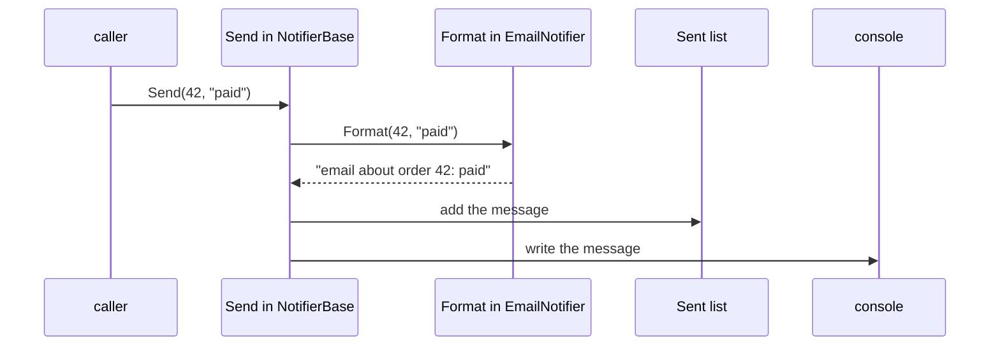

## Bạn cần biết trước

- [[design.l2.strategy-pattern]] — bạn đã thấy một quy tắc được đưa cho `CheckoutTotal` dưới dạng đối tượng. Bài này cho một bước thay đổi theo cách khác và so sánh hai cách.
- [[foundation.l1.oop-interface-vs-abstract]] — bạn đã gặp `NotifierBase`, abstract class giữ danh sách tin đã gửi và các bước của `Send`, chỉ chừa `Format` cho các lớp con.

## Tình huống

Đội muốn thêm notifier thứ ba vào samples, loại gửi tin push, tức các thông báo ngắn mà app hiện lên trên điện thoại. Notifier nào cũng phải làm cùng những việc theo cùng thứ tự: tạo nội dung tin, ghi nó vào `Sent` để test đọc được, rồi xuất nó ra. Chỉ câu chữ là khác nhau giữa email, SMS và push. Nếu mỗi class tự viết `Send` riêng, bản push có thể quên ghi tin lại, và test kiểm tra `Sent` sẽ gặp một danh sách rỗng. Làm sao để mỗi notifier tự viết câu chữ của mình, còn các bước kia nằm ở một chỗ mà không notifier nào override được?

## Khái niệm cốt lõi

- **Template Method pattern** (phương thức ở lớp cha cố định thứ tự các bước, để lớp con điền một số bước) — một phương thức ở lớp cha cố định thứ tự các bước và để một hoặc vài bước trong đó ở dạng abstract, cho lớp con điền vào.
- template method — phương thức ở lớp cha giữ thứ tự cố định. Trong tình huống trên, đó là `NotifierBase.Send`.
- bước cần điền — một phương thức abstract mà template method gọi ở một điểm cố định. Ở đây là `Format`, được `EmailNotifier` và `SmsNotifier` override.

## Cơ chế hoạt động



Đọc sơ đồ từ trên xuống. Bên gọi giữ một `EmailNotifier` và gọi `Send`. `EmailNotifier` không có `Send` riêng, nên code chạy là bản viết trong `NotifierBase`. Phương thức đó chính là template method: nó làm ba việc, luôn theo đúng thứ tự này.

Đầu tiên nó gọi `Format`. Đây là chỗ duy nhất lớp con được lên tiếng: `Format` là abstract trong `NotifierBase`, nên bản override trong `EmailNotifier` trả lời, đúng như đa hình vẫn làm với `ShippingFee`. Sau đó `Send` thêm đoạn text nhận được vào danh sách private đứng sau `Sent`, cuối cùng ghi nó ra console. Hai bước này thuộc về lớp cha. Lớp con không bao giờ thấy field danh sách, vì nó là private.

Lớp con không override được thứ tự này. Trong C#, lớp con chỉ override được phương thức mà lớp cha đánh dấu là mở cho nó, như `abstract` làm với `Format`. `Send` không mang dấu nào như vậy, nên chỉ `Format` là mở. Vì thế notifier push chỉ cần viết một phương thức, phần câu chữ, và nhận được bước ghi lại lẫn bước in ra theo đúng thứ tự. Với notifier chỉ viết `Format`, chuyện quên ghi tin lại không còn xảy ra được.

So sánh với Strategy. `CheckoutTotal` được đưa một đối tượng `ShippingFee` qua constructor, và code tạo ra nó chọn đối tượng nào lúc chương trình đang chạy. Ở đây bước thay đổi đi vào qua kế thừa: `Format` nào chạy đã cố định từ lúc bạn viết `class EmailNotifier : NotifierBase`. Muốn đổi câu chữ của một notifier, bạn chọn lớp con khác. Notifier không thể đổi `Format` của nó sang một bản khác về sau.

## Trong hệ thống Đơn Hàng

Template method và bước nó chừa ra:

```csharp file=samples/DonHang.Samples/Samples/Oop/NotifierBase.cs tag=stage-1 lines=4-19
// A skeleton: shared state and shared steps, with one step left to fill in.
public abstract class NotifierBase : INotifier
{
    private readonly List<string> sent = new();

    public IReadOnlyList<string> Sent => sent;

    public void Send(int orderId, string subject)
    {
        var message = Format(orderId, subject);
        sent.Add(message);
        Console.WriteLine(message);
    }

    protected abstract string Format(int orderId, string subject);
}
```

Hãy nhìn ba dòng bên trong `Send`: chúng là toàn bộ thuật toán, và chúng nằm ở một chỗ. `Format` là `protected`, nên code bên ngoài không gọi trực tiếp được, chỉ `Send` và các lớp con gọi được. Bản thân `Send` là phương thức mà `INotifier` yêu cầu, nên bên gọi chỉ biết `INotifier` vẫn nhận đúng thứ tự cố định.

Các lớp con mỗi lớp điền một bước:

```csharp file=samples/DonHang.Samples/Samples/Oop/NotifierBase.cs tag=stage-1 lines=21-31
public sealed class EmailNotifier : NotifierBase
{
    protected override string Format(int orderId, string subject) =>
        $"email about order {orderId}: {subject}";
}

public sealed class SmsNotifier : NotifierBase
{
    protected override string Format(int orderId, string subject) =>
        $"sms about order {orderId}: {subject}";
}
```

Không lớp con nào có danh sách, có `Add` hay có lời gọi console. Vì `Format` là abstract, compiler từ chối một lớp con không abstract mà bỏ sót nó, nên notifier nào cũng phải tự cung cấp câu chữ.

Giờ giả sử có thêm bước thứ hai cũng thay đổi: tin được gửi tới đâu, console với một số notifier và file với số khác. Một class C# chỉ kế thừa được từ một lớp cha, nên mỗi tổ hợp câu chữ và nơi gửi sẽ cần một lớp con riêng: email ra console, email ra file, SMS ra console, SMS ra file. Mỗi kiểu câu chữ hay nơi gửi mới lại nhân số class lên: thêm kiểu câu chữ thứ ba là thêm hai class.

Với Strategy, `NotifierBase` có thể nhận một đối tượng cho câu chữ và một đối tượng khác cho nơi gửi, và cặp nào cũng chạy được mà không cần class mới. Template Method hợp khi chỉ một bước thay đổi và thứ tự xung quanh nó không bao giờ được đổi. Khi các bước thay đổi độc lập với nhau, truyền đối tượng vào sẽ mở rộng tốt hơn.

## Người mới hay nghĩ rằng…

- **"Abstract class nào cũng là Template Method pattern, miễn là nó có một phương thức abstract."** → Thực ra pattern này cần một phương thức hoàn chỉnh ở lớp cha gọi bước abstract tại một điểm cố định trong một chuỗi cố định. `ShippingFee` là abstract và có `ForOrder` abstract, nhưng không phương thức nào ở lớp cha gọi `ForOrder` xen giữa các bước khác. Mỗi lớp con tự đưa ra toàn bộ câu trả lời. Bạn sẽ nhận ra khi đi tìm phương thức ở lớp cha giữ thứ tự các bước và không thấy cái nào.
- **"Template Method và Strategy là một ý tưởng, một cái viết bằng abstract class, cái kia viết bằng interface."** → Thực ra chúng khác nhau ở cách phần thay đổi đi vào, không phải ở từ khóa. Với Template Method, lớp con cung cấp phần đó, cố định từ lúc viết class. Với Strategy, một đối tượng được truyền vào và có thể được chọn lúc chương trình đang chạy. `ShippingFee` là abstract class, vậy mà `CheckoutTotal` dùng nó như một strategy. Bạn sẽ thấy khác biệt khi muốn đổi một hành vi của đối tượng đã tạo: với strategy bạn truyền đối tượng khác, với template method bạn cần một lớp con khác.

## Thử ngay (3 phút)

Trong `samples/DonHang.Samples.Tests/SamplesTests.cs` ở stage-1, file vốn đã có `using DonHang.Samples.Oop;`:

1. Ở cuối file, thêm một public sealed class `PushNotifier` kế thừa `NotifierBase` và override `Format` (một phương thức `protected` nhận order id kiểu `int` và subject kiểu `string`, trả về `string`) để trả về `$"push about order {orderId}: {subject}"`.
2. Thêm một public class `PushNotifierTests` có một method `[Fact]` tạo một `PushNotifier`, gọi `Send(42, "paid")`, rồi assert `Assert.Equal("push about order 42: paid", Assert.Single(notifier.Sent))`.
3. Chạy `dotnet test samples/DonHang.Samples.Tests --filter PushNotifierTests`.
4. Thêm `public override void Send(int orderId, string subject) { }` vào `PushNotifier`, chạy lại đúng lệnh đó, rồi gỡ mọi thứ bạn đã thêm ở bước 1, 2 và 4.

Kết quả mong đợi: bước 3 in ra một dòng bắt đầu bằng `Passed!` với 1 test qua và 0 test lỗi, dù `PushNotifier` không hề đụng tới `Sent`. Bước 4 build lỗi với mã `CS0506` tại `PushNotifier.Send`: lớp con không override được `Send`, nên thứ tự vẫn nằm ở lớp cha.

## Liên hệ

- [[design.l2.strategy-pattern]] — pattern trông giống: Strategy truyền quy tắc thay đổi vào dưới dạng đối tượng, Template Method để lớp con điền một bước.
- [[foundation.l1.oop-interface-vs-abstract]] — nơi `NotifierBase` xuất hiện lần đầu như một bộ khung. Bài này đặt tên cho hình dạng của `Send` trong đó.
- [[foundation.l1.oop-polymorphism]] — tính năng ngôn ngữ nằm bên dưới: lời gọi `Format` chạy bản override của chính class của đối tượng.
- [[design.l2.builder-pattern]] — pattern tiếp theo trong module này, về việc tạo một đối tượng qua nhiều bước.

## Tóm tắt 5 dòng

1. Template Method pattern giữ thứ tự các bước trong một phương thức ở lớp cha, lớp con chỉ điền các bước abstract.
2. `NotifierBase.Send` luôn tạo nội dung, ghi vào `Sent`, rồi ghi ra console. Lớp con chỉ override `Format`.
3. Lớp con không override được `Send`, nên notifier mới có sẵn bước ghi lại và in ra chỉ bằng cách viết một phương thức.
4. Template Method đổi một bước qua kế thừa, cố định khi viết lớp con. Strategy truyền vào đối tượng chọn lúc chạy.
5. Chỉ có một lớp cha, nên các bước đổi độc lập cần lớp con cho mỗi tổ hợp. Tách thành đối tượng strategy thì tránh được.
