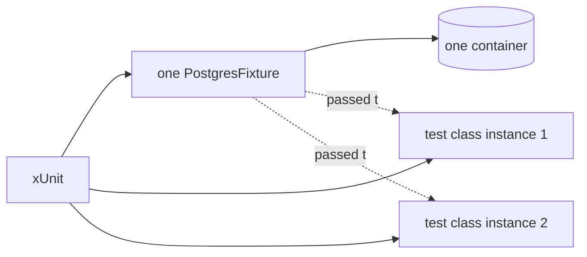

## Before you start

- [[design.l2.testcontainers-postgresql]] — you know `PostgresFixture` starts a `postgres:17.6-alpine` container and migrates it in `InitializeAsync`, and removes it in `DisposeAsync`.
- [[design.l1.writing-a-unit-test]] — you know xUnit finds and runs the tests in the project's public test classes, with no list to register them in.

## The situation

`EfOrderRepositoryTests` has two tests at stage-2, and more will come. In `OrderServiceTests` you got used to building everything a test needs inside the test, fresh each time. A teammate suggests the same for the database: start the PostgreSQL container in the test class's constructor, so every test gets one ready. But starting a container and applying the migrations takes seconds, while a repository test itself, once the database is up, takes tens of milliseconds (the class's first test, up to about a second). Where should the container start so that every test in the class can use it, and what do those tests then have in common?

## Core concepts

- **test fixture** — setup that several tests share, such as a started database, created once and cleaned up after the last of those tests.
- one instance per test — xUnit creates a new object of the test class for every test method it runs, so its constructor runs once per test.
- class fixture — a test fixture shared by the tests of one test class: the class declares `IClassFixture<T>`, and xUnit creates one `T` for that class only.

## How it works



Start with the teammate's idea. xUnit creates a new instance of the test class for every test method, so a container started in the constructor would start again for every test. Two tests would mean two containers; twenty tests, twenty.

In the situation above, the test fixture is `PostgresFixture`. `EfOrderRepositoryTests` declares `IClassFixture<PostgresFixture>`, and xUnit then creates one `PostgresFixture` for all tests in that class. Each new instance of the test class receives that same object through its constructor, as the parameter `database`.

`PostgresFixture` implements `IAsyncLifetime`, an xUnit interface with two methods. xUnit awaits its `InitializeAsync` before the class's first test and its `DisposeAsync` after the last one. That is where the container starts and stops, once for the class.

The cost explains the choice. Starting a container and migrating it takes far longer than one repository test, so one container per class keeps a full run of the tests quick enough to run often.

A class fixture belongs to the class that declares it. At stage-2, `OrdersApiTests` declares its own class fixture, `ApiFactory`, which holds a second `PostgresFixture`, so a full run of the project starts two PostgreSQL containers.

Sharing has a price as well. Because the tests share the fixture, they also share one database: rows saved by one test are still there when the next test runs, unless something empties the tables first.

## In the Đơn Hàng system

The test class asks for the fixture:

```csharp file=DonHang.Tests/Integration/EfOrderRepositoryTests.cs tag=stage-2 lines=9-19
// lesson: design.l2.class-fixtures
// lesson: design.l2.resetting-data-between-tests
// One PostgresFixture (one container) for every test in this class. Before
// each test, InitializeAsync empties the tables: the tests share a database,
// and xUnit does not promise to run them in the order they are written.
public sealed class EfOrderRepositoryTests(PostgresFixture database)
    : IClassFixture<PostgresFixture>, IAsyncLifetime
{
    public Task InitializeAsync() => database.ResetAsync();

    public Task DisposeAsync() => Task.CompletedTask;
```

`IClassFixture<PostgresFixture>` is the request; `(PostgresFixture database)` is where each instance receives the shared object. No line in the test class creates a `PostgresFixture`: xUnit creates it, keeps it for the whole class, and passes it to each new instance. The class implements `IAsyncLifetime` too, but its own `InitializeAsync` runs before every test, not once, because xUnit creates a new test class instance for every test and calls `InitializeAsync` on each, while the fixture exists only once. It is the "something" that empties the tables, and the lesson after next is about it.

The fixture's side:

```csharp file=DonHang.Tests/Integration/PostgresFixture.cs tag=stage-2 lines=21-33
    // lesson: design.l2.class-fixtures
    // xUnit awaits this once, before the first test of the class that uses
    // the fixture, and DisposeAsync once, after its last test.
    // MigrateAsync applies every migration, InitialCreate included: on an
    // empty database, the same list the migration bundle applies.
    public async Task InitializeAsync()
    {
        await container.StartAsync();
        await using var db = CreateContext();
        await db.Database.MigrateAsync();
    }

    public async Task DisposeAsync() => await container.DisposeAsync();
```

The comment's last two lines repeat what the previous lesson showed about the migrations; you can skip them here. These two methods run once per class that uses the fixture. Everything slow, starting the container and applying the migrations, sits here, outside any single test. A failing test does not skip `DisposeAsync`: xUnit still calls it after the class's last test, so the container is removed either way.

## Beginners often think…

- **"The test class constructor runs once per class, so it is the right place to start the container."** → Actually xUnit creates a new instance of the class for every test, so the constructor runs once per test. You notice this when a class with ten tests takes ten container starts to finish, and `docker ps` keeps showing new `postgres:17.6-alpine` containers during one run.
- **"A class fixture is shared by every test class in the project."** → Actually xUnit creates one per test class that declares it; another class that asks for the same type, or holds one of its own, gets a separate instance. You notice this when a full run of `DonHang.Tests` creates two PostgreSQL containers, not one.

## Try it (3 minutes)

On your own machine, in the root folder of the example repository checked out at `stage-2`, with Docker running:

1. In a first terminal, run `docker events --filter image=postgres:17.6-alpine --filter event=create`. It prints one line each time a container from that image is created, and keeps waiting until you stop it.
2. In a second terminal, run `dotnet test DonHang.Tests`, the whole project.
3. When it finishes, count the lines in the first terminal, then stop it with `Ctrl+C`.

Expected result: all 24 tests pass. The first terminal shows exactly two `container create` lines: one for `EfOrderRepositoryTests` and its two tests, one for `OrdersApiTests` and its five. Seven integration tests, two containers.

## Connections

- [[design.l2.testcontainers-postgresql]] — what the fixture holds; this lesson adds when xUnit starts and stops it.
- [[design.l1.writing-a-unit-test]] — the same xUnit, one level up: besides finding the test methods, it creates the test class and its fixture.
- [[design.l1.what-makes-a-good-unit-test]] — the contrast: unit tests shared nothing, so test order could not matter; a shared database brings that risk back.
- [[design.l2.testing-the-real-repository]] — the next lesson: what the two tests in `EfOrderRepositoryTests` actually check.

## Five-line summary

1. xUnit creates a new test class instance per test, so a container started in the constructor starts again for every test.
2. A test fixture is setup several tests share; `IClassFixture<PostgresFixture>` makes xUnit create one `PostgresFixture` for the whole class.
3. `PostgresFixture` implements `IAsyncLifetime`, so xUnit awaits `InitializeAsync` before the first test and `DisposeAsync` after the last.
4. A container takes far longer to start than one repository test runs, so one per class keeps a full test run quick.
5. Sharing the fixture means sharing the database: rows from one test remain for the next unless the tables are emptied first.
