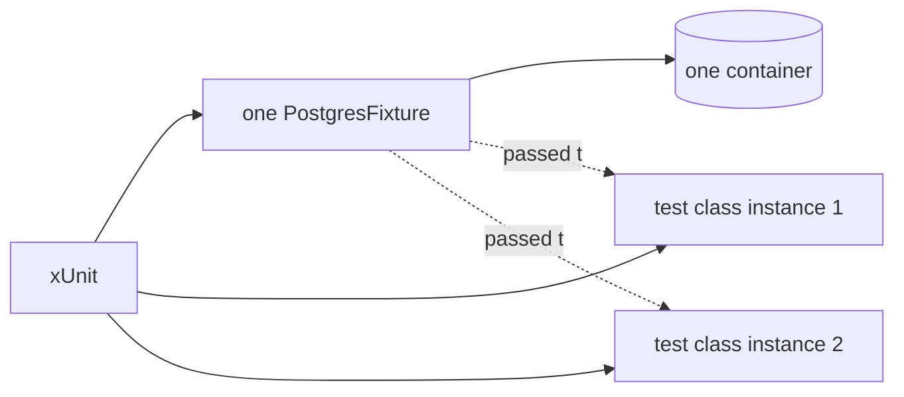

## Bạn cần biết trước

- [[design.l2.testcontainers-postgresql]] — bạn biết `PostgresFixture` khởi động một container `postgres:17.6-alpine` và migrate nó trong `InitializeAsync`, rồi xóa nó trong `DisposeAsync`.
- [[design.l1.writing-a-unit-test]] — bạn biết xUnit tự tìm và chạy các test trong những class test public của project, không cần danh sách đăng ký nào.

## Tình huống

`EfOrderRepositoryTests` có hai test ở stage-2, và sẽ còn thêm nữa. Ở `OrderServiceTests`, bạn đã quen dựng mọi thứ một test cần ngay trong test đó, mới tinh mỗi lần. Một đồng đội đề xuất làm y vậy với database: khởi động container PostgreSQL trong constructor của class test, để test nào cũng có sẵn một cái. Nhưng khởi động container và áp migration mất vài giây, trong khi bản thân một test repository, khi database đã sẵn sàng, chỉ mất vài chục mili giây (test đầu tiên của class thì tới khoảng một giây). Container nên khởi động ở đâu để mọi test trong class đều dùng được, và khi đó các test ấy có chung những gì?

## Khái niệm cốt lõi

- **test fixture** (Phần chuẩn bị dùng chung cho nhiều test, tạo một lần và dọn sau test cuối, như một database đã khởi động) — phần chuẩn bị mà nhiều test dùng chung, như một database đã khởi động, được tạo một lần và dọn đi sau test cuối cùng trong số đó.
- mỗi test một instance — xUnit tạo một object mới của class test cho mỗi method test nó chạy, nên constructor chạy một lần cho mỗi test.
- class fixture — test fixture dùng chung cho các test của một class test: class khai báo `IClassFixture<T>`, và xUnit tạo một `T` riêng cho class đó.

## Cơ chế hoạt động



Bắt đầu từ ý của người đồng đội. xUnit tạo một instance mới của class test cho mỗi method test, nên container khởi động trong constructor sẽ khởi động lại cho mỗi test. Hai test là hai container; hai mươi test là hai mươi container.

Trong tình huống trên, test fixture là `PostgresFixture`. `EfOrderRepositoryTests` khai báo `IClassFixture<PostgresFixture>`, và xUnit khi đó tạo một `PostgresFixture` cho mọi test trong class. Mỗi instance mới của class test nhận đúng object đó qua constructor, dưới dạng tham số `database`.

`PostgresFixture` cài `IAsyncLifetime`, một interface của xUnit có hai method. xUnit chờ `InitializeAsync` của nó chạy xong trước test đầu tiên của class và chờ `DisposeAsync` sau test cuối cùng. Đó là chỗ container khởi động và dừng, một lần cho cả class.

Chi phí giải thích lựa chọn này. Khởi động và migrate một container lâu hơn rất nhiều so với một test repository, nên mỗi class một container giúp một lần chạy toàn bộ test đủ nhanh để chạy thường xuyên.

Class fixture thuộc về class khai báo nó. Ở stage-2, `OrdersApiTests` khai báo class fixture riêng là `ApiFactory`, thứ giữ một `PostgresFixture` thứ hai, nên một lần chạy cả project khởi động hai container PostgreSQL.

Dùng chung cũng có cái giá của nó. Vì các test dùng chung fixture, chúng cũng dùng chung một database: dòng mà một test lưu vẫn còn đó khi test kế tiếp chạy, trừ khi có thứ gì đó làm rỗng các bảng trước.

## Trong hệ thống Đơn Hàng

Class test xin fixture:

```csharp file=DonHang.Tests/Integration/EfOrderRepositoryTests.cs tag=stage-2 lines=9-19
// lesson: design.l2.class-fixtures
// lesson: design.l2.resetting-data-between-tests
// One PostgresFixture (one container) for every test in this class. Before
// each test, InitializeAsync empties the tables: the tests share a database,
// and xUnit does not promise to run them in the order they are written.
public sealed class EfOrderRepositoryTests(PostgresFixture database)
    : IClassFixture<PostgresFixture>, IAsyncLifetime
{
    public Task InitializeAsync() => database.ResetAsync();

    public Task DisposeAsync() => Task.CompletedTask;
```

`IClassFixture<PostgresFixture>` là lời xin; `(PostgresFixture database)` là chỗ mỗi instance nhận object dùng chung. Không dòng nào trong class test tạo `PostgresFixture`: xUnit tạo nó, giữ nó cho cả class và truyền nó cho từng instance mới. Class này cũng cài `IAsyncLifetime`, nhưng `InitializeAsync` của chính nó chạy trước mọi test chứ không phải một lần, vì xUnit tạo instance mới của class test cho mỗi test và gọi `InitializeAsync` trên từng instance, còn fixture thì chỉ có một. Nó chính là "thứ gì đó" làm rỗng các bảng, và bài sau bài tiếp theo sẽ nói về nó.

Phía fixture:

```csharp file=DonHang.Tests/Integration/PostgresFixture.cs tag=stage-2 lines=21-33
    // lesson: design.l2.class-fixtures
    // xUnit awaits this once, before the first test of the class that uses
    // the fixture, and DisposeAsync once, after its last test.
    // MigrateAsync applies every migration, InitialCreate included: on an
    // empty database, the same list the migration bundle applies.
    public async Task InitializeAsync()
    {
        await container.StartAsync();
        await using var db = CreateContext();
        await db.Database.MigrateAsync();
    }

    public async Task DisposeAsync() => await container.DisposeAsync();
```

Hai dòng cuối của comment nhắc lại điều bài trước đã cho thấy về migration; ở đây bạn có thể bỏ qua. Hai method này chạy một lần cho mỗi class dùng fixture. Mọi việc chậm, khởi động container và áp migration, đều nằm ở đây, ngoài mọi test riêng lẻ. Một test fail không làm `DisposeAsync` bị bỏ qua: xUnit vẫn gọi nó sau test cuối cùng của class, nên container bị xóa trong mọi trường hợp.

## Người mới hay nghĩ rằng…

- **"Constructor của class test chạy một lần cho mỗi class, nên đó là chỗ đúng để khởi động container."** → Thực ra xUnit tạo instance mới của class cho mỗi test, nên constructor chạy một lần cho mỗi test. Bạn sẽ nhận ra khi một class có mười test phải chờ mười lần khởi động container mới xong, và `docker ps` liên tục hiện thêm container `postgres:17.6-alpine` mới trong một lần chạy.
- **"Class fixture được dùng chung bởi mọi class test trong project."** → Thực ra xUnit tạo một fixture cho mỗi class test khai báo nó; class khác xin cùng kiểu đó, hoặc tự giữ một cái riêng, sẽ nhận một instance khác. Bạn sẽ nhận ra khi một lần chạy toàn bộ `DonHang.Tests` tạo hai container PostgreSQL chứ không phải một.

## Thử ngay (3 phút)

Trên máy của bạn, ở thư mục gốc của repo ví dụ đã checkout tại `stage-2`, với Docker đang chạy:

1. Ở terminal thứ nhất, chạy `docker events --filter image=postgres:17.6-alpine --filter event=create`. Lệnh này in một dòng mỗi khi một container từ image đó được tạo, và đứng chờ cho tới khi bạn dừng nó.
2. Ở terminal thứ hai, chạy `dotnet test DonHang.Tests`, tức là cả project.
3. Khi chạy xong, đếm số dòng ở terminal thứ nhất, rồi dừng nó bằng `Ctrl+C`.

Kết quả mong đợi: cả 24 test đều qua. Terminal thứ nhất hiện đúng hai dòng `container create`: một cho `EfOrderRepositoryTests` với hai test của nó, một cho `OrdersApiTests` với năm test. Bảy integration test, hai container.

## Liên hệ

- [[design.l2.testcontainers-postgresql]] — thứ mà fixture giữ; bài này thêm phần xUnit khởi động và dừng nó khi nào.
- [[design.l1.writing-a-unit-test]] — vẫn là xUnit, lên thêm một bậc: ngoài việc tìm các method test, nó còn tạo class test và fixture của class.
- [[design.l1.what-makes-a-good-unit-test]] — sự tương phản: unit test không dùng chung gì nên thứ tự test không thể ảnh hưởng; một database dùng chung đem rủi ro đó quay lại.
- [[design.l2.testing-the-real-repository]] — bài tiếp theo: hai test trong `EfOrderRepositoryTests` thật ra kiểm tra điều gì.

## Tóm tắt 5 dòng

1. xUnit tạo instance mới của class test cho mỗi test, nên container khởi động trong constructor sẽ khởi động lại ở mọi test.
2. Test fixture là phần chuẩn bị nhiều test dùng chung; `IClassFixture<PostgresFixture>` khiến xUnit tạo một `PostgresFixture` cho cả class.
3. `PostgresFixture` cài `IAsyncLifetime`, nên xUnit chờ `InitializeAsync` trước test đầu tiên và `DisposeAsync` sau test cuối cùng.
4. Khởi động container lâu hơn nhiều so với chạy một test repository, nên mỗi class một container giữ cho lần chạy toàn bộ test nhanh.
5. Dùng chung fixture nghĩa là dùng chung database: dòng của test này còn lại cho test sau, trừ khi các bảng được làm rỗng trước.
