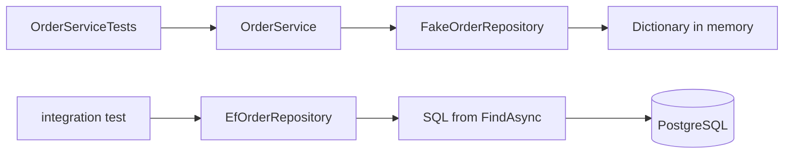

## Before you start

- [[design.l2.testing-the-entity]] — you know a rule inside `Order` is tested by calling its methods, and that `OrderServiceTests` keeps only what needs the fakes.
- [[backend.l1.efcore-n-plus-one]] — you know `EfOrderRepository.FindAsync` loads an order's items in the same query because it calls `.Include(...)`.
- [[backend.l1.efcore-relationships-and-keys]] — you know `orders.customer_id` is a foreign key to `customers`, mapped to the `Order.Customer` navigation property.

## The situation

At stage-1, `OrderServiceTests` has five tests, and all five pass in well under a second. A teammate tidies `EfOrderRepository` and, by mistake, deletes `.Include(o => o.Items)` from `FindAsync`. The pull request shows a green test run, so it gets merged. In the lab, `GET /api/v1/orders/{id}` now answers with an order that has no items, and nobody has changed a single test. The tests checked `OrderService` carefully. What kind of test would have failed on that pull request, and what does it need that the existing tests do not have?

## Core concepts

- **integration test** — a test that runs code together with a real dependency it talks to, such as `EfOrderRepository` against a real PostgreSQL database, instead of a test double.
- real dependency — the thing the code talks to when it runs for real: for `EfOrderRepository`, a PostgreSQL database with the schema the migrations created.
- what only the real dependency can show — behaviour that lives outside the C# class, such as the SQL EF Core builds from a query, the column names in the mapping, and rules such as foreign keys that a migration adds.

## How it works



The top path is the one Đơn Hàng has at stage-1. `OrderServiceTests` builds `OrderService` with `FakeOrderRepository`, a test double that keeps orders in a `Dictionary`. Its tests check steps of `OrderService`, such as `PlaceOrderAsync` refusing an empty item list and sending one notification. When `OrderService` asks the fake for an order, the fake hands back the same object the test stored, items included, because nothing ever left memory.

The bottom path is what an integration test adds. In the situation above, the integration test is a test that calls `EfOrderRepository` itself, connected to a real PostgreSQL database. Its `FindAsync` returns items only because the query calls `Include(o => o.Items)`: EF Core then reads the `order_items` rows in the same query. Without the `Include`, EF Core reads the order row alone, and `Items` stays the empty list `Order` creates. The one exception is when the same `DbContext` already tracks those items. In the API each request gets a new `DbContext`, so the order comes back with no items.

No test that uses the fake runs that query. A missing `Include`, a wrong column name in the mapping or a broken migration therefore passes every `OrderServiceTests` test. At stage-1, `DonHang.Tests` does not even reference `DonHang.Infrastructure`, so `EfOrderRepository` is not part of the test build.

The database also enforces rules of its own. The migration `AddOrderCustomerNavigation` adds a foreign key on `orders.customer_id`, so PostgreSQL refuses an order whose `customer_id` names no customer. `FakeOrderRepository` stores such an order without complaint, because a dictionary has no foreign keys.

An integration test against PostgreSQL needs a running database and is slower than a test with a fake. It is worth writing for what only the real dependency can show, not to repeat rules a unit test already checks.

## In the Đơn Hàng system

The fake, as `OrderServiceTests` uses it:

```csharp file=DonHang.Tests/FakeOrderRepository.cs tag=stage-1 lines=10-24
    private readonly Dictionary<int, Order> orders = [];
    private int nextId = 1;

    public Task<Order?> FindAsync(int id) =>
        Task.FromResult(orders.GetValueOrDefault(id));

    public Task<List<Order>> ListByCustomerAsync(int customerId) =>
        Task.FromResult(orders.Values.Where(o => o.CustomerId == customerId).OrderBy(o => o.Id).ToList());

    public Task AddAsync(Order order)
    {
        order.Id = nextId++;
        orders[order.Id] = order;
        return Task.CompletedTask;
    }
```

`AddAsync` puts the very object it receives into the dictionary, and `FindAsync` returns that object. Its `Items` list is whatever the caller filled in. There is no query here to get wrong and no foreign key to break, so the fake answers correctly whatever the real repository does.

The real repository at the same tag:

```csharp file=DonHang.Infrastructure/EfOrderRepository.cs tag=stage-1 lines=7-19
public sealed class EfOrderRepository(DonHangDbContext db) : IOrderRepository
{
    public Task<Order?> FindAsync(int id) =>
        db.Orders.Include(o => o.Items).FirstOrDefaultAsync(o => o.Id == id);

    // lesson: backend.l1.efcore-n-plus-one
    public Task<List<Order>> ListByCustomerAsync(int customerId) =>
        db.Orders.Where(o => o.CustomerId == customerId).Include(o => o.Customer).OrderBy(o => o.Id).ToListAsync();

    public async Task AddAsync(Order order) => await db.Orders.AddAsync(order);

    public Task SaveChangesAsync() => db.SaveChangesAsync();
}
```

Both classes implement `IOrderRepository`, so `OrderService` cannot tell them apart. Look at what only the second one has: the `Include` on line 10 (the body of `FindAsync`), and a `SaveChangesAsync` whose body really sends SQL to PostgreSQL through `db`. Those are the lines an integration test exercises and a test with the fake never reaches.

## Beginners often think…

- **"An integration test is just a unit test that happens to run slowly."** → Actually the difference is what runs: an integration test lets the real dependency take part, so it can fail on a query, a mapping or a foreign key, which no fake can. You notice this when a bug like the missing `Include` passes all unit tests and is caught only by a test that reads from PostgreSQL.
- **"Once there are integration tests, the unit tests with fakes are no longer needed."** → Actually each kind checks a different risk. The unit tests check `OrderService`'s steps in milliseconds; an integration test needs a database and checks where code meets it. You notice this when rewriting a fast unit test as an integration test makes it slower but catches nothing new.
- **"Running the API by hand and trying a few requests does the same job as an integration test."** → Actually a manual check is not repeated on every change, and nobody remembers to retry the same requests after an unrelated pull request. You notice this when the missing `Include` reaches the lab even though someone had tried that endpoint by hand before the change.

## Try it (3 minutes)

In the root folder of the example repository, checked out at `stage-1`:

1. Run `dotnet test DonHang.Tests` and note the result.
2. In `DonHang.Infrastructure/EfOrderRepository.cs`, change line 10 to `db.Orders.FirstOrDefaultAsync(o => o.Id == id);`, removing the `Include`. Run the same command again.
3. Undo the change.

Expected result: both runs report five tests, all passing. The second run passes even though `FindAsync` no longer loads any items, because no test in `DonHang.Tests` runs `EfOrderRepository` against a database.

## Connections

- [[design.l1.testing-with-a-fake-repository]] — the limit that lesson named, now made concrete: the fake proves `OrderService`'s steps, not how `EfOrderRepository` stores data.
- [[backend.l1.efcore-n-plus-one]] — the source of the `Include` this lesson shows can disappear unnoticed.
- [[design.l2.testing-the-entity]] — the other end: a rule inside `Order` needs no database, so a unit test is the right place for it.
- [[design.l2.testcontainers-postgresql]] — the next lesson: where the real PostgreSQL for such a test comes from.

## Five-line summary

1. An integration test runs code together with a real dependency, such as `EfOrderRepository` against PostgreSQL, instead of a test double.
2. `FakeOrderRepository` returns the very object it stored; `EfOrderRepository` returns items only because `FindAsync` calls `Include`.
3. No test using the fake runs that query, so a missing `Include`, a wrong column or a broken migration passes them all.
4. PostgreSQL refuses an order for a customer that does not exist, because of the foreign key; the fake stores it anyway.
5. Integration tests against a database are slower and need it running, so write them for what only the real dependency can show.
