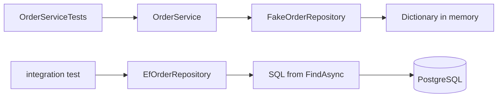

## Bạn cần biết trước

- [[design.l2.testing-the-entity]] — bạn biết quy tắc nằm trong `Order` được test bằng cách gọi các method của nó, và `OrderServiceTests` chỉ giữ lại những gì cần tới fake.
- [[backend.l1.efcore-n-plus-one]] — bạn biết `EfOrderRepository.FindAsync` tải các món hàng của đơn trong cùng một câu truy vấn vì nó gọi `.Include(...)`.
- [[backend.l1.efcore-relationships-and-keys]] — bạn biết `orders.customer_id` là khóa ngoại trỏ tới `customers`, được map thành navigation property `Order.Customer`.

## Tình huống

Ở stage-1, `OrderServiceTests` có năm test, và cả năm đều qua trong chưa tới một giây. Một đồng đội dọn dẹp `EfOrderRepository` và lỡ tay xóa `.Include(o => o.Items)` khỏi `FindAsync`. Pull request hiện lần chạy test màu xanh, nên được merge. Trên lab, `GET /api/v1/orders/{id}` giờ trả về một đơn không có món hàng nào, dù không ai sửa một test nào. Các test đã kiểm tra `OrderService` rất kỹ. Loại test nào lẽ ra đã fail trên pull request đó, và nó cần thứ gì mà các test hiện có không có?

## Khái niệm cốt lõi

- **integration test** (Test chạy code cùng một phụ thuộc thật, như database, thay vì dùng test double) — test chạy code cùng với một phụ thuộc thật mà code đó làm việc cùng, chẳng hạn `EfOrderRepository` trên một database PostgreSQL thật, thay vì một test double.
- phụ thuộc thật — thứ mà code làm việc cùng khi chạy thật: với `EfOrderRepository`, đó là một database PostgreSQL có schema do các migration tạo ra.
- điều chỉ phụ thuộc thật mới cho thấy — hành vi nằm ngoài class C#, như câu SQL mà EF Core dựng từ một truy vấn, tên cột trong mapping, và các quy tắc như khóa ngoại mà một migration thêm vào.

## Cơ chế hoạt động



Đường trên là thứ Đơn Hàng đang có ở stage-1. `OrderServiceTests` dựng `OrderService` với `FakeOrderRepository`, một test double giữ các đơn trong một `Dictionary`. Các test của nó kiểm tra các bước của `OrderService`, như `PlaceOrderAsync` từ chối danh sách hàng rỗng và gửi đúng một thông báo. Khi `OrderService` hỏi fake một đơn, fake trả lại đúng object mà test đã lưu, kèm cả món hàng, vì chưa có gì rời khỏi bộ nhớ.

Đường dưới là thứ integration test thêm vào. Trong tình huống trên, integration test là một test gọi thẳng `EfOrderRepository`, nối với một database PostgreSQL thật. `FindAsync` của nó trả về món hàng chỉ vì câu truy vấn gọi `Include(o => o.Items)`: khi đó EF Core đọc các dòng `order_items` trong cùng câu truy vấn. Không có `Include`, EF Core chỉ đọc dòng order, và `Items` vẫn là danh sách rỗng mà `Order` tạo sẵn. Ngoại lệ duy nhất là khi chính `DbContext` đó đang theo dõi sẵn các món hàng ấy. Trong API, mỗi request có một `DbContext` mới, nên đơn trả về không có món hàng nào.

Không test nào dùng fake chạy câu truy vấn đó. Vì vậy một `Include` bị thiếu, một tên cột sai trong mapping hay một migration hỏng đều qua mọi test của `OrderServiceTests`. Ở stage-1, `DonHang.Tests` thậm chí không tham chiếu `DonHang.Infrastructure`, nên `EfOrderRepository` không nằm trong bản build của test.

Database còn có quy tắc riêng của nó. Migration `AddOrderCustomerNavigation` thêm một khóa ngoại trên `orders.customer_id`, nên PostgreSQL từ chối một đơn có `customer_id` không ứng với khách nào. `FakeOrderRepository` thì lưu đơn đó mà không phàn nàn gì, vì dictionary không có khóa ngoại.

Integration test chạy trên PostgreSQL cần một database đang chạy và chậm hơn test dùng fake. Nó đáng viết cho những gì chỉ phụ thuộc thật mới cho thấy, không phải để lặp lại các quy tắc mà unit test đã kiểm tra.

## Trong hệ thống Đơn Hàng

Fake, đúng như `OrderServiceTests` dùng:

```csharp file=DonHang.Tests/FakeOrderRepository.cs tag=stage-1 lines=10-24
    private readonly Dictionary<int, Order> orders = [];
    private int nextId = 1;

    public Task<Order?> FindAsync(int id) =>
        Task.FromResult(orders.GetValueOrDefault(id));

    public Task<List<Order>> ListByCustomerAsync(int customerId) =>
        Task.FromResult(orders.Values.Where(o => o.CustomerId == customerId).OrderBy(o => o.Id).ToList());

    public Task AddAsync(Order order)
    {
        order.Id = nextId++;
        orders[order.Id] = order;
        return Task.CompletedTask;
    }
```

`AddAsync` đặt chính object nó nhận được vào dictionary, và `FindAsync` trả lại đúng object đó. Danh sách `Items` của nó là thứ mà bên gọi đã điền vào. Ở đây không có câu truy vấn nào để viết sai và không có khóa ngoại nào để vi phạm, nên fake luôn trả lời đúng, bất kể repository thật làm gì.

Repository thật ở cùng tag:

```csharp file=DonHang.Infrastructure/EfOrderRepository.cs tag=stage-1 lines=7-19
public sealed class EfOrderRepository(DonHangDbContext db) : IOrderRepository
{
    public Task<Order?> FindAsync(int id) =>
        db.Orders.Include(o => o.Items).FirstOrDefaultAsync(o => o.Id == id);

    // lesson: backend.l1.efcore-n-plus-one
    public Task<List<Order>> ListByCustomerAsync(int customerId) =>
        db.Orders.Where(o => o.CustomerId == customerId).Include(o => o.Customer).OrderBy(o => o.Id).ToListAsync();

    public async Task AddAsync(Order order) => await db.Orders.AddAsync(order);

    public Task SaveChangesAsync() => db.SaveChangesAsync();
}
```

Cả hai class đều cài `IOrderRepository`, nên `OrderService` không phân biệt được chúng. Hãy nhìn những gì chỉ class thứ hai có: `Include` ở dòng 10 (thân của `FindAsync`), và một `SaveChangesAsync` có thân thật sự gửi SQL tới PostgreSQL qua `db`. Đó là những dòng mà integration test chạy tới, còn test dùng fake thì không bao giờ chạm vào.

## Người mới hay nghĩ rằng…

- **"Integration test chỉ là unit test tình cờ chạy chậm."** → Thực ra khác biệt nằm ở thứ được chạy: integration test để phụ thuộc thật tham gia, nên nó có thể fail vì câu truy vấn, mapping hay khóa ngoại, điều mà không fake nào làm được. Bạn sẽ nhận ra khi một lỗi như thiếu `Include` qua hết unit test và chỉ bị bắt bởi một test đọc dữ liệu từ PostgreSQL.
- **"Đã có integration test thì không cần unit test dùng fake nữa."** → Thực ra mỗi loại kiểm một rủi ro khác nhau. Unit test kiểm các bước của `OrderService` trong vài mili giây, còn integration test cần database và kiểm chỗ code gặp database. Bạn sẽ nhận ra khi viết lại một unit test nhanh thành integration test chỉ khiến nó chậm hơn mà không bắt thêm được lỗi nào.
- **"Tự chạy API và thử vài request bằng tay cũng làm được việc của integration test."** → Thực ra kiểm tra bằng tay không được lặp lại sau mỗi thay đổi, và chẳng ai nhớ thử lại đúng những request đó sau một pull request không liên quan. Bạn sẽ nhận ra khi lỗi thiếu `Include` vẫn tới được lab, dù trước thay đổi đó đã có người thử endpoint ấy bằng tay.

## Thử ngay (3 phút)

Ở thư mục gốc của repo ví dụ, checkout tại `stage-1`:

1. Chạy `dotnet test DonHang.Tests` và ghi lại kết quả.
2. Trong `DonHang.Infrastructure/EfOrderRepository.cs`, sửa dòng 10 thành `db.Orders.FirstOrDefaultAsync(o => o.Id == id);`, tức là bỏ `Include`. Chạy lại đúng lệnh trên.
3. Hoàn tác thay đổi.

Kết quả mong đợi: cả hai lần chạy đều báo năm test, tất cả đều qua. Lần thứ hai vẫn qua dù `FindAsync` không còn tải món hàng nào, vì không test nào trong `DonHang.Tests` chạy `EfOrderRepository` trên database.

## Liên hệ

- [[design.l1.testing-with-a-fake-repository]] — giới hạn mà bài đó đã nêu, giờ thành cụ thể: fake chứng minh các bước của `OrderService`, không chứng minh `EfOrderRepository` lưu dữ liệu đúng.
- [[backend.l1.efcore-n-plus-one]] — nơi `Include` xuất hiện, thứ mà bài này cho thấy có thể biến mất mà không ai hay.
- [[design.l2.testing-the-entity]] — đầu bên kia: quy tắc nằm trong `Order` không cần database, nên unit test là chỗ đúng cho nó.
- [[design.l2.testcontainers-postgresql]] — bài tiếp theo: PostgreSQL thật cho loại test này lấy từ đâu.

## Tóm tắt 5 dòng

1. Integration test chạy code cùng một phụ thuộc thật, như `EfOrderRepository` trên PostgreSQL, thay vì một test double.
2. `FakeOrderRepository` trả lại đúng object nó đã lưu; `EfOrderRepository` trả về món hàng chỉ vì `FindAsync` gọi `Include`.
3. Không test nào dùng fake chạy câu truy vấn đó, nên thiếu `Include`, sai tên cột hay migration hỏng đều qua hết.
4. PostgreSQL từ chối đơn của một khách không tồn tại, vì khóa ngoại; fake thì vẫn lưu.
5. Integration test chạy trên database chậm hơn và cần database đang chạy, nên hãy viết chúng cho điều chỉ phụ thuộc thật mới cho thấy.
