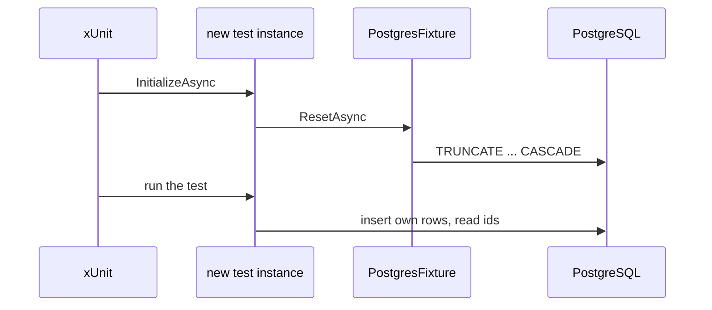

## Before you start

- [[design.l2.testing-the-real-repository]] — you know both tests in `EfOrderRepositoryTests` save their own customer and products through `InsertCustomerAndProductsAsync`, and that the class shares one `PostgresFixture`, so one database, across its tests.
- [[design.l1.what-makes-a-good-unit-test]] — you know a flaky test passes and fails with no code change, and that test order is one of the usual causes.

## The situation

`EfOrderRepositoryTests` runs green. Out of curiosity you remove the line in it that empties the tables before each test, and run the class again. One test now fails with `23505: duplicate key value violates unique constraint "IX_customers_email"`. You run that test on its own, and it passes: same code, same container image, a different result depending only on what ran before it. Both tests insert the customer `test.customer@example.com`, the first one's row is still there, and `customers.email` has a unique index: PostgreSQL refuses a second row with the same email. How do tests that share one database each start from a known state?

## Core concepts

- leftover rows — rows an earlier test saved that are still in the shared database when the next test starts.
- reset before each test — emptying the tables at the start of every test, so a test sees only the rows it inserts itself.
- `TRUNCATE` — the SQL statement that removes every row of the tables it lists in one go, keeping the tables themselves.
- id sequence — the running number PostgreSQL keeps for a table's id column, handing out the next number on every insert.
- ids from your own inserts — the ids PostgreSQL returns when a test saves its rows, used by that test instead of fixed numbers like `1`.

## How it works



Tests in one class share the fixture's database. In the situation above, the leftover row is the first test's customer, and the unique index refuses the second one. A test that counts orders would fail the same way, seeing orders another test saved, and only when that test ran first. That is a flaky test, caused by order.

xUnit does not promise to run a class's tests in the order they are written. No test may therefore rely on data an earlier test saved, and no test may be hurt by it either.

At stage-2, each integration test class implements `IAsyncLifetime`, the xUnit interface whose `InitializeAsync` xUnit awaits before a test, and calls `PostgresFixture.ResetAsync` there. Because xUnit creates a new instance of the test class for each test, that runs before every test. `ResetAsync` empties Đơn Hàng's tables with one `TRUNCATE ... CASCADE` statement. `CASCADE` makes PostgreSQL also empty any table whose foreign key points at a listed one; all six are listed, so today it adds none, but a later table pointing at one of them would not break the reset.

The reset runs before each test, not after it. A test that stopped halfway, because an assertion failed or an exception was thrown, never reaches clean-up code at the end of its own body, and a run you stop from outside, such as a debugging session you end, may clean up nothing. Resetting at the start means such rows cannot reach the next test.

The reset keeps the id sequences counting. After a few tests, the first order a test saves may get id `7`, not `1`. So a test uses the ids its own inserts returned, as `InsertCustomerAndProductsAsync` does, instead of assuming the first order is `1`.

## In the Đơn Hàng system

The test class asks for the reset before every test:

```csharp file=DonHang.Tests/Integration/EfOrderRepositoryTests.cs tag=stage-2 lines=9-19
// lesson: design.l2.class-fixtures
// lesson: design.l2.resetting-data-between-tests
// One PostgresFixture (one container) for every test in this class. Before
// each test, InitializeAsync empties the tables: the tests share a database,
// and xUnit does not promise to run them in the order they are written.
public sealed class EfOrderRepositoryTests(PostgresFixture database)
    : IClassFixture<PostgresFixture>, IAsyncLifetime
{
    public Task InitializeAsync() => database.ResetAsync();

    public Task DisposeAsync() => Task.CompletedTask;
```

The comment above the class gives both reasons at once: the tests share a database, and xUnit does not promise their order. `InitializeAsync` here belongs to the test class, so it runs once per test. `DisposeAsync` does nothing on purpose: cleaning up afterwards is the job the next test's reset already does. `OrdersApiTests`, the API test class of a later lesson, has the same line for its own database.

The reset itself:

```csharp file=DonHang.Tests/Integration/PostgresFixture.cs tag=stage-2 lines=40-49
    // lesson: design.l2.resetting-data-between-tests
    // Empties every Đơn Hàng table in one statement; CASCADE covers the
    // foreign keys between them. The id sequences keep counting from where
    // they were, so a test uses the ids its own inserts returned.
    public async Task ResetAsync()
    {
        await using var db = CreateContext();
        await db.Database.ExecuteSqlRawAsync(
            "TRUNCATE customers, products, orders, order_items, payments, notifications CASCADE");
    }
```

One SQL statement lists all six tables. There is no `RESTART IDENTITY`, the `TRUNCATE` option that would set the id sequences back to their start, which is why they keep counting. `CreateContext()` gives the reset its own short-lived `DonHangDbContext`, and `ExecuteSqlRawAsync` sends the SQL text as written. `TRUNCATE` removes rows, not tables, so the tables and keys the migrations created stay; the migrations' own table, `__EFMigrationsHistory`, is not in the list either.

## Beginners often think…

- **"Each test gets a fresh database, because the tests run in a container."** → Actually one container serves the whole class, and its database keeps every row until something empties it. The container keeps the tests away from every other database, not from the test next door. You notice this when a test fails on a duplicate email only in the full run of its class.
- **"Tests in a class run from top to bottom, so a later test can use the order an earlier test created."** → Actually xUnit does not promise any order, and the reset empties the tables before every test anyway. You notice this when the later test fails as soon as you run it on its own, because the order it expects was never created.

## Try it (3 minutes)

On your own machine, in the root folder of the example repository checked out at `stage-2`, with Docker running:

1. In `DonHang.Tests/Integration/EfOrderRepositoryTests.cs`, change `database.ResetAsync()` in `InitializeAsync` to `Task.CompletedTask`, so nothing is emptied.
2. Run `dotnet test DonHang.Tests --filter "FullyQualifiedName~EfOrderRepositoryTests"`.
3. Run `dotnet test DonHang.Tests --filter "FullyQualifiedName~SaveChangesAsync_OrderForMissingCustomer"`, then undo the change.

Expected result: in step 2 one test fails, `SaveChangesAsync_OrderForMissingCustomer_IsRefused` in our run, with a `DbUpdateException` whose inner error is `23505: duplicate key value violates unique constraint "IX_customers_email"`. That test also calls `InsertCustomerAndProductsAsync`, because its item needs a product. In step 3 the same test, run alone, passes: nothing ran before it to leave a customer behind. If `FindAsync_SavedOrderWithTwoItems_ReadsBothItemsBack` failed instead, xUnit picked the other order; run that one alone in step 3.

## Connections

- [[design.l2.class-fixtures]] — the cause: one fixture for the class means one database for all its tests.
- [[design.l1.what-makes-a-good-unit-test]] — the same flaky test, now caused by shared rows instead of a shared fake.
- [[design.l2.testing-the-real-repository]] — why the helper returns ids: the tests never assume which numbers PostgreSQL hands out.
- [[design.l2.webapplicationfactory]] — the next lesson: the API tests reset the same way, through `ApiFactory`'s database.

## Five-line summary

1. Tests sharing a fixture share its database, so leftover rows can make a test fail only when another ran first.
2. xUnit does not promise test order, so no test may rely on, or be hurt by, data an earlier test saved.
3. At stage-2 each integration test class calls `PostgresFixture.ResetAsync` before every test, which runs `TRUNCATE ... CASCADE`.
4. Resetting before each test, not after, means a test that stopped halfway cannot leave rows for the next one.
5. The reset keeps id sequences running, so a test uses the ids its own inserts returned, never a fixed `1`.
