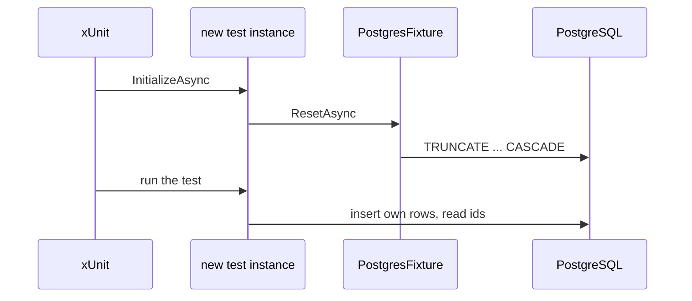

## Bạn cần biết trước

- [[design.l2.testing-the-real-repository]] — bạn biết cả hai test trong `EfOrderRepositoryTests` tự lưu khách và sản phẩm của mình qua `InsertCustomerAndProductsAsync`, và class này dùng chung một `PostgresFixture`, tức một database, cho mọi test của nó.
- [[design.l1.what-makes-a-good-unit-test]] — bạn biết flaky test lúc qua lúc fail dù code không đổi, và thứ tự chạy test là một trong những nguyên nhân thường gặp.

## Tình huống

`EfOrderRepositoryTests` đang xanh. Vì tò mò, bạn xóa dòng trong class đó làm rỗng các bảng trước mỗi test, rồi chạy lại cả class. Giờ một test fail với `23505: duplicate key value violates unique constraint "IX_customers_email"`. Bạn chạy riêng test đó, và nó qua: cùng code, cùng image container, kết quả khác nhau chỉ vì thứ đã chạy trước nó. Cả hai test đều insert khách `test.customer@example.com`, dòng của test đầu vẫn còn đó, và `customers.email` có unique index: PostgreSQL từ chối dòng thứ hai trùng email. Làm sao để các test dùng chung một database đều bắt đầu từ một trạng thái biết trước?

## Khái niệm cốt lõi

- dòng còn sót — các dòng một test trước đã lưu và vẫn còn trong database dùng chung khi test kế tiếp bắt đầu.
- reset trước mỗi test — làm rỗng các bảng ở đầu mỗi test, để test chỉ thấy những dòng do chính nó insert.
- `TRUNCATE` — câu lệnh SQL xóa mọi dòng của các bảng được liệt kê trong một lần, nhưng giữ nguyên các bảng.
- sequence id — con số chạy mà PostgreSQL giữ cho cột id của một bảng, phát ra số tiếp theo ở mỗi lần insert.
- id từ chính lần insert của bạn — các id PostgreSQL trả về khi test lưu dòng của nó, được test đó dùng thay cho những con số cố định như `1`.

## Cơ chế hoạt động



Các test trong một class dùng chung database của fixture. Trong tình huống trên, dòng còn sót là khách của test đầu, và unique index từ chối khách thứ hai. Một test đếm số đơn cũng sẽ fail theo cách tương tự, vì thấy cả đơn do test khác lưu, và chỉ fail khi test kia chạy trước. Đó là một flaky test, do thứ tự gây ra.

xUnit không hứa chạy các test của một class theo thứ tự chúng được viết. Vì vậy không test nào được dựa vào dữ liệu một test trước đã lưu, và cũng không test nào được để dữ liệu đó làm hỏng.

Ở stage-2, mỗi class integration test cài `IAsyncLifetime`, interface của xUnit có `InitializeAsync` được xUnit chờ chạy xong trước một test, và gọi `PostgresFixture.ResetAsync` ở đó. Vì xUnit tạo instance mới của class test cho mỗi test, lời gọi đó chạy trước mọi test. `ResetAsync` làm rỗng các bảng của Đơn Hàng bằng một câu `TRUNCATE ... CASCADE`. `CASCADE` khiến PostgreSQL làm rỗng luôn bảng nào có khóa ngoại trỏ tới một bảng trong danh sách; cả sáu bảng đều đã được liệt kê, nên hiện tại nó không thêm bảng nào, nhưng nếu sau này có bảng mới trỏ tới một trong số đó thì bước reset vẫn không hỏng.

Bước reset chạy trước mỗi test, không phải sau. Một test dừng giữa chừng, vì một assert fail hay một exception bị ném, sẽ không chạy tới đoạn dọn dẹp ở cuối thân của nó, còn một lần chạy bạn dừng từ bên ngoài, như khi tắt phiên debug, có thể chẳng dọn gì. Reset ở đầu nghĩa là những dòng như thế không thể lọt sang test kế tiếp.

Bước reset để các sequence id tiếp tục đếm. Sau vài test, đơn đầu tiên một test lưu có thể nhận id `7`, không phải `1`. Vì vậy test dùng các id mà chính lần insert của nó trả về, như `InsertCustomerAndProductsAsync` làm, thay vì giả định đơn đầu tiên là `1`.

## Trong hệ thống Đơn Hàng

Class test xin reset trước mọi test:

```csharp file=DonHang.Tests/Integration/EfOrderRepositoryTests.cs tag=stage-2 lines=9-19
// lesson: design.l2.class-fixtures
// lesson: design.l2.resetting-data-between-tests
// One PostgresFixture (one container) for every test in this class. Before
// each test, InitializeAsync empties the tables: the tests share a database,
// and xUnit does not promise to run them in the order they are written.
public sealed class EfOrderRepositoryTests(PostgresFixture database)
    : IClassFixture<PostgresFixture>, IAsyncLifetime
{
    public Task InitializeAsync() => database.ResetAsync();

    public Task DisposeAsync() => Task.CompletedTask;
```

Comment phía trên class nêu cùng lúc cả hai lý do: các test dùng chung một database, và xUnit không hứa thứ tự của chúng. `InitializeAsync` ở đây thuộc về class test, nên nó chạy một lần cho mỗi test. `DisposeAsync` cố ý không làm gì: dọn dẹp sau đó là việc mà bước reset của test kế tiếp đã làm rồi. `OrdersApiTests`, class test API của một bài sau, cũng có dòng y vậy cho database của riêng nó.

Bản thân bước reset:

```csharp file=DonHang.Tests/Integration/PostgresFixture.cs tag=stage-2 lines=40-49
    // lesson: design.l2.resetting-data-between-tests
    // Empties every Đơn Hàng table in one statement; CASCADE covers the
    // foreign keys between them. The id sequences keep counting from where
    // they were, so a test uses the ids its own inserts returned.
    public async Task ResetAsync()
    {
        await using var db = CreateContext();
        await db.Database.ExecuteSqlRawAsync(
            "TRUNCATE customers, products, orders, order_items, payments, notifications CASCADE");
    }
```

Một câu SQL liệt kê cả sáu bảng. Không có `RESTART IDENTITY`, tùy chọn của `TRUNCATE` để đưa các sequence id về điểm bắt đầu, nên chúng cứ tiếp tục đếm. `CreateContext()` cho bước reset một `DonHangDbContext` riêng, dùng xong bỏ, còn `ExecuteSqlRawAsync` gửi nguyên văn câu SQL đi. `TRUNCATE` xóa dòng chứ không xóa bảng, nên các bảng và khóa do migration tạo vẫn còn; bảng riêng của migration, `__EFMigrationsHistory`, cũng không nằm trong danh sách.

## Người mới hay nghĩ rằng…

- **"Mỗi test có một database mới, vì test chạy trong container."** → Thực ra một container phục vụ cả class, và database của nó giữ mọi dòng cho tới khi có thứ làm rỗng. Container tách test khỏi mọi database khác, chứ không tách khỏi test ngay bên cạnh. Bạn sẽ nhận ra khi một test fail vì trùng email chỉ khi chạy toàn bộ class của nó.
- **"Các test trong class chạy từ trên xuống dưới, nên test sau dùng được đơn mà test trước đã tạo."** → Thực ra xUnit không hứa thứ tự nào, và dù sao bước reset cũng làm rỗng bảng trước mọi test. Bạn sẽ nhận ra khi test sau fail ngay khi bạn chạy riêng nó, vì đơn nó chờ chưa bao giờ được tạo.

## Thử ngay (3 phút)

Trên máy của bạn, ở thư mục gốc của repo ví dụ đã checkout tại `stage-2`, với Docker đang chạy:

1. Trong `DonHang.Tests/Integration/EfOrderRepositoryTests.cs`, đổi `database.ResetAsync()` trong `InitializeAsync` thành `Task.CompletedTask`, để không có gì bị làm rỗng.
2. Chạy `dotnet test DonHang.Tests --filter "FullyQualifiedName~EfOrderRepositoryTests"`.
3. Chạy `dotnet test DonHang.Tests --filter "FullyQualifiedName~SaveChangesAsync_OrderForMissingCustomer"`, rồi hoàn tác thay đổi.

Kết quả mong đợi: ở bước 2 một test fail, ở lần chạy mẫu là `SaveChangesAsync_OrderForMissingCustomer_IsRefused`, với một `DbUpdateException` có lỗi bên trong là `23505: duplicate key value violates unique constraint "IX_customers_email"`. Test này cũng gọi `InsertCustomerAndProductsAsync`, vì món hàng của nó cần một sản phẩm. Ở bước 3, cũng test đó chạy riêng thì qua: không có gì chạy trước nó để bỏ lại một khách. Nếu test fail lại là `FindAsync_SavedOrderWithTwoItems_ReadsBothItemsBack`, tức là xUnit đã chọn thứ tự ngược lại; hãy chạy riêng test đó ở bước 3.

## Liên hệ

- [[design.l2.class-fixtures]] — nguyên nhân: một fixture cho cả class nghĩa là một database cho mọi test của nó.
- [[design.l1.what-makes-a-good-unit-test]] — vẫn là flaky test ấy, giờ do các dòng dùng chung gây ra thay vì một fake dùng chung.
- [[design.l2.testing-the-real-repository]] — lý do helper trả về id: các test không bao giờ giả định PostgreSQL sẽ phát ra số nào.
- [[design.l2.webapplicationfactory]] — bài tiếp theo: các test API reset theo cùng cách, qua database của `ApiFactory`.

## Tóm tắt 5 dòng

1. Các test dùng chung fixture thì dùng chung database của nó, nên dòng còn sót có thể khiến một test chỉ fail khi test khác chạy trước.
2. xUnit không hứa thứ tự test, nên không test nào được dựa vào, hay bị hỏng vì, dữ liệu một test trước đã lưu.
3. Ở stage-2, mỗi class integration test gọi `PostgresFixture.ResetAsync` trước mọi test, method chạy `TRUNCATE ... CASCADE`.
4. Reset trước mỗi test, không phải sau, nghĩa là một test dừng giữa chừng không thể để lại dòng cho test kế tiếp.
5. Bước reset để sequence id tiếp tục đếm, nên test dùng các id do chính lần insert của nó trả về, không bao giờ dùng `1` cố định.
