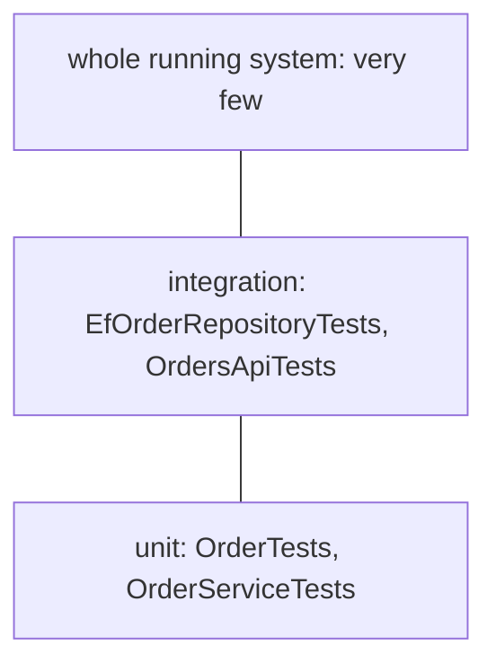

## Before you start

- [[design.l2.testing-protected-endpoints]] — you know `OrdersApiTests` sends real requests through `ApiFactory` and checks the status codes a client gets, `401` and `403` included.
- [[design.l2.testing-the-entity]] — you know `OrderTests` checks `Order`'s status rules by calling its methods directly, with no fake and no `await`.

## The situation

After the API tests are merged, a teammate is impressed: `OrdersApiTests` checks the real thing, through HTTP, PostgreSQL and Redis. So why keep `OrderTests` at all? The proposal is to rewrite each of its status checks as an API test, so every rule is proven through the whole stack. You run both groups. The ten tests in `OrderTests` report a test time well under a second; the seven integration tests first start PostgreSQL and Redis containers, and the whole run takes many seconds more on the clock. Before you answer the pull request, you need a rule of your own: which level of test should check which risk?

## Core concepts

- **test pyramid** — a picture of a test suite with many fast unit tests at the bottom, fewer integration tests above them, and very few tests of the whole running system at the top.
- test of the whole running system — a test that drives the app as deployed, with every real service it uses, Keycloak included; the API tests stop short of that, since they run the API inside the test process and skip Keycloak.
- risk where parts meet — a mistake between pieces that each work alone: a query, a mapping, a foreign key, the HTTP contract (the status code, headers and body a client relies on), who may call.
- risk in a rule — a mistake inside one class's decision, such as `Order.Ship()` accepting a `new` order.

## How it works



The test pyramid pictures a suite with many fast unit tests at the bottom, fewer integration tests above them, and very few tests of the whole running system at the top. Each level up costs more to run and to set up, and each one can fail for more reasons. In Đơn Hàng, `OrderTests` and `OrderServiceTests`, which checks `OrderService`'s steps with fakes, form the bottom. `EfOrderRepositoryTests` and `OrdersApiTests` form the middle.

In the situation above, the status rules are checked in `OrderTests`. `OrdersApiTests` checks once that a status refusal, an `OrderStatusException`, reaches the client as `409` with its problem `type`. It does not check every rule again over HTTP. If `Ship()` lost its check, both would fail. The unit failure arrives in milliseconds and can only come from `Order.Ship()`; a failing `409` test could come from the rule, routing, `StaffOnly`, the middleware or the database.

So each level has its job. An integration test pays for its cost where the risk sits where parts meet: a query, a mapping, a foreign key, the HTTP contract, who may call. A unit test is the better place where the risk sits in a rule. Because the middleware turns every `OrderStatusException` into `409` the same way, one API test of that path shows the HTTP side works; the rules themselves stay below.

The pyramid is not the only reasonable shape. When an application mostly moves data between HTTP and the database, with few rules, putting most tests at the integration level is a reasonable choice: there is little logic for a unit test to check, and most risks sit where parts meet. The pyramid fits where rules live in code, as they do in `Order`.

## In the Đơn Hàng system

One rule, checked where it lives:

```csharp file=DonHang.Tests/Domain/OrderTests.cs tag=stage-2 lines=96-105
    [Fact]
    public void Ship_NewOrder_Throws()
    {
        var order = NewOrder();

        var ex = Assert.Throws<OrderStatusException>(order.Ship);

        Assert.Equal("not-paid", ex.Code);
        Assert.Equal("new", order.Status);
    }
```

No database, no container, no request: `NewOrder()` is a helper that builds a `new` order. The test checks the `Code`, `not-paid`, and that the status did not change.

The same refusal, checked once over HTTP:

```csharp file=DonHang.Tests/Integration/OrdersApiTests.cs tag=stage-2 lines=75-86
    [Fact]
    public async Task ShipOrder_StaffAndNewOrder_Returns409NotPaid()
    {
        await InsertCustomerAsync("customer-an");
        var orderId = await PlaceOrderForAsync("customer-an");

        var response = await ClientFor("staff-lan", "staff").PatchAsync($"/api/v1/orders/{orderId}/ship", null);

        Assert.Equal(HttpStatusCode.Conflict, response.StatusCode);
        var problem = await response.Content.ReadFromJsonAsync<Problem>();
        Assert.Equal("https://donhang.local/problems/not-paid", problem!.Type);
    }
```

`ClientFor` sends the request as a staff member, and `Problem` reads the `type` from the JSON body. This test checks what `OrderTests` cannot: that the exception becomes `409`, that the problem `type` ends in `not-paid`, and that a staff caller gets past `StaffOnly` to reach the rule at all.

It does not try `already-shipped` or `already-cancelled` over HTTP; the middleware turns every `OrderStatusException` into `409` the same way, with the `type` built from its `Code`. The same thinking puts two checks in `EfOrderRepositoryTests`: that `FindAsync` really loads an order's items, and that PostgreSQL's foreign key refuses an order for a missing customer. No rule in `Order` could reveal either.

Not all code has rules. `ProductsController.List`, the product list endpoint, reads the EF Core context `DonHangDbContext` directly; its comment says it "has no rule to apply, only a query to shape". Code like that keeps its risk in the query.

## Beginners often think…

- **"Integration tests check the real thing, so every unit test should become one."** → Actually a rule checked over HTTP runs slower, needs containers, and when it fails, points at more places that could be wrong. You notice this when a broken status rule makes an API test report `Actual: OK` instead of `Conflict`, and the cause could sit anywhere from the policy to the middleware, while the failing unit test can only point at `Order.Ship()`.
- **"The pyramid sets fixed percentages that each level of tests must meet."** → Actually it describes a shape for code whose rules live in classes; the right mix depends on where a system's risks sit. You notice this when a team chasing a ratio writes unit tests for code that only passes data through, and those tests catch nothing.

## Try it (3 minutes)

On your own machine, in the root folder of the example repository checked out at `stage-2`, with Docker running:

1. In `DonHang.Domain/Entities.cs`, inside `Ship()`, delete the line that throws `not-paid` when `Status != "paid"`.
2. Run `dotnet test DonHang.Tests --filter "FullyQualifiedName~DonHang.Tests.Domain"`, then `dotnet test DonHang.Tests --filter "FullyQualifiedName~OrdersApiTests"`, and undo the change.

Expected result: both runs have one failure. The first reports a test duration of a fraction of a second: `Ship_NewOrder_Throws` reports `Assert.Throws() Failure: No exception was thrown`, and only `Order.Ship()` can cause it. The second starts its PostgreSQL and Redis containers first, then `ShipOrder_StaffAndNewOrder_Returns409NotPaid` reports `Expected: Conflict` and `Actual: OK`: the HTTP answer changed, and you still have to find out why.

## Connections

- [[design.l2.testing-the-entity]] — the bottom of the pyramid in Đơn Hàng: rules checked where they live.
- [[design.l2.integration-test-first-look]] — the first reason for the middle level: what no fake can show.
- [[design.l2.testing-protected-endpoints]] — the HTTP side of the middle level: who may call what.
- [[management.l1.reviewing-for-tests]] — the same question asked in review: is there a test at the level where this change can break?

## Five-line summary

1. The test pyramid pictures many fast unit tests, fewer integration tests, and very few tests of the whole running system.
2. Đơn Hàng checks the status rules in `OrderTests`; `OrdersApiTests` checks once that a refusal reaches the client as `409`.
3. Integration tests earn their cost where parts meet: queries, mappings, foreign keys, the HTTP contract and who may call.
4. Unit tests are the better place for a rule: they run in milliseconds, and a failure can only come from that rule's class.
5. An application with few rules may reasonably keep most tests at the integration level; the pyramid fits rule-heavy code.
