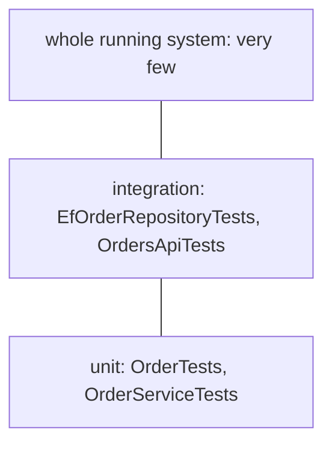

## Bạn cần biết trước

- [[design.l2.testing-protected-endpoints]] — bạn biết `OrdersApiTests` gửi request thật qua `ApiFactory` và kiểm tra status code mà client nhận, kể cả `401` và `403`.
- [[design.l2.testing-the-entity]] — bạn biết `OrderTests` kiểm tra các quy tắc trạng thái của `Order` bằng cách gọi thẳng method của nó, không fake, không `await`.

## Tình huống

Sau khi các test API được merge, một đồng đội rất ấn tượng: `OrdersApiTests` kiểm tra hệ thống thật, qua HTTP, PostgreSQL và Redis. Vậy còn giữ `OrderTests` làm gì? Đề xuất là viết lại từng phép kiểm tra trạng thái của nó thành test API, để mọi quy tắc được chứng minh qua toàn bộ hệ thống. Bạn chạy cả hai nhóm. Mười test trong `OrderTests` báo thời gian test chưa tới một giây; bảy integration test phải khởi động container PostgreSQL và Redis trước, và cả lần chạy mất thêm nhiều giây tính theo đồng hồ. Trước khi trả lời pull request, bạn cần một nguyên tắc của riêng mình: tầng test nào nên kiểm tra rủi ro nào?

## Khái niệm cốt lõi

- **test pyramid** (Hình dạng bộ test: nhiều unit test, ít integration test hơn, rất ít test cả hệ thống đang chạy) — hình ảnh một bộ test có nhiều unit test nhanh ở đáy, ít integration test hơn ở trên, và rất ít test cả hệ thống đang chạy ở đỉnh.
- test cả hệ thống đang chạy — test điều khiển app đúng như khi đã deploy, với mọi service thật nó dùng, kể cả Keycloak; các test API dừng trước mức đó, vì chúng chạy API ngay trong process test và bỏ qua Keycloak.
- rủi ro ở chỗ các phần gặp nhau — lỗi nằm giữa những phần mà riêng từng phần vẫn chạy đúng: một câu truy vấn, một mapping, một khóa ngoại, hợp đồng HTTP (status code, header và body mà client dựa vào), ai được gọi.
- rủi ro trong một quy tắc — lỗi nằm trong quyết định của một class, chẳng hạn `Order.Ship()` chấp nhận một đơn `new`.

## Cơ chế hoạt động



Test pyramid vẽ ra một bộ test có nhiều unit test nhanh ở đáy, ít integration test hơn ở trên, và rất ít test cả hệ thống đang chạy ở đỉnh. Mỗi tầng càng lên cao càng tốn công chạy và dựng hơn, và càng có nhiều lý do để fail. Trong Đơn Hàng, `OrderTests` và `OrderServiceTests`, class kiểm tra các bước của `OrderService` bằng fake, tạo thành tầng đáy. `EfOrderRepositoryTests` và `OrdersApiTests` tạo thành tầng giữa.

Trong tình huống trên, các quy tắc trạng thái được kiểm tra trong `OrderTests`. `OrdersApiTests` kiểm tra một lần rằng việc từ chối đổi trạng thái, tức một `OrderStatusException`, tới client dưới dạng `409` kèm `type` của problem. Nó không kiểm tra lại từng quy tắc qua HTTP. Nếu `Ship()` mất phép kiểm tra của nó, cả hai đều fail. Lỗi ở unit test đến trong vài mili giây và chỉ có thể do `Order.Ship()`; còn một test `409` fail thì có thể do quy tắc, routing, `StaffOnly`, middleware hay database.

Vậy mỗi tầng có việc riêng. Integration test đáng cái giá của nó ở chỗ rủi ro nằm nơi các phần gặp nhau: một câu truy vấn, một mapping, một khóa ngoại, hợp đồng HTTP, ai được gọi. Unit test là chỗ tốt hơn khi rủi ro nằm trong một quy tắc. Vì middleware biến mọi `OrderStatusException` thành `409` theo cùng một kiểu, một test API cho đường đó là đủ cho thấy phía HTTP chạy đúng; còn bản thân các quy tắc thì ở tầng dưới.

Pyramid không phải hình dạng hợp lý duy nhất. Khi một ứng dụng chủ yếu chuyển dữ liệu giữa HTTP và database, với rất ít quy tắc, dồn phần lớn test về tầng integration là lựa chọn hợp lý: có rất ít logic cho unit test kiểm tra, và phần lớn rủi ro nằm ở chỗ các phần gặp nhau. Pyramid hợp với nơi quy tắc nằm trong code, như trong `Order`.

## Trong hệ thống Đơn Hàng

Một quy tắc, được kiểm tra ngay nơi nó nằm:

```csharp file=DonHang.Tests/Domain/OrderTests.cs tag=stage-2 lines=96-105
    [Fact]
    public void Ship_NewOrder_Throws()
    {
        var order = NewOrder();

        var ex = Assert.Throws<OrderStatusException>(order.Ship);

        Assert.Equal("not-paid", ex.Code);
        Assert.Equal("new", order.Status);
    }
```

Không database, không container, không request: `NewOrder()` là helper dựng một đơn `new`. Test kiểm tra `Code` là `not-paid`, và trạng thái không đổi.

Cũng lần từ chối đó, được kiểm tra một lần qua HTTP:

```csharp file=DonHang.Tests/Integration/OrdersApiTests.cs tag=stage-2 lines=75-86
    [Fact]
    public async Task ShipOrder_StaffAndNewOrder_Returns409NotPaid()
    {
        await InsertCustomerAsync("customer-an");
        var orderId = await PlaceOrderForAsync("customer-an");

        var response = await ClientFor("staff-lan", "staff").PatchAsync($"/api/v1/orders/{orderId}/ship", null);

        Assert.Equal(HttpStatusCode.Conflict, response.StatusCode);
        var problem = await response.Content.ReadFromJsonAsync<Problem>();
        Assert.Equal("https://donhang.local/problems/not-paid", problem!.Type);
    }
```

`ClientFor` gửi request với tư cách một nhân viên, còn `Problem` đọc `type` từ body JSON. Test này kiểm tra điều `OrderTests` không thể: exception trở thành `409`, `type` của problem kết thúc bằng `not-paid`, và một người gọi là nhân viên qua được `StaffOnly` để tới được quy tắc.

Nó không thử `already-shipped` hay `already-cancelled` qua HTTP; middleware biến mọi `OrderStatusException` thành `409` theo cùng một kiểu, với `type` dựng từ `Code` của nó. Cũng cách nghĩ đó đặt hai phép kiểm tra vào `EfOrderRepositoryTests`: `FindAsync` có thật sự tải các món hàng của đơn không, và khóa ngoại của PostgreSQL có từ chối đơn của khách không tồn tại không. Không quy tắc nào trong `Order` có thể làm lộ ra hai điều đó.

Không phải code nào cũng có quy tắc. `ProductsController.List`, endpoint danh sách sản phẩm, đọc thẳng context EF Core `DonHangDbContext`; comment của nó nói nó "has no rule to apply, only a query to shape". Code như vậy giữ rủi ro của nó trong câu truy vấn.

## Người mới hay nghĩ rằng…

- **"Integration test kiểm tra hệ thống thật, nên unit test nào cũng nên chuyển thành integration test."** → Thực ra một quy tắc kiểm tra qua HTTP chạy chậm hơn, cần container, và khi fail thì chỉ ra nhiều chỗ có thể sai hơn. Bạn sẽ nhận ra khi một quy tắc trạng thái bị hỏng làm test API báo `Actual: OK` thay vì `Conflict`, và nguyên nhân có thể nằm ở bất cứ đâu từ policy tới middleware, trong khi unit test fail chỉ có thể chỉ vào `Order.Ship()`.
- **"Pyramid đặt ra tỉ lệ phần trăm cố định mà mỗi tầng test phải đạt."** → Thực ra nó mô tả một hình dạng cho code có quy tắc nằm trong class; tỉ lệ phù hợp tùy vào chỗ rủi ro của hệ thống nằm. Bạn sẽ nhận ra khi một team chạy theo tỉ lệ viết unit test cho code chỉ chuyển dữ liệu qua, và các test đó không bắt được gì.

## Thử ngay (3 phút)

Trên máy của bạn, ở thư mục gốc của repo ví dụ đã checkout tại `stage-2`, với Docker đang chạy:

1. Trong `DonHang.Domain/Entities.cs`, bên trong `Ship()`, xóa dòng ném `not-paid` khi `Status != "paid"`.
2. Chạy `dotnet test DonHang.Tests --filter "FullyQualifiedName~DonHang.Tests.Domain"`, rồi `dotnet test DonHang.Tests --filter "FullyQualifiedName~OrdersApiTests"`, và hoàn tác thay đổi.

Kết quả mong đợi: cả hai lần chạy đều có một test fail. Lần đầu báo thời gian test chưa tới một giây: `Ship_NewOrder_Throws` báo `Assert.Throws() Failure: No exception was thrown`, và chỉ `Order.Ship()` có thể gây ra nó. Lần thứ hai khởi động container PostgreSQL và Redis trước, rồi `ShipOrder_StaffAndNewOrder_Returns409NotPaid` báo `Expected: Conflict` và `Actual: OK`: câu trả lời HTTP đã đổi, và bạn vẫn phải tự tìm lý do.

## Liên hệ

- [[design.l2.testing-the-entity]] — tầng đáy của pyramid trong Đơn Hàng: quy tắc được kiểm tra ngay nơi nó nằm.
- [[design.l2.integration-test-first-look]] — lý do đầu tiên cho tầng giữa: điều không fake nào cho thấy được.
- [[design.l2.testing-protected-endpoints]] — phía HTTP của tầng giữa: ai được gọi gì.
- [[management.l1.reviewing-for-tests]] — cùng câu hỏi đó khi review: đã có test ở đúng tầng mà thay đổi này có thể làm hỏng chưa?

## Tóm tắt 5 dòng

1. Test pyramid vẽ ra nhiều unit test nhanh, ít integration test hơn, và rất ít test cả hệ thống đang chạy.
2. Đơn Hàng kiểm tra các quy tắc trạng thái trong `OrderTests`; `OrdersApiTests` kiểm tra một lần rằng lần từ chối tới client dưới dạng `409`.
3. Integration test đáng cái giá của nó ở chỗ các phần gặp nhau: truy vấn, mapping, khóa ngoại, hợp đồng HTTP và ai được gọi.
4. Unit test là chỗ tốt hơn cho một quy tắc: chạy trong vài mili giây, và khi fail thì chỉ có thể do class chứa quy tắc đó.
5. Một ứng dụng ít quy tắc có thể hợp lý khi giữ phần lớn test ở tầng integration; pyramid hợp với code nhiều quy tắc.
