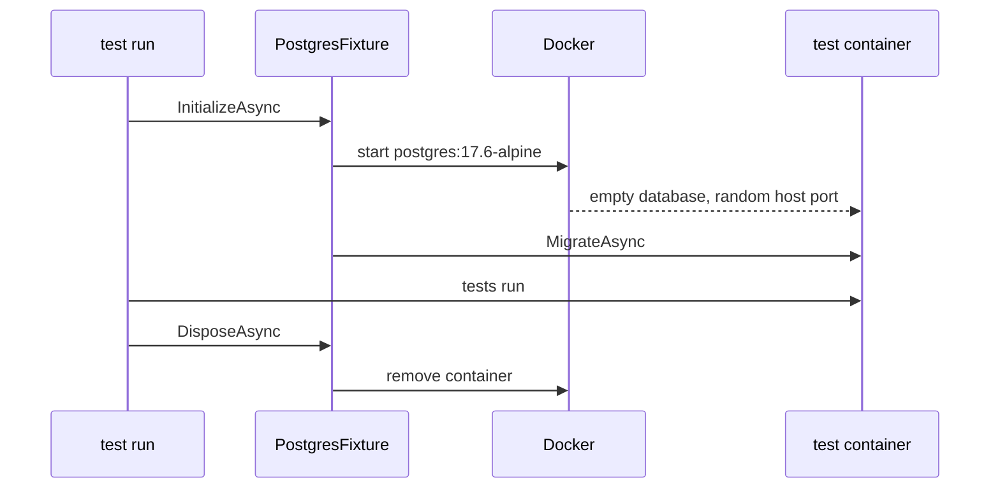

## Before you start

- [[design.l2.integration-test-first-look]] — you know an integration test runs `EfOrderRepository` against a real PostgreSQL, because only the real database runs the query and checks the foreign key.
- [[devops.l1.image-vs-container]] — you know a container is one running copy of an image, and two containers from the same image never see each other's changes.
- [[backend.l1.migrations]] — you know EF Core migrations are the code-tracked steps that build Đơn Hàng's schema, applied by `Migrate()` or the tools.

## The situation

At stage-2 you want the test the previous lesson asked for: save an order through `EfOrderRepository`, read it back from PostgreSQL. The lab's database is right there, `donhang-db` on `localhost:5432`, already full of seed data: five customers, eight products, twelve orders. But your test would insert and delete rows in the database other lessons read. It would also pass or fail depending on whether `up.sh` ran today and what someone typed into `psql` yesterday. Where should a test get a real PostgreSQL that belongs to nobody else?

## Core concepts

- **Testcontainers** — a library that starts a Docker container from test code and removes it when the test code disposes of it; only Docker has to be running, not the lab.
- throwaway database — a database that exists only for one test run, starts empty, and is deleted afterwards, so no one's data depends on it.
- schema from the migrations — the tables a test database gets by applying Đơn Hàng's EF Core migrations to it, the same steps that build any new database for the API.

## How it works



In the situation above, the throwaway database comes from Testcontainers. `PostgresFixture` describes a PostgreSQL container in code, with `PostgreSqlBuilder`. For `EfOrderRepositoryTests`, the test framework calls `PostgresFixture`'s `InitializeAsync` once before the first test of that class and its `DisposeAsync` once after the class's last test; the next lesson shows how. `InitializeAsync` asks Docker to start the container, and `DisposeAsync` asks Docker to remove it. Docker must be running; the lab does not.

The image is `postgres:17.6-alpine`, the same image as the `db` service in `docker-compose.yml`. Tests therefore run on the PostgreSQL version the lab runs, not on whatever version happens to be installed on your machine.

The test container is still not the lab's `db`. Testcontainers maps the container's port `5432` to a free port on the host, chosen when the container starts, so it never collides with the lab's `5432`. It gets none of the SQL files (`schema.sql`, `seed.sql`, `migrations-baseline.sql`) the lab's `db` runs on its first start, and no named volume, so it starts with an empty `donhang` database. `GetConnectionString()` returns the host, the port and the credentials, ready for EF Core.

Before any test runs, `PostgresFixture` calls `MigrateAsync`, which applies every migration to that empty database. The tests then see the schema the migrations really produce, including the foreign key on `orders.customer_id`.

EF Core also has an in-memory provider: an option that makes EF Core keep data in memory instead of sending SQL to a database. It needs no Docker, but it is not PostgreSQL: it runs no SQL and does not check foreign keys, so a test using it cannot show what the real database does with a query or a foreign key.

## In the Đơn Hàng system

`PostgresFixture`, the class every integration test at stage-2 shares to get its database:

```csharp file=DonHang.Tests/Integration/PostgresFixture.cs tag=stage-2 lines=8-31
// lesson: design.l2.testcontainers-postgresql
// A throwaway PostgreSQL for the tests: the same image as the db service in
// docker-compose.yml, but not the lab's db. Testcontainers maps its port to
// a free port on the host, and the database starts empty.
public sealed class PostgresFixture : IAsyncLifetime
{
    private readonly PostgreSqlContainer container = new PostgreSqlBuilder("postgres:17.6-alpine")
        .WithDatabase("donhang")
        .WithUsername("donhang")
        .Build();

    public string ConnectionString => container.GetConnectionString();

    // lesson: design.l2.class-fixtures
    // xUnit awaits this once, before the first test of the class that uses
    // the fixture, and DisposeAsync once, after its last test.
    // MigrateAsync applies every migration, InitialCreate included: on an
    // empty database, the same list the migration bundle applies.
    public async Task InitializeAsync()
    {
        await container.StartAsync();
        await using var db = CreateContext();
        await db.Database.MigrateAsync();
    }
```

`PostgreSqlBuilder` collects the image, the database name and the user, and `Build()` creates the container description; nothing starts yet. `IAsyncLifetime` is the interface that tells xUnit, the test framework `DonHang.Tests` uses, to call `InitializeAsync` before the tests and `DisposeAsync` after them. `StartAsync()` is where Docker starts the container. Then `CreateContext()`, just below this excerpt, builds a `DonHangDbContext` from `ConnectionString`, and `MigrateAsync` applies the migrations, `InitialCreate` included, since nothing exists yet. The last line of the comment above `InitializeAsync` compares this with how the lab's own database gets its migrations; you can skip it here.

The lab's database, for comparison:

```yaml file=docker-compose.yml tag=stage-2 lines=57-73
  db:
    image: postgres:17.6-alpine
    container_name: donhang-db
    hostname: db
    environment:
      POSTGRES_DB: donhang
      POSTGRES_USER: donhang
      POSTGRES_PASSWORD: "${POSTGRES_PASSWORD}"
      TZ: "Asia/Ho_Chi_Minh"
      PGTZ: "Asia/Ho_Chi_Minh"
    volumes:
      - ./db/schema.sql:/docker-entrypoint-initdb.d/10-schema.sql:ro
      - ./db/seed.sql:/docker-entrypoint-initdb.d/20-seed.sql:ro
      - ./db/migrations-baseline.sql:/docker-entrypoint-initdb.d/30-migrations-baseline.sql:ro
      - db-data:/var/lib/postgresql/data
    ports:
      - "5432:5432"
```

Same image, but everything around it differs. The lab's `db` has a fixed name, the fixed host port `5432`, seed data from `seed.sql`, and a volume `db-data` that keeps its rows across restarts. Its tables come from `schema.sql`, and `migrations-baseline.sql` marks `InitialCreate` as already applied, the job `MigrationBaseline` did at startup until stage-1; the test container's tables come from `MigrateAsync`. The test container has a random name, a random host port, no seed and no named volume. `DonHang.Tests.csproj` references the `Testcontainers.PostgreSql` package, and its comment reads: "Running this project now needs Docker, not the lab."

## Beginners often think…

- **"Integration tests should use the lab database that `up.sh` starts, since it already has data."** → Actually that data belongs to every other lesson, and a test that inserts or deletes rows changes it for them, while the test's result depends on what the lab holds that day. You notice this when a test passes on your machine and fails on a teammate's, whose lab has different rows.
- **"Testcontainers is a fake PostgreSQL written for tests."** → Actually it starts the real `postgres:17.6-alpine` image in Docker, the image the lab uses; the library starts and removes the container, and the database inside it is the real PostgreSQL. You notice this when `docker ps` during a test run lists a `postgres:17.6-alpine` container you did not start.
- **"EF Core's in-memory provider tests the repository just as well, without Docker."** → Actually it is not PostgreSQL and runs no SQL, so it cannot show what PostgreSQL does with a query or a foreign key. You notice this when an order for a missing customer saves fine in memory and is refused by PostgreSQL.

## Try it (3 minutes)

On your own machine, not inside the lab box, in the root folder of the example repository checked out at `stage-2`, with Docker running (the lab may be up or down):

1. In a first terminal, run `docker events --filter image=postgres:17.6-alpine --filter event=create --filter event=destroy`. It waits and prints a line each time Docker creates or removes a container from that image.
2. In a second terminal, run `dotnet test DonHang.Tests --filter "FullyQualifiedName~EfOrderRepositoryTests"`.
3. Watch the first terminal, then stop it with `Ctrl+C`.

Expected result: two tests pass. The first terminal shows one `container create` line and, a few seconds later, one `container destroy` line with the same randomly generated `name=`, never `donhang-db`.

## Connections

- [[design.l2.integration-test-first-look]] — the question this lesson answers: where the real database for an integration test comes from.
- [[devops.l1.image-vs-container]] — the same idea put to work: one image, two containers, the lab's and the test's, that never share data.
- [[backend.l1.migrations]] — why the test database has the right schema: the migrations are applied to it before any test runs.
- [[design.l2.builder-pattern]] — `PostgreSqlBuilder` is a builder: settings first, then one `Build()` call.
- [[design.l2.class-fixtures]] — the next lesson: how xUnit decides when `InitializeAsync` and `DisposeAsync` run.

## Five-line summary

1. Testcontainers starts a real Docker container from test code and removes it when the test code disposes of it.
2. `PostgresFixture` uses `postgres:17.6-alpine`, the image of the lab's `db` service, so tests run on the lab's PostgreSQL version.
3. The test container is not the lab's `db`: a random host port and an empty database, so lab data is never touched.
4. `PostgresFixture` applies every EF Core migration before the tests, so they see the schema the migrations really produce.
5. EF Core's in-memory provider runs no SQL, so it cannot show what PostgreSQL does with a query or a foreign key.
