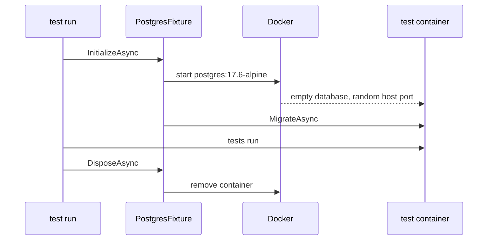

## Bạn cần biết trước

- [[design.l2.integration-test-first-look]] — bạn biết integration test chạy `EfOrderRepository` trên một PostgreSQL thật, vì chỉ database thật mới chạy câu truy vấn và kiểm tra khóa ngoại.
- [[devops.l1.image-vs-container]] — bạn biết container là một bản đang chạy của image, và hai container từ cùng một image không bao giờ thấy thay đổi của nhau.
- [[backend.l1.migrations]] — bạn biết migration của EF Core là các bước được lưu trong code để dựng schema của Đơn Hàng, được áp bằng `Migrate()` hoặc bằng công cụ.

## Tình huống

Ở stage-2, bạn muốn viết đúng loại test mà bài trước đặt ra: lưu một đơn qua `EfOrderRepository`, rồi đọc lại từ PostgreSQL. Database của lab có sẵn ngay đó, `donhang-db` ở `localhost:5432`, đã đầy dữ liệu mẫu: năm khách, tám sản phẩm, mười hai đơn. Nhưng test của bạn sẽ insert và xóa dòng trong chính database mà các bài khác đang đọc. Kết quả của nó còn tùy vào hôm nay `up.sh` đã chạy chưa và hôm qua ai đó đã gõ gì vào `psql`. Vậy test nên lấy một PostgreSQL thật, không thuộc về ai khác, từ đâu?

## Khái niệm cốt lõi

- **Testcontainers** (Thư viện khởi động container Docker thật từ code test và xóa nó khi test xong) — thư viện khởi động một container Docker từ code test và xóa nó khi code test giải phóng (dispose) nó; chỉ cần Docker đang chạy, không cần lab.
- database dùng xong bỏ — database chỉ tồn tại cho một lần chạy test, khởi đầu rỗng và bị xóa sau đó, nên không dữ liệu của ai phụ thuộc vào nó.
- schema từ migration — các bảng mà database của test có được nhờ áp migration EF Core của Đơn Hàng vào nó, cũng là những bước dựng mọi database mới cho API.

## Cơ chế hoạt động



Trong tình huống trên, database dùng xong bỏ đến từ Testcontainers. `PostgresFixture` mô tả một container PostgreSQL ngay trong code, bằng `PostgreSqlBuilder`. Với `EfOrderRepositoryTests`, framework test gọi `InitializeAsync` của `PostgresFixture` một lần trước test đầu tiên của class đó, và gọi `DisposeAsync` của nó một lần sau test cuối cùng của class; bài sau sẽ cho thấy cách làm. `InitializeAsync` nhờ Docker khởi động container, còn `DisposeAsync` nhờ Docker xóa nó. Docker phải đang chạy, còn lab thì không cần.

Image là `postgres:17.6-alpine`, đúng image của service `db` trong `docker-compose.yml`. Nhờ vậy test chạy trên đúng phiên bản PostgreSQL mà lab chạy, chứ không phải phiên bản nào tình cờ được cài trên máy bạn.

Dù vậy, container của test không phải `db` của lab. Testcontainers map port `5432` của container sang một port còn trống trên host, chọn lúc container khởi động, nên không bao giờ đụng với `5432` của lab. Nó không nhận file SQL nào (`schema.sql`, `seed.sql`, `migrations-baseline.sql`) mà `db` của lab chạy ở lần khởi động đầu, và không có named volume, nên nó khởi đầu với một database `donhang` rỗng. `GetConnectionString()` trả về host, port và thông tin đăng nhập, sẵn sàng cho EF Core.

Trước khi test nào chạy, `PostgresFixture` gọi `MigrateAsync` để áp mọi migration vào database rỗng đó. Các test vì thế thấy đúng schema mà migration thật sự tạo ra, kể cả khóa ngoại trên `orders.customer_id`.

EF Core còn có một provider in-memory: một tùy chọn khiến EF Core giữ dữ liệu trong bộ nhớ thay vì gửi SQL tới database. Nó không cần Docker, nhưng nó không phải PostgreSQL: nó không chạy SQL và không kiểm tra khóa ngoại, nên test dùng nó không thể cho thấy database thật làm gì với một câu truy vấn hay một khóa ngoại.

## Trong hệ thống Đơn Hàng

`PostgresFixture`, class mà mọi integration test ở stage-2 dùng chung để có database:

```csharp file=DonHang.Tests/Integration/PostgresFixture.cs tag=stage-2 lines=8-31
// lesson: design.l2.testcontainers-postgresql
// A throwaway PostgreSQL for the tests: the same image as the db service in
// docker-compose.yml, but not the lab's db. Testcontainers maps its port to
// a free port on the host, and the database starts empty.
public sealed class PostgresFixture : IAsyncLifetime
{
    private readonly PostgreSqlContainer container = new PostgreSqlBuilder("postgres:17.6-alpine")
        .WithDatabase("donhang")
        .WithUsername("donhang")
        .Build();

    public string ConnectionString => container.GetConnectionString();

    // lesson: design.l2.class-fixtures
    // xUnit awaits this once, before the first test of the class that uses
    // the fixture, and DisposeAsync once, after its last test.
    // MigrateAsync applies every migration, InitialCreate included: on an
    // empty database, the same list the migration bundle applies.
    public async Task InitializeAsync()
    {
        await container.StartAsync();
        await using var db = CreateContext();
        await db.Database.MigrateAsync();
    }
```

`PostgreSqlBuilder` gom image, tên database và user, rồi `Build()` tạo bản mô tả container; lúc này chưa có gì khởi động. `IAsyncLifetime` là interface báo cho xUnit, framework test mà `DonHang.Tests` dùng, gọi `InitializeAsync` trước các test và `DisposeAsync` sau chúng. `StartAsync()` là lúc Docker khởi động container. Sau đó `CreateContext()`, nằm ngay dưới đoạn trích này, dựng một `DonHangDbContext` từ `ConnectionString`, và `MigrateAsync` áp các migration, kể cả `InitialCreate`, vì lúc đó chưa có gì cả. Dòng cuối của comment phía trên `InitializeAsync` so sánh với cách database của lab nhận migration; ở bài này bạn có thể bỏ qua nó.

Database của lab, để so sánh:

```yaml file=docker-compose.yml tag=stage-2 lines=57-73
  db:
    image: postgres:17.6-alpine
    container_name: donhang-db
    hostname: db
    environment:
      POSTGRES_DB: donhang
      POSTGRES_USER: donhang
      POSTGRES_PASSWORD: "${POSTGRES_PASSWORD}"
      TZ: "Asia/Ho_Chi_Minh"
      PGTZ: "Asia/Ho_Chi_Minh"
    volumes:
      - ./db/schema.sql:/docker-entrypoint-initdb.d/10-schema.sql:ro
      - ./db/seed.sql:/docker-entrypoint-initdb.d/20-seed.sql:ro
      - ./db/migrations-baseline.sql:/docker-entrypoint-initdb.d/30-migrations-baseline.sql:ro
      - db-data:/var/lib/postgresql/data
    ports:
      - "5432:5432"
```

Cùng image, nhưng mọi thứ xung quanh đều khác. `db` của lab có tên cố định, port `5432` cố định trên host, dữ liệu mẫu từ `seed.sql`, và volume `db-data` giữ các dòng qua những lần khởi động lại. Bảng của nó đến từ `schema.sql`, và `migrations-baseline.sql` đánh dấu `InitialCreate` là đã áp, đúng việc mà `MigrationBaseline` làm lúc khởi động cho tới stage-1; còn bảng của container test đến từ `MigrateAsync`. Container của test có tên ngẫu nhiên, port ngẫu nhiên trên host, không có dữ liệu mẫu và không có named volume. `DonHang.Tests.csproj` tham chiếu package `Testcontainers.PostgreSql`, và comment của nó ghi: "Running this project now needs Docker, not the lab."

## Người mới hay nghĩ rằng…

- **"Integration test nên dùng database của lab mà `up.sh` khởi động, vì nó đã có sẵn dữ liệu."** → Thực ra dữ liệu đó thuộc về mọi bài khác, và test insert hay xóa dòng sẽ đổi nó dưới chân các bài ấy, trong khi kết quả test lại tùy vào hôm đó lab đang chứa gì. Bạn sẽ nhận ra khi một test qua trên máy bạn nhưng fail trên máy đồng đội, nơi lab có dữ liệu khác.
- **"Testcontainers là một PostgreSQL giả viết riêng cho test."** → Thực ra nó khởi động image `postgres:17.6-alpine` thật trong Docker, đúng image lab dùng; thư viện lo khởi động và xóa container, còn database bên trong là PostgreSQL thật. Bạn sẽ nhận ra khi `docker ps` trong lúc test chạy liệt kê một container `postgres:17.6-alpine` mà bạn không hề khởi động.
- **"Provider in-memory của EF Core test repository tốt không kém, lại không cần Docker."** → Thực ra nó không phải PostgreSQL và không chạy SQL, nên không thể cho thấy PostgreSQL làm gì với một câu truy vấn hay một khóa ngoại. Bạn sẽ nhận ra khi một đơn của khách không tồn tại vẫn lưu ngon lành trong bộ nhớ nhưng bị PostgreSQL từ chối.

## Thử ngay (3 phút)

Trên máy của bạn, không phải trong lab box, ở thư mục gốc của repo ví dụ đã checkout tại `stage-2`, với Docker đang chạy (lab bật hay tắt đều được):

1. Ở terminal thứ nhất, chạy `docker events --filter image=postgres:17.6-alpine --filter event=create --filter event=destroy`. Lệnh này đứng chờ và in một dòng mỗi khi Docker tạo hoặc xóa một container từ image đó.
2. Ở terminal thứ hai, chạy `dotnet test DonHang.Tests --filter "FullyQualifiedName~EfOrderRepositoryTests"`.
3. Quan sát terminal thứ nhất, rồi dừng nó bằng `Ctrl+C`.

Kết quả mong đợi: hai test qua. Terminal thứ nhất hiện một dòng `container create` và, vài giây sau, một dòng `container destroy` với cùng một `name=` sinh ngẫu nhiên, không bao giờ là `donhang-db`.

## Liên hệ

- [[design.l2.integration-test-first-look]] — câu hỏi mà bài này trả lời: database thật cho integration test lấy từ đâu.
- [[devops.l1.image-vs-container]] — cùng ý tưởng đó, giờ đem ra dùng: một image, hai container, của lab và của test, không bao giờ chung dữ liệu.
- [[backend.l1.migrations]] — lý do database của test có đúng schema: migration được áp vào nó trước khi test nào chạy.
- [[design.l2.builder-pattern]] — `PostgreSqlBuilder` là một builder: gom thiết lập trước, rồi gọi `Build()` một lần.
- [[design.l2.class-fixtures]] — bài tiếp theo: xUnit quyết định khi nào chạy `InitializeAsync` và `DisposeAsync` như thế nào.

## Tóm tắt 5 dòng

1. Testcontainers khởi động một container Docker thật từ code test và xóa nó khi code test giải phóng nó.
2. `PostgresFixture` dùng `postgres:17.6-alpine`, image của service `db` trong lab, nên test chạy trên đúng phiên bản PostgreSQL của lab.
3. Container của test không phải `db` của lab: port ngẫu nhiên trên host và database rỗng, nên dữ liệu lab không bị đụng tới.
4. `PostgresFixture` áp mọi migration EF Core trước khi test chạy, nên test thấy đúng schema mà migration thật sự tạo ra.
5. Provider in-memory của EF Core không chạy SQL, nên không thể cho thấy PostgreSQL làm gì với một câu truy vấn hay một khóa ngoại.
