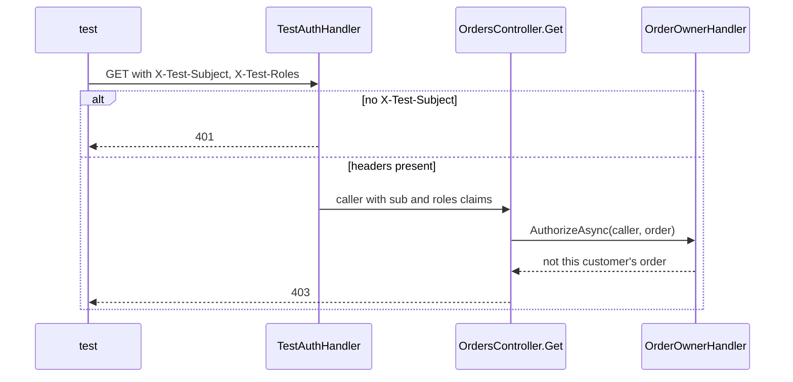

## Before you start

- [[design.l2.webapplicationfactory]] — you know `ApiFactory` runs `DonHang.Api` inside the test process and adds test-only services in `ConfigureTestServices`.
- [[backend.l2.resource-based-authorization]] — you know `OrderOwnerHandler` lets staff or the order's own customer read it, and anyone else gets `403`.
- [[backend.l2.validating-provider-tokens]] — you know `AddJwtBearer` checks each Keycloak token's signature, `iss`, `aud` and `exp`, and that `sub` leads to the customer through `customers.identity_subject`.

## The situation

The most important rules in `OrdersApiTests` are about who may do what: a customer must not read another customer's order, and must not ship anything. In the lab, the containers of Đơn Hàng and Keycloak running on your machine, every such request carries an access token from Keycloak. Real tokens in a test would mean starting Keycloak, loading Đơn Hàng's Keycloak settings, creating users and signing each one in first. That is a whole extra service to set up, and most of it tests Keycloak, not Đơn Hàng. Yet without a token, every protected endpoint answers `401`. How can a test say "this request comes from customer An" without Keycloak, and still check the real rules?

## Core concepts

- authentication scheme — a name tied to the handler ASP.NET Core asks "who is calling?"; the default scheme is the one used when an endpoint names none.
- test caller — the identity a test request carries, built from two request headers instead of from a token.
- claim — one named fact about the caller, such as `sub` (who is calling) or `roles` (which roles they have).
- identity link — the column `customers.identity_subject`, which ties a caller's `sub` to one customer row.
- what the test does not check — the token itself: its signature, issuer, audience and expiry, which only `AddJwtBearer` checks.

## How it works



API tests do not start Keycloak. `ApiFactory`, which exists only in `DonHang.Tests`, makes `TestAuthHandler` the default authentication scheme. In the situation above, the test caller comes from it: `TestAuthHandler` builds the caller from the headers `X-Test-Subject` and `X-Test-Roles`, with the same claim types the API reads from a Keycloak token, `sub` and `roles`.

A request without those headers gets no identity at all. A protected endpoint therefore still answers `401`, exactly as it does for a request without a token. With headers, the app's own rules run unchanged on the test caller. The `StaffOnly` policy, a named rule the ship endpoint requires, checks for the `staff` role before the controller's ship method runs. For `GET`, `OrdersController.Get` loads the order and asks `OrderOwnerHandler` about it, as the diagram shows. Neither rule names an authentication scheme; they ask about the caller, not about how the caller signed in.

The API turns `sub` into a customer through `customers.identity_subject`. So a test first inserts a customer whose `identity_subject` equals the header's subject, the same link the API makes from a Keycloak `sub`.

Tests can then check who may do what. Another customer's `GET /api/v1/orders/{id}` answers `403`, and a customer calling `PATCH /api/v1/orders/{id}/ship` answers `403`.

These tests do not check the token itself: signature, issuer, audience, expiry. That stays with `AddJwtBearer` and is seen only when the API runs against Keycloak, as in the lab.

## In the Đơn Hàng system

The handler that stands in for Keycloak's tokens:

```csharp file=DonHang.Tests/Integration/TestAuthHandler.cs tag=stage-2 lines=9-33
// lesson: design.l2.testing-protected-endpoints
// Exists only in DonHang.Tests: the running lab never registers it. It builds
// the caller from two request headers instead of from a Keycloak token, with
// the same claim types the api reads from a token: "sub" and "roles".
// No X-Test-Subject header → no identity → a protected endpoint answers 401.
public sealed class TestAuthHandler(
    IOptionsMonitor<AuthenticationSchemeOptions> options, ILoggerFactory logger, UrlEncoder encoder)
    : AuthenticationHandler<AuthenticationSchemeOptions>(options, logger, encoder)
{
    public const string SchemeName = "Test";

    protected override Task<AuthenticateResult> HandleAuthenticateAsync()
    {
        var subject = Request.Headers["X-Test-Subject"].ToString();
        if (subject.Length == 0) return Task.FromResult(AuthenticateResult.NoResult());

        var claims = new List<Claim> { new("sub", subject) };
        var roles = Request.Headers["X-Test-Roles"].ToString();
        claims.AddRange(roles.Split(',', StringSplitOptions.RemoveEmptyEntries).Select(role => new Claim("roles", role)));

        var identity = new ClaimsIdentity(claims, SchemeName, nameType: "sub", roleType: "roles");
        var ticket = new AuthenticationTicket(new ClaimsPrincipal(identity), SchemeName);
        return Task.FromResult(AuthenticateResult.Success(ticket));
    }
}
```

`NoResult()` means "no caller here", and the endpoint's authorization turns that into `401`. Otherwise every comma-separated role becomes a `roles` claim. The last three lines wrap the claims into the caller object ASP.NET Core hands to authorization.

`roleType: "roles"` makes `IsInRole("staff")` read those claims, as it does for a token. The `StaffOnly` policy's `RequireRole("staff")` relies on `IsInRole`. In `ApiFactory`, `AddScheme` registers this handler under the name `"Test"`, and `AddAuthentication(TestAuthHandler.SchemeName)` makes that name the default. The class lives in the test project, so the running lab never has it.

A rule checked through it:

```csharp file=DonHang.Tests/Integration/OrdersApiTests.cs tag=stage-2 lines=45-57
    // lesson: design.l2.testing-protected-endpoints
    // OrderOwnerHandler runs for real: customer-binh is a customer, but not this order's.
    [Fact]
    public async Task GetOrder_AnotherCustomersOrder_Returns403()
    {
        await InsertCustomerAsync("customer-an");
        await InsertCustomerAsync("customer-binh");
        var orderId = await PlaceOrderForAsync("customer-an");

        var response = await ClientFor("customer-binh", "customer").GetAsync($"/api/v1/orders/{orderId}");

        Assert.Equal(HttpStatusCode.Forbidden, response.StatusCode);
    }
```

`InsertCustomerAsync` saves a customer with `IdentitySubject = subject`, `PlaceOrderForAsync` places an order as that customer, and `ClientFor` sets the two headers. Both customers exist and both are signed in; only `OrderOwnerHandler` can tell them apart. `ShipOrder_Customer_Returns403` does the same for the `StaffOnly` policy, with `customer-an` shipping her own order. `PostOrder_NoCaller_Returns401` covers the other side: a client from `factory.CreateClient()` with no headers is refused before the controller runs, as a request without a token would be.

## Beginners often think…

- **"Replacing authentication in tests means the tests no longer check authorization."** → Actually only the step that says who is calling is replaced; the policy and the handler that decide what that caller may do are the app's own. You notice this when you break `OrderOwnerHandler` and `GetOrder_AnotherCustomersOrder_Returns403` fails.
- **"To test a protected endpoint you must first get a real token from Keycloak."** → Actually the authorization rules only need a caller with `sub` and `roles`, and `TestAuthHandler` provides one from two headers. You notice this when `OrdersApiTests` passes with Keycloak stopped.
- **"`TestAuthHandler` is also a way to skip login in the running lab."** → Actually it is registered only by `ApiFactory`, inside `DonHang.Tests`; the lab's API uses `AddJwtBearer` alone. You notice this when a request to the lab with an `X-Test-Subject` header and no token still answers `401`.

## Try it (3 minutes)

On your own machine, in the root folder of the example repository checked out at `stage-2`, with Docker running:

1. In `DonHang.Api/Authorization/OrderOwnerHandler.cs`, change `if (caller is not null && caller.Id == order.CustomerId)` to `if (caller is not null)`, so any known customer counts as the owner.
2. Run `dotnet test DonHang.Tests --filter "FullyQualifiedName~OrdersApiTests"`, then undo the change.

Expected result: the other four tests pass and `GetOrder_AnotherCustomersOrder_Returns403` fails with `Assert.Equal() Failure: Values differ`, `Expected: Forbidden`, `Actual: OK`. The test caller came from headers, yet the broken rule was caught, because the rule itself ran.

## Connections

- [[design.l2.webapplicationfactory]] — where `TestAuthHandler` is plugged in: `ConfigureTestServices` in `ApiFactory`.
- [[backend.l2.resource-based-authorization]] — the rule `GetOrder_AnotherCustomersOrder_Returns403` protects.
- [[backend.l2.role-based-access]] — the `StaffOnly` policy `ShipOrder_Customer_Returns403` exercises.
- [[backend.l2.validating-provider-tokens]] — the part these tests leave out: checking the token's signature, issuer, audience and expiry.
- [[design.l2.test-pyramid]] — the next lesson: which risks belong to API tests like these, and which to unit tests.

## Five-line summary

1. API tests skip Keycloak: `ApiFactory` makes `TestAuthHandler` the default scheme, building the caller from `X-Test-Subject` and `X-Test-Roles`.
2. No headers means no identity, so protected endpoints still answer `401`, and `StaffOnly` and `OrderOwnerHandler` run unchanged.
3. Each test inserts a customer whose `identity_subject` equals the header's subject, the link the API makes from `sub`.
4. Another customer reading an order and a customer shipping one both answer `403`, checked over HTTP.
5. The token itself, its signature, issuer, audience and expiry, is not tested here; that stays with `AddJwtBearer` and Keycloak.
