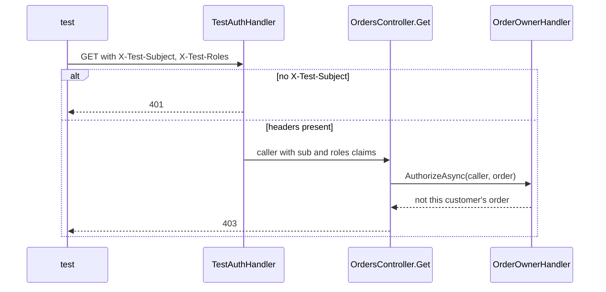

## Bạn cần biết trước

- [[design.l2.webapplicationfactory]] — bạn biết `ApiFactory` chạy `DonHang.Api` ngay trong process test và thêm các service chỉ dành cho test trong `ConfigureTestServices`.
- [[backend.l2.resource-based-authorization]] — bạn biết `OrderOwnerHandler` cho nhân viên hoặc chính khách của đơn đọc đơn đó, còn ai khác thì nhận `403`.
- [[backend.l2.validating-provider-tokens]] — bạn biết `AddJwtBearer` kiểm chữ ký, `iss`, `aud` và `exp` của từng token Keycloak, và `sub` dẫn tới khách hàng qua `customers.identity_subject`.

## Tình huống

Những quy tắc quan trọng nhất trong `OrdersApiTests` là về chuyện ai được làm gì: một khách không được đọc đơn của khách khác, và không được giao hàng. Ở lab, tức các container của Đơn Hàng và Keycloak chạy trên máy bạn, mọi request như vậy đều mang một access token do Keycloak cấp. Dùng token thật trong test nghĩa là phải khởi động Keycloak, nạp cấu hình Keycloak của Đơn Hàng, tạo user và cho từng user đăng nhập trước. Đó là cả một service nữa phải dựng, và phần lớn công sức là test Keycloak chứ không phải Đơn Hàng. Thế nhưng không có token thì endpoint được bảo vệ nào cũng trả `401`. Làm sao để một test nói được "request này đến từ khách An" mà không cần Keycloak, và vẫn kiểm đúng các quy tắc thật?

## Khái niệm cốt lõi

- authentication scheme — một cái tên gắn với handler mà ASP.NET Core hỏi "ai đang gọi?". Scheme mặc định là scheme được dùng khi endpoint không chỉ định scheme nào.
- người gọi trong test — danh tính mà một request test mang theo, dựng từ hai header của request thay vì từ token.
- claim — một thông tin có tên về người gọi, chẳng hạn `sub` (ai đang gọi) hay `roles` (họ có những role nào).
- liên kết danh tính — cột `customers.identity_subject`, nối `sub` của người gọi với đúng một dòng khách hàng.
- phần test không kiểm — chính token: chữ ký, bên phát hành, đối tượng nhận và hạn dùng của nó, những thứ chỉ `AddJwtBearer` kiểm.

## Cơ chế hoạt động



Test API không khởi động Keycloak. `ApiFactory`, thứ chỉ có trong `DonHang.Tests`, đặt `TestAuthHandler` làm authentication scheme mặc định. Người gọi trong test ở tình huống trên đến từ đây: `TestAuthHandler` dựng người gọi từ hai header `X-Test-Subject` và `X-Test-Roles`, với đúng các loại claim mà API đọc từ token Keycloak là `sub` và `roles`.

Request không có các header đó thì không có danh tính nào. Vì vậy endpoint được bảo vệ vẫn trả `401`, y như với request không có token. Khi có header, các quy tắc của chính app chạy nguyên vẹn trên người gọi trong test. Policy `StaffOnly`, một quy tắc có tên mà endpoint giao hàng yêu cầu, kiểm role `staff` trước khi method giao hàng của controller chạy. Với `GET`, `OrdersController.Get` nạp đơn rồi hỏi `OrderOwnerHandler` về đơn đó, như sơ đồ cho thấy. Không quy tắc nào nêu tên authentication scheme. Chúng hỏi về người gọi, chứ không hỏi người gọi đã đăng nhập bằng cách nào.

API đổi `sub` thành khách hàng qua `customers.identity_subject`. Nên trước hết test insert một khách có `identity_subject` bằng subject trong header, đúng liên kết mà API tạo từ `sub` của Keycloak.

Sau đó test kiểm được ai được làm gì. Khách khác gọi `GET /api/v1/orders/{id}` nhận `403`, và khách gọi `PATCH /api/v1/orders/{id}/ship` cũng nhận `403`.

Các test này không kiểm chính token: chữ ký, bên phát hành, đối tượng nhận, hạn dùng. Phần đó vẫn thuộc về `AddJwtBearer` và chỉ thấy được khi API chạy với Keycloak, như ở lab.

## Trong hệ thống Đơn Hàng

Handler đứng thay cho token của Keycloak:

```csharp file=DonHang.Tests/Integration/TestAuthHandler.cs tag=stage-2 lines=9-33
// lesson: design.l2.testing-protected-endpoints
// Exists only in DonHang.Tests: the running lab never registers it. It builds
// the caller from two request headers instead of from a Keycloak token, with
// the same claim types the api reads from a token: "sub" and "roles".
// No X-Test-Subject header → no identity → a protected endpoint answers 401.
public sealed class TestAuthHandler(
    IOptionsMonitor<AuthenticationSchemeOptions> options, ILoggerFactory logger, UrlEncoder encoder)
    : AuthenticationHandler<AuthenticationSchemeOptions>(options, logger, encoder)
{
    public const string SchemeName = "Test";

    protected override Task<AuthenticateResult> HandleAuthenticateAsync()
    {
        var subject = Request.Headers["X-Test-Subject"].ToString();
        if (subject.Length == 0) return Task.FromResult(AuthenticateResult.NoResult());

        var claims = new List<Claim> { new("sub", subject) };
        var roles = Request.Headers["X-Test-Roles"].ToString();
        claims.AddRange(roles.Split(',', StringSplitOptions.RemoveEmptyEntries).Select(role => new Claim("roles", role)));

        var identity = new ClaimsIdentity(claims, SchemeName, nameType: "sub", roleType: "roles");
        var ticket = new AuthenticationTicket(new ClaimsPrincipal(identity), SchemeName);
        return Task.FromResult(AuthenticateResult.Success(ticket));
    }
}
```

`NoResult()` nghĩa là "không có người gọi nào", và bước phân quyền của endpoint biến điều đó thành `401`. Ngược lại, mỗi role trong chuỗi cách nhau bằng dấu phẩy trở thành một claim `roles`. Ba dòng cuối gói các claim thành đối tượng người gọi mà ASP.NET Core đưa cho bước phân quyền.

`roleType: "roles"` làm `IsInRole("staff")` đọc các claim đó, giống như với token. `RequireRole("staff")` của policy `StaffOnly` dựa vào `IsInRole`. Trong `ApiFactory`, `AddScheme` đăng ký handler này dưới tên `"Test"`, và `AddAuthentication(TestAuthHandler.SchemeName)` đặt tên đó làm mặc định. Class này nằm trong project test, nên lab đang chạy không hề có nó.

Một quy tắc được kiểm qua handler đó:

```csharp file=DonHang.Tests/Integration/OrdersApiTests.cs tag=stage-2 lines=45-57
    // lesson: design.l2.testing-protected-endpoints
    // OrderOwnerHandler runs for real: customer-binh is a customer, but not this order's.
    [Fact]
    public async Task GetOrder_AnotherCustomersOrder_Returns403()
    {
        await InsertCustomerAsync("customer-an");
        await InsertCustomerAsync("customer-binh");
        var orderId = await PlaceOrderForAsync("customer-an");

        var response = await ClientFor("customer-binh", "customer").GetAsync($"/api/v1/orders/{orderId}");

        Assert.Equal(HttpStatusCode.Forbidden, response.StatusCode);
    }
```

`InsertCustomerAsync` lưu một khách với `IdentitySubject = subject`, `PlaceOrderForAsync` đặt một đơn dưới danh nghĩa khách đó, còn `ClientFor` gắn hai header. Cả hai khách đều tồn tại và đều đã đăng nhập, chỉ `OrderOwnerHandler` mới phân biệt được họ. `ShipOrder_Customer_Returns403` làm điều tương tự cho policy `StaffOnly`, với `customer-an` tự giao đơn của mình. `PostOrder_NoCaller_Returns401` kiểm phía còn lại: một client tạo từ `factory.CreateClient()` không có header bị từ chối trước khi controller chạy, đúng như một request không có token.

## Người mới hay nghĩ rằng…

- **"Thay phần xác thực trong test nghĩa là test không còn kiểm phân quyền nữa."** → Thực ra chỉ bước xác định ai đang gọi bị thay. Policy và handler quyết định người gọi đó được làm gì vẫn là của chính app. Bạn sẽ nhận ra khi làm hỏng `OrderOwnerHandler` và `GetOrder_AnotherCustomersOrder_Returns403` rớt.
- **"Muốn test một endpoint được bảo vệ thì phải lấy token thật từ Keycloak trước."** → Thực ra các quy tắc phân quyền chỉ cần một người gọi có `sub` và `roles`, và `TestAuthHandler` cung cấp người gọi đó từ hai header. Bạn sẽ nhận ra khi `OrdersApiTests` vẫn qua trong lúc Keycloak đang dừng.
- **"`TestAuthHandler` cũng dùng được để bỏ qua đăng nhập ở lab đang chạy."** → Thực ra chỉ `ApiFactory`, nằm trong `DonHang.Tests`, đăng ký nó. API của lab chỉ dùng `AddJwtBearer`. Bạn sẽ nhận ra khi một request tới lab có header `X-Test-Subject` mà không có token vẫn nhận `401`.

## Thử ngay (3 phút)

Trên máy của bạn, ở thư mục gốc của repo ví dụ đã checkout tại `stage-2`, với Docker đang chạy:

1. Trong `DonHang.Api/Authorization/OrderOwnerHandler.cs`, đổi `if (caller is not null && caller.Id == order.CustomerId)` thành `if (caller is not null)`, để khách nào đã biết cũng được tính là chủ đơn.
2. Chạy `dotnet test DonHang.Tests --filter "FullyQualifiedName~OrdersApiTests"`, rồi hoàn tác thay đổi.

Kết quả mong đợi: bốn test còn lại qua, còn `GetOrder_AnotherCustomersOrder_Returns403` rớt với `Assert.Equal() Failure: Values differ`, `Expected: Forbidden`, `Actual: OK`. Người gọi trong test đến từ header, vậy mà quy tắc bị làm hỏng vẫn bị bắt, vì chính quy tắc đó đã chạy.

## Liên hệ

- [[design.l2.webapplicationfactory]] — nơi `TestAuthHandler` được gắn vào: `ConfigureTestServices` trong `ApiFactory`.
- [[backend.l2.resource-based-authorization]] — quy tắc mà `GetOrder_AnotherCustomersOrder_Returns403` bảo vệ.
- [[backend.l2.role-based-access]] — policy `StaffOnly` mà `ShipOrder_Customer_Returns403` kiểm.
- [[backend.l2.validating-provider-tokens]] — phần các test này bỏ ra ngoài: kiểm chữ ký, bên phát hành, đối tượng nhận và hạn dùng của token.
- [[design.l2.test-pyramid]] — bài tiếp theo: rủi ro nào thuộc về test API như thế này, và rủi ro nào thuộc về unit test.

## Tóm tắt 5 dòng

1. Test API bỏ qua Keycloak: `ApiFactory` đặt `TestAuthHandler` làm scheme mặc định, dựng người gọi từ `X-Test-Subject` và `X-Test-Roles`.
2. Không có header nghĩa là không có danh tính, nên endpoint được bảo vệ vẫn trả `401`, còn `StaffOnly` và `OrderOwnerHandler` chạy nguyên vẹn.
3. Mỗi test insert một khách có `identity_subject` bằng subject trong header, đúng liên kết mà API tạo từ `sub`.
4. Khách khác đọc một đơn và khách tự giao một đơn đều nhận `403`, được kiểm qua HTTP.
5. Chính token, gồm chữ ký, bên phát hành, đối tượng nhận và hạn dùng, không được test ở đây. Phần đó vẫn thuộc về `AddJwtBearer` và Keycloak.
