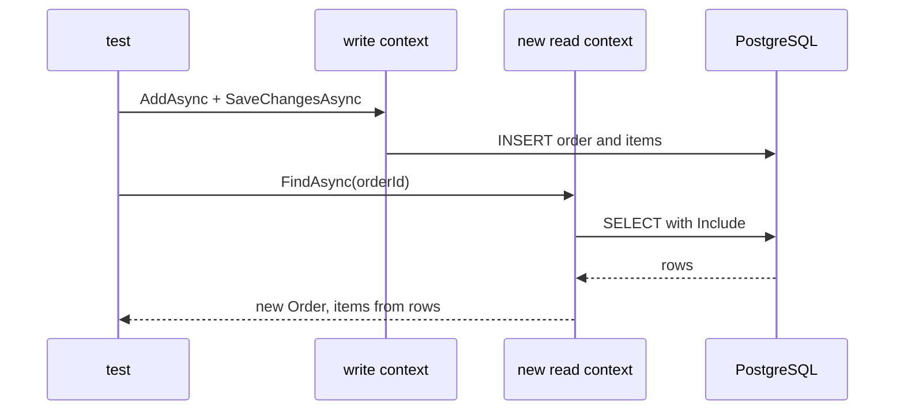

## Before you start

- [[design.l2.class-fixtures]] — you know `EfOrderRepositoryTests` shares one `PostgresFixture`, so every test in it talks to one migrated PostgreSQL container.
- [[backend.l2.no-tracking-queries]] — you know a tracked query puts its entities in the change tracker of the `DonHangDbContext` that ran it.

## The situation

You have a migrated PostgreSQL from `PostgresFixture` and want the test the first lesson of this module asked for: does `FindAsync` really bring an order's items back? The obvious version takes one `DonHangDbContext`, saves an order with two items through `EfOrderRepository`, calls `FindAsync` on the same repository, and asserts two items. It passes. To check that it can fail, you delete `.Include(o => o.Items)` from `FindAsync` and run it again. It still passes. What is this test really reading, and how does it have to read instead?

## Core concepts

- reading back — loading, after a save, the data a test just wrote, so the assertion is about what was stored, not about what the test still holds in memory.
- the object still in memory — after `SaveChangesAsync`, the context that saved an `Order` keeps tracking that object; a tracked query on the same context that finds the order hands back that object instead of building a new one from the row.
- a new context — a `DonHangDbContext` created after the save, whose change tracker is empty, so everything it returns comes from PostgreSQL.

## How it works



At stage-2, `EfOrderRepositoryTests` saves an order with two items through one `DonHangDbContext`. Then it reads the order back through a second, new `DonHangDbContext` before asserting.

Look at the situation above to see why. After the save, the first context still tracks the `Order` object, with its `Items` list filled in by the test. When the same context runs `FindAsync`, the change tracker hands back that object still in memory, items included. The test would pass even if `FindAsync` lost its `Include`, because the items never came from the query.

The second context has tracked nothing. Its `FindAsync` must build the order from the rows PostgreSQL returns, and the items appear only if the query asked for them with `Include`, the eager loading you already know. Remove the `Include` and the test now fails. That failure is the point: a test that keeps passing when the code under it is broken checks nothing.

The test also needs data the order can point to. It first inserts a customer, because the foreign key on `orders.customer_id` refuses an order for a customer that does not exist. It also inserts two products, so that each item names a product that really exists.

An assertion on what comes back from PostgreSQL checks three things at once. The mapping turns `Order` and `OrderItem` into the right columns. The migrations created those columns and keys. The query reads them back. No test using `FakeOrderRepository` touches any of these.

## In the Đơn Hàng system

The test, at stage-2:

```csharp file=DonHang.Tests/Integration/EfOrderRepositoryTests.cs tag=stage-2 lines=25-49
    [Fact]
    public async Task FindAsync_SavedOrderWithTwoItems_ReadsBothItemsBack()
    {
        int orderId;
        await using (var db = database.CreateContext())
        {
            var (customerId, penId, bookId) = await InsertCustomerAndProductsAsync(db);
            var repository = new EfOrderRepository(db);
            var order = new Order(customerId,
                [
                    new() { ProductId = penId, Quantity = 2, UnitPriceVnd = 15_000 },
                    new() { ProductId = bookId, Quantity = 1, UnitPriceVnd = 120_000 },
                ],
                DateTimeOffset.UtcNow);
            await repository.AddAsync(order);
            await repository.SaveChangesAsync();
            orderId = order.Id;
        }

        await using var readDb = database.CreateContext();
        var found = await new EfOrderRepository(readDb).FindAsync(orderId);

        Assert.NotNull(found);
        Assert.Equal("new", found.Status);
        Assert.Equal(2, found.Items.Count);
```

The braces after `await using (var db = ...)` end the first context before the read starts. Only `orderId` leaves that block: the id PostgreSQL gave the order during the save. `database` is the shared `PostgresFixture` the class receives, and its `CreateContext()` returns a new `DonHangDbContext` on every call, so `readDb` starts with an empty change tracker. The assertions then check what PostgreSQL returned. The next line of the test, below this excerpt, also checks that the item amounts add up to `150_000`: two pens at `15_000` and one book at `120_000`, read back from `order_items`.

What the order points to:

```csharp file=DonHang.Tests/Integration/EfOrderRepositoryTests.cs tag=stage-2 lines=72-80
    private static async Task<(int CustomerId, int PenId, int BookId)> InsertCustomerAndProductsAsync(DonHangDbContext db)
    {
        var customer = new Customer { FullName = "Test Customer", Email = "test.customer@example.com", City = "Hà Nội" };
        var pen = new Product { Name = "Pen", PriceVnd = 15_000 };
        var book = new Product { Name = "Book", PriceVnd = 120_000 };
        db.AddRange(customer, pen, book);
        await db.SaveChangesAsync();
        return (customer.Id, pen.Id, book.Id);
    }
```

The helper saves a customer and two products and returns the ids PostgreSQL gave them. The test uses those ids, never a number it made up, so the foreign key on `orders.customer_id` always finds its customer.

## Beginners often think…

- **"If a test saves an order and then finds it again, the repository's query must be right."** → Actually, on the same `DonHangDbContext`, the find hands back the object the test saved, items and all, whatever the query does. You notice this when you remove the `Include` from `FindAsync` and the save-then-find test on one context still passes.
- **"A repository test should replace `DonHangDbContext` with a test double, so that no database is needed."** → Actually `DonHangDbContext` is where EF Core builds the SQL, and PostgreSQL is what runs it and checks the keys. Replace them and nothing the repository does with the database is left to test. You notice this when such a test stays green while the real `FindAsync` returns orders with no items.

## Try it (3 minutes)

On your own machine, in the root folder of the example repository checked out at `stage-2`, with Docker running:

1. In `DonHang.Infrastructure/EfOrderRepository.cs`, delete `.Include(o => o.Items)` from `FindAsync`, so that its line reads `db.Orders.FirstOrDefaultAsync(o => o.Id == id);`.
2. Run `dotnet test DonHang.Tests --filter "FullyQualifiedName~EfOrderRepositoryTests"`.
3. Undo the change.

Expected result: one test fails and the other, `SaveChangesAsync_OrderForMissingCustomer_IsRefused`, passes, since it only checks that an order for a missing customer is refused and never calls `FindAsync`. `FindAsync_SavedOrderWithTwoItems_ReadsBothItemsBack` fails on `Assert.Equal() Failure: Values differ` with `Expected: 2` and `Actual: 0`: the new context built the order from the rows alone, and no item rows were read.

## Connections

- [[design.l2.integration-test-first-look]] — the bug that lesson said no fake could catch; this test catches it.
- [[backend.l2.no-tracking-queries]] — the change tracker from the other side: here it is the reason this test reads through a new context.
- [[design.l2.class-fixtures]] — where `database` comes from: one `PostgresFixture` shared by both tests of the class.
- [[backend.l2.optimistic-concurrency]] — what this module does not test: two saves of the same order racing each other.
- [[design.l2.resetting-data-between-tests]] — the next lesson: both tests insert the same customer, and the database is shared.

## Five-line summary

1. `EfOrderRepositoryTests` saves through one `DonHangDbContext` and reads back through a new one, so the result comes from PostgreSQL.
2. On the same context, the change tracker returns the object still in memory, so the test passes even without the `Include`.
3. The test first inserts a customer, because the foreign key on `orders.customer_id` refuses an order for a customer that does not exist.
4. Asserting on what PostgreSQL returns checks the mapping, the migrations and the query together, which no fake-based test touches.
5. Removing the `Include` makes `FindAsync_SavedOrderWithTwoItems_ReadsBothItemsBack` fail with two items expected and zero read.
