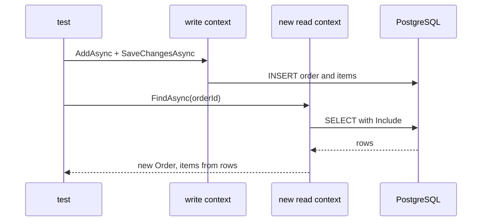

## Bạn cần biết trước

- [[design.l2.class-fixtures]] — bạn biết `EfOrderRepositoryTests` dùng chung một `PostgresFixture`, nên mọi test trong đó làm việc với cùng một container PostgreSQL đã migrate.
- [[backend.l2.no-tracking-queries]] — bạn biết một truy vấn có theo dõi đặt các entity của nó vào change tracker của chính `DonHangDbContext` đã chạy nó.

## Tình huống

Bạn đã có một PostgreSQL đã migrate từ `PostgresFixture` và muốn viết đúng test mà bài đầu của module này đặt ra: `FindAsync` có thật sự trả về các món hàng của đơn không? Phiên bản dễ nghĩ ra nhất lấy một `DonHangDbContext`, lưu một đơn có hai món qua `EfOrderRepository`, gọi `FindAsync` trên chính repository đó, rồi assert có hai món. Test qua. Để chắc nó có thể fail, bạn xóa `.Include(o => o.Items)` khỏi `FindAsync` và chạy lại. Nó vẫn qua. Thật ra test này đang đọc cái gì, và nó phải đọc theo cách nào mới đúng?

## Khái niệm cốt lõi

- đọc lại — sau khi lưu, tải lại dữ liệu test vừa ghi, để assert nói về thứ đã được lưu, chứ không phải thứ test vẫn còn giữ trong bộ nhớ.
- object vẫn còn trong bộ nhớ — sau `SaveChangesAsync`, context đã lưu một `Order` vẫn tiếp tục theo dõi object đó; một truy vấn có theo dõi trên cùng context tìm thấy đơn này sẽ trả lại chính object ấy, thay vì dựng một object mới từ dòng dữ liệu.
- context mới — một `DonHangDbContext` tạo ra sau khi lưu, có change tracker rỗng, nên mọi thứ nó trả về đều đến từ PostgreSQL.

## Cơ chế hoạt động



Ở stage-2, `EfOrderRepositoryTests` lưu một đơn có hai món qua một `DonHangDbContext`. Sau đó nó đọc lại đơn qua một `DonHangDbContext` thứ hai, mới tinh, rồi mới assert.

Nhìn lại tình huống ở trên để thấy vì sao. Sau khi lưu, context đầu tiên vẫn theo dõi object `Order`, với danh sách `Items` do test điền vào. Khi chính context đó chạy `FindAsync`, change tracker trả lại object vẫn còn trong bộ nhớ, kèm luôn các món hàng. Test sẽ qua kể cả khi `FindAsync` mất `Include`, vì các món hàng chưa bao giờ đến từ câu truy vấn.

Context thứ hai chưa theo dõi gì cả. `FindAsync` của nó phải dựng đơn từ các dòng PostgreSQL trả về, và món hàng chỉ xuất hiện nếu câu truy vấn xin chúng bằng `Include`, chính là eager loading bạn đã biết. Bỏ `Include` đi thì giờ test fail. Cái fail đó mới là điều quan trọng: một test vẫn qua khi code bên dưới đã hỏng thì không kiểm tra được gì.

Test còn cần dữ liệu để đơn trỏ tới. Trước hết nó insert một khách, vì khóa ngoại trên `orders.customer_id` từ chối đơn của khách không tồn tại. Nó cũng insert hai sản phẩm, để mỗi món hàng trỏ tới một sản phẩm có thật.

Một assert trên thứ PostgreSQL trả về kiểm tra cùng lúc ba điều. Mapping biến `Order` và `OrderItem` thành đúng các cột. Migration đã tạo các cột và khóa đó. Câu truy vấn đọc chúng trở lại. Không test nào dùng `FakeOrderRepository` chạm tới những thứ này.

## Trong hệ thống Đơn Hàng

Test ở stage-2:

```csharp file=DonHang.Tests/Integration/EfOrderRepositoryTests.cs tag=stage-2 lines=25-49
    [Fact]
    public async Task FindAsync_SavedOrderWithTwoItems_ReadsBothItemsBack()
    {
        int orderId;
        await using (var db = database.CreateContext())
        {
            var (customerId, penId, bookId) = await InsertCustomerAndProductsAsync(db);
            var repository = new EfOrderRepository(db);
            var order = new Order(customerId,
                [
                    new() { ProductId = penId, Quantity = 2, UnitPriceVnd = 15_000 },
                    new() { ProductId = bookId, Quantity = 1, UnitPriceVnd = 120_000 },
                ],
                DateTimeOffset.UtcNow);
            await repository.AddAsync(order);
            await repository.SaveChangesAsync();
            orderId = order.Id;
        }

        await using var readDb = database.CreateContext();
        var found = await new EfOrderRepository(readDb).FindAsync(orderId);

        Assert.NotNull(found);
        Assert.Equal("new", found.Status);
        Assert.Equal(2, found.Items.Count);
```

Cặp ngoặc nhọn sau `await using (var db = ...)` kết thúc context đầu tiên trước khi bắt đầu đọc. Chỉ `orderId` ra khỏi khối đó: id mà PostgreSQL gán cho đơn trong lúc lưu. `database` là `PostgresFixture` dùng chung mà class nhận được, và `CreateContext()` của nó trả về một `DonHangDbContext` mới ở mỗi lần gọi, nên `readDb` bắt đầu với change tracker rỗng. Các assert khi đó kiểm tra thứ PostgreSQL đã trả về. Dòng tiếp theo của test, ngay dưới đoạn trích này, còn kiểm tra tổng tiền các món bằng `150_000`: hai cây bút giá `15_000` và một cuốn sách giá `120_000`, đọc lại từ `order_items`.

Thứ mà đơn trỏ tới:

```csharp file=DonHang.Tests/Integration/EfOrderRepositoryTests.cs tag=stage-2 lines=72-80
    private static async Task<(int CustomerId, int PenId, int BookId)> InsertCustomerAndProductsAsync(DonHangDbContext db)
    {
        var customer = new Customer { FullName = "Test Customer", Email = "test.customer@example.com", City = "Hà Nội" };
        var pen = new Product { Name = "Pen", PriceVnd = 15_000 };
        var book = new Product { Name = "Book", PriceVnd = 120_000 };
        db.AddRange(customer, pen, book);
        await db.SaveChangesAsync();
        return (customer.Id, pen.Id, book.Id);
    }
```

Helper này lưu một khách và hai sản phẩm, rồi trả về các id PostgreSQL đã gán. Test dùng đúng các id đó, không bao giờ dùng một con số tự bịa, nên khóa ngoại trên `orders.customer_id` luôn tìm thấy khách của nó.

## Người mới hay nghĩ rằng…

- **"Nếu test lưu một đơn rồi tìm lại được nó, thì câu truy vấn của repository chắc chắn đúng."** → Thực ra trên cùng một `DonHangDbContext`, lần tìm sẽ trả lại chính object test đã lưu, đủ cả món hàng, bất kể câu truy vấn làm gì. Bạn sẽ nhận ra khi xóa `Include` khỏi `FindAsync` mà test lưu-rồi-tìm trên một context vẫn qua.
- **"Test repository nên thay `DonHangDbContext` bằng một test double, để không cần database."** → Thực ra `DonHangDbContext` là nơi EF Core dựng câu SQL, còn PostgreSQL là thứ chạy câu đó và kiểm tra các khóa. Thay chúng đi thì không còn gì trong việc repository làm với database để kiểm tra nữa. Bạn sẽ nhận ra khi test kiểu đó vẫn xanh trong lúc `FindAsync` thật trả về những đơn không có món hàng nào.

## Thử ngay (3 phút)

Trên máy của bạn, ở thư mục gốc của repo ví dụ đã checkout tại `stage-2`, với Docker đang chạy:

1. Trong `DonHang.Infrastructure/EfOrderRepository.cs`, xóa `.Include(o => o.Items)` khỏi `FindAsync`, để dòng đó còn lại `db.Orders.FirstOrDefaultAsync(o => o.Id == id);`.
2. Chạy `dotnet test DonHang.Tests --filter "FullyQualifiedName~EfOrderRepositoryTests"`.
3. Hoàn tác thay đổi.

Kết quả mong đợi: một test fail, còn test kia, `SaveChangesAsync_OrderForMissingCustomer_IsRefused`, vẫn qua, vì nó chỉ kiểm tra đơn của khách không tồn tại bị từ chối và không hề gọi `FindAsync`. `FindAsync_SavedOrderWithTwoItems_ReadsBothItemsBack` fail với `Assert.Equal() Failure: Values differ`, kèm `Expected: 2` và `Actual: 0`: context mới dựng đơn chỉ từ các dòng dữ liệu, và không dòng món hàng nào được đọc.

## Liên hệ

- [[design.l2.integration-test-first-look]] — lỗi mà bài đó nói không fake nào bắt được; test này bắt được nó.
- [[backend.l2.no-tracking-queries]] — change tracker nhìn từ phía bên kia: ở đây nó là lý do test này đọc qua một context mới.
- [[design.l2.class-fixtures]] — nơi `database` đến từ: một `PostgresFixture` mà cả hai test của class dùng chung.
- [[backend.l2.optimistic-concurrency]] — điều module này không test: hai lần lưu cùng một đơn tranh nhau.
- [[design.l2.resetting-data-between-tests]] — bài tiếp theo: cả hai test cùng insert một khách, và database thì dùng chung.

## Tóm tắt 5 dòng

1. `EfOrderRepositoryTests` lưu qua một `DonHangDbContext` và đọc lại qua một context mới, nên kết quả đến từ PostgreSQL.
2. Trên cùng một context, change tracker trả lại object vẫn còn trong bộ nhớ, nên test qua kể cả khi không có `Include`.
3. Test insert một khách trước, vì khóa ngoại trên `orders.customer_id` từ chối đơn của khách không tồn tại.
4. Assert trên thứ PostgreSQL trả về kiểm tra cùng lúc mapping, migration và câu truy vấn, những thứ không test dùng fake nào chạm tới.
5. Bỏ `Include` khiến `FindAsync_SavedOrderWithTwoItems_ReadsBothItemsBack` fail: chờ hai món nhưng đọc được không món nào.
