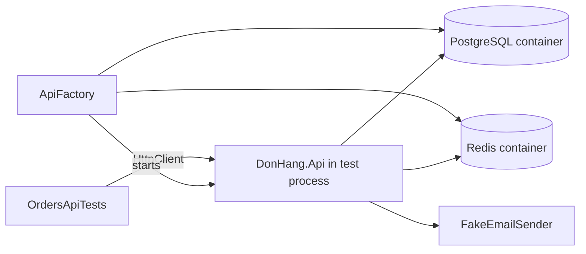

## Before you start

- [[design.l2.resetting-data-between-tests]] — you know a test class shares one `PostgresFixture` and empties the tables with `ResetAsync` before every test.
- [[backend.l1.hosting-and-program-cs]] — you know `Program.cs` registers the app's services on `builder.Services`, then `Build()` creates the app and `Run()` starts Kestrel.
- [[backend.l2.redis-key-value-store]] — you know the API keeps cached copies in Redis, a separate process it reaches through a connection string.
- [[design.l2.adapter-pattern]] — you know `NotificationSender` sends email through `IEmailSender`, and `MailKitEmailSender` is the adapter behind it.

## The situation

`EfOrderRepositoryTests` proves the repository talks to PostgreSQL correctly. A client never calls the repository, though: it sends `POST /api/v1/orders` and expects `201` with a `Location` header pointing at the new order. That answer depends on routing, the controller, `OrderService`, the repository and the exception middleware working together. Creating `OrdersController` with `new` would skip the middleware and routing entirely. Calling the lab's API with `curl` needs the lab running and writes into its data. How can a test send a real request to the real API, with nothing else running?

## Core concepts

- application under test — `DonHang.Api` itself, built from its own `Program.cs`, as opposed to one of its classes.
- in-process host — the API running inside the test process, receiving requests from an `HttpClient` in memory rather than over a network port.
- test-only replacement — a service registration the test adds after the app's own, so the app uses the test's version of that one service.
- routing — the step that matches a request's HTTP method and path to the endpoint that handles it, such as `OrdersController.Create` for `POST /api/v1/orders`.

## How it works



`WebApplicationFactory<Program>` starts `DonHang.Api` inside the test process, running the same `Program.cs`. Its `CreateClient()` returns an `HttpClient` whose requests reach that app in memory, without Kestrel and without a network port. In the situation above, this is the application under test, as an in-process host.

At stage-2, `ApiFactory` derives from `WebApplicationFactory<Program>`, and `OrdersApiTests` declares it as its class fixture. So xUnit awaits its `InitializeAsync` before the first test. That method starts a PostgreSQL container, through its own `PostgresFixture`, and a Redis container. `ApiFactory` then gives the app their connection strings as configuration: the values the lab passes as environment variables. A connection string says where a store is and, for PostgreSQL, which user to log in as. The API under test therefore uses real stores.

`Program.cs` applies no migrations at stage-2; in the lab, a separate step does that before the API starts. So `ApiFactory` lets its `PostgresFixture` apply them to the empty test database first, and the API finds its tables ready when it builds, on the first `CreateClient()`.

`ConfigureTestServices` runs after the app's own registrations in `Program.cs`. That is where test-only replacements go. `ApiFactory` replaces `IEmailSender` with `FakeEmailSender`, a fake that only records emails, adds the test authentication of the next lesson, and keeps every other registration as the app wrote it.

An API test then sends a request and asserts what a client would see. `POST /api/v1/orders` answers `201` with a `Location` header, through the same middleware, routing and controller the lab runs.

## In the Đơn Hàng system

The factory, from starting the containers to the test-only services:

```csharp file=DonHang.Tests/Integration/ApiFactory.cs tag=stage-2 lines=26-49
    public async Task InitializeAsync()
    {
        await Database.InitializeAsync();
        await redis.StartAsync();
    }

    // lesson: design.l2.webapplicationfactory
    // lesson: design.l2.testing-protected-endpoints
    // UseSetting feeds the containers' connection strings to the app as
    // configuration, where the lab passes them as environment variables.
    // ConfigureTestServices runs after Program.cs's registrations: it swaps
    // only the email sender, and makes TestAuthHandler the default scheme.
    protected override void ConfigureWebHost(IWebHostBuilder builder)
    {
        builder.UseSetting("ConnectionStrings:Default", Database.ConnectionString);
        builder.UseSetting("ConnectionStrings:Redis", redis.GetConnectionString());
        builder.ConfigureTestServices(services =>
        {
            services.RemoveAll<IEmailSender>();
            services.AddSingleton<IEmailSender>(Emails);
            services.AddAuthentication(TestAuthHandler.SchemeName)
                .AddScheme<AuthenticationSchemeOptions, TestAuthHandler>(TestAuthHandler.SchemeName, null);
        });
    }
```

`Database` is a `PostgresFixture`, so `Database.InitializeAsync()` both starts and migrates its container. `UseSetting` sets the same keys `Program.cs` reads with `GetConnectionString("Default")` and `GetConnectionString("Redis")`. `RemoveAll<IEmailSender>()` drops the app's registration, which is already there to drop because the callback runs after `Program.cs` made it. The next line registers `Emails`, a `FakeEmailSender`, so the fake is the only `IEmailSender` left. `NotificationSender` still runs and still sends, only into that fake.

A test that uses it:

```csharp file=DonHang.Tests/Integration/OrdersApiTests.cs tag=stage-2 lines=19-30
    [Fact]
    public async Task PostOrder_SignedInCustomer_Returns201WithLocation()
    {
        await InsertCustomerAsync("customer-an");
        var productId = await InsertProductAsync();

        var response = await PlaceOrderAsync(ClientFor("customer-an", "customer"), productId);

        Assert.Equal(HttpStatusCode.Created, response.StatusCode);
        var order = await response.Content.ReadFromJsonAsync<OrderDto>();
        Assert.Equal($"/api/v1/orders/{order!.Id}", response.Headers.Location!.AbsolutePath);
    }
```

Like `EfOrderRepositoryTests`, `OrdersApiTests` empties the tables before every test, through `factory.Database.ResetAsync()`, where `factory` is the class's shared `ApiFactory`. The test inserts its rows straight into the test database, then sends the request with `PlaceOrderAsync`, a helper of the class that posts one item for that product. `ClientFor` creates a client through the factory and adds two headers that stand in for a signed-in customer; the next lesson explains them. The assertions read only what any client could see: the status code, the JSON body and the `Location` header.

## Beginners often think…

- **"Testing a controller means creating it with `new` and calling its method."** → Actually that skips the middleware and authorization, the parts that decide whether the method runs at all, and the routing that builds the URL in the `Location` header. You notice this when a controller test passes but the real request answers `401` or `404`.
- **"`WebApplicationFactory` needs the API already running in Docker, the way `curl` does."** → Actually it builds the API from `Program.cs` inside the test process; only the PostgreSQL and Redis containers run in Docker. You notice this when `OrdersApiTests` passes while the lab's `donhang-api` container is stopped.
- **"An API test should replace every dependency with a fake, including the database."** → Actually, besides the test sign-in of the next lesson, `ApiFactory` replaces only the email sender, which would need a mail server, and keeps PostgreSQL and Redis real. You notice the value when the order id in the `Location` header is one PostgreSQL really assigned, exactly as in the lab.

## Try it (3 minutes)

On your own machine, in the root folder of the example repository checked out at `stage-2`, with Docker running (the lab may be up or down):

1. In a first terminal, run `docker events --filter image=postgres:17.6-alpine --filter image=redis:8.10.2-alpine --filter event=create`. It prints one line per container created from either image and keeps waiting.
2. In a second terminal, run `dotnet test DonHang.Tests --filter "FullyQualifiedName~OrdersApiTests"`.
3. Stop the first terminal with `Ctrl+C`.

Expected result: five tests pass. The first terminal shows two `container create` lines, one with `image=postgres:17.6-alpine` and one with `image=redis:8.10.2-alpine`. No line mentions the API: it ran inside the test process.

## Connections

- [[backend.l1.hosting-and-program-cs]] — the same `Program.cs`, now started by a test instead of by `Run()`.
- [[backend.l1.middleware-pipeline]] — what a `new OrdersController()` test skips and an API test runs: the middleware, in order.
- [[design.l2.adapter-pattern]] — why one swap is enough: `NotificationSender` depends only on `IEmailSender`.
- [[design.l2.resetting-data-between-tests]] — `OrdersApiTests` resets through `factory.Database`, the same way.
- [[design.l2.testing-protected-endpoints]] — the next lesson: the test authentication `ConfigureTestServices` adds.

## Five-line summary

1. `WebApplicationFactory<Program>` runs `DonHang.Api` from its own `Program.cs` inside the test process; `CreateClient()` reaches it without a network port.
2. `ApiFactory` starts PostgreSQL and Redis containers and passes their connection strings as configuration, so the API uses real stores.
3. `Program.cs` applies no migrations, so `ApiFactory`'s `PostgresFixture` migrates the test database before the app builds.
4. `ConfigureTestServices` runs after the app's registrations: `ApiFactory` swaps `IEmailSender` for a fake and adds test authentication only.
5. An API test asserts what a client sees, such as `201` and `Location`, through the real middleware, routing and controller.
