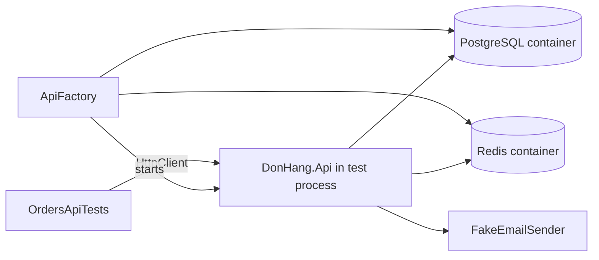

## Bạn cần biết trước

- [[design.l2.resetting-data-between-tests]] — bạn biết một class test dùng chung một `PostgresFixture` và làm rỗng các bảng bằng `ResetAsync` trước mọi test.
- [[backend.l1.hosting-and-program-cs]] — bạn biết `Program.cs` đăng ký các service của app trên `builder.Services`, rồi `Build()` tạo app và `Run()` khởi động Kestrel.
- [[backend.l2.redis-key-value-store]] — bạn biết API giữ các bản sao cache trong Redis, một process riêng mà nó tới được qua một connection string.
- [[design.l2.adapter-pattern]] — bạn biết `NotificationSender` gửi email qua `IEmailSender`, và `MailKitEmailSender` là adapter đứng sau interface đó.

## Tình huống

`EfOrderRepositoryTests` chứng minh repository làm việc với PostgreSQL đúng. Nhưng client không bao giờ gọi repository: nó gửi `POST /api/v1/orders` và chờ `201` kèm header `Location` trỏ tới đơn mới. Câu trả lời đó phụ thuộc vào routing, controller, `OrderService`, repository và middleware xử lý exception cùng làm việc với nhau. Tạo `OrdersController` bằng `new` thì bỏ qua hẳn middleware và routing. Gọi API của lab bằng `curl` thì cần lab đang chạy và ghi vào dữ liệu của lab. Làm sao để một test gửi request thật tới API thật, mà không cần gì khác đang chạy?

## Khái niệm cốt lõi

- ứng dụng được test — chính `DonHang.Api`, dựng từ `Program.cs` của nó, chứ không phải một class bên trong.
- host chạy trong process — API chạy ngay trong process test, nhận request từ một `HttpClient` qua bộ nhớ thay vì qua port mạng.
- phần thay thế chỉ cho test — một đăng ký service mà test thêm vào sau các đăng ký của app, để app dùng phiên bản của test cho đúng service đó.
- routing — bước khớp HTTP method và đường dẫn của request với endpoint xử lý nó, chẳng hạn `OrdersController.Create` cho `POST /api/v1/orders`.

## Cơ chế hoạt động



`WebApplicationFactory<Program>` khởi động `DonHang.Api` ngay trong process test, chạy đúng `Program.cs` đó. `CreateClient()` của nó trả về một `HttpClient` có request tới app qua bộ nhớ, không cần Kestrel và không cần port mạng. Trong tình huống trên, đây là ứng dụng được test, dưới dạng một host chạy trong process.

Ở stage-2, `ApiFactory` kế thừa `WebApplicationFactory<Program>`, và `OrdersApiTests` khai báo nó làm class fixture. Vì vậy xUnit chờ `InitializeAsync` của nó chạy xong trước test đầu tiên. Method đó khởi động một container PostgreSQL, qua `PostgresFixture` riêng của nó, và một container Redis. Sau đó `ApiFactory` đưa connection string của chúng cho app dưới dạng cấu hình: đúng những giá trị mà lab truyền bằng biến môi trường. Connection string cho biết kho dữ liệu nằm ở đâu và, với PostgreSQL, đăng nhập bằng user nào. Nhờ vậy API được test dùng kho dữ liệu thật.

Ở stage-2, `Program.cs` không áp migration nào; trong lab, một bước riêng làm việc đó trước khi API khởi động. Vì thế `ApiFactory` để `PostgresFixture` của nó áp migration vào database test rỗng trước, và API thấy các bảng đã sẵn sàng khi nó được dựng, ở lần `CreateClient()` đầu tiên.

`ConfigureTestServices` chạy sau các đăng ký của chính app trong `Program.cs`. Đó là chỗ đặt các phần thay thế chỉ cho test. `ApiFactory` thay `IEmailSender` bằng `FakeEmailSender`, một fake chỉ ghi nhận email, thêm phần xác thực cho test của bài sau, và giữ mọi đăng ký khác đúng như app đã viết.

Sau đó một test API gửi request và assert thứ một client sẽ thấy. `POST /api/v1/orders` trả `201` kèm header `Location`, đi qua đúng middleware, routing và controller mà lab chạy.

## Trong hệ thống Đơn Hàng

Factory, từ lúc khởi động container tới các service chỉ dành cho test:

```csharp file=DonHang.Tests/Integration/ApiFactory.cs tag=stage-2 lines=26-49
    public async Task InitializeAsync()
    {
        await Database.InitializeAsync();
        await redis.StartAsync();
    }

    // lesson: design.l2.webapplicationfactory
    // lesson: design.l2.testing-protected-endpoints
    // UseSetting feeds the containers' connection strings to the app as
    // configuration, where the lab passes them as environment variables.
    // ConfigureTestServices runs after Program.cs's registrations: it swaps
    // only the email sender, and makes TestAuthHandler the default scheme.
    protected override void ConfigureWebHost(IWebHostBuilder builder)
    {
        builder.UseSetting("ConnectionStrings:Default", Database.ConnectionString);
        builder.UseSetting("ConnectionStrings:Redis", redis.GetConnectionString());
        builder.ConfigureTestServices(services =>
        {
            services.RemoveAll<IEmailSender>();
            services.AddSingleton<IEmailSender>(Emails);
            services.AddAuthentication(TestAuthHandler.SchemeName)
                .AddScheme<AuthenticationSchemeOptions, TestAuthHandler>(TestAuthHandler.SchemeName, null);
        });
    }
```

`Database` là một `PostgresFixture`, nên `Database.InitializeAsync()` vừa khởi động vừa migrate container của nó. `UseSetting` đặt đúng những khóa mà `Program.cs` đọc bằng `GetConnectionString("Default")` và `GetConnectionString("Redis")`. `RemoveAll<IEmailSender>()` gỡ đăng ký của app, thứ đã có sẵn để gỡ vì callback chạy sau khi `Program.cs` tạo ra nó. Dòng tiếp theo đăng ký `Emails`, một `FakeEmailSender`, nên fake là `IEmailSender` duy nhất còn lại. `NotificationSender` vẫn chạy và vẫn gửi, chỉ là gửi vào fake đó.

Một test dùng nó:

```csharp file=DonHang.Tests/Integration/OrdersApiTests.cs tag=stage-2 lines=19-30
    [Fact]
    public async Task PostOrder_SignedInCustomer_Returns201WithLocation()
    {
        await InsertCustomerAsync("customer-an");
        var productId = await InsertProductAsync();

        var response = await PlaceOrderAsync(ClientFor("customer-an", "customer"), productId);

        Assert.Equal(HttpStatusCode.Created, response.StatusCode);
        var order = await response.Content.ReadFromJsonAsync<OrderDto>();
        Assert.Equal($"/api/v1/orders/{order!.Id}", response.Headers.Location!.AbsolutePath);
    }
```

Giống `EfOrderRepositoryTests`, `OrdersApiTests` làm rỗng các bảng trước mọi test, qua `factory.Database.ResetAsync()`, trong đó `factory` là `ApiFactory` dùng chung của class. Test insert dòng của nó thẳng vào database test, rồi gửi request bằng `PlaceOrderAsync`, một helper của class gửi một món cho sản phẩm đó. `ClientFor` tạo một client qua factory và thêm hai header đứng thay cho một khách đã đăng nhập; bài sau sẽ giải thích chúng. Các assert chỉ đọc những gì client nào cũng thấy: status code, body JSON và header `Location`.

## Người mới hay nghĩ rằng…

- **"Test một controller nghĩa là tạo nó bằng `new` rồi gọi method của nó."** → Thực ra làm vậy là bỏ qua middleware và phân quyền, những phần quyết định method có được chạy hay không, và cả routing, thứ dựng URL trong header `Location`. Bạn sẽ nhận ra khi test controller qua mà request thật lại trả `401` hoặc `404`.
- **"`WebApplicationFactory` cần API đang chạy sẵn trong Docker, giống như `curl`."** → Thực ra nó dựng API từ `Program.cs` ngay trong process test; chỉ có container PostgreSQL và Redis chạy trong Docker. Bạn sẽ nhận ra khi `OrdersApiTests` vẫn qua trong lúc container `donhang-api` của lab đang dừng.
- **"Test API nên thay mọi phụ thuộc bằng fake, kể cả database."** → Thực ra, ngoài phần đăng nhập cho test của bài sau, `ApiFactory` chỉ thay bộ gửi email, thứ cần một mail server, và giữ PostgreSQL với Redis là thật. Bạn sẽ thấy giá trị của nó khi id đơn trong header `Location` là id PostgreSQL thật sự gán, y như ở lab.

## Thử ngay (3 phút)

Trên máy của bạn, ở thư mục gốc của repo ví dụ đã checkout tại `stage-2`, với Docker đang chạy (lab bật hay tắt đều được):

1. Ở terminal thứ nhất, chạy `docker events --filter image=postgres:17.6-alpine --filter image=redis:8.10.2-alpine --filter event=create`. Lệnh này in một dòng cho mỗi container được tạo từ một trong hai image và đứng chờ.
2. Ở terminal thứ hai, chạy `dotnet test DonHang.Tests --filter "FullyQualifiedName~OrdersApiTests"`.
3. Dừng terminal thứ nhất bằng `Ctrl+C`.

Kết quả mong đợi: năm test qua. Terminal thứ nhất hiện hai dòng `container create`, một dòng có `image=postgres:17.6-alpine` và một dòng có `image=redis:8.10.2-alpine`. Không dòng nào nhắc tới API: nó đã chạy ngay trong process test.

## Liên hệ

- [[backend.l1.hosting-and-program-cs]] — vẫn `Program.cs` đó, giờ được một test khởi động thay vì `Run()`.
- [[backend.l1.middleware-pipeline]] — thứ mà test `new OrdersController()` bỏ qua còn test API thì chạy: middleware, theo đúng thứ tự.
- [[design.l2.adapter-pattern]] — lý do chỉ cần thay một chỗ: `NotificationSender` chỉ phụ thuộc vào `IEmailSender`.
- [[design.l2.resetting-data-between-tests]] — `OrdersApiTests` reset qua `factory.Database`, theo cùng cách.
- [[design.l2.testing-protected-endpoints]] — bài tiếp theo: phần xác thực cho test mà `ConfigureTestServices` thêm vào.

## Tóm tắt 5 dòng

1. `WebApplicationFactory<Program>` chạy `DonHang.Api` từ chính `Program.cs` của nó ngay trong process test; `CreateClient()` tới được app mà không cần port mạng.
2. `ApiFactory` khởi động container PostgreSQL và Redis, rồi truyền connection string của chúng dưới dạng cấu hình, nên API dùng kho dữ liệu thật.
3. `Program.cs` không áp migration, nên `PostgresFixture` của `ApiFactory` migrate database test trước khi app được dựng.
4. `ConfigureTestServices` chạy sau các đăng ký của app: `ApiFactory` chỉ đổi `IEmailSender` sang fake và thêm phần xác thực cho test.
5. Test API assert thứ client thấy, như `201` và `Location`, qua đúng middleware, routing và controller thật.
