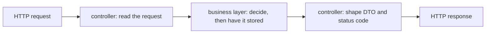

## Before you start

- [[design.l1.why-layers]] — you know a layer groups classes by the kind of reason they change for, and that `DonHang.Api` is the HTTP layer of the Đơn Hàng API.
- [[backend.l1.rest-resources]] — you know `/api/v1/orders` is a collection resource and that POST on it creates an order.

## The situation

A teammate is asked to make orders refuse more than 20 items. They open `OrdersController`, find `Create`, and start writing `if (request.Items.Count > 20) return BadRequest(...)` right at the top. It would work for this endpoint. But the rule that an order needs at least one item is not in `Create` at all, and a test in `DonHang.Tests` places orders without any HTTP request. If the new check goes into the controller, who else would have to know about it?

## Core concepts

- **controller** — the class in the HTTP layer that only speaks HTTP: it reads the request, calls into the layer below, and shapes the result into a response.
- speaking HTTP — everything about the request and response themselves: the route, the body, the token, the DTO that goes back, and the status code.
- delegate — hand a piece of work to another class instead of doing it yourself.

## How it works



A controller sits at the edge of the application, where HTTP comes in. Its job has three parts. First it reads what the request says: the route values, the body and who the caller is. Then it calls into the layer below with values it has pulled out of the request, not with the request itself. Finally it turns what comes back into HTTP: a DTO for the body and a status code.

What a controller does not do is decide business rules or talk to the database. Whether an order is allowed is a business rule, so it belongs in the business layer; saving the order is a data concern, so it belongs in the data layer. The controller hands the decision to the business layer, which in turn has the order stored by the data layer. That keeps it changing only for HTTP reasons — a new route, a new DTO shape, a different status code.

The payoff is that a rule lives in one place. If "at most 20 items" goes into `Create`, any other code that places orders — a test, or a future program that reads orders from a file and calls `PlaceOrderAsync` itself — skips it. If it goes into the business layer, every caller gets it, and the controller does not change at all.

## In the Đơn Hàng system

`OrdersController.Create` does only HTTP work:

```csharp file=DonHang.Api/Controllers/OrdersController.cs tag=stage-1 lines=17-28
    [Authorize]
    [HttpPost]
    public async Task<ActionResult<OrderDto>> Create(CreateOrderRequest request)
    {
        var customerId = int.Parse(User.FindFirstValue(JwtRegisteredClaimNames.Sub)!);
        var items = request.Items
            .Select(i => new OrderItem { ProductId = i.ProductId, Quantity = i.Quantity, UnitPriceVnd = i.UnitPriceVnd })
            .ToList();

        var order = await orderService.PlaceOrderAsync(customerId, items);
        return CreatedAtAction(nameof(Get), new { id = order.Id }, ToDto(order));
    }
```

`CreateOrderRequest` is the DTO for the request body. The method reads the caller's id from the token's `sub`, maps the request's items into `OrderItem` objects, and calls `orderService.PlaceOrderAsync` with the caller's id and that list — not with the request itself. Then it answers `201` through `CreatedAtAction`, with the order shaped by `ToDto`. There is no `if` about items and no `SaveChangesAsync` — the EF Core call that writes to the database — anywhere in the method. The empty-items check lives in `OrderService`; when it throws `ArgumentException`, the exception-handling middleware turns that into a `400`.

`ToDto`, at the bottom of the same class, is HTTP work too — it decides what the response body looks like:

```csharp file=DonHang.Api/Controllers/OrdersController.cs tag=stage-1 lines=58-63
    private static OrderDto ToDto(Order order) => new(
        order.Id,
        order.CustomerId,
        order.Status,
        order.PlacedAt,
        order.Items.Select(i => new OrderItemDto(i.ProductId, i.Quantity, i.UnitPriceVnd)).ToList());
```

Not every controller in Đơn Hàng is this strict: `ProductsController` queries `DonHangDbContext` itself, with no business layer in between. A later lesson in this module looks at those shortcuts.

## Beginners often think…

- **"Business rules like discount logic belong in the controller, since that's what the client is asking for."** → Actually the client asks for an order; whether that order is allowed, or what it costs, is the business layer's decision. A rule in `Create` would be skipped by every caller that does not come through HTTP, such as the tests in `DonHang.Tests` that call `OrderService` directly. You notice this when the same rule has to be copied into a second place that places orders without going through `Create`, such as a test.
- **"A thin controller means writing less code overall, not moving code to a different layer."** → Actually a thin controller — one that only does HTTP work — still has the checks and the saving somewhere; they just live in the layer that owns them. `Create` is short because `PlaceOrderAsync` does the checking and has the order saved. You notice this when you search for a rule in the controller and find it one layer down instead.

## Try it (3 minutes)

Read `Create` above and sort each line into one of two groups: reading the request / shaping the response, or delegating.

1. `var customerId = int.Parse(User.FindFirstValue(JwtRegisteredClaimNames.Sub)!);`
2. `var items = request.Items.Select(...)`
3. `var order = await orderService.PlaceOrderAsync(customerId, items);`
4. `return CreatedAtAction(nameof(Get), new { id = order.Id }, ToDto(order));`

Expected result: 1 and 2 read the request (the token and the body). 3 delegates to the business layer. 4 shapes the response: status `201`, a `Location` header pointing at the new order's own URL (the `Get` method just below), and the `OrderDto` body.

Where would "at most 20 items" go, and which of these four lines would change?

<details><summary>Suggested answer</summary>

Next to the empty-items check in `OrderService.PlaceOrderAsync`, in the business layer. None of the four lines in `Create` would change: the controller already passes the items along, and a new check that throws `ArgumentException`, like the existing one, becomes a `400` through the middleware.

</details>

## Connections

- [[design.l1.why-layers]] — the HTTP layer from that lesson, seen from inside one class.
- [[backend.l1.validating-input]] — where the empty-items check in `OrderService` and its `400` were looked at as input validation.
- [[design.l1.the-service-layer]] — the next lesson, which opens the business layer that `Create` delegates to.

## Five-line summary

1. A controller only speaks HTTP: it reads the request, calls the layer below, and shapes the result into a DTO and a status code.
2. It does not decide business rules or touch the database; it delegates both.
3. `OrdersController.Create` reads the token and body, calls `OrderService.PlaceOrderAsync`, and answers `201` with an `OrderDto`.
4. The empty-items check lives in `OrderService`, so every caller gets it, not only HTTP requests.
5. A thin controller does not remove code; it moves the code to the layer that owns it.
