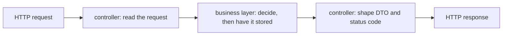

## Bạn cần biết trước

- [[design.l1.why-layers]] — bạn biết một tầng nhóm các class theo loại lý do khiến chúng thay đổi, và `DonHang.Api` là tầng HTTP của API Đơn Hàng.
- [[backend.l1.rest-resources]] — bạn biết `/api/v1/orders` là một resource dạng tập hợp và POST lên nó sẽ tạo một order.

## Tình huống

Một đồng nghiệp được giao việc khiến order từ chối khi có hơn 20 món. Họ mở `OrdersController`, tìm tới `Create`, và bắt đầu viết `if (request.Items.Count > 20) return BadRequest(...)` ngay đầu method. Với endpoint này thì chạy được. Nhưng quy tắc order phải có ít nhất một món hoàn toàn không nằm trong `Create`, và một test trong `DonHang.Tests` đặt order mà không cần request HTTP nào. Nếu phép kiểm tra mới nằm trong controller, còn ai khác phải biết về nó?

## Khái niệm cốt lõi

- **controller** — class ở tầng HTTP chỉ nói HTTP: nó đọc request, gọi vào tầng bên dưới, và định dạng kết quả thành response.
- nói HTTP — mọi thứ thuộc về chính request và response: route, body, token, DTO trả về, và status code.
- giao việc (delegate) — chuyển một phần việc cho class khác thay vì tự làm.

## Cơ chế hoạt động



Controller đứng ở rìa ứng dụng, nơi HTTP đi vào. Việc của nó gồm ba phần. Đầu tiên nó đọc xem request nói gì: giá trị trên route, body, và người gọi là ai. Rồi nó gọi vào tầng bên dưới bằng những giá trị đã lấy ra từ request, chứ không truyền cả request. Cuối cùng nó biến thứ nhận về thành HTTP: một DTO cho body và một status code.

Điều controller không làm là quyết định quy tắc nghiệp vụ hay nói chuyện với database. Một order có được phép hay không là quy tắc nghiệp vụ, nên thuộc tầng nghiệp vụ; lưu order là việc dữ liệu, nên thuộc tầng dữ liệu. Controller giao việc quyết định cho tầng nghiệp vụ, rồi tầng nghiệp vụ nhờ tầng dữ liệu lưu order. Nhờ vậy controller chỉ thay đổi vì lý do HTTP — một route mới, một dạng DTO mới, một status code khác.

Cái lợi là mỗi quy tắc nằm ở đúng một chỗ. Nếu "tối đa 20 món" nằm trong `Create`, mọi code khác đặt order — một test, hay một chương trình sau này đọc order từ file rồi tự gọi `PlaceOrderAsync` — đều bỏ qua nó. Nếu nó nằm ở tầng nghiệp vụ, chỗ gọi nào cũng đi qua nó, và controller chẳng phải đổi gì.

## Trong hệ thống Đơn Hàng

`OrdersController.Create` chỉ làm việc HTTP:

```csharp file=DonHang.Api/Controllers/OrdersController.cs tag=stage-1 lines=17-28
    [Authorize]
    [HttpPost]
    public async Task<ActionResult<OrderDto>> Create(CreateOrderRequest request)
    {
        var customerId = int.Parse(User.FindFirstValue(JwtRegisteredClaimNames.Sub)!);
        var items = request.Items
            .Select(i => new OrderItem { ProductId = i.ProductId, Quantity = i.Quantity, UnitPriceVnd = i.UnitPriceVnd })
            .ToList();

        var order = await orderService.PlaceOrderAsync(customerId, items);
        return CreatedAtAction(nameof(Get), new { id = order.Id }, ToDto(order));
    }
```

`CreateOrderRequest` là DTO cho body của request. Method đọc id người gọi từ `sub` trong token, chuyển các món trong request thành các object `OrderItem`, và gọi `orderService.PlaceOrderAsync` với id người gọi và danh sách đó — không truyền cả request. Rồi nó trả `201` qua `CreatedAtAction`, với order được định dạng bằng `ToDto`. Không có `if` nào về danh sách món, cũng không có `SaveChangesAsync` — lời gọi EF Core ghi xuống database — ở bất cứ đâu trong method. Phép kiểm tra order rỗng nằm trong `OrderService`; khi nó throw `ArgumentException`, middleware xử lý exception biến điều đó thành `400`.

`ToDto`, ở cuối cùng class, cũng là việc HTTP — nó quyết định body của response trông ra sao, với `OrderItemDto` là dạng của từng món:

```csharp file=DonHang.Api/Controllers/OrdersController.cs tag=stage-1 lines=58-63
    private static OrderDto ToDto(Order order) => new(
        order.Id,
        order.CustomerId,
        order.Status,
        order.PlacedAt,
        order.Items.Select(i => new OrderItemDto(i.ProductId, i.Quantity, i.UnitPriceVnd)).ToList());
```

Không phải controller nào trong Đơn Hàng cũng chặt chẽ như vậy: `ProductsController` tự truy vấn `DonHangDbContext`, không có tầng nghiệp vụ nào ở giữa. Một bài sau trong module này sẽ xem xét những lối tắt đó.

## Người mới hay nghĩ rằng…

- **"Quy tắc nghiệp vụ như cách tính giảm giá thuộc về controller, vì đó là thứ client yêu cầu."** → Thực ra client yêu cầu một order; order đó có được phép không, hay giá bao nhiêu, là quyết định của tầng nghiệp vụ. Một quy tắc nằm trong `Create` sẽ bị bỏ qua bởi mọi chỗ gọi không đi qua HTTP, như các test trong `DonHang.Tests` gọi thẳng `OrderService`. Bạn sẽ nhận ra khi cùng một quy tắc phải chép sang một chỗ thứ hai đặt order mà không qua `Create`, chẳng hạn một test.
- **"Controller mỏng nghĩa là tổng cộng viết ít code hơn, chứ không phải dời code sang tầng khác."** → Thực ra một controller mỏng — chỉ làm việc HTTP — vẫn có phép kiểm tra và việc lưu ở đâu đó; chúng chỉ nằm ở tầng sở hữu chúng. `Create` ngắn vì `PlaceOrderAsync` lo kiểm tra và nhờ lưu order. Bạn sẽ nhận ra khi đi tìm một quy tắc trong controller và thấy nó nằm ở tầng dưới.

## Thử ngay (3 phút)

Đọc `Create` ở trên và xếp từng dòng vào một trong hai nhóm: đọc request / định dạng response, hoặc giao việc.

1. `var customerId = int.Parse(User.FindFirstValue(JwtRegisteredClaimNames.Sub)!);`
2. `var items = request.Items.Select(...)`
3. `var order = await orderService.PlaceOrderAsync(customerId, items);`
4. `return CreatedAtAction(nameof(Get), new { id = order.Id }, ToDto(order));`

Kết quả mong đợi: 1 và 2 đọc request (token và body). 3 giao việc cho tầng nghiệp vụ. 4 định dạng response: status `201`, một header `Location` trỏ tới URL riêng của order mới (method `Get` ngay bên dưới), và body là `OrderDto`.

"Tối đa 20 món" sẽ nằm ở đâu, và dòng nào trong bốn dòng này sẽ phải đổi?

<details><summary>Gợi ý đáp án</summary>

Cạnh phép kiểm tra order rỗng trong `OrderService.PlaceOrderAsync`, ở tầng nghiệp vụ. Không dòng nào trong bốn dòng của `Create` phải đổi: controller vốn đã chuyển danh sách món đi, và một phép kiểm tra mới throw `ArgumentException`, như phép kiểm tra sẵn có, sẽ thành `400` nhờ middleware.

</details>

## Liên hệ

- [[design.l1.why-layers]] — tầng HTTP của bài đó, nhìn từ bên trong một class.
- [[backend.l1.validating-input]] — nơi phép kiểm tra order rỗng trong `OrderService` và `400` của nó được xem xét dưới góc độ kiểm tra đầu vào.
- [[design.l1.the-service-layer]] — bài tiếp theo, mở tầng nghiệp vụ mà `Create` giao việc tới.

## Tóm tắt 5 dòng

1. Controller chỉ nói HTTP: nó đọc request, gọi tầng bên dưới, và định dạng kết quả thành DTO và status code.
2. Nó không quyết định quy tắc nghiệp vụ hay đụng tới database; nó giao cả hai cho tầng nghiệp vụ.
3. `OrdersController.Create` đọc token và body, gọi `OrderService.PlaceOrderAsync`, và trả `201` kèm một `OrderDto`.
4. Phép kiểm tra order rỗng nằm trong `OrderService`, nên chỗ gọi nào cũng đi qua nó, không riêng request HTTP.
5. Controller mỏng không làm mất code; nó dời code tới tầng sở hữu code đó.
