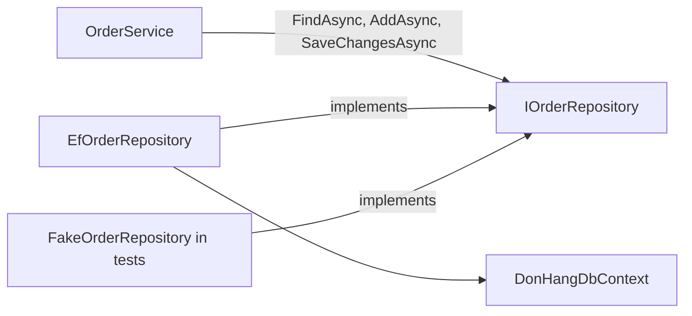

## Before you start

- [[design.l1.the-service-layer]] — you know `OrderService` holds the rules and steps of placing an order, and has the order saved through `IOrderRepository`.
- [[backend.l1.querying-with-linq]] — you know a LINQ query with `.Where(...)` and `.Include(...)` on a `DbSet` becomes one SQL statement when something like `.FirstOrDefaultAsync()` runs it.

## The situation

`OrderService.CancelOrderAsync` needs one order, with its items, by id. It could ask `DonHangDbContext` directly: `db.Orders.Include(o => o.Items).FirstOrDefaultAsync(o => o.Id == orderId)`. Instead it calls `repository.FindAsync(orderId)` and never mentions EF Core, `Include` or a `DbSet`. The tests for `OrderService` run with no database at all, yet the same service code saves real orders to PostgreSQL when the API runs. What does that one extra step buy, and what would the service have to know without it?

## Core concepts

- **repository** — the layer hiding how data is fetched or saved behind a small set of methods that describe what is needed, not how.
- data-access code — the code that actually talks to the database: queries, `Include`, `SaveChangesAsync`. The data layer is the project meant to hold this code — in Đơn Hàng, `DonHang.Infrastructure`, where `DonHangDbContext` and `EfOrderRepository` live.
- implementation — a class that provides the methods an interface declares; `EfOrderRepository` and `FakeOrderRepository` are two implementations of `IOrderRepository`.

## How it works



A repository sits between the business layer (the service layer, `OrderService`) and the data-access code. It offers a few methods named for what the business layer needs — find this order, list this customer's orders, add an order, save — and keeps the how to itself. The how is EF Core: a `DbSet`, a LINQ query, an `Include`, a call to `SaveChangesAsync`.

In Đơn Hàng this is DIP again, now between two layers instead of two classes. `OrderService` depends on `IOrderRepository`, an interface declared in `DonHang.Domain` next to it. `EfOrderRepository`, in `DonHang.Infrastructure`, implements that interface with `DonHangDbContext`. The business layer owns the interface; the data layer fills it in.

Because the service only sees those methods, changing how data is stored would not change the service's own code. That is not just a promise: the tests already give `OrderService` a second implementation, `FakeOrderRepository`, which keeps orders in a dictionary instead of PostgreSQL, and `OrderService` runs unchanged against it.

## In the Đơn Hàng system

The interface, in `DonHang.Domain`:

```csharp file=DonHang.Domain/IOrderRepository.cs tag=stage-1 lines=5-11
public interface IOrderRepository
{
    Task<Order?> FindAsync(int id);
    Task<List<Order>> ListByCustomerAsync(int customerId);
    Task AddAsync(Order order);
    Task SaveChangesAsync();
}
```

Four methods, all about orders, none about EF Core. Nothing here says "include the items" or "join the customers"; those are decisions for the implementation. The return types matter too: `Task<Order?>` means `FindAsync` may give back nothing, and the caller decides what that means — `CancelOrderAsync` throws `KeyNotFoundException`.

The implementation, in `DonHang.Infrastructure`:

```csharp file=DonHang.Infrastructure/EfOrderRepository.cs tag=stage-1 lines=7-19
public sealed class EfOrderRepository(DonHangDbContext db) : IOrderRepository
{
    public Task<Order?> FindAsync(int id) =>
        db.Orders.Include(o => o.Items).FirstOrDefaultAsync(o => o.Id == id);

    // lesson: backend.l1.efcore-n-plus-one
    public Task<List<Order>> ListByCustomerAsync(int customerId) =>
        db.Orders.Where(o => o.CustomerId == customerId).Include(o => o.Customer).OrderBy(o => o.Id).ToListAsync();

    public async Task AddAsync(Order order) => await db.Orders.AddAsync(order);

    public Task SaveChangesAsync() => db.SaveChangesAsync();
}
```

The `// lesson:` comment only marks the lesson where `ListByCustomerAsync` was added. Each method is a thin wrapper around one EF Core query or call. `FindAsync` always brings the items along with `Include`, so no caller can forget them. `ListByCustomerAsync` filters, loads the customer and sorts, all in one query. `OrderService` sees none of this; it knows only the names in the interface and calls three of them. The fourth, `ListByCustomerAsync`, is called by `OrdersController.List`, which — like `Get` with `FindAsync` — goes to the repository directly, skipping the service; the next lesson looks at that shortcut.

## Beginners often think…

- **"A repository is just a different name for a DbContext; wrapping it in a class with the same methods changes nothing."** → Actually `IOrderRepository` does not have the same methods: it has four, named for what orders need, while `DonHangDbContext` exposes a `DbSet` for each of its six tables and accepts any LINQ query over them. The service cannot write an unexpected query or forget an `Include`, because `OrderService` lives in `DonHang.Domain`, which has no reference to EF Core or to `DonHang.Infrastructure`. You notice this when a tests project can replace the whole data layer with a dictionary.
- **"Every query the app needs should be written inline wherever it's used, since the repository can't anticipate every query."** → Actually a repository does not have to anticipate them; it grows one named method at a time. `ListByCustomerAsync` was added when the order list endpoint needed it. You notice this when the same query starts appearing, slightly different each time, in several places.

## Try it (3 minutes)

The shop wants a page listing a customer's cancelled orders. Using the two code blocks above, decide what changes.

1. What would you add to `IOrderRepository`?
2. Where would the EF Core query for it go?
3. Would `OrderService.PlaceOrderAsync` change?

Expected result: 1 — one method named for the need, such as `Task<List<Order>> ListCancelledByCustomerAsync(int customerId)`. 2 — in `EfOrderRepository`, as a `db.Orders.Where(...)` query filtering on the customer and on `Status == "cancelled"`. 3 — no: it never calls the new method, and its own code does not mention how orders are queried.

One more class would also have to change for the solution to compile. Which one, and why?

<details><summary>Suggested answer</summary>

`FakeOrderRepository` in `DonHang.Tests`: it implements `IOrderRepository` too, and a class must provide every method its interface declares — the new fifth one as well as the four it already has. That is the cost of a new repository method — every implementation grows with it — and the reason to keep the interface small.

</details>

## Connections

- [[design.l1.the-service-layer]] — the business layer that calls `IOrderRepository` and never touches EF Core.
- [[design.l1.solid-dip]] — the same move as `INotifier` and `LoggingNotifier`, now for data access.
- [[design.l1.tracing-a-request-through-layers]] — the next lesson, which follows one request through the controller, the service and the repository.

## Five-line summary

1. A repository hides how data is fetched or saved behind a few methods named for what is needed.
2. `IOrderRepository` has four methods; `EfOrderRepository` implements them with `DonHangDbContext` and EF Core.
3. `OrderService` depends on the interface in `DonHang.Domain`, while the EF Core implementation lives in `DonHang.Infrastructure` — DIP between layers.
4. Because the service sees only the interface, the tests can give it an in-memory implementation and it runs unchanged.
5. A repository grows one named method at a time; every implementation has to grow with it.
