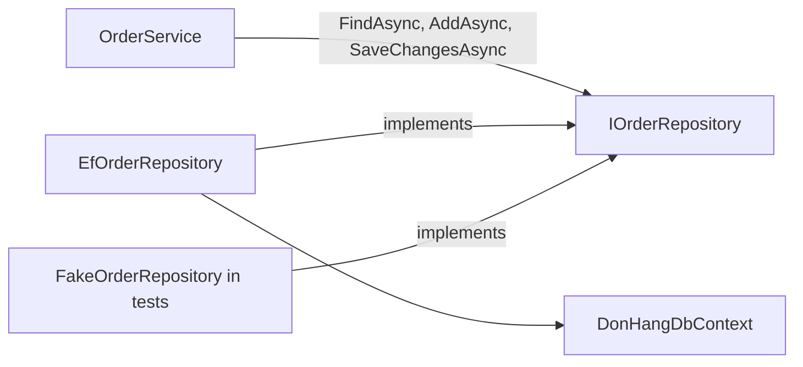

## Bạn cần biết trước

- [[design.l1.the-service-layer]] — bạn biết `OrderService` giữ quy tắc và các bước của việc đặt order, và nhờ `IOrderRepository` lưu order.
- [[backend.l1.querying-with-linq]] — bạn biết một câu LINQ có `.Where(...)` và `.Include(...)` trên một `DbSet` sẽ thành một câu SQL khi thứ gì đó như `.FirstOrDefaultAsync()` chạy nó.

## Tình huống

`OrderService.CancelOrderAsync` cần một order, kèm các món của nó, theo id. Nó có thể hỏi thẳng `DonHangDbContext`: `db.Orders.Include(o => o.Items).FirstOrDefaultAsync(o => o.Id == orderId)`. Thay vào đó, nó gọi `repository.FindAsync(orderId)` và không hề nhắc tới EF Core, `Include` hay `DbSet`. Các test của `OrderService` chạy mà hoàn toàn không có database, vậy mà cũng code service đó lưu order thật vào PostgreSQL khi API chạy. Một bước thêm ấy mang lại gì, và không có nó thì service phải biết những gì?

## Khái niệm cốt lõi

- **repository** — tầng che cách dữ liệu được lấy hay lưu sau một vài method mô tả cần gì, chứ không phải làm thế nào.
- code truy cập dữ liệu — phần code thật sự nói chuyện với database: câu truy vấn, `Include`, `SaveChangesAsync`. Tầng dữ liệu là project dành để chứa code này — trong Đơn Hàng là `DonHang.Infrastructure`, nơi có `DonHangDbContext` và `EfOrderRepository`.
- bản cài đặt — một class cung cấp các method mà một interface khai báo; `EfOrderRepository` và `FakeOrderRepository` là hai bản cài đặt của `IOrderRepository`.

## Cơ chế hoạt động



Repository đứng giữa tầng nghiệp vụ (tầng service, `OrderService`) và code truy cập dữ liệu. Nó đưa ra vài method đặt tên theo điều tầng nghiệp vụ cần — tìm order này, liệt kê order của khách này, thêm một order, lưu — và giữ riêng phần "làm thế nào". Phần đó là EF Core: một `DbSet`, một câu LINQ, một `Include`, một lời gọi `SaveChangesAsync`.

Trong Đơn Hàng, đây lại là DIP, lần này giữa hai tầng thay vì giữa hai class. `OrderService` phụ thuộc vào `IOrderRepository`, một interface khai báo trong `DonHang.Domain` ngay cạnh nó. `EfOrderRepository`, trong `DonHang.Infrastructure`, cài đặt interface đó bằng `DonHangDbContext`. Tầng nghiệp vụ sở hữu interface; tầng dữ liệu điền phần ruột.

Vì service chỉ thấy những method đó, đổi cách lưu dữ liệu sẽ không làm đổi code của chính service. Đó không chỉ là một lời hứa: các test đã đưa cho `OrderService` một bản cài đặt thứ hai, `FakeOrderRepository`, giữ order trong một dictionary thay vì PostgreSQL, và `OrderService` chạy với nó mà không đổi gì.

## Trong hệ thống Đơn Hàng

Interface, trong `DonHang.Domain`:

```csharp file=DonHang.Domain/IOrderRepository.cs tag=stage-1 lines=5-11
public interface IOrderRepository
{
    Task<Order?> FindAsync(int id);
    Task<List<Order>> ListByCustomerAsync(int customerId);
    Task AddAsync(Order order);
    Task SaveChangesAsync();
}
```

Bốn method, đều về order, không cái nào về EF Core. Không có gì ở đây nói "tải kèm các món" hay "join bảng khách hàng"; đó là quyết định của bản cài đặt. Kiểu trả về cũng quan trọng: `Task<Order?>` nghĩa là `FindAsync` có thể không trả về gì, và chỗ gọi quyết định điều đó có nghĩa gì — `CancelOrderAsync` throw `KeyNotFoundException`.

Bản cài đặt, trong `DonHang.Infrastructure`:

```csharp file=DonHang.Infrastructure/EfOrderRepository.cs tag=stage-1 lines=7-19
public sealed class EfOrderRepository(DonHangDbContext db) : IOrderRepository
{
    public Task<Order?> FindAsync(int id) =>
        db.Orders.Include(o => o.Items).FirstOrDefaultAsync(o => o.Id == id);

    // lesson: backend.l1.efcore-n-plus-one
    public Task<List<Order>> ListByCustomerAsync(int customerId) =>
        db.Orders.Where(o => o.CustomerId == customerId).Include(o => o.Customer).OrderBy(o => o.Id).ToListAsync();

    public async Task AddAsync(Order order) => await db.Orders.AddAsync(order);

    public Task SaveChangesAsync() => db.SaveChangesAsync();
}
```

Comment `// lesson:` chỉ đánh dấu bài học mà `ListByCustomerAsync` được thêm vào. Mỗi method là một lớp bọc mỏng quanh một câu truy vấn hoặc một lời gọi EF Core. `FindAsync` luôn tải kèm các món bằng `Include`, nên không chỗ gọi nào quên được. `ListByCustomerAsync` lọc, tải khách hàng và sắp xếp, tất cả trong một câu truy vấn. `OrderService` không thấy gì trong số này; nó chỉ biết các tên trong interface và gọi ba trong số đó. Method thứ tư, `ListByCustomerAsync`, được `OrdersController.List` gọi — giống `Get` với `FindAsync` — đi thẳng tới repository, bỏ qua service; bài tiếp theo sẽ xem xét lối tắt đó.

## Người mới hay nghĩ rằng…

- **"Repository chỉ là một tên khác của DbContext; bọc nó trong một class có cùng các method thì chẳng thay đổi gì."** → Thực ra `IOrderRepository` không có cùng các method: nó có bốn, đặt tên theo điều order cần, trong khi `DonHangDbContext` để lộ một `DbSet` cho mỗi bảng trong sáu bảng của nó và nhận bất kỳ câu LINQ nào trên chúng. Service không thể viết một câu truy vấn bất ngờ hay quên `Include`, vì `OrderService` nằm trong `DonHang.Domain`, project không tham chiếu tới EF Core hay `DonHang.Infrastructure`. Bạn sẽ nhận ra khi một project test thay được cả tầng dữ liệu bằng một dictionary.
- **"Mọi câu truy vấn app cần nên viết thẳng ở chỗ dùng, vì repository không lường trước được mọi câu truy vấn."** → Thực ra repository không cần lường trước; nó lớn dần, mỗi lần thêm một method có tên. `ListByCustomerAsync` được thêm vào khi endpoint danh sách order cần tới nó. Bạn sẽ nhận ra khi cùng một câu truy vấn bắt đầu xuất hiện, mỗi chỗ khác đi một chút, ở nhiều nơi.

## Thử ngay (3 phút)

Cửa hàng muốn một trang liệt kê các order đã hủy của một khách. Dựa vào hai khối code ở trên, xác định những gì thay đổi.

1. Bạn sẽ thêm gì vào `IOrderRepository`?
2. Câu truy vấn EF Core cho nó sẽ nằm ở đâu?
3. `OrderService.PlaceOrderAsync` có phải đổi không?

Kết quả mong đợi: 1 — một method đặt tên theo nhu cầu, chẳng hạn `Task<List<Order>> ListCancelledByCustomerAsync(int customerId)`. 2 — trong `EfOrderRepository`, là một câu truy vấn `db.Orders.Where(...)` lọc theo khách hàng và theo `Status == "cancelled"`. 3 — không: nó không hề gọi method mới, và code của nó không nhắc gì tới cách truy vấn order.

Còn một class nữa cũng phải đổi thì solution mới compile được. Class nào, và vì sao?

<details><summary>Gợi ý đáp án</summary>

`FakeOrderRepository` trong `DonHang.Tests`: nó cũng cài đặt `IOrderRepository`, và một class phải có mọi method mà interface của nó khai báo — cả method thứ năm mới lẫn bốn method sẵn có. Đó là cái giá của một method repository mới — mọi bản cài đặt đều phải lớn theo — và là lý do nên giữ interface nhỏ.

</details>

## Liên hệ

- [[design.l1.the-service-layer]] — tầng nghiệp vụ gọi `IOrderRepository` mà không bao giờ đụng tới EF Core.
- [[design.l1.solid-dip]] — cùng một nước đi như `INotifier` và `LoggingNotifier`, giờ áp cho truy cập dữ liệu.
- [[design.l1.tracing-a-request-through-layers]] — bài tiếp theo, theo một request đi qua controller, service và repository.

## Tóm tắt 5 dòng

1. Repository che cách dữ liệu được lấy hay lưu sau vài method đặt tên theo điều cần có.
2. `IOrderRepository` có bốn method; `EfOrderRepository` cài đặt chúng bằng `DonHangDbContext` và EF Core.
3. `OrderService` phụ thuộc vào interface trong `DonHang.Domain`, còn bản cài đặt EF Core nằm ở `DonHang.Infrastructure` — DIP giữa các tầng.
4. Vì service chỉ thấy interface, các test đưa được cho nó một bản cài đặt trong bộ nhớ và nó chạy mà không đổi gì.
5. Repository lớn dần mỗi lần một method có tên; mọi bản cài đặt đều phải lớn theo.
