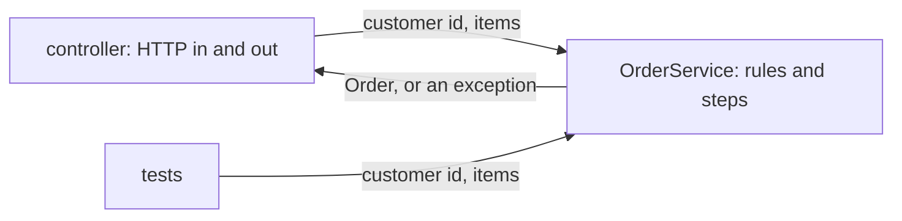

## Before you start

- [[design.l1.the-controller-layer]] — you know `OrdersController.Create` only reads the request, calls `OrderService.PlaceOrderAsync`, and shapes the result into `201` with an `OrderDto`.
- [[backend.l1.validating-input]] — you know `PlaceOrderAsync` refuses an order with no items before anything is saved, and that the refusal ends up as a `400`.

## The situation

The tests in `DonHang.Tests` check that an order with no items is refused. They do it without starting the API, without an HTTP request, without a token and without a JSON body: they create an `OrderService` and call `PlaceOrderAsync` with a customer id and an empty list. That only works because of what `PlaceOrderAsync` takes and returns. What would those tests have to build if the method took the HTTP request instead?

## Core concepts

- **service layer** — the layer holding business rules and orchestration, taking and returning plain data with no HTTP involved.
- orchestration — running the steps of a business task in the right order: check, build, save, notify.
- plain data — ordinary C# values and objects, such as an `int` customer id or a list of `OrderItem`, rather than an HTTP request, response or status code.

## How it works



The service layer is where a business task is decided and carried out. It knows the rules — an order needs at least one item — and the steps: check the items, build the order, have it saved, send a notification. It does not know that HTTP exists.

That is visible in its method signatures. A service method takes plain input, such as a customer id and a list of items, and returns a plain result, such as an `Order`. When something is wrong, it throws an ordinary exception; it does not pick a status code. Turning the result into JSON, or the exception into a `400`, is the job of the HTTP side: the controller for the result, the exception-handling middleware for the exception.

Because nothing in it depends on HTTP, a service method can be called by anything that can create the service and has the plain values: the controller, a test, or any other program. The tests in the diagram call `OrderService` exactly the way the controller does. This is SRP again: deciding whether an order is valid sits in `OrderService`, and turning it into an HTTP response sits in `OrdersController`, so each changes for its own reason.

## In the Đơn Hàng system

`OrderService` lives in `DonHang.Domain`, the business layer:

```csharp file=DonHang.Domain/OrderService.cs tag=stage-1 lines=6-23
public sealed class OrderService(IOrderRepository repository, INotifier notifier)
{
    public async Task<Order> PlaceOrderAsync(int customerId, List<OrderItem> items)
    {
        if (items.Count == 0) throw new ArgumentException("an order needs at least one item");

        var order = new Order
        {
            CustomerId = customerId,
            PlacedAt = DateTimeOffset.UtcNow,
            Status = "new",
            Items = items,
        };
        await repository.AddAsync(order);
        await repository.SaveChangesAsync();
        notifier.Send(order.Id, "order placed");
        return order;
    }
```

`PlaceOrderAsync` takes an `int` and a `List<OrderItem>` and returns an `Order`. In between, it runs the steps in order: refuse an empty list, build the `Order` with status `"new"`, have it added and saved through `IOrderRepository`, and send a notification through `INotifier`. The empty-items check from the validation lesson is the first line — here, not in the controller. Nothing in the method mentions a request, a DTO or a status code. In the tests, the two constructor parameters are small classes written just for testing, `FakeOrderRepository` and `FakeNotifier`, which implement `IOrderRepository` and `INotifier` by keeping orders and messages in memory — so no database is involved.

The same class also cancels orders:

```csharp file=DonHang.Domain/OrderService.cs tag=stage-1 lines=29-38
    public async Task<Order> CancelOrderAsync(int orderId)
    {
        var order = await repository.FindAsync(orderId)
            ?? throw new KeyNotFoundException($"order {orderId} not found");

        order.Status = "cancelled";
        await repository.SaveChangesAsync();
        notifier.Send(order.Id, "order cancelled");
        return order;
    }
```

It asks `IOrderRepository.FindAsync` for the order; when that returns `null`, `?? throw` throws instead. So an unknown order is reported with `KeyNotFoundException`, a plain .NET exception. The service does not decide that this means `404`; the exception-handling middleware in the API project, `DonHang.Api`, does that translation, just as it turns `ArgumentException` into `400`.

## Beginners often think…

- **"The service layer is just where you put code that doesn't fit anywhere else."** → Actually it has one clear job: the business rules and steps for its task. `OrderService` holds placing and cancelling orders and nothing else — no JSON, no database code, no logging setup. You notice this when a service class starts collecting unrelated helpers and every change seems to touch it.
- **"A service method should accept the raw HTTP request object, so it has access to everything it might need."** → Actually taking the request would tie the business rules to HTTP. `PlaceOrderAsync` takes a customer id and a list of items, so the tests can call it with two plain values; with the request as its input, every test would first have to build a stand-in HTTP request, token included. You notice this when calling a rule from anywhere but an endpoint suddenly needs HTTP objects.

## Try it (3 minutes)

For each piece of work, say whether it belongs in `OrdersController` or in `OrderService`, using the code in this lesson and the previous one.

1. Reading the caller's id from the token's `sub`.
2. Refusing an order with no items.
3. Setting a new order's status to `"new"`.
4. Building the `OrderDto` for the response body.
5. Sending the "order placed" notification.

Expected result: 1 and 4 are in `OrdersController` — they are HTTP work. 2, 3 and 5 are in `OrderService` — they are the rule and the steps of placing an order.

If the shop later let customers place orders by importing a file, which of the five would a new importer need to repeat?

<details><summary>Suggested answer</summary>

None of 2, 3 or 5: the importer calls `PlaceOrderAsync` and gets the rule and the steps for free. It would only need its own versions of 1 and 4 — how it learns who the customer is, and what it reports back — because those are about its way in and out, not about orders.

</details>

## Connections

- [[design.l1.the-controller-layer]] — the other side of the call: the controller that reads the request and hands plain values to `OrderService`.
- [[design.l1.solid-srp]] — the reason the rule and the HTTP response live in different classes.
- [[design.l1.the-repository-layer]] — the next lesson, which opens `IOrderRepository`, the interface `OrderService` saves through.

## Five-line summary

1. The service layer holds business rules and the steps of a task, and knows nothing about HTTP.
2. `OrderService.PlaceOrderAsync` refuses empty orders, builds the `Order`, has it saved and sends a notification.
3. Its methods take plain values and return plain results, and report problems with ordinary exceptions.
4. Because of that, the tests in `DonHang.Tests` call it directly, with no request, token or JSON.
5. Deciding whether an order is valid and turning it into an HTTP response live in different classes, as SRP asks.
