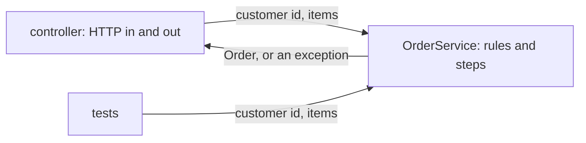

## Bạn cần biết trước

- [[design.l1.the-controller-layer]] — bạn biết `OrdersController.Create` chỉ đọc request, gọi `OrderService.PlaceOrderAsync`, rồi định dạng kết quả thành `201` kèm một `OrderDto`.
- [[backend.l1.validating-input]] — bạn biết `PlaceOrderAsync` từ chối order không có món nào trước khi lưu bất cứ gì, và lời từ chối đó cuối cùng thành `400`.

## Tình huống

Các test trong `DonHang.Tests` kiểm tra rằng order không có món nào sẽ bị từ chối. Chúng làm vậy mà không khởi động API, không có request HTTP, không có token và không có body JSON: chúng tạo một `OrderService` rồi gọi `PlaceOrderAsync` với một id customer và một danh sách rỗng. Điều đó chỉ được là nhờ những gì `PlaceOrderAsync` nhận vào và trả ra. Nếu method nhận request HTTP, các test đó sẽ phải dựng những gì?

## Khái niệm cốt lõi

- **tầng service** (service layer) — tầng giữ quy tắc nghiệp vụ và điều phối các bước, nhận và trả dữ liệu thuần, không dính gì tới HTTP.
- điều phối — chạy các bước của một việc nghiệp vụ theo đúng thứ tự: kiểm tra, dựng, lưu, báo.
- dữ liệu thuần — các giá trị và object C# bình thường, như một id customer kiểu `int` hay một danh sách `OrderItem`, chứ không phải request, response hay status code của HTTP.

## Cơ chế hoạt động



Tầng service là nơi một việc nghiệp vụ được quyết định và thực hiện. Nó biết các quy tắc — một order cần ít nhất một món — và các bước: kiểm tra danh sách món, dựng order, nhờ lưu, gửi thông báo. Nó không biết HTTP tồn tại.

Điều đó thấy ngay trong chữ ký method. Một method của service nhận đầu vào thuần, như một id customer và một danh sách món, và trả về kết quả thuần, như một `Order`. Khi có gì sai, nó throw một exception bình thường; nó không chọn status code. Biến kết quả thành JSON, hay biến exception thành `400`, là việc của phía HTTP: controller lo kết quả, middleware xử lý exception lo exception.

Vì không có gì trong nó phụ thuộc vào HTTP, một method của service có thể được gọi bởi bất cứ thứ gì tạo được service và có các giá trị thuần: controller, một test, hay chương trình nào khác. Các test trong sơ đồ gọi `OrderService` y hệt cách controller gọi. Lại là SRP: quyết định một order có hợp lệ không nằm trong `OrderService`, còn biến nó thành response HTTP nằm trong `OrdersController`, nên mỗi bên thay đổi vì lý do riêng.

## Trong hệ thống Đơn Hàng

`OrderService` nằm trong `DonHang.Domain`, tầng nghiệp vụ:

```csharp file=DonHang.Domain/OrderService.cs tag=stage-1 lines=6-23
public sealed class OrderService(IOrderRepository repository, INotifier notifier)
{
    public async Task<Order> PlaceOrderAsync(int customerId, List<OrderItem> items)
    {
        if (items.Count == 0) throw new ArgumentException("an order needs at least one item");

        var order = new Order
        {
            CustomerId = customerId,
            PlacedAt = DateTimeOffset.UtcNow,
            Status = "new",
            Items = items,
        };
        await repository.AddAsync(order);
        await repository.SaveChangesAsync();
        notifier.Send(order.Id, "order placed");
        return order;
    }
```

`PlaceOrderAsync` nhận một `int` và một `List<OrderItem>` rồi trả về một `Order`. Ở giữa, nó chạy các bước theo thứ tự: từ chối danh sách rỗng, dựng `Order` với trạng thái `"new"`, nhờ `IOrderRepository` thêm và lưu, và gửi thông báo qua `INotifier`. Phép kiểm tra order rỗng từ bài validation là dòng đầu tiên — ở đây, không phải trong controller. Không có gì trong method nhắc tới request, DTO hay status code. Trong các test, hai tham số constructor là những class nhỏ viết riêng để test, `FakeOrderRepository` và `FakeNotifier`, cài đặt `IOrderRepository` và `INotifier` bằng cách giữ order và tin nhắn trong bộ nhớ — nên không có database nào dính vào.

Cùng class đó cũng hủy order:

```csharp file=DonHang.Domain/OrderService.cs tag=stage-1 lines=29-38
    public async Task<Order> CancelOrderAsync(int orderId)
    {
        var order = await repository.FindAsync(orderId)
            ?? throw new KeyNotFoundException($"order {orderId} not found");

        order.Status = "cancelled";
        await repository.SaveChangesAsync();
        notifier.Send(order.Id, "order cancelled");
        return order;
    }
```

Nó hỏi `IOrderRepository.FindAsync` để lấy order; khi kết quả là `null`, `?? throw` sẽ throw. Vậy nên một order không tồn tại được báo bằng `KeyNotFoundException`, một exception .NET bình thường. Service không quyết định rằng điều này nghĩa là `404`; middleware xử lý exception trong project API, `DonHang.Api`, làm việc chuyển đổi đó, cũng như nó biến `ArgumentException` thành `400`.

## Người mới hay nghĩ rằng…

- **"Tầng service chỉ là chỗ để nhét code không vừa chỗ nào khác."** → Thực ra nó có một việc rõ ràng: quy tắc nghiệp vụ và các bước cho việc của nó. `OrderService` chỉ giữ việc đặt và hủy order, không gì khác — không JSON, không code database, không thiết lập logging. Bạn sẽ nhận ra khi một class service bắt đầu gom đủ loại hàm tiện ích chẳng liên quan và thay đổi nào cũng có vẻ đụng tới nó.
- **"Method của service nên nhận nguyên object request HTTP, để có mọi thứ nó có thể cần."** → Thực ra nhận request là buộc quy tắc nghiệp vụ vào HTTP. `PlaceOrderAsync` nhận một id customer và một danh sách món, nên test gọi được nó với hai giá trị thuần; nếu đầu vào là request, test nào cũng phải dựng trước một request HTTP thay thế, kèm cả token. Bạn sẽ nhận ra khi gọi một quy tắc từ bất cứ đâu ngoài endpoint bỗng nhiên cần tới object HTTP.

## Thử ngay (3 phút)

Với mỗi việc, cho biết nó thuộc `OrdersController` hay `OrderService`, dựa vào code trong bài này và bài trước.

1. Đọc id người gọi từ `sub` trong token.
2. Từ chối order không có món nào.
3. Đặt trạng thái của order mới là `"new"`.
4. Dựng `OrderDto` cho body của response.
5. Gửi thông báo "order placed".

Kết quả mong đợi: 1 và 4 nằm trong `OrdersController` — đó là việc HTTP. 2, 3 và 5 nằm trong `OrderService` — đó là quy tắc và các bước của việc đặt order.

Nếu sau này cửa hàng cho khách đặt order bằng cách nhập từ file, một chương trình nhập file mới sẽ phải làm lại những việc nào trong năm việc?

<details><summary>Gợi ý đáp án</summary>

Không phải 2, 3 hay 5: chương trình nhập file gọi `PlaceOrderAsync` là có sẵn quy tắc và các bước. Nó chỉ cần phiên bản riêng của 1 và 4 — cách nó biết khách là ai, và nó báo lại điều gì — vì đó là chuyện lối vào và lối ra của riêng nó, không phải chuyện order.

</details>

## Liên hệ

- [[design.l1.the-controller-layer]] — phía bên kia của lời gọi: controller đọc request và đưa giá trị thuần cho `OrderService`.
- [[design.l1.solid-srp]] — lý do quy tắc và response HTTP nằm ở hai class khác nhau.
- [[design.l1.the-repository-layer]] — bài tiếp theo, mở `IOrderRepository`, interface mà `OrderService` dùng để lưu.

## Tóm tắt 5 dòng

1. Tầng service giữ quy tắc nghiệp vụ và các bước của một việc, và không biết gì về HTTP.
2. `OrderService.PlaceOrderAsync` từ chối order rỗng, dựng `Order`, nhờ lưu và gửi thông báo.
3. Method của nó nhận giá trị thuần, trả kết quả thuần, và báo lỗi bằng exception bình thường.
4. Nhờ vậy, các test trong `DonHang.Tests` gọi thẳng nó, không cần request, token hay JSON.
5. Quyết định order có hợp lệ không và biến nó thành response HTTP nằm ở hai class khác nhau, đúng như SRP đòi hỏi.
