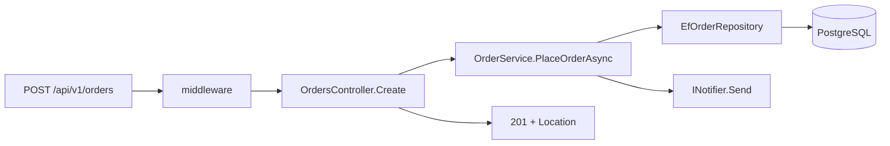

## Before you start

- [[design.l1.the-repository-layer]] — you know `OrderService` saves orders through `IOrderRepository`, and that `EfOrderRepository` implements it with `DonHangDbContext`.

## The situation

A customer places an order from the app. One `POST /api/v1/orders` arrives, and a moment later the app gets back `201` and a link to the new order. In between, the request passed through three projects, several classes and a database. When something goes wrong — an order refused, a `500`, a missing notification — you need to know which class handled which step, and which classes never saw the request at all. What exactly happens, in what order, between the request arriving and the `201` going back?

## Core concepts

- trace — following one request from the moment it arrives to the moment its response leaves, step by step, noting which class does each step.
- call direction — which layer calls which; in a layered application, calls go from the HTTP layer down to the business layer and on to the data layer, never back up.
- shortcut — a call that skips a layer, such as a controller going straight to the data layer for a simple read.

## How it works



The request first passes through the middleware — exception handling, logging, the token check — and then reaches the controller. `OrdersController.Create` reads who the caller is and what they sent, turns the request's items into `OrderItem` objects, and calls `OrderService.PlaceOrderAsync`. The controller does not check the items or save anything.

The service does the business work. It refuses an empty list, builds the `Order` with status `"new"`, and asks `IOrderRepository` to add and save it. At run time that interface is `EfOrderRepository`, which hands the order to EF Core; `SaveChangesAsync` sends the `INSERT`s — the order row and its item rows — to PostgreSQL, and PostgreSQL assigns the order's id. The service then sends the "order placed" notification through `INotifier` — at stage-1, `LoggingNotifier` writes it as a log line — and returns the `Order`.

Back in the controller, the `Order` becomes an `OrderDto`, and `CreatedAtAction` answers `201` with a `Location` header pointing at the new order. Each layer called only the one directly below it, and nothing called back up: the data layer never asked the service anything, and the service never touched HTTP. That is why a rule about which orders may be placed can stay in the service, and a change to how orders are queried touches only the repository.

## In the Đơn Hàng system

The request's first and last stop, in `DonHang.Api`:

```csharp file=DonHang.Api/Controllers/OrdersController.cs tag=stage-1 lines=17-28
    [Authorize]
    [HttpPost]
    public async Task<ActionResult<OrderDto>> Create(CreateOrderRequest request)
    {
        var customerId = int.Parse(User.FindFirstValue(JwtRegisteredClaimNames.Sub)!);
        var items = request.Items
            .Select(i => new OrderItem { ProductId = i.ProductId, Quantity = i.Quantity, UnitPriceVnd = i.UnitPriceVnd })
            .ToList();

        var order = await orderService.PlaceOrderAsync(customerId, items);
        return CreatedAtAction(nameof(Get), new { id = order.Id }, ToDto(order));
    }
```

Between `PlaceOrderAsync` being called and returning, the service from the previous lessons runs its steps. The last hop down is here, in `DonHang.Infrastructure`:

```csharp file=DonHang.Infrastructure/EfOrderRepository.cs tag=stage-1 lines=16-18
    public async Task AddAsync(Order order) => await db.Orders.AddAsync(order);

    public Task SaveChangesAsync() => db.SaveChangesAsync();
```

`AddAsync` only stages the order in EF Core; `SaveChangesAsync` is the moment the rows reach PostgreSQL and `order.Id` gets its value. That is why the controller can use `order.Id` for the `Location` header: by the time `PlaceOrderAsync` returns, the id exists.

Not every request in Đơn Hàng takes all three steps. `OrdersController.Get` and `List` call `IOrderRepository` directly, skipping `OrderService`, and the products endpoints query `DonHangDbContext` themselves — shortcuts for simple reads with no business rule to apply today. The login endpoint also queries `DonHangDbContext` itself, and checks the password from the controller with `PasswordHasher` from `DonHang.Domain`. The cost shows up later: if a rule about reading orders appears, it has no place in the business layer until those reads go through it.

## Beginners often think…

- **"Any layer can call any other layer directly, as long as the end result is correct."** → Actually the direction of calls is what keeps each layer changing for its own reason. If `EfOrderRepository` called back into `OrderService`, a change to a business rule could break data access; if every controller queried the database, a new rule would have to be copied into each one. You notice this when a rule you added to the service is silently skipped by a request that went around it, as `Get` does today.
- **"Splitting into layers means writing the same logic three times, once per layer."** → Actually each layer does a different job with the same order. The controller turns request items into `OrderItem` objects and the `Order` into an `OrderDto`; the service checks and builds; the repository stores. Nothing is repeated — the empty-items check exists once, in `OrderService`. You notice this when you trace a request and each class adds a step no other class performs.

## Try it (3 minutes)

Trace two requests through the code in this module. For each, list the methods that run, in order, and say where it stops.

1. `POST /api/v1/orders` with one item, from a signed-in customer.
2. The same request with an empty `items` list.

Expected result: 1 — `Create` → `PlaceOrderAsync` → `AddAsync` → `SaveChangesAsync` → the notifier's `Send` → back in `Create`, `ToDto` and `CreatedAtAction`, answering `201`. 2 — `Create` → `PlaceOrderAsync`, which throws `ArgumentException` on its first line; the exception-handling middleware answers `400`, and `AddAsync` and `SaveChangesAsync` never run.

In request 2, which layers never saw the request, and why is that a good thing?

<details><summary>Suggested answer</summary>

The data layer never saw it: `EfOrderRepository` was not called, and nothing reached PostgreSQL. The business layer refused the order before asking for it to be saved, so a bad order costs no database work and leaves no half-saved row behind.

</details>

## Connections

- [[design.l1.the-controller-layer]] — the first and last stop of the trace.
- [[design.l1.the-service-layer]] — the middle stop, where the rule and the steps live.
- [[design.l1.the-repository-layer]] — the last stop down, where EF Core meets PostgreSQL.

## Five-line summary

1. `POST /api/v1/orders` goes controller → service → repository → PostgreSQL, and the answer comes back up to the controller.
2. The controller reads and shapes HTTP, the service checks and builds the order, and the repository stores it.
3. In `Create`, each layer calls only the one below it, and nothing calls back up.
4. `Get`, `List` and the products endpoints skip the service for simple reads — a shortcut with a cost if a read rule appears.
5. Because each concern lives in one layer, a rule change touches the service and a query change touches the repository.
