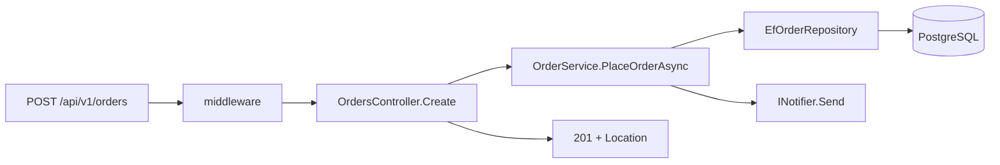

## Bạn cần biết trước

- [[design.l1.the-repository-layer]] — bạn biết `OrderService` lưu order qua `IOrderRepository`, và `EfOrderRepository` cài đặt interface đó bằng `DonHangDbContext`.

## Tình huống

Một khách đặt order từ app. Một `POST /api/v1/orders` đi tới, và chỉ lát sau app nhận lại `201` cùng một đường dẫn tới order mới. Ở giữa, request đã đi qua ba project, nhiều class và một database. Khi có gì trục trặc — order bị từ chối, một lỗi `500`, một thông báo không tới — bạn cần biết class nào xử lý bước nào, và class nào hoàn toàn không thấy request. Chính xác thì chuyện gì xảy ra, theo thứ tự nào, từ lúc request tới cho tới lúc `201` trả về?

## Khái niệm cốt lõi

- lần theo (trace) — theo một request từ lúc nó tới cho tới lúc response của nó rời đi, từng bước một, ghi lại class nào làm bước nào.
- hướng gọi — tầng nào gọi tầng nào; trong một ứng dụng phân tầng, lời gọi đi từ tầng HTTP xuống tầng nghiệp vụ rồi tới tầng dữ liệu, không bao giờ ngược lên.
- lối tắt — một lời gọi bỏ qua một tầng, như controller đi thẳng xuống tầng dữ liệu cho một thao tác đọc đơn giản.

## Cơ chế hoạt động



Request đầu tiên đi qua các middleware — xử lý exception, ghi log và kiểm tra token, cùng vài thứ khác — rồi mới tới controller. `OrdersController.Create` đọc người gọi là ai và họ gửi gì, chuyển các món trong request thành các object `OrderItem`, và gọi `OrderService.PlaceOrderAsync`. Controller không kiểm tra danh sách món và không lưu gì cả.

Service làm việc nghiệp vụ. Nó từ chối danh sách rỗng, dựng `Order` với trạng thái `"new"`, và nhờ `IOrderRepository` thêm rồi lưu. Lúc chạy, interface đó là `EfOrderRepository`, class giao order cho EF Core; `SaveChangesAsync` gửi các câu `INSERT` — dòng của order và các dòng món của nó — tới PostgreSQL, và PostgreSQL cấp id cho order. Sau đó service gửi thông báo "order placed" qua `INotifier` — ở stage-1, `LoggingNotifier` ghi nó thành một dòng log — rồi trả về `Order`.

Quay lại controller, `Order` được biến thành `OrderDto`, và `CreatedAtAction` trả `201` kèm header `Location` trỏ tới order mới. Mỗi tầng chỉ gọi đúng tầng ngay bên dưới, và không có gì gọi ngược lên: tầng dữ liệu không hỏi gì service, còn service không đụng tới HTTP. Vì vậy một quy tắc về order nào được đặt có thể ở yên trong service, còn thay đổi cách truy vấn order chỉ đụng tới repository.

## Trong hệ thống Đơn Hàng

Điểm dừng đầu tiên và cuối cùng của request, trong `DonHang.Api`:

```csharp file=DonHang.Api/Controllers/OrdersController.cs tag=stage-1 lines=17-28
    [Authorize]
    [HttpPost]
    public async Task<ActionResult<OrderDto>> Create(CreateOrderRequest request)
    {
        var customerId = int.Parse(User.FindFirstValue(JwtRegisteredClaimNames.Sub)!);
        var items = request.Items
            .Select(i => new OrderItem { ProductId = i.ProductId, Quantity = i.Quantity, UnitPriceVnd = i.UnitPriceVnd })
            .ToList();

        var order = await orderService.PlaceOrderAsync(customerId, items);
        return CreatedAtAction(nameof(Get), new { id = order.Id }, ToDto(order));
    }
```

Giữa lúc `PlaceOrderAsync` được gọi và lúc nó trả về, service ở các bài trước chạy các bước của nó. Chặng cuối cùng đi xuống nằm ở đây, trong `DonHang.Infrastructure`:

```csharp file=DonHang.Infrastructure/EfOrderRepository.cs tag=stage-1 lines=16-18
    public async Task AddAsync(Order order) => await db.Orders.AddAsync(order);

    public Task SaveChangesAsync() => db.SaveChangesAsync();
```

`AddAsync` chỉ đưa order vào hàng chờ của EF Core; `SaveChangesAsync` mới là lúc các dòng dữ liệu tới PostgreSQL và `order.Id` có giá trị. Đó là lý do controller dùng được `order.Id` cho header `Location`: tới lúc `PlaceOrderAsync` trả về, id đã có.

Không phải request nào trong Đơn Hàng cũng đi đủ ba bước. `OrdersController.Get` và `List` gọi thẳng `IOrderRepository`, bỏ qua `OrderService`, còn các endpoint sản phẩm tự truy vấn `DonHangDbContext` — những lối tắt cho thao tác đọc đơn giản, hiện chưa có quy tắc nghiệp vụ nào cần áp. Endpoint đăng nhập là một kiểu lối tắt khác: nó cũng tự truy vấn `DonHangDbContext`, và phép kiểm tra mật khẩu — một quy tắc — chạy từ controller, dùng `PasswordHasher` trong `DonHang.Domain`. Cái giá sẽ lộ ra sau này: nếu xuất hiện một quy tắc về việc đọc order, nó chẳng có chỗ nào trong tầng nghiệp vụ cho tới khi những thao tác đọc đó đi qua tầng này.

## Người mới hay nghĩ rằng…

- **"Tầng nào cũng gọi thẳng được tầng nào khác, miễn là kết quả cuối cùng đúng."** → Thực ra hướng gọi chính là thứ giữ cho mỗi tầng thay đổi vì lý do riêng. Nếu `EfOrderRepository` gọi ngược vào `OrderService`, một thay đổi quy tắc nghiệp vụ có thể làm hỏng việc truy cập dữ liệu; nếu controller nào cũng tự truy vấn database, một quy tắc mới sẽ phải chép vào từng controller. Bạn sẽ nhận ra khi một quy tắc bạn thêm vào service bị một request đi vòng lặng lẽ bỏ qua, như `Get` sẽ làm ngay khi service có thêm một quy tắc về việc đọc order.
- **"Chia tầng nghĩa là viết cùng một logic ba lần, mỗi tầng một lần."** → Thực ra mỗi tầng làm một việc khác nhau với cùng một order. Controller biến các món trong request thành object `OrderItem` và biến `Order` thành `OrderDto`; service kiểm tra và dựng order; repository lưu. Không có gì lặp lại — phép kiểm tra order rỗng chỉ có một, trong `OrderService`. Bạn sẽ nhận ra khi lần theo một request và thấy mỗi class thêm một bước mà không class nào khác làm.

## Thử ngay (3 phút)

Lần theo hai request qua code trong module này. Với mỗi request, liệt kê các method chạy theo thứ tự, và cho biết nó dừng ở đâu.

1. `POST /api/v1/orders` với một món, từ một khách đã đăng nhập.
2. Cùng request đó nhưng danh sách `items` rỗng.

Kết quả mong đợi: 1 — `Create` → `PlaceOrderAsync` → `AddAsync` → `SaveChangesAsync` → `Send` của notifier → quay lại `Create`, `ToDto` và `CreatedAtAction`, trả `201`. 2 — `Create` → `PlaceOrderAsync`, nơi throw `ArgumentException` ngay dòng đầu; middleware xử lý exception trả `400`, và `AddAsync` cùng `SaveChangesAsync` không bao giờ chạy.

Ở request 2, những tầng nào không hề thấy request, và vì sao điều đó là tốt?

<details><summary>Gợi ý đáp án</summary>

Tầng dữ liệu không hề thấy nó: `EfOrderRepository` không được gọi, và không có gì tới được PostgreSQL. Tầng nghiệp vụ đã từ chối order trước khi nhờ lưu, nên một order sai không tốn công database nào và không để lại dòng dữ liệu lưu dở nào.

</details>

## Liên hệ

- [[design.l1.the-controller-layer]] — điểm dừng đầu tiên và cuối cùng của đường đi.
- [[design.l1.the-service-layer]] — điểm dừng ở giữa, nơi có quy tắc và các bước.
- [[design.l1.the-repository-layer]] — điểm dừng thấp nhất, nơi EF Core gặp PostgreSQL.

## Tóm tắt 5 dòng

1. `POST /api/v1/orders` đi controller → service → repository → PostgreSQL, và câu trả lời quay ngược lên controller.
2. Controller đọc và định dạng HTTP, service kiểm tra và dựng order, repository lưu nó.
3. Trong `Create`, mỗi tầng chỉ gọi tầng ngay bên dưới, và không có gì gọi ngược lên.
4. `Get`, `List` và các endpoint sản phẩm bỏ qua service cho thao tác đọc đơn giản — một lối tắt có cái giá khi xuất hiện quy tắc đọc.
5. Vì mỗi loại việc nằm ở một tầng, thay đổi quy tắc đụng tới service, còn thay đổi truy vấn đụng tới repository.
