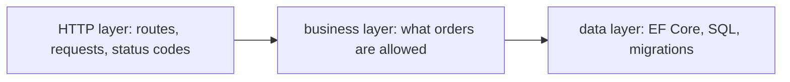

## Before you start

- [[design.l1.solid-srp]] — you know a class should have one reason to change, and that `PlaceOrderSplit` holds four: checking, pricing, saving and notifying.
- [[backend.l1.saving-changes]] — you know `AddAsync` stages an order and `SaveChangesAsync` sends it to PostgreSQL through EF Core.

## The situation

SRP told you how to judge one class. But the Đơn Hàng API is not one class: it has HTTP endpoints for products, orders and login, order rules, entities, EF Core's `DbContext`, migrations, middleware. A new rule arrives — "an order may have at most 20 items" — and you have to decide where it goes. Looking at one class at a time does not answer that; you need a map of the whole application first. Where should a business rule live, and how would you know without opening every file?

## Core concepts

- **layer** — a group of classes responsible for one kind of concern, such as speaking HTTP, deciding what the business allows, or reading and writing data.
- concern — a kind of work the application must do, with its own reason to change: a new route is an HTTP concern, a new order rule is a business concern, a new query is a data concern.
- calls — at run time, one layer asking another to do work; the arrows in this lesson's diagram show calls, not project references.

## How it works



SRP says one class, one reason to change. Splitting an application into layers applies the same idea one level up: instead of judging classes one by one, it groups them by the kind of reason they change for. Code that changes when the HTTP side — routes, requests, status codes — changes goes in one layer. Code that changes when a business rule changes goes in another. Code that changes when the way data is stored changes goes in a third.

With that map, the question from the situation has an answer before you open a file. "At most 20 items" is a business rule, so it belongs in the business layer. A renamed route would touch only the HTTP layer; a new index or a different order query would touch only the data layer.

The arrows show which layer uses which. The HTTP layer calls into the business layer to get work done, and the business layer relies on the data layer to store what it decides. Each layer can then change for its own reason without dragging the others along.

## In the Đơn Hàng system

At stage-1, the API is split into three projects, one per kind of concern. `DonHang.Api` holds the HTTP side: the endpoints, the DTOs and the middleware. `DonHang.Domain` holds the business side: the entities and `OrderService`, which decides whether an order can be placed. `DonHang.Infrastructure` holds the data side: `DonHangDbContext`, the migrations and the order queries in `EfOrderRepository`. The split is not perfectly clean: the products endpoints in `DonHang.Api` query `DonHangDbContext` directly, and the read endpoints for orders call the data layer without going through `OrderService` — shortcuts a later lesson in this module comes back to.

The project files show which way the dependencies go. This is all of `DonHang.Domain.csproj`:

```xml file=DonHang.Domain/DonHang.Domain.csproj tag=stage-1 lines=1-10
<Project Sdk="Microsoft.NET.Sdk">

  <PropertyGroup>
    <TargetFramework>net10.0</TargetFramework>
    <ImplicitUsings>enable</ImplicitUsings>
    <Nullable>enable</Nullable>
    <RootNamespace>DonHang.Domain</RootNamespace>
  </PropertyGroup>

</Project>
```

No project reference and no package reference: the business layer cannot use EF Core, the Npgsql package that lets EF Core talk to PostgreSQL, or ASP.NET Core. The data project, by contrast, references it:

```xml file=DonHang.Infrastructure/DonHang.Infrastructure.csproj tag=stage-1 lines=10-20
  <ItemGroup>
    <ProjectReference Include="..\DonHang.Domain\DonHang.Domain.csproj" />
  </ItemGroup>

  <ItemGroup>
    <PackageReference Include="Microsoft.EntityFrameworkCore.Design">
      <IncludeAssets>runtime; build; native; contentfiles; analyzers; buildtransitive</IncludeAssets>
      <PrivateAssets>all</PrivateAssets>
    </PackageReference>
    <PackageReference Include="Npgsql.EntityFrameworkCore.PostgreSQL" />
  </ItemGroup>
```

The lines that matter are the `ProjectReference` to `DonHang.Domain` and the two `PackageReference` lines for EF Core; `IncludeAssets` and `PrivateAssets` are packaging details you can skip. So `DonHang.Infrastructure` knows `DonHang.Domain` and brings in EF Core, while EF Core code cannot creep into `DonHang.Domain` by accident: without a reference to those packages, the compiler would reject it.

Notice that this reference points from the data project to the business project — the opposite of the call arrow in the diagram. That works because of DIP: `DonHang.Domain` declares the interfaces `IOrderRepository` and `INotifier`, `EfOrderRepository` and `LoggingNotifier` in `DonHang.Infrastructure` implement them, and `OrderService` only knows the interfaces. `PlaceOrderSplit` in the samples hinted at these concerns inside one small class; the API gives each group its own project.

## Beginners often think…

- **"Layers are just folders for organizing files; putting a class in the right folder is what matters."** → Actually a layer is defined by what its classes change for and what they are allowed to depend on. In Đơn Hàng the layers are separate projects, and `DonHang.Domain` has no reference to EF Core, so data-access code there would not even compile. You notice this when moving a file to another folder changes nothing, but a missing project reference still makes the build fail.
- **"More layers is always better design, no matter how small the application."** → Actually each layer adds a step to read through and a boundary to maintain. `PlaceOrderSplit` is 38 lines and needs no projects of its own; the whole API, with HTTP, order rules and a database, earns its three. You notice this when a tiny change has to be passed through several layers that add nothing to it.

## Try it (3 minutes)

For each change, name the layer — and the Đơn Hàng project — it belongs in.

1. The orders route moves from `/api/v1/orders` to `/api/v2/orders`.
2. An order may have at most 20 items.
3. Loading an order should also load its customer's name in the same query.

Expected result: 1 is an HTTP concern, `DonHang.Api`. 2 is a business rule, `DonHang.Domain` — next to the existing check that an order has at least one item. 3 is a data concern, `DonHang.Infrastructure`, where the order queries live in `EfOrderRepository`.

Which of the three changes would also force a change in another layer?

<details><summary>Suggested answer</summary>

Changes 1 and 2 do not: the route lives only in the HTTP layer and the item limit only in the business layer. Change 3 lands in the data layer's query; if the name must also appear in the response, the DTO in the HTTP layer changes too — a second change, for a second reason. That is the point of grouping by reason to change: each reason lands in one place.

</details>

## Connections

- [[design.l1.solid-srp]] — the same "one reason to change" idea, applied to classes; here it is applied to whole groups of classes.
- [[design.l1.solid-dip]] — why the data project depends on the business project, and not the other way round.
- [[design.l1.the-controller-layer]] — the next lesson, which opens the HTTP layer.

## Five-line summary

1. A layer groups classes by the kind of concern they handle: HTTP, business rules, or data.
2. Splitting an application into layers is SRP for a whole application: each layer changes for its own reason.
3. Knowing the layers tells you where a new change belongs before you open a file.
4. Đơn Hàng's API splits into `DonHang.Api`, `DonHang.Domain` and `DonHang.Infrastructure`, one project per layer.
5. `DonHang.Domain` has no project or package reference, so EF Core code cannot creep into the business layer.
