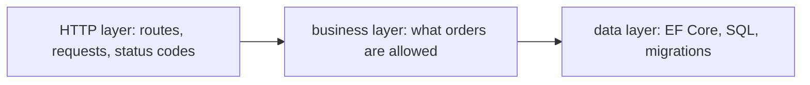

## Bạn cần biết trước

- [[design.l1.solid-srp]] — bạn biết một class chỉ nên có một lý do để thay đổi, và `PlaceOrderSplit` giữ tới bốn: kiểm tra, tính giá, lưu và báo khách.
- [[backend.l1.saving-changes]] — bạn biết `AddAsync` đưa một order vào hàng chờ và `SaveChangesAsync` gửi nó tới PostgreSQL qua EF Core.

## Tình huống

SRP đã chỉ cho bạn cách đánh giá một class. Nhưng API Đơn Hàng không phải một class: nó có các endpoint HTTP cho sản phẩm, order và đăng nhập, các quy tắc về order, các entity, `DbContext` của EF Core, migration, middleware. Một quy tắc mới đến — "một order được có tối đa 20 món" — và bạn phải quyết định đặt nó ở đâu. Nhìn từng class một không trả lời được câu đó; bạn cần trước hết một tấm bản đồ của cả ứng dụng. Một quy tắc nghiệp vụ nên nằm ở đâu, và làm sao biết được mà không phải mở từng file?

## Khái niệm cốt lõi

- **tầng** (layer) — một nhóm class cùng chịu trách nhiệm cho một loại việc, như nói HTTP, quyết định điều nghiệp vụ cho phép, hay đọc và ghi dữ liệu.
- loại việc — một kiểu công việc ứng dụng phải làm, có lý do thay đổi riêng: một route mới là việc của HTTP, một quy tắc order mới là việc nghiệp vụ, một câu truy vấn mới là việc dữ liệu.
- gọi — lúc chạy, một tầng nhờ tầng khác làm việc; các mũi tên trong sơ đồ của bài này thể hiện lời gọi, không phải tham chiếu giữa các project.

## Cơ chế hoạt động



SRP nói mỗi class một lý do để thay đổi. Chia một ứng dụng thành các tầng là áp dụng đúng ý đó ở mức cao hơn: thay vì đánh giá từng class, ta nhóm chúng theo loại lý do khiến chúng thay đổi. Code thay đổi khi phía HTTP — route, request, status code — thay đổi thì nằm ở một tầng. Code thay đổi khi một quy tắc nghiệp vụ thay đổi thì nằm ở tầng khác. Code thay đổi khi cách lưu dữ liệu thay đổi thì nằm ở tầng thứ ba.

Có tấm bản đồ đó, câu hỏi trong tình huống có lời đáp trước khi bạn mở file nào. "Tối đa 20 món" là quy tắc nghiệp vụ, nên nó thuộc tầng nghiệp vụ. Đổi tên một route chỉ đụng tới tầng HTTP; thêm một index hay đổi một câu truy vấn order chỉ đụng tới tầng dữ liệu.

Các mũi tên cho thấy tầng nào dùng tầng nào. Tầng HTTP gọi vào tầng nghiệp vụ để làm việc, và tầng nghiệp vụ dựa vào tầng dữ liệu để lưu điều nó quyết định. Nhờ vậy mỗi tầng có thể thay đổi vì lý do của riêng nó mà không kéo các tầng khác theo.

## Trong hệ thống Đơn Hàng

Ở stage-1, API được chia thành ba project, mỗi project một loại việc. `DonHang.Api` giữ phía HTTP: các endpoint, DTO và middleware. `DonHang.Domain` giữ phía nghiệp vụ: các entity và `OrderService`, class quyết định một order có được đặt hay không. `DonHang.Infrastructure` giữ phía dữ liệu: `DonHangDbContext`, các migration và các câu truy vấn order trong `EfOrderRepository`. Việc chia chưa hoàn toàn sạch: các endpoint sản phẩm và đăng nhập trong `DonHang.Api` truy vấn thẳng `DonHangDbContext`, và các endpoint đọc order gọi tầng dữ liệu mà không đi qua `OrderService` — những lối tắt mà một bài sau trong module này sẽ quay lại.

Các file project cho thấy sự phụ thuộc đi theo hướng nào. Đây là toàn bộ `DonHang.Domain.csproj`:

```xml file=DonHang.Domain/DonHang.Domain.csproj tag=stage-1 lines=1-10
<Project Sdk="Microsoft.NET.Sdk">

  <PropertyGroup>
    <TargetFramework>net10.0</TargetFramework>
    <ImplicitUsings>enable</ImplicitUsings>
    <Nullable>enable</Nullable>
    <RootNamespace>DonHang.Domain</RootNamespace>
  </PropertyGroup>

</Project>
```

Không có tham chiếu project, không có tham chiếu package: tầng nghiệp vụ không dùng được EF Core, package Npgsql giúp EF Core nói chuyện với PostgreSQL, hay ASP.NET Core. Ngược lại, project dữ liệu tham chiếu tới nó:

```xml file=DonHang.Infrastructure/DonHang.Infrastructure.csproj tag=stage-1 lines=10-20
  <ItemGroup>
    <ProjectReference Include="..\DonHang.Domain\DonHang.Domain.csproj" />
  </ItemGroup>

  <ItemGroup>
    <PackageReference Include="Microsoft.EntityFrameworkCore.Design">
      <IncludeAssets>runtime; build; native; contentfiles; analyzers; buildtransitive</IncludeAssets>
      <PrivateAssets>all</PrivateAssets>
    </PackageReference>
    <PackageReference Include="Npgsql.EntityFrameworkCore.PostgreSQL" />
  </ItemGroup>
```

Những dòng đáng chú ý là `ProjectReference` tới `DonHang.Domain` và hai dòng `PackageReference` cho EF Core; `IncludeAssets` và `PrivateAssets` là chi tiết đóng gói, có thể bỏ qua. Vậy là `DonHang.Infrastructure` biết `DonHang.Domain` và kéo EF Core vào, còn code EF Core không thể lọt vào `DonHang.Domain` do vô tình: không có tham chiếu tới các package đó, compiler sẽ từ chối.

Để ý rằng tham chiếu này đi từ project dữ liệu tới project nghiệp vụ — ngược với mũi tên lời gọi trong sơ đồ. Điều đó được là nhờ DIP: `DonHang.Domain` khai báo các interface `IOrderRepository` và `INotifier`, `EfOrderRepository` và `LoggingNotifier` trong `DonHang.Infrastructure` cài đặt chúng, còn `OrderService` chỉ biết các interface. `PlaceOrderSplit` trong samples đã gợi ra những loại việc này bên trong một class nhỏ; API cho mỗi nhóm một project riêng.

## Người mới hay nghĩ rằng…

- **"Tầng chỉ là thư mục để sắp xếp file; đặt class vào đúng thư mục là điều quan trọng."** → Thực ra một tầng được xác định bởi các class của nó thay đổi vì điều gì và được phép phụ thuộc vào gì. Trong Đơn Hàng các tầng là những project riêng, và `DonHang.Domain` không tham chiếu tới EF Core, nên code truy cập dữ liệu đặt ở đó thậm chí không compile được. Bạn sẽ nhận ra khi chuyển một file sang thư mục khác chẳng đổi gì, nhưng thiếu một tham chiếu project thì build vẫn hỏng.
- **"Càng nhiều tầng thiết kế càng tốt, bất kể ứng dụng nhỏ cỡ nào."** → Thực ra mỗi tầng thêm một bước phải đọc qua và một ranh giới phải giữ. `PlaceOrderSplit` dài 38 dòng và chẳng cần project riêng nào; cả API, với HTTP, quy tắc order và một database, mới xứng đáng có ba tầng. Bạn sẽ nhận ra khi một thay đổi nhỏ phải truyền qua nhiều tầng chẳng thêm gì cho nó.

## Thử ngay (3 phút)

Với mỗi thay đổi, gọi tên tầng — và project Đơn Hàng — mà nó thuộc về.

1. Route của order chuyển từ `/api/v1/orders` sang `/api/v2/orders`.
2. Một order được có tối đa 20 món.
3. Khi tải một order, cũng tải luôn tên khách hàng trong cùng câu truy vấn.

Kết quả mong đợi: 1 là việc của HTTP, `DonHang.Api`. 2 là quy tắc nghiệp vụ, `DonHang.Domain` — cạnh phép kiểm tra sẵn có rằng order phải có ít nhất một món. 3 là việc dữ liệu, `DonHang.Infrastructure`, nơi các câu truy vấn order nằm trong `EfOrderRepository`.

Trong ba thay đổi, cái nào còn buộc phải đổi ở một tầng khác?

<details><summary>Gợi ý đáp án</summary>

Thay đổi 1 và 2 thì không: route chỉ nằm ở tầng HTTP còn giới hạn số món chỉ nằm ở tầng nghiệp vụ. Thay đổi 3 rơi vào câu truy vấn của tầng dữ liệu; nếu tên còn phải hiện trong response thì DTO ở tầng HTTP cũng phải đổi — một thay đổi thứ hai, vì một lý do thứ hai. Đó chính là ý nghĩa của việc nhóm theo lý do thay đổi: mỗi lý do rơi vào đúng một chỗ.

</details>

## Liên hệ

- [[design.l1.solid-srp]] — cùng ý "một lý do để thay đổi", áp cho class; ở đây nó được áp cho cả nhóm class.
- [[design.l1.solid-dip]] — vì sao project dữ liệu phụ thuộc vào project nghiệp vụ, chứ không phải ngược lại.
- [[design.l1.the-controller-layer]] — bài tiếp theo, mở tầng HTTP ra xem.

## Tóm tắt 5 dòng

1. Một tầng nhóm các class theo loại việc chúng xử lý: HTTP, quy tắc nghiệp vụ, hay dữ liệu.
2. Chia một ứng dụng thành các tầng là SRP cho cả ứng dụng: mỗi tầng thay đổi vì lý do riêng của nó.
3. Biết các tầng giúp bạn biết một thay đổi mới thuộc về đâu trước khi mở file nào.
4. API Đơn Hàng chia thành `DonHang.Api`, `DonHang.Domain` và `DonHang.Infrastructure`, mỗi tầng một project.
5. `DonHang.Domain` không có tham chiếu project hay package nào, nên code EF Core không thể lọt vào tầng nghiệp vụ.
