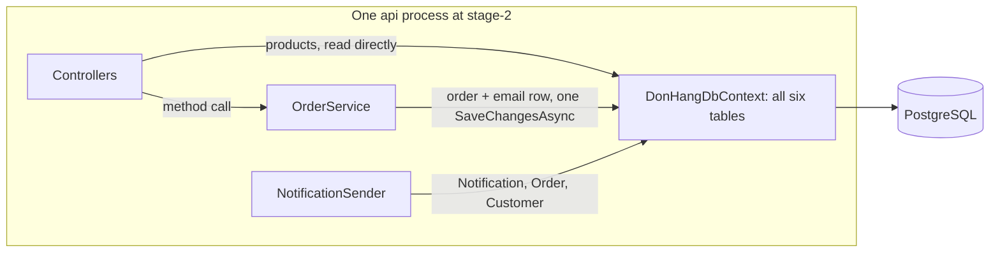

## Before you start

- [[design.l3.contexts-inside-don-hang]] — you know that one reasonable reading of stage-2 finds three bounded contexts, ordering, the product catalogue and notifications, with a boundary that exists only in words.
- [[design.l2.clean-architecture]] — you know that Clean Architecture separates HTTP, rules and data access, and keeps every dependency pointing toward the business rules.
- [[backend.l2.hosted-services]] — you know that `NotificationSender` is a hosted service: the host starts it with the app and runs it in the same process, beside the requests.

## The situation

The email job keeps growing: retries, backoff, a queue in the `notifications` table. In a planning meeting a teammate says: "Notifications should be a service of its own. Our monolith is the problem."

You open the code to see what moving the job would touch. `Program.cs` starts `NotificationSender` in the same process as every endpoint. When an order is placed, its email row is saved by the same `SaveChangesAsync` as the order. And the job finds the customer's address by walking from `Notification` to `Order` to `Customer`.

Is the trouble that Đơn Hàng runs as one process, or something else?

## Core concepts

- **monolith** — an application built and deployed as one unit, with all its parts running in the same process; Đơn Hàng's API at stage-2 is one.
- **modular monolith** — a monolith whose code is split into modules, each owning one bounded context's model and data and offering the other modules only a small public contract.
- module — the part of the code that holds one bounded context: its classes, its tables and the few public types other parts may call.
- a shared model — classes and a `DbContext` that every part of the code can read and change, as `Entities.cs` and `DonHangDbContext` are at stage-2.
- a service, in the teammate's sense — a part split out into its own program, deployed separately and reached over the network.

## How it works



In the situation above, the box, the `api` process, is the monolith. `Program.cs` registers the controllers, `OrderService` and, with `AddHostedService`, `NotificationSender`; one `app.Run()` serves them all. Two things run outside the box: the Flutter app, a client, and the `migrate` container, a one-off step before `api` starts.

Inside the box, parts call each other with ordinary method calls. `OrderService` hands the order to its repository and the email to its notifier, and both land in the same `DonHangDbContext`. One `SaveChangesAsync` then writes the order and its email row together, in one transaction. That is what one process and one database give you, and it is worth keeping while the parts have no reason to be deployed separately.

The arrows into `DonHangDbContext` show the cost. The products controller reads `Products` straight from it, with no service class in between, and that context writes to the one PostgreSQL database. Every part reaches the same context, so every part can read every table. The email job walks into ordering's `Order` for an address, and nothing in the build stops the next notifications class from reading `orders` too.

A modular monolith keeps the one process and draws lines inside it. Each module owns one bounded context's model and tables; other modules may use only the small public part it offers, never its other classes or its rows. Calls between modules stay ordinary method calls; what changes is which calls the code allows.

So the trouble in the situation is not the single process. It is three contexts sharing one model and one `DbContext`, and a second process would not remove that by itself.

## In the Đơn Hàng system

The shared model, in one class:

```csharp file=DonHang.Infrastructure/DonHangDbContext.cs tag=stage-2 lines=6-14
// lesson: backend.l1.efcore-mapping
public sealed class DonHangDbContext(DbContextOptions<DonHangDbContext> options) : DbContext(options)
{
    public DbSet<Customer> Customers => Set<Customer>();
    public DbSet<Product> Products => Set<Product>();
    public DbSet<Order> Orders => Set<Order>();
    public DbSet<OrderItem> OrderItems => Set<OrderItem>();
    public DbSet<Payment> Payments => Set<Payment>();
    public DbSet<Notification> Notifications => Set<Notification>();
```

One class, six `DbSet` properties: ordering's `Customer`, `Order` and `OrderItem`, the catalogue's `Product`, the notifications' `Notification`, and `Payment`, which no service, controller or job uses yet. Any class that receives a `DonHangDbContext` sees all six. The three projects, `DonHang.Api`, `DonHang.Domain` and `DonHang.Infrastructure`, split HTTP, rules and storage, so each project holds a slice of every context. In a modular monolith, each set of tables would belong to one module and be reached by no other.

What one process gives, in `PlaceOrderAsync`:

```csharp file=DonHang.Domain/OrderService.cs tag=stage-2 lines=25-33
        var order = new Order(customerId, items, DateTimeOffset.UtcNow) { IdempotencyKey = idempotencyKey };
        await repository.AddAsync(order);

        // lesson: backend.l2.database-job-queue
        // The notifier only adds a pending email job next to the order; this one
        // SaveChangesAsync then writes both in one transaction, or neither.
        notifier.Send(order, "order placed");
        await repository.SaveChangesAsync();
        return (order, Created: true);
```

`notifier.Send` is an ordinary method call: no network, no waiting for another program to answer. The comment states the second benefit: the order and its pending email job are written "in one transaction, or neither". An order is never saved without its email row, and no email row points at an order that failed to save. A modular monolith keeps the method call; whether two modules should share one transaction is a question for the lessons after this one.

## Seniors often assume…

- **"A monolith is an outdated design that every growing system has to escape by splitting into services."** → Actually a monolith is a choice about deployment: one unit to build, ship and run. It gives method calls instead of network calls, and one transaction over several tables, as in `PlaceOrderAsync`. When a system's parts read each other's data freely, more processes do not stop them from doing so. If notifications moves to its own process and database, its email row can no longer join the order's `SaveChangesAsync`: two separate saves write them. You notice this when a split leaves the order and its email row in two places, and new code has to keep the two in step.
- **"Đơn Hàng already has three projects, so it is already a modular monolith."** → Actually `DonHang.Api`, `DonHang.Domain` and `DonHang.Infrastructure` are layers: each holds part of every context. `Entities.cs` declares the classes of all three contexts, and `DonHangDbContext` maps all their tables. You notice this when a change to email retries, such as a new property on `Notification`, edits `Entities.cs`, and `DonHangDbContext.cs` too, since every `Notification` column there is named with `HasColumnName`: the same files that hold ordering's classes.
- **"Modules inside one process cannot really be kept apart, so boundaries only matter once parts run as separate services."** → Actually the build and the tests can check a boundary inside one process, as the dependency-rule test already fails if `DonHang.Domain` references `DonHang.Infrastructure` or `DonHang.Api`. The reverse also holds: two services that read the same tables are still tangled, now across a network. You notice this when two programs break together after a change to one shared table.

## Try it (3 minutes)

In the root folder of the example repository, in a terminal:

1. Run `git show stage-2:DonHang.Infrastructure/DonHangDbContext.cs`.
2. For each `DbSet` property, write which context it belongs to: ordering, the product catalogue or notifications.
3. In the `modelBuilder.Entity<Notification>` block, find the line that points at a class from another context.

Expected result: six `DbSet` properties. `Customers`, `Orders` and `OrderItems` belong to ordering, `Products` to the catalogue, `Notifications` to notifications, and `Payments` to no context yet. In the `Notification` block, `e.HasOne(n => n.Order).WithMany().HasForeignKey(n => n.OrderId);` links each notification to ordering's `Order`.

<details><summary>Suggested answer</summary>

The file holds every context's tables in one class, so it is the shared model in one place. The `HasOne(n => n.Order)` line is notifications' mapping naming ordering's class: the same crossing that lets `NotificationSender` walk from `Notification` to `Order` to `Customer`. In a modular monolith, notifications would not map ordering's classes at all; replacing this line is the kind of change the next lessons make. Nothing here needs a second process.

</details>

## Connections

- [[design.l3.bounded-context]] — prerequisite idea: each module is drawn around one bounded context.
- [[devops.l1.what-is-deploy]] — the other half of the word: "monolith" describes how an application is deployed.
- [[design.l3.contexts-inside-don-hang]] — the contexts found there are the modules named here; there the boundary existed only in words.
- [[design.l2.clean-architecture]] — a different cut: rings and layers split code by kind of work, modules split it by context.
- [[design.l3.modules-cut-through-layers]] — what comes next: a module holds every layer of one context.

## Five-line summary

1. A modular monolith is deployed as one unit, like any monolith, but its code is split into modules, each owning one context's model and data.
2. At stage-2, every endpoint and `NotificationSender` run in the one process `Program.cs` starts: Đơn Hàng's API is a monolith.
3. One process gives ordinary method calls and one transaction: `PlaceOrderAsync` saves an order and its email row with one `SaveChangesAsync`.
4. Stage-2 is not modular: its three projects are layers, and `Entities.cs` and `DonHangDbContext` hold every context's classes and tables.
5. Being a monolith is a deployment choice; modules address parts reaching freely into each other's data, in one process or many.
