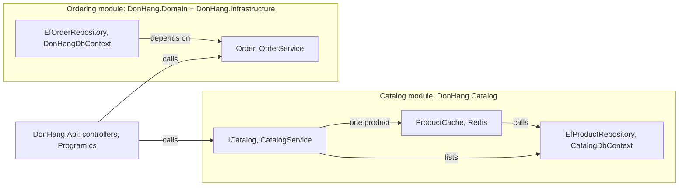

## Before you start

- [[design.l3.modular-monolith]] — you know that a modular monolith keeps one process but splits the code into modules, each owning one bounded context, and that stage-2's three projects are layers, not modules.
- [[design.l3.subdomains]] — you know that ordering is where Đơn Hàng's design effort goes, while the product list is a supporting part that gets something simple.
- [[design.l2.decorator-pattern]] — you know that `ProductCache` wraps `EfProductRepository` behind `IProductRepository`, and that one registration puts it there.

## The situation

At stage-2 you are asked to change how products are stored and cached. You start at `ProductCache` in `DonHang.Infrastructure`, follow its registration to `ServiceCollectionExtensions`, open `EfProductRepository`, then the `Product` class in `DonHang.Domain/Entities.cs` and its mapping in `DonHangDbContext`. Five files in two projects, and three of those files also hold ordering's code.

A teammate who has read about modular monoliths suggests a fourth project, `DonHang.Modules`, to sit above the other three.

Where should the product code go so that a change to the catalogue, the product list, stays in one place?

## Core concepts

- layer — code grouped by the kind of work it does; at stage-2, `DonHang.Api` holds HTTP, `DonHang.Domain` the rules and `DonHang.Infrastructure` the storage, each for every context.
- module — as in the previous lesson, the code that holds one bounded context: its model, its tables and the few public types other code may call.
- a module's share of a layer — the part of the model, the storage or the cache that serves only that module's context, such as `Product`, its mapping and `ProductCache` for the catalogue.
- a module's inside design — how one module arranges its share: in one project or several, with a domain model or with plain queries.

## How it works



In the situation, the five files belonged to two layers, each shared with ordering. Layers split code by kind of work: HTTP, rules, storage. Modules split it by bounded context, and the two cuts cross: a module keeps its own share of each layer below HTTP.

In the diagram, a "calls" arrow is a call at run time; the "depends on" arrow is a project reference, the line in a `.csproj` that lets one project use another project's public classes. Both module boxes run inside the one process that `DonHang.Api`, the host, starts.

The Catalog module is the project `DonHang.Catalog`: `Product`, its mapping in `CatalogDbContext`, `EfProductRepository`, `ProductCache` with its Redis connection, and `CatalogModule`, which registers them all. `DonHang.Api` calls `CatalogService` through `ICatalog`; it lists products from `CatalogDbContext` and reads one through `ProductCache`. A change to how products are stored and cached now opens files in `DonHang.Catalog` alone.

Ordering did not move: `Order` and `OrderService` are in `DonHang.Domain`, `EfOrderRepository` and `DonHangDbContext` in `DonHang.Infrastructure`, which references `DonHang.Domain`. Product code left both projects, and order emails went to `DonHang.Notifications`, a separate program, not a module of this process. What is left in both is ordering's code alone, so together they are the Ordering module. `DonHang.Api` calls `OrderService` directly: `OrdersController` takes the class itself, with no interface. One module can span several projects.

Catalog's `Product` has three properties and no methods; `Order` has methods that guard its status changes. The supporting product list gets something simple; the core ordering keeps its domain model.

The controllers, `ProductsController` among them, are in `DonHang.Api`: here the host is the one project that answers HTTP, and each module starts below it. A module could also hold its own controllers; here they stay in the host.

## In the Đơn Hàng system

The Catalog module's project file:

```xml file=DonHang.Catalog/DonHang.Catalog.csproj tag=stage-3 lines=10-19
  <!-- lesson: design.l3.modules-cut-through-layers -->
  <!-- lesson: design.l3.one-way-module-dependencies -->
  <!-- The Catalog module: products, their table and their Redis cache, all in
       one project. No ProjectReference: Catalog needs nothing from Ordering,
       and ModuleBoundaryTests fails if it ever refers to DonHang.Domain,
       DonHang.Infrastructure or DonHang.Api. -->
  <ItemGroup>
    <PackageReference Include="Npgsql.EntityFrameworkCore.PostgreSQL" />
    <PackageReference Include="StackExchange.Redis" />
  </ItemGroup>
```

The first two comment lines only tag the lessons that cite this file. The two `PackageReference` lines show the cut the comment states; each adds one library to the project. The PostgreSQL provider for EF Core, the package that lets EF Core talk to PostgreSQL, is storage work and `StackExchange.Redis` is cache work, yet both sit in one project because both serve one context. At stage-2 the same two packages were in `DonHang.Infrastructure`, which served every context. There is no `ProjectReference`: Catalog's code builds without any of Ordering's, and the architecture test the comment names, `ModuleBoundaryTests`, keeps it that way.

Where the two modules are registered:

```csharp file=DonHang.Api/Program.cs tag=stage-3 lines=33-39
// lesson: design.l3.modules-cut-through-layers
// Two modules in one process. Catalog registers everything it has itself;
// Ordering is still DonHang.Domain plus DonHang.Infrastructure. Both get the
// same connection string: they share one database, not one another's tables.
builder.Services.AddCatalogModule(connectionString, redisConfiguration);
builder.Services.AddDonHangInfrastructure(connectionString);
builder.Services.AddScoped<OrderService>();
```

`AddCatalogModule` is Catalog's own method, in `CatalogModule.cs` outside this excerpt: it registers `CatalogDbContext`, the Redis connection, `ProductCache` around `EfProductRepository`, and `ICatalog`, the interface other code uses to reach the catalogue (the next lesson's subject). Ordering has no such method: `AddDonHangInfrastructure` registers what `DonHang.Infrastructure` holds, and `OrderService` gets its own line. Both receive the same connection string, the text saying which database to connect to and how; which tables belong to whom is a later lesson.

## Seniors often assume…

- **"A modular monolith adds one more layer, called modules, on top of controllers, services and repositories."** → Actually modules run across the layers, not above them: Catalog holds its own model, storage and cache, and Ordering holds its own. A `DonHang.Modules` project above the other three would leave `Product` in `Entities.cs` and its mapping in `DonHangDbContext`. You notice this when a change meant for one module still edits the shared files beside ordering's classes, as the five-file tour in the situation did.
- **"Every module must have the same inside structure, with the same projects and the same patterns."** → Actually each module can pick the design its subdomain needs, because what modules must share is how they meet, not how they are built inside. Catalog is one project with no domain model; Ordering keeps two projects and the dependency rule that `DependencyRuleTests` checks. Forcing Catalog into Ordering's shape would give it a rules project with no rules: `Product` has no methods to protect. You notice this when a module template asks for a `Domain` project and its only content is a class with three properties.
- **"Moving files into a folder named after a context is enough to make that context a module."** → Actually a folder inside a project changes nothing the compiler checks: every class that could use the moved classes before still can. What made Catalog a module at stage-3 is that its model, mapping, cache and registration left the shared files: `Entities.cs` no longer declares `Product`, and Catalog builds without Ordering's code. You notice this when a `Catalog` folder appears in `DonHang.Infrastructure` and any class can still query `db.Products` on `DonHangDbContext`, as `ProductsController` does.

## Try it (3 minutes)

In the root folder of the example repository, in a terminal:

1. Run `git ls-tree --name-only stage-2 DonHang.Infrastructure/` and mark the files that serve only products.
2. Run `git ls-tree --name-only stage-3 DonHang.Catalog/` and sort its files into model, storage, cache and registration, leaving aside what fits none of them.

Expected result: in step 1, `EfProductRepository.cs` and `ProductCache.cs` sit among ordering's and notifications' files, while `DonHangDbContext.cs` and `ServiceCollectionExtensions.cs` serve every context. In step 2, eleven entries: the model `Product.cs`; storage `CatalogDbContext.cs`, `EfProductRepository.cs` and `IProductRepository.cs`; the cache `ProductCache.cs`; registration `CatalogModule.cs`; and, in none of the four groups, `CatalogService.cs`, `ICatalog.cs`, `CatalogProduct.cs`, the project file and `packages.lock.json`.

<details><summary>Suggested answer</summary>

Step 1 shows the catalogue's share of the storage layer scattered among other contexts' files, with its model in a second project. Step 2 shows the same share, plus the model and the registration, in one list. The HTTP part is missing from both lists: `ProductsController` is in `DonHang.Api` at both tags. `CatalogService.cs` is Catalog's service layer behind `ICatalog`; with no rules to apply, it fits none of the four groups. `ICatalog` and `CatalogProduct`, with `CatalogModule` that registers them, are what code outside Catalog may use, the subject of the next lesson.

</details>

## Connections

- [[design.l1.why-layers]] — the other cut: layers split code by kind of work, and in a modular monolith they live inside each module.
- [[backend.l2.cache-aside]] — the cache that moved: `ProductCache` now lives in the Catalog module, beside the data it caches.
- [[design.l3.modular-monolith]] — prerequisite: there a module was named; here its code finds a home.
- [[design.l2.clean-architecture]] — the dependency rule that Ordering keeps inside its own module.
- [[design.l3.module-contracts]] — what comes next: what code outside Catalog may use.

## Five-line summary

1. A module holds its own model, storage and cache, a share of each layer below HTTP; layers split code by kind of work.
2. At stage-2, changing how products are stored and cached touched five files in two projects shared with ordering.
3. At stage-3 `DonHang.Catalog` holds `Product`, its table mapping, `ProductCache` and `CatalogModule`, which registers them all.
4. Ordering stayed in `DonHang.Domain` and `DonHang.Infrastructure`: one module can span several projects.
5. Each module picks its inside design: Catalog has no domain model, Ordering keeps `Order` and the dependency rule.
