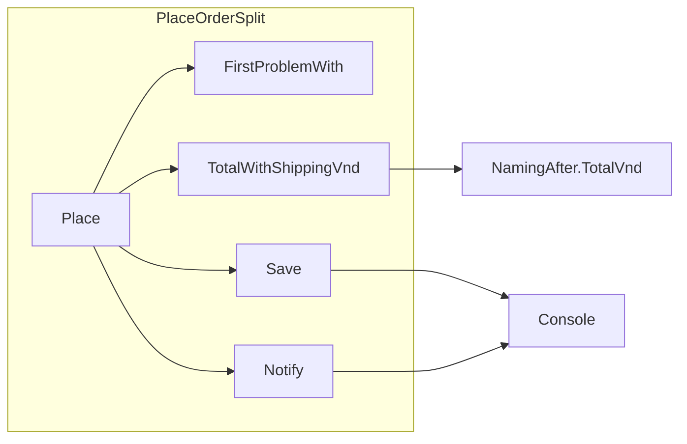

## Before you start

- [[design.l1.why-design-matters]] — you know `PlaceOrderLong.Place` holds four reasons to change in one method body, and that a discount edit reached the shipping fee through the shared `totalVnd`.

## The situation

A teammate has already split `PlaceOrderLong` into `PlaceOrderSplit`: a short `Place` that calls four private methods, one per job. The code review says "much better — this fixes the design." Then the shop asks for the order total to appear in the customer's email. You open `PlaceOrderSplit` expecting to touch one small method, and find you must also change `Place`. A week later the loyalty discount drops from 10% to 5%, the edit happens in a different file, and the shipping fee in `PlaceOrderSplit` changes anyway for some loyal customers. If the split fixed the design, why do changes still land here — and now arrive from outside too?

## Core concepts

- **cohesion** — how closely the things inside one unit (a method, a class) belong to the same job; a unit where every line serves one job has high cohesion.
- **coupling** — how much one unit knows about, or depends on, another; two units are tightly coupled when a change to one is likely to force a change in the other.
- unit — here, a method or a class: the piece of code you are measuring.

## How it works



Cohesion looks inside one unit and asks: do these lines belong together? `TotalWithShippingVnd` has high cohesion — every line in it serves one job, working out a total. `PlaceOrderLong.Place` had low cohesion: checking, pricing, saving and notifying all lived in one body.

Coupling looks between units and asks: if this one changes, must that one change too? In the diagram, each arrow is a place where one unit relies on another. `Place` calls all four private methods, so it depends on each one's name and parameters, and on the results of `FirstProblemWith` and `TotalWithShippingVnd`. `TotalWithShippingVnd` relies on `NamingAfter.TotalVnd`, a method in another class, and on what that result means — the lines added up with the discount already taken off. `Save` and `Notify` both rely on `Console`, which is where their output goes.

The two measurements can disagree. Each method in `PlaceOrderSplit` does one focused job: high cohesion at the method level. The class as a whole still holds all four jobs, which is low cohesion at the class level, and its `Place` still has an arrow to each of them, which is coupling. Splitting raised the cohesion of each method; it did not reduce what `Place` depends on — `Place` now calls each job by name, and pricing now depends on another class, `NamingAfter`. High cohesion and low coupling usually both make a change cheaper, but you have to check each one separately.

## In the Đơn Hàng system

`Place` in `PlaceOrderSplit` now reads like a list of the four jobs:

```csharp file=samples/DonHang.Samples/Samples/Clean/PlaceOrderSplit.cs tag=stage-0 lines=6-16
    public static string Place(int customerId, List<OrderLine> lines, bool customerIsLoyal)
    {
        var problem = FirstProblemWith(customerId, lines);
        if (problem is not null) return problem;

        var totalVnd = TotalWithShippingVnd(lines, customerIsLoyal);
        Save(customerId, totalVnd);
        Notify(customerId);

        return $"order placed, total {totalVnd}";
    }
```

`FirstProblemWith` checks the input and returns a message for the first problem it finds, or `null`. Each job has a name, and the only thing that passes between them is what each call takes and returns. That is a real improvement over `PlaceOrderLong`, where the discount and fee rules both changed the one variable `totalVnd`, and the saving line read it. But `Place` names all four methods and decides what each receives. `Notify` receives only `customerId`, so putting the total in the email means changing `Notify` and the line in `Place` that calls it — two methods for one change.

The last three methods:

```csharp file=samples/DonHang.Samples/Samples/Clean/PlaceOrderSplit.cs tag=stage-0 lines=27-37
    private static int TotalWithShippingVnd(List<OrderLine> lines, bool customerIsLoyal)
    {
        var totalVnd = NamingAfter.TotalVnd(lines, customerIsLoyal);
        return totalVnd + (totalVnd >= 2_000_000 ? 0 : 30_000);
    }

    private static void Save(int customerId, int totalVnd) =>
        Console.WriteLine($"saving order for customer {customerId}, total {totalVnd}");

    private static void Notify(int customerId) =>
        Console.WriteLine($"sending an email to customer {customerId}");
```

`TotalWithShippingVnd` gets its starting total from `NamingAfter.TotalVnd`, in `NamingAfter.cs`. That method adds up the lines and takes `LoyaltyDiscountPercent` off for a loyal customer; the percentage is a constant, `10`, inside `NamingAfter`. So the discount rule lives in another class, but the fee here is still decided from the total that rule produces. Change `10` to `5` in `NamingAfter`, and the fee in `PlaceOrderSplit` can change without any edit to this file.

## Beginners often think…

- **"Coupling and cohesion are the same idea, described from two directions."** → Actually they measure different things: cohesion looks at what is inside one unit, coupling at how units depend on each other. Every method in `PlaceOrderSplit` does one job, yet its fee still moves when `NamingAfter` changes. You notice this when a class that looks tidy inside keeps changing because of edits made somewhere else.
- **"Splitting one long method into private methods in the same class, the way `PlaceOrderSplit` does, already fixes both its coupling and its cohesion problem."** → Actually the split raised each method's cohesion, but the class still holds all four jobs, and `Place` still depends on every one of them. You notice this when one new requirement — the total in the email — still means editing two methods of the same class.

## Try it (3 minutes)

Read the two code blocks above. For each change, list every method you would have to edit, and in which file.

1. The email must include the order total.
2. The loyalty discount becomes 5% instead of 10%.

Expected result: change 1 edits `Notify` (new parameter, new text) and `Place` (pass `totalVnd` to it), both in `PlaceOrderSplit.cs`. Change 2 edits only the constant `LoyaltyDiscountPercent` in `NamingAfter.cs` — yet for a loyal customer ordering two items at 1,100,000 VND, `PlaceOrderSplit.Place` goes from `order placed, total 2010000` to `order placed, total 2090000`, because the fee stops applying.

Which change shows coupling between methods of one class, and which shows coupling between classes?

<details><summary>Suggested answer</summary>

Change 1 stays inside one class but still touches two methods, because `Place` decides what `Notify` receives: `Place` is coupled to `Notify`'s parameters. Change 2 is edited in one file and changes the result of another: `PlaceOrderSplit` depends on what `NamingAfter.TotalVnd` returns, so the two classes are coupled even though neither mentions the other's rules.

</details>

## Connections

- [[design.l1.why-design-matters]] — the same fee-follows-discount effect, now crossing from one class to another instead of staying inside one method.
- [[foundation.l1.small-functions]] — where `PlaceOrderSplit` was first introduced, as the short-functions version of `PlaceOrderLong`.
- [[design.l1.solid-srp]] — the next lesson, which takes on the problem this split left in place: one class with four reasons to change.

## Five-line summary

1. Cohesion measures how closely the things inside one unit belong to the same job.
2. Coupling measures how much one unit depends on another, so that a change to one is likely to force a change in the other.
3. They are different measurements: every method can be focused while the class around them still depends on many things.
4. `PlaceOrderSplit` gave each job its own method, raising cohesion, but `Place` still depends on all four.
5. Its fee still reads the discounted total from `NamingAfter.TotalVnd`, so a discount edit in another file reaches it.
