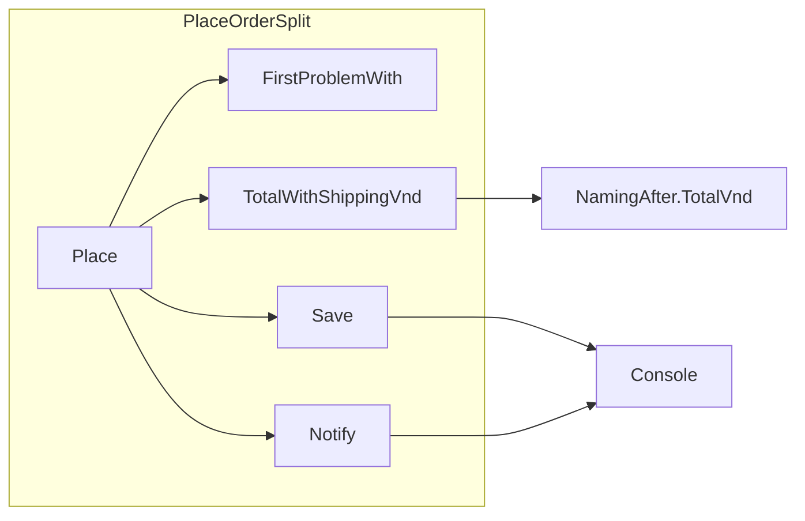

## Bạn cần biết trước

- [[design.l1.why-design-matters]] — bạn biết `PlaceOrderLong.Place` chứa bốn lý do để thay đổi trong một thân method, và một lần sửa giảm giá đã lan tới phí giao hàng qua biến dùng chung `totalVnd`.

## Tình huống

Một đồng nghiệp đã tách `PlaceOrderLong` thành `PlaceOrderSplit`: một `Place` ngắn gọi bốn method private, mỗi method một việc. Code review ghi "tốt hơn nhiều — thế là thiết kế ổn rồi." Rồi cửa hàng muốn tổng tiền của order xuất hiện trong email gửi khách. Bạn mở `PlaceOrderSplit`, tưởng chỉ phải đụng vào một method nhỏ, và thấy mình phải sửa cả `Place`. Một tuần sau, giảm giá cho khách thân thiết giảm từ 10% xuống 5%, chỗ sửa nằm ở một file khác, vậy mà phí giao hàng trong `PlaceOrderSplit` vẫn đổi với một số khách thân thiết. Nếu việc tách đã sửa được thiết kế, sao thay đổi vẫn rơi vào đây — mà giờ còn đến từ bên ngoài nữa?

## Khái niệm cốt lõi

- **cohesion** — mức các phần bên trong một đơn vị (một method, một class) cùng thuộc về một việc; đơn vị mà mọi dòng đều phục vụ một việc thì có cohesion cao.
- **coupling** — mức một đơn vị biết về, hay phụ thuộc vào, một đơn vị khác; hai đơn vị coupling chặt khi thay đổi ở cái này nhiều khả năng buộc cái kia phải đổi theo.
- đơn vị — ở đây là một method hoặc một class: phần code mà bạn đang đo.

## Cơ chế hoạt động



Cohesion nhìn vào bên trong một đơn vị và hỏi: các dòng này có thuộc về nhau không? `TotalWithShippingVnd` có cohesion cao — mọi dòng trong nó phục vụ một việc là tính ra tổng tiền. `PlaceOrderLong.Place` thì cohesion thấp: kiểm tra, tính giá, lưu và báo cho khách đều nằm trong một thân method.

Coupling nhìn vào giữa các đơn vị và hỏi: nếu cái này đổi, cái kia có phải đổi theo không? Trong sơ đồ, mỗi mũi tên là một chỗ một đơn vị dựa vào đơn vị khác. `Place` gọi cả bốn method private, nên nó phụ thuộc vào tên và tham số của từng method, và vào kết quả của `FirstProblemWith` và `TotalWithShippingVnd`. `TotalWithShippingVnd` dựa vào `NamingAfter.TotalVnd`, một method ở class khác, và vào ý nghĩa của kết quả đó — tổng các dòng đã trừ sẵn giảm giá. `Save` và `Notify` đều dựa vào `Console`, nơi output của chúng được đưa ra.

Cohesion và coupling có thể cho kết quả khác nhau. Mỗi method trong `PlaceOrderSplit` làm một việc tập trung: cohesion cao ở mức method. Class nhìn tổng thể vẫn giữ cả bốn việc, tức cohesion thấp ở mức class, và `Place` của nó vẫn có mũi tên tới từng việc, tức là coupling. Việc tách làm tăng cohesion của từng method; nó không làm giảm những gì `Place` phụ thuộc vào — `Place` giờ gọi từng việc theo tên, và phần tính giá giờ phụ thuộc vào một class khác, `NamingAfter`. Cohesion cao và coupling thấp thường đều làm thay đổi rẻ hơn, nhưng bạn phải kiểm tra riêng từng cái.

## Trong hệ thống Đơn Hàng

`Place` trong `PlaceOrderSplit` giờ đọc như một danh sách bốn việc:

```csharp file=samples/DonHang.Samples/Samples/Clean/PlaceOrderSplit.cs tag=stage-0 lines=6-16
    public static string Place(int customerId, List<OrderLine> lines, bool customerIsLoyal)
    {
        var problem = FirstProblemWith(customerId, lines);
        if (problem is not null) return problem;

        var totalVnd = TotalWithShippingVnd(lines, customerIsLoyal);
        Save(customerId, totalVnd);
        Notify(customerId);

        return $"order placed, total {totalVnd}";
    }
```

`FirstProblemWith` kiểm tra đầu vào và trả về thông báo cho vấn đề đầu tiên nó gặp, hoặc `null`. Mỗi việc có một cái tên, và thứ duy nhất đi qua lại giữa chúng là những gì mỗi lời gọi nhận vào và trả ra. Đó là một cải thiện thật so với `PlaceOrderLong`, nơi quy tắc giảm giá và quy tắc phí cùng sửa một biến `totalVnd`, còn dòng lưu thì đọc nó. Nhưng `Place` gọi tên cả bốn method và quyết định mỗi method nhận gì. `Notify` chỉ nhận `customerId`, nên đưa tổng tiền vào email nghĩa là phải sửa `Notify` và dòng trong `Place` gọi nó — hai method cho một thay đổi.

Ba method cuối:

```csharp file=samples/DonHang.Samples/Samples/Clean/PlaceOrderSplit.cs tag=stage-0 lines=27-37
    private static int TotalWithShippingVnd(List<OrderLine> lines, bool customerIsLoyal)
    {
        var totalVnd = NamingAfter.TotalVnd(lines, customerIsLoyal);
        return totalVnd + (totalVnd >= 2_000_000 ? 0 : 30_000);
    }

    private static void Save(int customerId, int totalVnd) =>
        Console.WriteLine($"saving order for customer {customerId}, total {totalVnd}");

    private static void Notify(int customerId) =>
        Console.WriteLine($"sending an email to customer {customerId}");
```

`TotalWithShippingVnd` lấy tổng ban đầu từ `NamingAfter.TotalVnd`, trong `NamingAfter.cs`. Method đó cộng các dòng và trừ `LoyaltyDiscountPercent` cho khách thân thiết; tỷ lệ này là một hằng số, `10`, nằm trong `NamingAfter`. Vậy là quy tắc giảm giá nằm ở một class khác, nhưng phí ở đây vẫn được quyết định từ tổng mà quy tắc đó tạo ra. Đổi `10` thành `5` trong `NamingAfter`, và phí trong `PlaceOrderSplit` có thể đổi mà không cần sửa gì ở file này.

## Người mới hay nghĩ rằng…

- **"Coupling và cohesion là cùng một ý, chỉ được mô tả từ hai phía."** → Thực ra chúng đo những thứ khác nhau: cohesion nhìn vào những gì bên trong một đơn vị, coupling nhìn vào cách các đơn vị phụ thuộc nhau. Mọi method trong `PlaceOrderSplit` đều làm một việc, vậy mà phí vẫn đổi khi `NamingAfter` đổi. Bạn sẽ nhận ra khi một class trông gọn gàng bên trong mà cứ phải đổi vì những chỗ sửa ở nơi khác.
- **"Tách một method dài thành các method private trong cùng class, như `PlaceOrderSplit` đã làm, là đã giải quyết cả vấn đề coupling lẫn cohesion."** → Thực ra việc tách làm tăng cohesion của từng method, nhưng class vẫn giữ cả bốn việc, và `Place` vẫn phụ thuộc vào từng việc một. Bạn sẽ nhận ra khi một yêu cầu mới — tổng tiền trong email — vẫn đồng nghĩa với việc sửa hai method của cùng một class.

## Thử ngay (3 phút)

Đọc hai khối code ở trên. Với mỗi thay đổi, liệt kê mọi method bạn sẽ phải sửa, và nằm ở file nào.

1. Email phải có tổng tiền của order.
2. Giảm giá cho khách thân thiết thành 5% thay vì 10%.

Kết quả mong đợi: thay đổi 1 sửa `Notify` (thêm tham số, đổi nội dung) và `Place` (truyền `totalVnd` cho nó), cả hai trong `PlaceOrderSplit.cs`. Thay đổi 2 chỉ sửa hằng số `LoyaltyDiscountPercent` trong `NamingAfter.cs` — vậy mà với một khách thân thiết đặt số lượng 2, mỗi món 1.100.000 VND, `PlaceOrderSplit.Place` chuyển từ `order placed, total 2010000` sang `order placed, total 2090000`, vì phí không còn được tính.

Thay đổi nào cho thấy coupling giữa các method trong một class, và thay đổi nào cho thấy coupling giữa các class?

<details><summary>Gợi ý đáp án</summary>

Thay đổi 1 nằm gọn trong một class nhưng vẫn đụng tới hai method, vì `Place` quyết định `Notify` nhận gì: `Place` coupling với tham số của `Notify`. Thay đổi 2 được sửa ở một file mà làm đổi kết quả của file khác: `PlaceOrderSplit` phụ thuộc vào thứ `NamingAfter.TotalVnd` trả về, nên hai class coupling với nhau dù không class nào nhắc tới quy tắc của class kia.

</details>

## Liên hệ

- [[design.l1.why-design-matters]] — vẫn là hiệu ứng phí đi theo giảm giá, giờ vượt từ class này sang class khác thay vì chỉ nằm trong một method.
- [[foundation.l1.small-functions]] — nơi `PlaceOrderSplit` được giới thiệu lần đầu, như phiên bản hàm ngắn của `PlaceOrderLong`.
- [[design.l1.solid-srp]] — bài tiếp theo, xử lý vấn đề mà việc tách này còn để lại: một class với bốn lý do để thay đổi.

## Tóm tắt 5 dòng

1. Cohesion đo mức các phần bên trong một đơn vị cùng thuộc về một việc.
2. Coupling đo mức một đơn vị phụ thuộc vào đơn vị khác, để thay đổi ở cái này nhiều khả năng buộc cái kia đổi theo.
3. Đây là hai phép đo khác nhau: mọi method có thể tập trung trong khi class bao quanh vẫn phụ thuộc vào nhiều thứ.
4. `PlaceOrderSplit` cho mỗi việc một method riêng, làm tăng cohesion, nhưng `Place` vẫn phụ thuộc vào cả bốn.
5. Phí của nó vẫn đọc tổng đã giảm từ `NamingAfter.TotalVnd`, nên một chỗ sửa giảm giá ở file khác vẫn lan tới nó.
