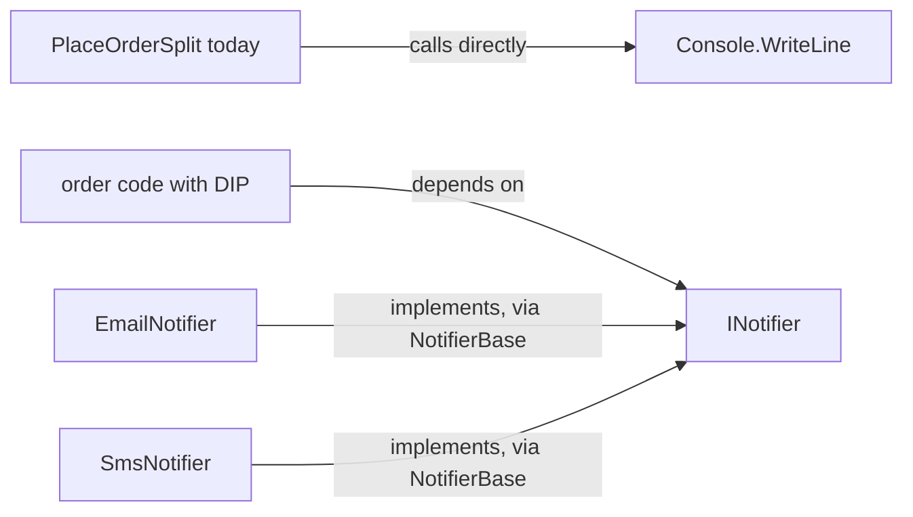

## Before you start

- [[design.l1.solid-isp]] — you know `INotifier` has a single method, `Send`, and that `EmailNotifier` and `SmsNotifier` implement it through `NotifierBase`.

## The situation

The shop decides order confirmations should go out by SMS instead of email. The samples already have `SmsNotifier`, ready to use. But `PlaceOrderSplit`, the code that places an order, does not use any notifier: its `Notify` method writes "sending an email" straight to the console. To switch channels you have to open the order-placing class and edit it, even though nothing about placing an order has changed. Why does a choice about how to send a message live inside the code that decides how an order is placed?

## Core concepts

- **Dependency Inversion Principle (DIP)** — high-level code should depend on an abstraction, not on a concrete, low-level implementation.
- high-level code — code that decides the steps of a business task, like `PlaceOrderSplit.Place`: check, price, save, notify.
- low-level code — code that does one concrete job, like printing a line to the console or sending an SMS.
- abstraction — an interface or abstract class that says what is done without saying how, like `INotifier`.

## How it works



In the top row, the high-level code points straight at a low-level detail. `PlaceOrderSplit` knows exactly how a customer is told: one console line about an email. Every change to that detail — another channel, other wording — is an edit to the order-placing class.

In the rows below, the high-level code depends only on `INotifier`: "send a message about this order". It does not know whether email, SMS or something newer answers that. The concrete classes depend on `INotifier` too: implementing it means they must match exactly what it declares, so a change to it reaches them. Before, the arrow ran from the order code to the low-level detail; now the low-level classes have arrows to an abstraction shaped by what the order code needs. That turn in direction is the "inversion": both sides depend on the abstraction, and the high-level code no longer depends on any concrete notifier.

Using an interface is not enough by itself. If the order code wrote `new EmailNotifier()` inside itself, it would be tied to `EmailNotifier` again, whatever type its variable had — the tight coupling from the coupling lesson. With DIP, the order code receives an `INotifier`, for example as a constructor parameter, and something outside it decides which concrete class to pass. Then it can be given `EmailNotifier`, `SmsNotifier`, or a class written next year, and its own source does not change.

## In the Đơn Hàng system

In `PlaceOrderSplit` today, `Place` — the high-level steps — ends by calling these two methods:

```csharp file=samples/DonHang.Samples/Samples/Clean/PlaceOrderSplit.cs tag=stage-0 lines=33-37
    private static void Save(int customerId, int totalVnd) =>
        Console.WriteLine($"saving order for customer {customerId}, total {totalVnd}");

    private static void Notify(int customerId) =>
        Console.WriteLine($"sending an email to customer {customerId}");
```

Here the high-level class reaches straight into a low-level detail. `Save` does it for saving; this lesson follows `Notify`, which depends on `Console.WriteLine` with the word "email" written into the text. Nothing in `PlaceOrderSplit` mentions `INotifier`. So switching to SMS means editing this line, inside the class whose job is placing orders.

The abstraction the samples already have:

```csharp file=samples/DonHang.Samples/Samples/Oop/INotifier.cs tag=stage-0 lines=5-8
public interface INotifier
{
    void Send(int orderId, string subject);
}
```

`EmailNotifier` and `SmsNotifier` implement it through `NotifierBase`, each writing its own message format. Order code that held an `INotifier` and called `Send` would never need to know which of them it had. Today no order code does that — in the samples, the only class that refers to `INotifier` is `NotifierBase`, which implements it. The abstraction exists; the high-level code simply does not depend on it yet.

## Beginners often think…

- **"Dependency Inversion just means using interfaces somewhere in the codebase."** → Actually what matters is what the high-level code depends on. The samples already contain `INotifier`, yet `PlaceOrderSplit` still calls `Console.WriteLine` directly, so the interface changes nothing for it. You notice this when a project has interfaces for everything but changing a channel still means editing business code.
- **"Dependency Inversion is just a way of creating objects and handing them to the classes that need them."** → Actually DIP is about direction: the high-level code should know only the abstraction. How the concrete object gets to it — created in one place and passed in — is a separate mechanism, the subject of the next module. You notice this when code receives its notifier from outside but its parameter is typed `EmailNotifier`: the object is handed in, yet the order code still depends on one concrete class.

## Try it (3 minutes)

For each change, decide whether the source of the order-placing code must be edited, (a) with `PlaceOrderSplit` as it is today, and (b) with order code that receives an `INotifier` and calls `Send`.

1. Send confirmations by SMS instead of email.
2. Add a new push-notification channel.
3. Change the fixed wording every email starts with.

Expected result: (a) all three edit the order-placing code, because `Notify` holds the channel and the wording. (b) none of them do: 1 passes `SmsNotifier` instead of `EmailNotifier`; 2 writes a new class that implements `INotifier` and passes that; 3 edits the fixed format in `EmailNotifier` (the subject text itself is still whatever the order code passes to `Send`).

In (b), where do the three edits land, and what does the order code still know?

<details><summary>Suggested answer</summary>

They land in low-level code or in the place that chooses which notifier to pass: a different object for 1, a new class for 2, `EmailNotifier`'s format for 3. The order code still knows only that it can send a message about an order through `INotifier` — which is all it needs to know.

</details>

## Connections

- [[design.l1.solid-isp]] — `INotifier` is small enough that depending on it costs the order code nothing it does not use.
- [[design.l1.coupling-and-cohesion]] — writing `new EmailNotifier()` inside the order code would bring back the tight coupling that lesson measured.
- [[design.l1.solid-srp]] — moving the channel choice out of `PlaceOrderSplit` takes one of its four reasons to change away from it.

## Five-line summary

1. The Dependency Inversion Principle says high-level code should depend on an abstraction, not on a concrete low-level class.
2. `PlaceOrderSplit.Notify` calls `Console.WriteLine` directly, so any change of channel or wording edits the order-placing class.
3. With DIP, order code depends on `INotifier`, and `EmailNotifier` and `SmsNotifier` point up at that same abstraction.
4. Writing `new EmailNotifier()` inside the order code ties it to one concrete class again, interface or not.
5. DIP is about which way the dependency points; how the concrete object is passed in is a separate mechanism.
