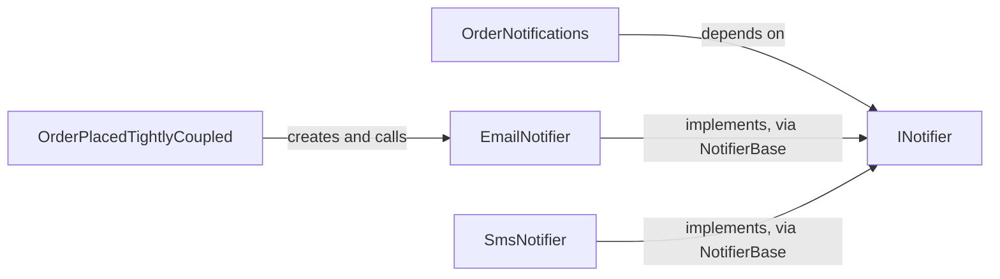

## Before you start

- [[design.l1.solid-isp]] — you know `INotifier` has a single method, `Send`, and that `EmailNotifier` and `SmsNotifier` implement it through `NotifierBase`.

## The situation

The shop decides order confirmations should go out by SMS instead of email. The samples already have `SmsNotifier`, ready to use. But `OrderPlacedTightlyCoupled`, the class that sends the "order placed" message, creates its own `EmailNotifier` in a field. To switch channels you have to open that class and edit it, even though nothing about when to notify has changed. Its neighbour in the same file, `OrderNotifications`, does the same job and would not need a single edit. What is the difference?

## Core concepts

- **Dependency Inversion Principle (DIP)** — high-level code should depend on an abstraction, not on a concrete, low-level implementation.
- high-level code — code that decides the steps or policy of a business task, like "when an order is placed, notify the customer".
- low-level code — code that does one concrete job, like writing an email line or sending an SMS.
- abstraction — an interface or abstract class that says what is done without saying how, like `INotifier`.

## How it works



In the top arrow, the high-level code points straight at a low-level class. `OrderPlacedTightlyCoupled` knows exactly how a customer is told: by an `EmailNotifier` it creates itself. Every change to that detail — another channel, a stand-in for a test — is an edit to this class.

In the other arrows, `OrderNotifications` depends only on `INotifier`: "send a message about this order". It does not know whether email, SMS or something newer answers that. The concrete classes depend on `INotifier` too: implementing it means providing every method it declares. So if `Send` changed, `NotifierBase` — which implements it for `EmailNotifier` and `SmsNotifier` — would have to change too. Before, the arrow ran from the high-level code to the concrete class; now the concrete classes have arrows to the abstraction the high-level code uses. That turn in direction is the "inversion": both sides depend on the abstraction, and the high-level code no longer depends on any concrete notifier.

`OrderNotifications` receives its `INotifier` as a constructor parameter, and something outside it decides which concrete class to pass. Then it can be given `EmailNotifier`, `SmsNotifier`, or a class written next year, and its own source does not change. Merely using an interface is not enough: code that stored `new EmailNotifier()` in an `INotifier` field of its own would still be tied to `EmailNotifier`.

## In the Đơn Hàng system

Both versions sit in one file of the samples:

```csharp file=samples/DonHang.Samples/Samples/Design/OrderNotifications.cs tag=stage-1 lines=9-23
public sealed class OrderPlacedTightlyCoupled
{
    private readonly EmailNotifier notifier = new();

    public void Handle(int orderId) => notifier.Send(orderId, "order placed");
}

// lesson: design.l1.dependency-injection-intro
// Same job, but this caller depends on INotifier — the abstraction both
// EmailNotifier and SmsNotifier already implement (Samples/Oop/NotifierBase.cs).
// Any INotifier works here, including a fake one in a test.
public sealed class OrderNotifications(INotifier notifier)
{
    public void Handle(int orderId) => notifier.Send(orderId, "order placed");
}
```

The `// lesson:` comment only marks where a later lesson picks `OrderNotifications` up again. The two `Handle` methods are identical. The only difference is where the notifier comes from and what type it has: `OrderPlacedTightlyCoupled` names `EmailNotifier` and creates it; `OrderNotifications` names only `INotifier` and receives one.

The real API follows the same rule. `OrderService`, in the `DonHang.Domain` project, places orders and then notifies:

```csharp file=DonHang.Domain/OrderService.cs tag=stage-1 lines=6-23
public sealed class OrderService(IOrderRepository repository, INotifier notifier)
{
    public async Task<Order> PlaceOrderAsync(int customerId, List<OrderItem> items)
    {
        if (items.Count == 0) throw new ArgumentException("an order needs at least one item");

        var order = new Order
        {
            CustomerId = customerId,
            PlacedAt = DateTimeOffset.UtcNow,
            Status = "new",
            Items = items,
        };
        await repository.AddAsync(order);
        await repository.SaveChangesAsync();
        notifier.Send(order.Id, "order placed");
        return order;
    }
```

`OrderService` asks for an `INotifier` in its constructor and calls `notifier.Send` — it never names a concrete notifier. Its other constructor parameter, `IOrderRepository`, is an interface for storing orders; this lesson follows only the notifier.

This `INotifier` is declared in `DonHang.Domain` itself. It is a separate interface from the samples' `INotifier`, with the same single `Send` method; the samples' `EmailNotifier` implements the samples' one, so it cannot be passed to `OrderService`. The API's concrete class is `LoggingNotifier`, in the `DonHang.Infrastructure` project: it implements the Domain's `INotifier` by writing a log line instead of sending a real message.

`DonHang.Infrastructure` references `DonHang.Domain`, not the other way round: the project with the concrete notifier depends on the project that owns the abstraction, and `DonHang.Domain` references no other project at all. Because the abstraction lives next to the code that uses it, the code that places orders never needs to know that logging, email or SMS exists.


## Beginners often think…

- **"Dependency Inversion just means using interfaces somewhere in the codebase."** → Actually what matters is what the high-level code depends on. The samples contain `INotifier`, yet `OrderPlacedTightlyCoupled` still depends on `EmailNotifier`, so the interface changes nothing for it. You notice this when a project has interfaces for everything but changing a channel still means editing business code.
- **"Dependency Inversion is just a way of creating objects and handing them to the classes that need them."** → Actually DIP is about direction: the high-level code should know only the abstraction. How the concrete object gets to it — created in one place and passed in — is a separate mechanism, covered later in the dependency-injection module. You notice this when code receives its notifier from outside but its parameter is typed `EmailNotifier`: the object is handed in, yet the code still depends on one concrete class.

## Try it (3 minutes)

For each change, decide whether the source of the class must be edited, (a) for `OrderPlacedTightlyCoupled` and (b) for `OrderNotifications`.

1. Send the message by SMS instead of email.
2. Use a stand-in notifier in a test, so no real message goes out.
3. Add a new push-notification channel.

Expected result: (a) all three edit `OrderPlacedTightlyCoupled`, because its field is typed and created as `EmailNotifier`. (b) none of them edit `OrderNotifications`: 1 passes a `SmsNotifier`; 2 passes any class that implements `INotifier`; 3 writes a new class that implements `INotifier` and passes that.

In (b), where do the edits land, and what does `OrderNotifications` still know?

<details><summary>Suggested answer</summary>

They land in the place that chooses which notifier to pass, or in a new low-level class. `OrderNotifications` still knows only that it can send a message about an order through `INotifier` — which is all it needs to know, and exactly what `OrderService` knows in the real API.

</details>

## Connections

- [[design.l1.solid-isp]] — `INotifier` is small enough that depending on it costs the caller nothing it does not use.
- [[design.l1.coupling-and-cohesion]] — a high-level class that creates its own `EmailNotifier` is tightly coupled in that lesson's sense: switching the channel forces a change in that class.
- [[design.l1.solid-srp]] — moving the channel choice out of a class takes one of its reasons to change away from it.

## Five-line summary

1. The Dependency Inversion Principle says high-level code should depend on an abstraction, not on a concrete low-level class.
2. `OrderPlacedTightlyCoupled` creates its own `EmailNotifier`, so any change of channel edits that class.
3. `OrderNotifications` and the API's `OrderService` each receive an `INotifier` of their own project and never name a concrete notifier.
4. In the API, `LoggingNotifier` lives in `DonHang.Infrastructure`, which depends on `DonHang.Domain`, where `INotifier` is declared.
5. DIP is about which way the dependency points; how the concrete object is passed in is a separate mechanism.
