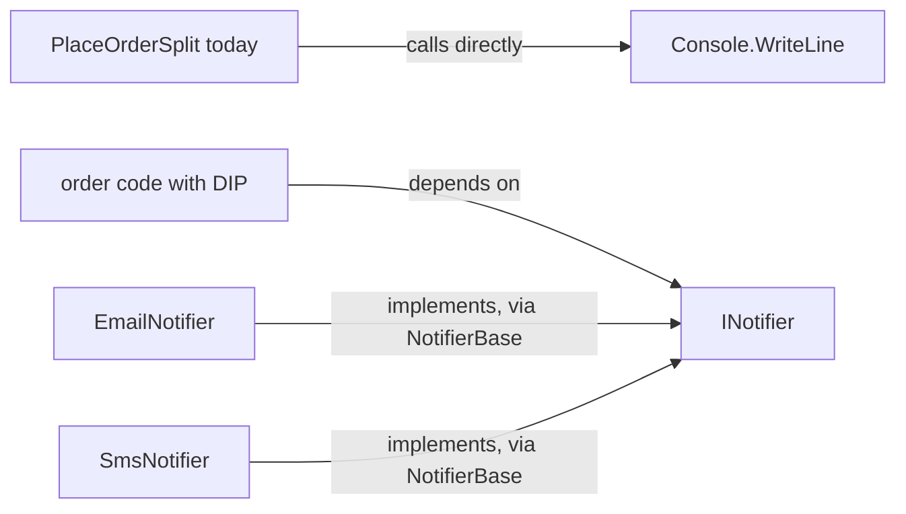

## Bạn cần biết trước

- [[design.l1.solid-isp]] — bạn biết `INotifier` chỉ có một method, `Send`, và `EmailNotifier` cùng `SmsNotifier` cài đặt nó thông qua `NotifierBase`.

## Tình huống

Cửa hàng quyết định tin xác nhận order sẽ gửi bằng SMS thay vì email. Samples đã có sẵn `SmsNotifier`, dùng được ngay. Nhưng `PlaceOrderSplit`, đoạn code đặt order, không dùng notifier nào: method `Notify` của nó ghi thẳng "sending an email" ra console. Muốn đổi kênh, bạn phải mở class đặt order và sửa nó, dù chẳng có gì trong việc đặt order thay đổi. Vì sao một lựa chọn về cách gửi tin lại nằm bên trong đoạn code quyết định cách đặt một order?

## Khái niệm cốt lõi

- **Dependency Inversion Principle (DIP)** — code tầng cao nên phụ thuộc vào một abstraction, không phụ thuộc vào một cài đặt cụ thể ở tầng thấp.
- code tầng cao — code quyết định các bước của một việc nghiệp vụ, như `PlaceOrderSplit.Place`: kiểm tra, tính giá, lưu, báo khách.
- code tầng thấp — code làm một việc cụ thể, như in một dòng ra console hay gửi một tin SMS.
- abstraction — một interface hoặc abstract class nói việc gì được làm mà không nói làm thế nào, như `INotifier`.

## Cơ chế hoạt động



Ở hàng trên cùng, code tầng cao trỏ thẳng vào một chi tiết tầng thấp. `PlaceOrderSplit` biết chính xác khách được báo thế nào: một dòng console về một email. Mọi thay đổi ở chi tiết đó — kênh khác, câu chữ khác — đều là sửa class đặt order.

Ở các hàng bên dưới, code tầng cao chỉ phụ thuộc vào `INotifier`: "gửi một tin nhắn về order này". Nó không biết email, SMS hay thứ gì mới hơn sẽ trả lời yêu cầu đó. Các class cụ thể cũng phụ thuộc vào `INotifier`: cài đặt nó nghĩa là phải có mọi method nó khai báo, nên nếu `Send` đổi thì `NotifierBase` — và kéo theo `EmailNotifier` với `SmsNotifier` — cũng phải đổi. Trước đây mũi tên chạy từ code đặt order tới chi tiết tầng thấp; giờ các class tầng thấp có mũi tên tới abstraction mà code đặt order dùng. Sự đổi hướng đó chính là "inversion" (đảo ngược): cả hai phía đều phụ thuộc vào abstraction, và code tầng cao không còn phụ thuộc vào notifier cụ thể nào.

Chỉ dùng interface thôi thì chưa đủ. Nếu code đặt order tự viết `new EmailNotifier()` bên trong, nó lại bị buộc vào `EmailNotifier`, dù biến có kiểu gì — đúng kiểu coupling chặt ở bài coupling. Với DIP, code đặt order nhận một `INotifier`, chẳng hạn qua tham số constructor, và một thứ bên ngoài nó quyết định đưa class cụ thể nào vào. Khi đó nó có thể nhận `EmailNotifier`, `SmsNotifier`, hay một class viết năm sau, mà source của chính nó không đổi.

## Trong hệ thống Đơn Hàng

Trong `PlaceOrderSplit` hiện giờ, `Place` — các bước tầng cao — kiểm tra order, tính giá, rồi gọi hai method này:

```csharp file=samples/DonHang.Samples/Samples/Clean/PlaceOrderSplit.cs tag=stage-0 lines=33-37
    private static void Save(int customerId, int totalVnd) =>
        Console.WriteLine($"saving order for customer {customerId}, total {totalVnd}");

    private static void Notify(int customerId) =>
        Console.WriteLine($"sending an email to customer {customerId}");
```

Ở đây class tầng cao với thẳng vào một chi tiết tầng thấp. `Save` làm vậy cho việc lưu; bài này theo dõi `Notify`, method phụ thuộc vào `Console.WriteLine` với chữ "email" viết cứng trong nội dung. Không có gì trong `PlaceOrderSplit` nhắc tới `INotifier`. Vì thế chuyển sang SMS nghĩa là sửa dòng này, bên trong class có nhiệm vụ đặt order.

Abstraction mà samples đã có:

```csharp file=samples/DonHang.Samples/Samples/Oop/INotifier.cs tag=stage-0 lines=5-8
public interface INotifier
{
    void Send(int orderId, string subject);
}
```

`EmailNotifier` và `SmsNotifier` cài đặt nó thông qua `NotifierBase`, mỗi class viết định dạng tin nhắn riêng. Code đặt order nào giữ một `INotifier` và gọi `Send` sẽ không bao giờ cần biết mình đang có class nào. Hiện giờ chưa code đặt order nào làm vậy — trong samples, class duy nhất nhắc tới `INotifier` là `NotifierBase`, class cài đặt nó. Abstraction đã có; chỉ là code tầng cao chưa phụ thuộc vào nó.

## Người mới hay nghĩ rằng…

- **"Dependency Inversion chỉ có nghĩa là dùng interface ở đâu đó trong codebase."** → Thực ra điều quan trọng là code tầng cao phụ thuộc vào cái gì. Samples đã có `INotifier`, vậy mà `PlaceOrderSplit` vẫn gọi thẳng `Console.WriteLine`, nên interface chẳng thay đổi gì với nó. Bạn sẽ nhận ra khi một project có interface cho mọi thứ mà đổi một kênh vẫn phải sửa code nghiệp vụ.
- **"Dependency Inversion chỉ là chuyện tạo object rồi đưa chúng cho những class cần."** → Thực ra DIP nói về hướng: code tầng cao chỉ nên biết abstraction. Object cụ thể đến được với nó bằng cách nào — tạo ở một chỗ rồi truyền vào — là một cơ chế riêng, chủ đề của module tiếp theo. Bạn sẽ nhận ra khi code nhận notifier từ bên ngoài nhưng tham số lại có kiểu `EmailNotifier`: object được đưa vào, vậy mà code đặt order vẫn phụ thuộc vào một class cụ thể.

## Thử ngay (3 phút)

Với mỗi thay đổi, xác định source của code đặt order có phải sửa không, (a) với `PlaceOrderSplit` như hiện giờ, và (b) với code đặt order nhận một `INotifier` và gọi `Send`.

1. Gửi xác nhận bằng SMS thay vì email.
2. Thêm một kênh thông báo đẩy mới.
3. Đổi phần câu chữ cố định mà email nào cũng mở đầu bằng nó.

Kết quả mong đợi: (a) cả ba đều sửa code đặt order, vì `Notify` giữ cả kênh gửi lẫn câu chữ. (b) không cái nào phải sửa: 1 truyền `SmsNotifier` thay cho `EmailNotifier`; 2 viết một class mới cài đặt `INotifier` rồi truyền nó vào; 3 sửa định dạng cố định trong `EmailNotifier` (còn nội dung subject vẫn là thứ code đặt order truyền vào `Send`).

Ở (b), ba chỗ sửa rơi vào đâu, và code đặt order vẫn còn biết những gì?

<details><summary>Gợi ý đáp án</summary>

Chúng rơi vào code tầng thấp hoặc vào nơi chọn notifier nào để truyền: một object khác cho 1, một class mới cho 2, định dạng của `EmailNotifier` cho 3. Code đặt order vẫn chỉ biết rằng nó gửi được tin nhắn về một order qua `INotifier` — và đó là tất cả những gì nó cần biết.

</details>

## Liên hệ

- [[design.l1.solid-isp]] — `INotifier` đủ nhỏ để việc phụ thuộc vào nó không bắt code đặt order mang thứ nó không dùng.
- [[design.l1.coupling-and-cohesion]] — viết `new EmailNotifier()` bên trong code đặt order sẽ mang lại đúng kiểu coupling chặt mà bài đó đã đo.
- [[design.l1.solid-srp]] — đưa lựa chọn kênh ra khỏi `PlaceOrderSplit` là bớt đi một trong bốn lý do để thay đổi của nó.

## Tóm tắt 5 dòng

1. Dependency Inversion Principle nói code tầng cao nên phụ thuộc vào abstraction, không phụ thuộc vào một class tầng thấp cụ thể.
2. `PlaceOrderSplit.Notify` gọi thẳng `Console.WriteLine`, nên mọi thay đổi về kênh hay câu chữ đều sửa class đặt order.
3. Với DIP, code đặt order phụ thuộc vào `INotifier`, và `EmailNotifier` cùng `SmsNotifier` cũng phụ thuộc vào chính abstraction đó.
4. Viết `new EmailNotifier()` bên trong code đặt order lại buộc nó vào một class cụ thể, có interface hay không cũng vậy.
5. DIP nói về hướng của sự phụ thuộc; cách object cụ thể được truyền vào là một cơ chế riêng.
