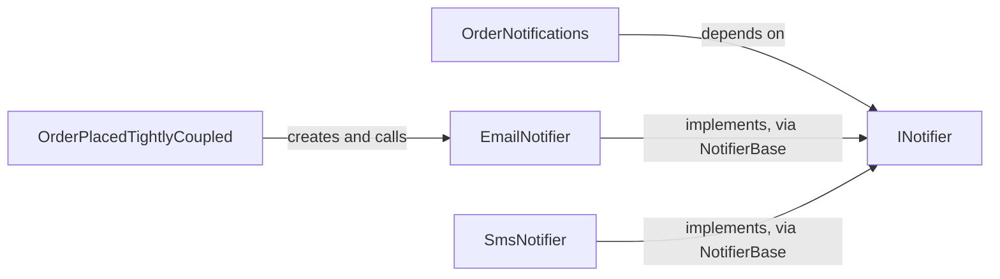

## Bạn cần biết trước

- [[design.l1.solid-isp]] — bạn biết `INotifier` chỉ có một method, `Send`, và `EmailNotifier` cùng `SmsNotifier` cài đặt nó thông qua `NotifierBase`.

## Tình huống

Cửa hàng quyết định tin xác nhận order sẽ gửi bằng SMS thay vì email. Samples đã có sẵn `SmsNotifier`, dùng được ngay. Nhưng `OrderPlacedTightlyCoupled`, class gửi tin "order placed", tự tạo `EmailNotifier` của riêng nó trong một field. Muốn đổi kênh, bạn phải mở class đó ra sửa, dù chẳng có gì trong chuyện khi nào cần báo khách thay đổi. Class nằm ngay cạnh trong cùng file, `OrderNotifications`, làm đúng việc đó mà không cần sửa một dòng nào. Khác nhau ở đâu?

## Khái niệm cốt lõi

- **Dependency Inversion Principle (DIP)** — code tầng cao nên phụ thuộc vào một abstraction, không phụ thuộc vào một cài đặt cụ thể ở tầng thấp.
- code tầng cao — code quyết định các bước hay chính sách của một việc nghiệp vụ, như "khi có order mới, báo cho khách".
- code tầng thấp — code làm một việc cụ thể, như ghi một dòng email hay gửi một tin SMS.
- abstraction — một interface hoặc abstract class nói việc gì được làm mà không nói làm thế nào, như `INotifier`.

## Cơ chế hoạt động



Ở mũi tên trên cùng, code tầng cao trỏ thẳng vào một class tầng thấp. `OrderPlacedTightlyCoupled` biết chính xác khách được báo thế nào: bằng một `EmailNotifier` mà nó tự tạo. Mọi thay đổi ở chi tiết đó — kênh khác, một bản thay thế để test — đều là sửa class này.

Ở các mũi tên còn lại, `OrderNotifications` chỉ phụ thuộc vào `INotifier`: "gửi một tin nhắn về order này". Nó không biết email, SMS hay thứ gì mới hơn sẽ trả lời yêu cầu đó. Các class cụ thể cũng phụ thuộc vào `INotifier`: cài đặt nó nghĩa là phải có mọi method nó khai báo. Vì vậy nếu `Send` đổi, `NotifierBase` — class cài đặt nó cho `EmailNotifier` và `SmsNotifier` — cũng phải đổi. Trước đây mũi tên chạy từ code tầng cao tới class cụ thể; giờ các class cụ thể có mũi tên tới abstraction mà code tầng cao dùng. Sự đổi hướng đó chính là "inversion" (đảo ngược): cả hai phía đều phụ thuộc vào abstraction, và code tầng cao không còn phụ thuộc vào notifier cụ thể nào.

`OrderNotifications` nhận `INotifier` qua tham số constructor, và một thứ bên ngoài nó quyết định đưa class cụ thể nào vào. Khi đó nó có thể nhận `EmailNotifier`, `SmsNotifier`, hay một class viết năm sau, mà source của chính nó không đổi. Chỉ dùng interface thôi thì chưa đủ: code tự lưu `new EmailNotifier()` vào một field `INotifier` của mình vẫn bị buộc vào `EmailNotifier`.

## Trong hệ thống Đơn Hàng

Cả hai phiên bản nằm trong cùng một file của samples:

```csharp file=samples/DonHang.Samples/Samples/Design/OrderNotifications.cs tag=stage-1 lines=9-23
public sealed class OrderPlacedTightlyCoupled
{
    private readonly EmailNotifier notifier = new();

    public void Handle(int orderId) => notifier.Send(orderId, "order placed");
}

// lesson: design.l1.dependency-injection-intro
// Same job, but this caller depends on INotifier — the abstraction both
// EmailNotifier and SmsNotifier already implement (Samples/Oop/NotifierBase.cs).
// Any INotifier works here, including a fake one in a test.
public sealed class OrderNotifications(INotifier notifier)
{
    public void Handle(int orderId) => notifier.Send(orderId, "order placed");
}
```

Comment `// lesson:` chỉ đánh dấu chỗ một bài sau sẽ quay lại với `OrderNotifications`. Hai method `Handle` giống hệt nhau. Khác biệt duy nhất là notifier đến từ đâu và có kiểu gì: `OrderPlacedTightlyCoupled` gọi tên `EmailNotifier` và tự tạo nó; `OrderNotifications` chỉ gọi tên `INotifier` và nhận nó từ bên ngoài.

API thật cũng theo đúng quy tắc này. `OrderService`, trong project `DonHang.Domain`, đặt order rồi báo khách:

```csharp file=DonHang.Domain/OrderService.cs tag=stage-1 lines=6-23
public sealed class OrderService(IOrderRepository repository, INotifier notifier)
{
    public async Task<Order> PlaceOrderAsync(int customerId, List<OrderItem> items)
    {
        if (items.Count == 0) throw new ArgumentException("an order needs at least one item");

        var order = new Order
        {
            CustomerId = customerId,
            PlacedAt = DateTimeOffset.UtcNow,
            Status = "new",
            Items = items,
        };
        await repository.AddAsync(order);
        await repository.SaveChangesAsync();
        notifier.Send(order.Id, "order placed");
        return order;
    }
```

`OrderService` đòi một `INotifier` trong constructor và gọi `notifier.Send` — nó không bao giờ gọi tên một notifier cụ thể. Tham số constructor còn lại của nó, `IOrderRepository`, là một interface để lưu order; bài này chỉ theo dõi phần notifier.

`INotifier` này được khai báo ngay trong `DonHang.Domain`. Nó là một interface riêng, khác với `INotifier` của samples, dù cũng chỉ có một method `Send`; `EmailNotifier` của samples cài đặt interface của samples, nên không thể đưa cho `OrderService`. Class cụ thể của API là `LoggingNotifier`, trong project `DonHang.Infrastructure`: nó cài đặt `INotifier` của Domain bằng cách ghi một dòng log thay vì gửi tin thật.

`DonHang.Infrastructure` tham chiếu `DonHang.Domain`, không phải chiều ngược lại: project chứa notifier cụ thể phụ thuộc vào project sở hữu abstraction, còn `DonHang.Domain` không tham chiếu project nào khác. Vì abstraction nằm cạnh code dùng nó, code đặt order không bao giờ cần biết log, email hay SMS tồn tại.

## Người mới hay nghĩ rằng…

- **"Dependency Inversion chỉ có nghĩa là dùng interface ở đâu đó trong codebase."** → Thực ra điều quan trọng là code tầng cao phụ thuộc vào cái gì. Samples có `INotifier`, vậy mà `OrderPlacedTightlyCoupled` vẫn phụ thuộc vào `EmailNotifier`, nên interface chẳng thay đổi gì với nó. Bạn sẽ nhận ra khi một project có interface cho mọi thứ mà đổi một kênh vẫn phải sửa code nghiệp vụ.
- **"Dependency Inversion chỉ là chuyện tạo object rồi đưa chúng cho những class cần."** → Thực ra DIP nói về hướng: code tầng cao chỉ nên biết abstraction. Object cụ thể đến được với nó bằng cách nào — tạo ở một chỗ rồi truyền vào — là một cơ chế riêng, sẽ học sau ở module dependency-injection. Bạn sẽ nhận ra khi code nhận notifier từ bên ngoài nhưng tham số lại có kiểu `EmailNotifier`: object được đưa vào, vậy mà code vẫn phụ thuộc vào một class cụ thể.

## Thử ngay (3 phút)

Với mỗi thay đổi, xác định source của class có phải sửa không, (a) với `OrderPlacedTightlyCoupled` và (b) với `OrderNotifications`.

1. Gửi tin bằng SMS thay vì email.
2. Dùng một notifier thay thế trong test, để không có tin thật nào được gửi đi.
3. Thêm một kênh thông báo đẩy mới.

Kết quả mong đợi: (a) cả ba đều sửa `OrderPlacedTightlyCoupled`, vì field của nó có kiểu và được tạo là `EmailNotifier`. (b) không cái nào sửa `OrderNotifications`: 1 truyền một `SmsNotifier`; 2 truyền bất kỳ class nào cài đặt `INotifier`; 3 viết một class mới cài đặt `INotifier` rồi truyền nó vào.

Ở (b), các chỗ sửa rơi vào đâu, và `OrderNotifications` vẫn còn biết những gì?

<details><summary>Gợi ý đáp án</summary>

Chúng rơi vào nơi chọn notifier nào để truyền, hoặc vào một class tầng thấp mới. `OrderNotifications` vẫn chỉ biết rằng nó gửi được tin nhắn về một order qua `INotifier` — đó là tất cả những gì nó cần biết, và cũng đúng là những gì `OrderService` biết trong API thật.

</details>

## Liên hệ

- [[design.l1.solid-isp]] — `INotifier` đủ nhỏ để việc phụ thuộc vào nó không bắt chỗ gọi mang thứ nó không dùng.
- [[design.l1.coupling-and-cohesion]] — một class tầng cao tự tạo `EmailNotifier` là coupling chặt theo đúng nghĩa của bài đó: đổi kênh buộc phải sửa class ấy.
- [[design.l1.solid-srp]] — đưa lựa chọn kênh ra khỏi một class là bớt đi một lý do để thay đổi của nó.

## Tóm tắt 5 dòng

1. Dependency Inversion Principle nói code tầng cao nên phụ thuộc vào abstraction, không phụ thuộc vào một class tầng thấp cụ thể.
2. `OrderPlacedTightlyCoupled` tự tạo `EmailNotifier`, nên mọi lần đổi kênh đều phải sửa class đó.
3. `OrderNotifications` và `OrderService` của API mỗi class nhận một `INotifier` của project mình và không bao giờ gọi tên notifier cụ thể.
4. Trong API, `LoggingNotifier` nằm ở `DonHang.Infrastructure`, project phụ thuộc vào `DonHang.Domain`, nơi khai báo `INotifier`.
5. DIP nói về hướng của sự phụ thuộc; cách object cụ thể được truyền vào là một cơ chế riêng.
