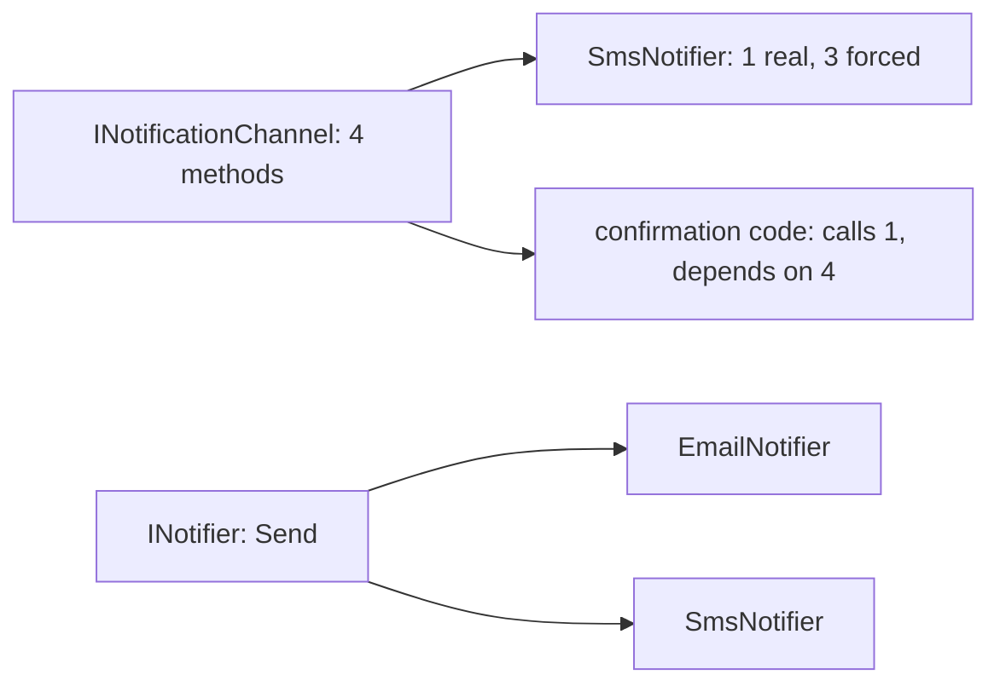

## Before you start

- [[design.l1.solid-lsp]] — you know every class behind a base type must keep that type's promise, so callers never have to check which one they got.

## The situation

A teammate wants every notification channel to "look the same", so they propose one interface, `INotificationChannel`, with four methods: `SendEmail`, `SendSms`, `SendPush` and `GetDeliveryReport`. Then they try to make `SmsNotifier` implement it. It can send an SMS, but what should its `SendEmail` do? Its `SendPush`, or its `GetDeliveryReport`, when nothing in the samples tracks delivery at all? And the code that sends an order confirmation calls only one of the four, yet now depends on all of them. What went wrong with an interface that looked so complete?

## Core concepts

- **Interface Segregation Principle (ISP)** — no code should be forced to depend on methods it does not use; many small, focused interfaces beat one large one.
- depend on — code depends on an interface when it implements it or calls through it; a change to any method of that interface can reach that code.
- fat interface — an interface with methods that some of its implementers or callers have no use for.

## How it works



A fat interface hurts on two sides. On the implementing side, C# requires a class to provide every member of an interface it implements. `SmsNotifier` has real behaviour for `SendSms` only, so the other three get filler: an empty body, a made-up result, or an exception. An exception there breaks the promise from the LSP lesson: code that holds an `INotificationChannel` may call `SendEmail` and has no way to know this one will fail.

On the calling side, the order confirmation code uses one method but depends on four. If someone changes the parameters of `GetDeliveryReport`, every class that implements the interface has to change, including `SmsNotifier`, even though nothing it does is about delivery reports.

ISP's answer is to cut interfaces along what their users need. Code that sends a message about an order needs one thing: a way to send it. That is exactly what `INotifier` already offers. If delivery reports are ever needed, they belong in a separate interface that only reporting code uses and only classes that can report implement.

## In the Đơn Hàng system

The interface the samples already have:

```csharp file=samples/DonHang.Samples/Samples/Oop/INotifier.cs tag=stage-0 lines=5-8
public interface INotifier
{
    void Send(int orderId, string subject);
}
```

One method. A class that implements `INotifier` promises to send a message about an order, and nothing else. In the samples, `NotifierBase` implements it: it provides `Send`, keeps a list of sent messages, prints each one, and leaves a single step, `Format`, to the classes that derive from it. The two channels fill in only that step:

```csharp file=samples/DonHang.Samples/Samples/Oop/NotifierBase.cs tag=stage-0 lines=21-31
public sealed class EmailNotifier : NotifierBase
{
    protected override string Format(int orderId, string subject) =>
        $"email about order {orderId}: {subject}";
}

public sealed class SmsNotifier : NotifierBase
{
    protected override string Format(int orderId, string subject) =>
        $"sms about order {orderId}: {subject}";
}
```

Neither class carries a method it has no behaviour for. `SmsNotifier` does not know email exists; `EmailNotifier` does not know about SMS. Code that needs to send something asks for an `INotifier` and can be given either one. Compare that with the proposed `INotificationChannel`, where `SmsNotifier` would carry three methods it has no real behaviour for.

## Beginners often think…

- **"A big interface is fine as long as every class implementing it eventually uses every method somewhere."** → Actually ISP asks about each piece of code that depends on the interface, not about the system as a whole. The confirmation code calls one method of `INotificationChannel` and still has to live with changes to the other three. You notice this when a change to a method you never call forces edits in your class anyway.
- **"ISP is only about how many methods an interface has, not about who is forced to depend on it."** → Actually a small count is a symptom, not the goal. An interface with three methods is fine when every caller and every implementer needs all three; `INotificationChannel` is a problem because `SmsNotifier` needs one of its four. You notice this when you find yourself writing filler bodies just to make a class compile.

## Try it (3 minutes)

Take the proposed `INotificationChannel` from the situation, with `SendEmail`, `SendSms`, `SendPush` and `GetDeliveryReport`.

1. List the methods `SmsNotifier` would have real behaviour for, and the ones it would have to fill with something.
2. List the methods the order confirmation code calls, if it sends an SMS.
3. Say which interface in the samples already gives both of them exactly what they need.

Expected result: 1 — real: `SendSms`; filler: `SendEmail`, `SendPush`, `GetDeliveryReport`. 2 — only `SendSms`. 3 — `INotifier`, with its single `Send`, which `SmsNotifier` gets through `NotifierBase`.

If `GetDeliveryReport` later needs a new parameter, which classes must change under each design?

<details><summary>Suggested answer</summary>

With `INotificationChannel`, every implementing class must change, `SmsNotifier` and `EmailNotifier` included, even though neither reports anything. With `INotifier`, nothing changes: delivery reports would live in their own interface, implemented only by classes that can report.

</details>

## Connections

- [[design.l1.solid-lsp]] — filler methods that throw are exactly the broken promise LSP warns about.
- [[foundation.l1.oop-interface-vs-abstract]] — where `INotifier`, `NotifierBase`, `EmailNotifier` and `SmsNotifier` were first introduced.
- [[design.l1.solid-dip]] — the last SOLID principle, about which way the dependency on an interface like `INotifier` should point.

## Five-line summary

1. The Interface Segregation Principle says no code should be forced to depend on methods it does not use.
2. A fat interface makes implementers write filler methods and makes callers depend on methods they never call.
3. Filler that throws also breaks the promise LSP asks every implementation to keep.
4. `INotifier` has one method, `Send`, so `EmailNotifier` and `SmsNotifier` carry only what they really do.
5. Cut interfaces by what each caller and implementer needs, not by a wish for every channel to look the same.
