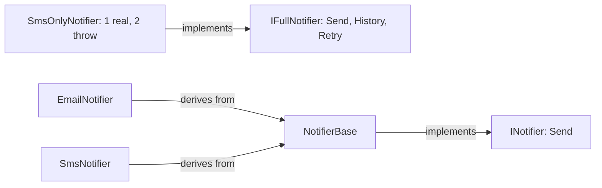

## Before you start

- [[design.l1.solid-lsp]] — you know every class behind a base type must keep that type's promise, so callers never have to check which one they got.

## The situation

The samples have two notifier interfaces: `INotifier` has one method, `Send`; `IFullNotifier` bundles three: `Send`, `History` and `Retry`. `SmsOnlyNotifier` implements `IFullNotifier`, but it only ever sends: it keeps no history and never resends. So its `History` and `Retry` throw `NotSupportedException`, and a support screen that asks any `IFullNotifier` for its `History()` crashes the first time it is handed this one. The class compiles, the interface looks complete, and yet two of its three methods cannot do what they promise. What went wrong?

## Core concepts

- **Interface Segregation Principle (ISP)** — no code should be forced to depend on methods it does not use; when the code that calls or implements an interface needs different parts of it, split it into small, focused interfaces instead of one large one.
- depend on — code depends on an interface when it implements it or calls through it; implementers must change when its methods change, and callers can only be given classes that provide all of it.
- fat interface — an interface with methods that some of its implementers or callers have no use for.

## How it works



In the diagram, the arrow into `IFullNotifier` is the fat design. The other three are the small one: `NotifierBase` implements `INotifier`, and `EmailNotifier` and `SmsNotifier` derive from `NotifierBase`. Both live in the samples today. A fat interface hurts on two sides.

On the implementing side, C# requires `SmsOnlyNotifier` to provide every method `IFullNotifier` declares — all three. `SmsOnlyNotifier` has real behaviour for `Send` only, so the other two get filler: here, a `throw`. And if someone changes the parameters of `Retry`, every class that implements `IFullNotifier` must change, `SmsOnlyNotifier` included, even though it never retries anything.

On the calling side, code that only needs to send a message but asks for an `IFullNotifier` can only be given classes that provide all three methods. A class that can send and nothing else cannot be handed to it without filler. And that filler breaks the promise from the LSP lesson: code that holds an `IFullNotifier` may call `History` and has no way to know this one will throw.

ISP's answer is to cut interfaces along what the code that calls or implements them needs. Code that sends a message about an order needs one thing: a way to send it. That is exactly what `INotifier` offers. If history or retries are needed, they belong in separate interfaces that only the code using them asks for, and only classes that can really keep history or retry implement.

## In the Đơn Hàng system

The fat interface and the class forced to implement it:

```csharp file=samples/DonHang.Samples/Samples/Design/NotifierIspViolation.cs tag=stage-1 lines=7-26
public interface IFullNotifier
{
    void Send(int orderId, string subject);
    IReadOnlyList<string> History();
    void Retry(int orderId);
}

// SmsNotifier only ever sends. It still has to answer for History and Retry —
// neither means anything for a channel that does not keep or resend messages.
public sealed class SmsOnlyNotifier : IFullNotifier
{
    public void Send(int orderId, string subject) =>
        Console.WriteLine($"sms about order {orderId}: {subject}");

    public IReadOnlyList<string> History() =>
        throw new NotSupportedException("this channel keeps no history");

    public void Retry(int orderId) =>
        throw new NotSupportedException("this channel does not retry");
}
```

The comment in the source says `SmsNotifier`, but the class it describes is `SmsOnlyNotifier`. `Send` does real work. `History` and `Retry` exist only because the interface demands them, and both throw `NotSupportedException`. Nothing stops a caller holding an `IFullNotifier` from calling them.

The small interface next to it:

```csharp file=samples/DonHang.Samples/Samples/Oop/INotifier.cs tag=stage-1 lines=5-8
public interface INotifier
{
    void Send(int orderId, string subject);
}
```

One method. A class that implements `INotifier` promises to send a message about an order, and nothing else. In the samples, `NotifierBase` implements it and leaves a single step, `Format`, to `EmailNotifier` and `SmsNotifier`. Neither carries a method it has no behaviour for, and either one can be used wherever an `INotifier` is expected.

## Beginners often think…

- **"A big interface is fine as long as each of its methods is used by some class somewhere."** → Actually ISP asks about each piece of code that depends on the interface, not about the system as a whole. `History` might matter to a channel that keeps messages, but `SmsOnlyNotifier` still has to carry it, and a caller that only sends still asks for all three. You notice this when a class that does exactly what you need cannot be passed in without filler for methods you never call.
- **"ISP is only about how many methods an interface has, not about who is forced to depend on it."** → Actually a small count is a symptom, not the goal. An interface with three methods is fine when every caller and every implementer needs all three; `IFullNotifier` is a problem because `SmsOnlyNotifier` needs one of its three. You notice this when you find yourself writing filler bodies just to make a class compile.

## Try it (3 minutes)

Use the first code block.

1. List the methods `SmsOnlyNotifier` has real behaviour for, and the ones it only fills.
2. What happens when code calls `History()` on a `SmsOnlyNotifier`?
3. Say which interface in the samples already gives a send-only channel exactly what it needs.

Expected result: 1 — real: `Send`; filler: `History`, `Retry`. 2 — it throws `NotSupportedException` with the message `this channel keeps no history`. 3 — `INotifier`, with its single `Send`.

If `Retry` later needs a new parameter, which classes must change under each design?

<details><summary>Suggested answer</summary>

With `IFullNotifier`, every implementing class must change, `SmsOnlyNotifier` included, even though it never retries. With `INotifier`, no class that only sends changes: retries would live in their own interface, implemented only by classes that can really retry.

</details>

## Connections

- [[design.l1.solid-lsp]] — filler methods that throw are exactly the broken promise LSP warns about.
- [[foundation.l1.oop-interface-vs-abstract]] — where `INotifier`, `NotifierBase`, `EmailNotifier` and `SmsNotifier` were first introduced.
- [[design.l1.solid-dip]] — the last SOLID principle, about which way the dependency on an interface like `INotifier` should point.

## Five-line summary

1. The Interface Segregation Principle says no code should be forced to depend on methods it does not use.
2. A fat interface makes implementers write filler methods and makes callers depend on methods they never call.
3. `SmsOnlyNotifier` must implement `History` and `Retry` from `IFullNotifier`, and both just throw `NotSupportedException`.
4. `INotifier` has one method, `Send`, so `EmailNotifier` and `SmsNotifier` carry only what they really do.
5. Cut interfaces by what each caller and implementer needs, not by how many methods they have.
