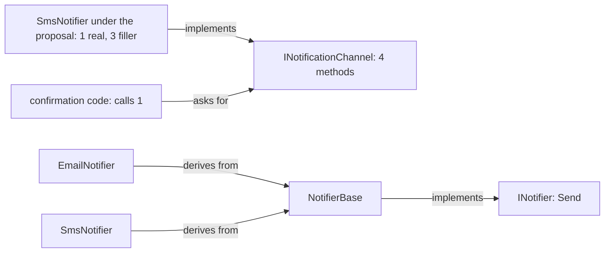

## Bạn cần biết trước

- [[design.l1.solid-lsp]] — bạn biết mọi class đứng sau một kiểu cha đều phải giữ lời hứa của kiểu đó, để chỗ gọi không bao giờ phải kiểm tra mình nhận được class nào.

## Tình huống

Một đồng nghiệp muốn mọi kênh thông báo "trông giống nhau", nên đề xuất một interface duy nhất, `INotificationChannel`, với bốn method: `SendEmail`, `SendSms`, `SendPush` và `GetDeliveryReport`. Rồi họ thử cho `SmsNotifier` cài đặt nó. Nó gửi được SMS, nhưng `SendEmail` của nó nên làm gì? Còn `SendPush`, hay `GetDeliveryReport`, khi không có gì trong samples theo dõi việc tin đã tới nơi hay chưa? Và code gửi xác nhận order — được giả định cho bài này — sẽ chỉ gọi một trong bốn method, vậy mà phụ thuộc vào cả bốn. Một interface trông đầy đủ như vậy thì sai ở đâu?

## Khái niệm cốt lõi

- **Interface Segregation Principle (ISP)** — không code nào nên bị buộc phụ thuộc vào những method nó không dùng; khi code gọi hoặc cài đặt một interface cần những phần khác nhau của nó, hãy tách nó thành các interface nhỏ, tập trung thay vì một interface lớn.
- phụ thuộc vào — code phụ thuộc vào một interface khi nó cài đặt interface đó hoặc gọi qua interface đó; class cài đặt phải đổi khi method của interface đổi, còn chỗ gọi chỉ nhận được những class cung cấp đủ mọi thứ trong interface.
- interface quá lớn — interface có những method mà một vài class cài đặt hoặc chỗ gọi của nó không dùng tới.

## Cơ chế hoạt động



Trong sơ đồ, hai mũi tên đi vào `INotificationChannel` là đề xuất; ba mũi tên quanh `INotifier` và `NotifierBase` là thứ samples đang có. Một interface quá lớn gây hại ở hai phía.

Ở phía cài đặt, C# đòi một class phải có mọi method mà interface khai báo, trừ những method interface đã cho sẵn thân — và cả bốn method này đều không có. `SmsNotifier` chỉ có hành vi thật cho `SendSms`, nên ba method kia phải lấp chỗ: một thân rỗng, một kết quả bịa ra, hoặc một exception. Và nếu ai đó đổi tham số của `GetDeliveryReport`, mọi class cài đặt đều phải đổi, kể cả `SmsNotifier`, dù nó chẳng làm gì liên quan tới báo cáo gửi tin.

Ở phía gọi, code gửi xác nhận order chỉ dùng một method nhưng lại đòi một `INotificationChannel`, nên nó chỉ nhận được những class có đủ cả bốn method. Một class chỉ biết gửi SMS và không gì khác thì không thể đưa cho nó nếu không lấp chỗ. Nếu phần lấp chỗ đó throw, lời hứa ở bài LSP bị phá: code đang giữ một `INotificationChannel` có thể gọi `SendEmail` mà không có cách nào biết class này sẽ hỏng.

Câu trả lời của ISP là cắt interface theo đúng thứ mà code gọi hoặc cài đặt nó cần. Code gửi tin nhắn về một order chỉ cần một thứ: cách để gửi nó. Đó chính xác là thứ `INotifier` cung cấp, và `EmailNotifier` và `SmsNotifier` cài đặt nó thông qua `NotifierBase`. Nếu sau này cần báo cáo gửi tin, chúng thuộc về một interface riêng mà chỉ code làm báo cáo dùng và chỉ những class biết báo cáo cài đặt.

## Trong hệ thống Đơn Hàng

Interface mà samples đã có:

```csharp file=samples/DonHang.Samples/Samples/Oop/INotifier.cs tag=stage-0 lines=5-8
public interface INotifier
{
    void Send(int orderId, string subject);
}
```

Một method. Class cài đặt `INotifier` hứa gửi một tin nhắn về một order, ngoài ra không gì khác. Trong samples, `NotifierBase` cài đặt nó: cung cấp `Send`, giữ danh sách tin đã gửi, in ra từng tin, và để lại đúng một bước, `Format`, cho các class kế thừa nó. Hai kênh chỉ điền vào bước đó:

```csharp file=samples/DonHang.Samples/Samples/Oop/NotifierBase.cs tag=stage-0 lines=21-31
public sealed class EmailNotifier : NotifierBase
{
    protected override string Format(int orderId, string subject) =>
        $"email about order {orderId}: {subject}";
}

public sealed class SmsNotifier : NotifierBase
{
    protected override string Format(int orderId, string subject) =>
        $"sms about order {orderId}: {subject}";
}
```

Không class nào mang một method mà nó không có hành vi thật. `SmsNotifier` không biết email tồn tại; `EmailNotifier` không biết gì về SMS. Cả hai đều là `INotifier`, nên class nào cũng dùng được ở bất kỳ chỗ nào cần một `INotifier`. Hãy so với `INotificationChannel` được đề xuất, nơi `SmsNotifier` sẽ phải mang ba method mà nó không có hành vi thật.

## Người mới hay nghĩ rằng…

- **"Một interface lớn vẫn ổn, miễn là rốt cuộc mọi class cài đặt nó đều dùng mọi method ở đâu đó."** → Thực ra, kể cả khi method nào cũng được một class nào đó dùng tới, ISP vẫn xét từng đoạn code phụ thuộc vào interface, không xét cả hệ thống. Code gửi xác nhận order gọi một method của `INotificationChannel`, vậy mà chỉ nhận được những class cài đặt đủ cả bốn. Bạn sẽ nhận ra khi một class làm đúng thứ bạn cần lại không thể đưa vào nếu không lấp chỗ cho những method bạn chẳng bao giờ gọi.
- **"ISP chỉ nói về số method của interface, không nói về ai bị buộc phải phụ thuộc vào nó."** → Thực ra ít method là một triệu chứng, không phải mục tiêu. Một interface có ba method vẫn ổn khi mọi chỗ gọi và mọi class cài đặt đều cần cả ba; `INotificationChannel` có vấn đề vì `SmsNotifier` chỉ cần một trong bốn. Bạn sẽ nhận ra khi thấy mình viết những thân method lấp chỗ chỉ để class compile được.

## Thử ngay (3 phút)

Lấy `INotificationChannel` được đề xuất trong tình huống, với `SendEmail`, `SendSms`, `SendPush` và `GetDeliveryReport`.

1. Liệt kê các method mà `SmsNotifier` có hành vi thật, và các method nó phải lấp bằng thứ gì đó.
2. Liệt kê các method mà code gửi xác nhận order gọi, nếu nó gửi SMS.
3. Chỉ ra interface nào trong samples đã cho cả hai đúng thứ chúng cần.

Kết quả mong đợi: 1 — thật: `SendSms`; lấp chỗ: `SendEmail`, `SendPush`, `GetDeliveryReport`. 2 — chỉ `SendSms`. 3 — `INotifier`, với một method `Send` duy nhất, mà `SmsNotifier` có được qua `NotifierBase`.

Nếu sau này `GetDeliveryReport` cần thêm một tham số, với mỗi thiết kế thì những class nào phải đổi?

<details><summary>Gợi ý đáp án</summary>

Với `INotificationChannel`, mọi class cài đặt đều phải đổi, kể cả `SmsNotifier` và `EmailNotifier`, dù không class nào báo cáo gì. Với `INotifier`, không gì phải đổi: báo cáo gửi tin sẽ nằm trong interface riêng, chỉ những class biết báo cáo mới cài đặt.

</details>

## Liên hệ

- [[design.l1.solid-lsp]] — method lấp chỗ mà throw chính là lời hứa bị phá mà LSP cảnh báo.
- [[foundation.l1.oop-interface-vs-abstract]] — nơi `INotifier`, `NotifierBase`, `EmailNotifier` và `SmsNotifier` được giới thiệu lần đầu.
- [[design.l1.solid-dip]] — nguyên tắc SOLID cuối cùng, về việc sự phụ thuộc vào một interface như `INotifier` nên hướng về phía nào.

## Tóm tắt 5 dòng

1. Interface Segregation Principle nói không code nào nên bị buộc phụ thuộc vào những method nó không dùng.
2. Interface quá lớn bắt class cài đặt viết method lấp chỗ và bắt chỗ gọi phụ thuộc vào method nó không bao giờ gọi.
3. Phần lấp chỗ mà throw còn phá lời hứa mà LSP yêu cầu mọi cài đặt phải giữ.
4. `INotifier` có một method, `Send`, nên `EmailNotifier` và `SmsNotifier` chỉ mang đúng thứ chúng thật sự làm.
5. Hãy cắt interface theo thứ mà mỗi chỗ gọi và mỗi class cài đặt cần, không theo mong muốn mọi kênh trông giống nhau.
