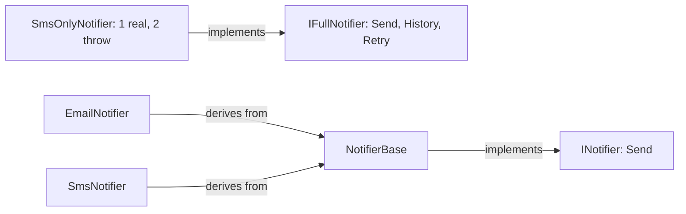

## Bạn cần biết trước

- [[design.l1.solid-lsp]] — bạn biết mọi class đứng sau một kiểu cha đều phải giữ lời hứa của kiểu đó, để chỗ gọi không bao giờ phải kiểm tra mình nhận được class nào.

## Tình huống

Samples có hai interface notifier: `INotifier` có một method, `Send`; `IFullNotifier` gộp ba: `Send`, `History` và `Retry`. `SmsOnlyNotifier` cài đặt `IFullNotifier`, nhưng nó chỉ biết gửi: nó không lưu lịch sử và không bao giờ gửi lại. Vì thế `History` và `Retry` của nó throw `NotSupportedException`, và một màn hình hỗ trợ hỏi `History()` của bất kỳ `IFullNotifier` nào sẽ nhận `NotSupportedException` ngay lần đầu được đưa class này. Class compile được, interface trông đầy đủ, vậy mà hai trong ba method của nó không làm được điều chúng hứa. Sai ở đâu?

## Khái niệm cốt lõi

- **Interface Segregation Principle (ISP)** — không code nào nên bị buộc phụ thuộc vào những method nó không dùng; khi code gọi hoặc cài đặt một interface cần những phần khác nhau của nó, hãy tách nó thành các interface nhỏ, tập trung thay vì một interface lớn.
- phụ thuộc vào — code phụ thuộc vào một interface khi nó cài đặt interface đó hoặc gọi qua interface đó; class cài đặt phải đổi khi method của interface đổi, còn chỗ gọi chỉ nhận được những class cung cấp đủ mọi thứ trong interface.
- interface quá lớn — interface có những method mà một vài class cài đặt hoặc chỗ gọi của nó không dùng tới.

## Cơ chế hoạt động



Trong sơ đồ, mũi tên đi vào `IFullNotifier` là thiết kế interface quá lớn. Ba mũi tên còn lại là thiết kế nhỏ: `NotifierBase` cài đặt `INotifier`, còn `EmailNotifier` và `SmsNotifier` kế thừa `NotifierBase`. Cả hai thiết kế đều đang có trong samples. Một interface quá lớn gây hại ở hai phía.

Ở phía cài đặt, C# đòi `SmsOnlyNotifier` phải có mọi method mà `IFullNotifier` khai báo — cả ba. `SmsOnlyNotifier` chỉ có hành vi thật cho `Send`, nên hai method kia phải lấp chỗ: ở đây là một lệnh `throw`. Và nếu ai đó đổi tham số của `Retry`, mọi class cài đặt `IFullNotifier` đều phải đổi, kể cả `SmsOnlyNotifier`, dù nó chẳng bao giờ gửi lại gì.

Ở phía gọi, code chỉ cần gửi tin nhắn mà lại đòi một `IFullNotifier` thì chỉ nhận được những class có đủ cả ba method. Một class chỉ biết gửi và không gì khác thì không thể đưa cho nó nếu không lấp chỗ. Và phần lấp chỗ đó phá lời hứa ở bài LSP: code đang giữ một `IFullNotifier` có thể gọi `History` mà không có cách nào biết class này sẽ throw.

Câu trả lời của ISP là cắt interface theo đúng thứ mà code gọi hoặc cài đặt nó cần. Code gửi tin nhắn về một order chỉ cần một thứ: cách để gửi nó. Đó chính xác là thứ `INotifier` cung cấp. Nếu cần lịch sử hay gửi lại, chúng thuộc về những interface riêng mà chỉ code dùng tới mới đòi, và chỉ những class thật sự lưu lịch sử hay gửi lại được mới cài đặt.

## Trong hệ thống Đơn Hàng

Interface quá lớn và class bị buộc phải cài đặt nó:

```csharp file=samples/DonHang.Samples/Samples/Design/NotifierIspViolation.cs tag=stage-1 lines=7-26
public interface IFullNotifier
{
    void Send(int orderId, string subject);
    IReadOnlyList<string> History();
    void Retry(int orderId);
}

// SmsNotifier only ever sends. It still has to answer for History and Retry —
// neither means anything for a channel that does not keep or resend messages.
public sealed class SmsOnlyNotifier : IFullNotifier
{
    public void Send(int orderId, string subject) =>
        Console.WriteLine($"sms about order {orderId}: {subject}");

    public IReadOnlyList<string> History() =>
        throw new NotSupportedException("this channel keeps no history");

    public void Retry(int orderId) =>
        throw new NotSupportedException("this channel does not retry");
}
```

Comment trong source ghi `SmsNotifier`, nhưng class nó mô tả là `SmsOnlyNotifier`. `Send` làm việc thật. `History` và `Retry` tồn tại chỉ vì interface đòi hỏi, và cả hai đều throw `NotSupportedException`. Không gì ngăn một chỗ gọi đang giữ `IFullNotifier` gọi tới chúng.

Interface nhỏ nằm ngay cạnh:

```csharp file=samples/DonHang.Samples/Samples/Oop/INotifier.cs tag=stage-1 lines=5-8
public interface INotifier
{
    void Send(int orderId, string subject);
}
```

Một method. Class cài đặt `INotifier` hứa gửi một tin nhắn về một order, ngoài ra không gì khác. Trong samples, `NotifierBase` cài đặt nó và để lại đúng một bước, `Format`, cho `EmailNotifier` và `SmsNotifier`. Không class nào mang một method mà nó không có hành vi thật, và class nào cũng dùng được ở bất kỳ chỗ nào cần một `INotifier`.

## Người mới hay nghĩ rằng…

- **"Một interface lớn vẫn ổn, miễn là method nào của nó cũng được một class nào đó dùng tới."** → Thực ra ISP xét từng đoạn code phụ thuộc vào interface, không xét cả hệ thống. `History` có thể có ý nghĩa với một kênh có lưu tin, nhưng `SmsOnlyNotifier` vẫn phải mang nó, và một chỗ gọi chỉ cần gửi vẫn đòi đủ cả ba. Bạn sẽ nhận ra khi một class làm đúng thứ bạn cần lại không thể đưa vào nếu không lấp chỗ cho những method bạn chẳng bao giờ gọi.
- **"ISP chỉ nói về số method của interface, không nói về ai bị buộc phải phụ thuộc vào nó."** → Thực ra ít method thường là kết quả, không phải mục tiêu. Một interface có ba method vẫn ổn khi mọi chỗ gọi và mọi class cài đặt đều cần cả ba; `IFullNotifier` có vấn đề vì `SmsOnlyNotifier` chỉ cần một trong ba. Bạn sẽ nhận ra khi thấy mình viết những thân method lấp chỗ chỉ để class compile được.

## Thử ngay (3 phút)

Dùng khối code đầu tiên.

1. Liệt kê các method mà `SmsOnlyNotifier` có hành vi thật, và các method nó chỉ lấp chỗ.
2. Chuyện gì xảy ra khi code gọi `History()` trên một `SmsOnlyNotifier`?
3. Chỉ ra interface nào trong samples đã cho một kênh chỉ-gửi đúng thứ nó cần.

Kết quả mong đợi: 1 — thật: `Send`; lấp chỗ: `History`, `Retry`. 2 — nó throw `NotSupportedException` với thông báo `this channel keeps no history`. 3 — `INotifier`, với một method `Send` duy nhất.

Nếu sau này `Retry` cần thêm một tham số, với mỗi thiết kế thì những class nào phải đổi?

<details><summary>Gợi ý đáp án</summary>

Với `IFullNotifier`, mọi class cài đặt đều phải đổi, kể cả `SmsOnlyNotifier`, dù nó chẳng bao giờ gửi lại. Với `INotifier`, không class chỉ-gửi nào phải đổi: việc gửi lại sẽ nằm trong interface riêng, chỉ những class thật sự gửi lại được mới cài đặt.

</details>

## Liên hệ

- [[design.l1.solid-lsp]] — method lấp chỗ mà throw chính là lời hứa bị phá mà LSP cảnh báo.
- [[foundation.l1.oop-interface-vs-abstract]] — nơi `INotifier`, `NotifierBase`, `EmailNotifier` và `SmsNotifier` được giới thiệu lần đầu.
- [[design.l1.solid-dip]] — nguyên tắc SOLID cuối cùng, về việc sự phụ thuộc vào một interface như `INotifier` nên hướng về phía nào.

## Tóm tắt 5 dòng

1. Interface Segregation Principle nói không code nào nên bị buộc phụ thuộc vào những method nó không dùng.
2. Interface quá lớn bắt class cài đặt viết method lấp chỗ và bắt chỗ gọi phụ thuộc vào method nó không bao giờ gọi.
3. `SmsOnlyNotifier` phải cài đặt `History` và `Retry` của `IFullNotifier`, và cả hai chỉ throw `NotSupportedException`.
4. `INotifier` có một method, `Send`, nên `EmailNotifier` và `SmsNotifier` chỉ mang đúng thứ chúng thật sự làm.
5. Hãy cắt interface theo thứ mà mỗi chỗ gọi và mỗi class cài đặt cần, không theo số method của nó.
