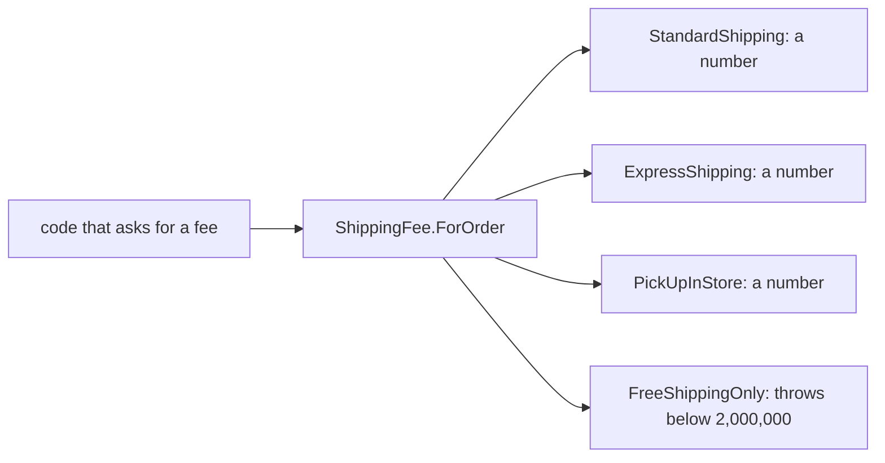

## Before you start

- [[design.l1.solid-ocp]] — you know a new kind of shipping can arrive as a new class deriving from `ShippingFee`, leaving the existing classes and their callers unchanged.

## The situation

For a promotion, a teammate adds a fourth kind of shipping, `FreeShippingOnly`: free for orders from 2,000,000 VND, and for anything smaller its `ForOrder` throws an exception, because "this kind should never be used for small orders." It derives from `ShippingFee`, overrides `ForOrder`, and compiles. Following OCP, nothing else was edited. Then a customer with a 500,000 VND order reaches the fee step, and the code that works out the fee — code that has not changed in months — crashes. Nothing it relied on was edited, so what broke it?

## Core concepts

- **Liskov Substitution Principle (LSP)** — code written against a base type must keep working, unchanged, when given any of its subtypes.
- subtype — a class that derives from a base type, like `StandardShipping` for `ShippingFee`.
- substitute — hand code one subtype where it expects the base type; LSP says any subtype should work there.

## How it works



Code written against `ShippingFee` knows only one thing about it: you give `ForOrder` a total, and it gives you back a fee. It does not know which subtype it has, and with OCP it should not need to. So it relies on every subtype keeping that promise for any total it might pass.

The three existing kinds keep it. `StandardShipping`, `ExpressShipping` and `PickUpInStore` each return a number for every total, so any one of them can be substituted for any other and the caller behaves correctly. That is LSP holding.

`FreeShippingOnly` breaks it. For a total below 2,000,000 it does not return a fee at all; it throws. The caller did nothing wrong: it asked `ShippingFee` the question `ShippingFee` says it answers. The subtype changed what the question means, so code that was correct for the base type is no longer correct for this subtype. That is what LSP forbids.

The compiler cannot catch this. It checks that `ForOrder` exists with the right parameters and return type; it does not check what the method does with a total of 500,000. So LSP is something you check yourself when you write a subtype, by asking: does this keep the base type's promise for every input a caller might pass, not just the ones I had in mind?

## In the Đơn Hàng system

The base type makes one promise:

```csharp file=samples/DonHang.Samples/Samples/Oop/ShippingFee.cs tag=stage-0 lines=5-8
public abstract class ShippingFee
{
    public abstract int ForOrder(int totalVnd);
}
```

`ForOrder` takes any `int` total and returns an `int` fee. Nothing in the declaration says some totals are not allowed.

The place in the samples that calls `ForOrder` on several kinds without knowing which is which is a test:

```csharp file=samples/DonHang.Samples.Tests/SamplesTests.cs tag=stage-0 lines=18-24
    [Fact]
    public void EveryKindAnswersTheSameCall()
    {
        var kinds = new ShippingFee[] { new StandardShipping(), new ExpressShipping(), new PickUpInStore() };

        Assert.Equal(new[] { 0, 60_000, 0 }, kinds.Select(kind => kind.ForOrder(2_000_000)));
    }
```

The array is typed `ShippingFee[]`, and `kinds.Select(kind => kind.ForOrder(2_000_000))` calls the same method on each element without asking what it is. Each existing kind substitutes cleanly. But notice the test only asks about one total, 2,000,000. Added to the array with an expected fee of `0`, `FreeShippingOnly` would pass this test too — it only throws below 2,000,000. A passing test at one value does not prove a subtype keeps the promise for every value.

## Beginners often think…

- **"LSP just means a subclass must implement every method its base type declares."** → Actually the compiler already enforces that for abstract methods; LSP is about what the method does. `FreeShippingOnly` implements `ForOrder` and still breaks code written for `ShippingFee`. You notice this when a new subtype compiles cleanly but callers that never changed start failing.
- **"As long as a subclass compiles against its base type, it automatically satisfies LSP."** → Actually compiling proves the override has the right signature and its body is valid C#, not what it does for each input. Whether `ForOrder` returns a fee or throws for a 500,000 total is behaviour the compiler never checks. You notice this when the failure appears only for certain inputs, far from where the subtype was written.

## Try it (3 minutes)

For each kind, work out what `ForOrder(500_000)` does. Use the `ShippingFee.cs` code you read in the OCP lesson for the three real kinds, and the description in the situation for `FreeShippingOnly`.

1. `StandardShipping`
2. `ExpressShipping`
3. `PickUpInStore`
4. `FreeShippingOnly`

Expected result: 1 returns `30000`, because 500,000 is below 2,000,000. 2 returns `60000`. 3 returns `0`. 4 throws an exception instead of returning a fee.

Which of the four could not be handed to code that works out a fee for any order, and what would that code see?

<details><summary>Suggested answer</summary>

`FreeShippingOnly`. Code that works out a fee for any order passes whatever total it has; with a 500,000 order it gets an exception instead of a number, even though it called `ForOrder` exactly as `ShippingFee` allows. The other three return a number for every total, so any of them can be substituted.

</details>

## Connections

- [[design.l1.solid-ocp]] — OCP lets a new kind arrive as a new class; LSP is what makes that safe, because callers trust every subtype to keep the base type's promise.
- [[foundation.l1.oop-polymorphism]] — where calling `ForOrder` through `ShippingFee` without asking which kind was first shown.
- [[design.l1.solid-isp]] — the next SOLID principle, about what a caller should be forced to depend on.

## Five-line summary

1. The Liskov Substitution Principle says code written for a base type must keep working with any of its subtypes.
2. `ShippingFee.ForOrder` promises a fee for a total; the three existing kinds return a number for every total.
3. A `FreeShippingOnly` that throws below 2,000,000 breaks that promise, so unchanged callers start failing.
4. The compiler checks that methods exist with the right signatures, not what they do for each input.
5. A test at one value, like 2,000,000, can pass even when a subtype breaks the promise elsewhere.
