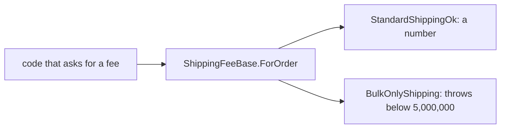

## Before you start

- [[design.l1.solid-ocp]] — you know a new kind of shipping can arrive as a new class deriving from a shipping base class, leaving the existing classes and their callers unchanged.

## The situation

A teammate adds bulk shipping, `BulkOnlyShipping`: 45,000 VND for orders from 5,000,000 VND, and for anything smaller its `ForOrder` throws an exception. `ShippingFeeBase` is a second base class in the samples with the same shape as `ShippingFee`: one method, `ForOrder`; its other subtype, `StandardShippingOk`, behaves like `StandardShipping`. `BulkOnlyShipping` derives from `ShippingFeeBase`, overrides `ForOrder`, and compiles. Following OCP, nothing else was edited. Then some code loops over the day's orders, calling `ForOrder(order.TotalVnd)` on whichever shipping each one chose — code that has not changed in months — and it crashes on the first 500,000 VND order that picked bulk. Nothing it relied on was edited, so what broke it?

## Core concepts

- **Liskov Substitution Principle (LSP)** — code written against a base type must keep working, unchanged, when given any of its subtypes.
- subtype — a class that derives from a base type, like `StandardShipping` for `ShippingFee`.
- substitute — hand code one subtype where it expects the base type; LSP says any subtype should work there.

## How it works



In the diagram, each arrow from `ForOrder` shows what a call to that subtype gives back. Code written against a shipping base type knows only one thing about it: you give `ForOrder` a total, and it gives you back a fee. It does not know which subtype it has, and with OCP it should not need to. So it relies on every subtype keeping that promise for any total it might pass.

The `ShippingFee` kinds keep it. `StandardShipping`, `ExpressShipping` and `PickUpInStore` each return a number for every total, so any one of them can be substituted for any other and the caller behaves correctly. That is LSP holding. `StandardShippingOk`, under `ShippingFeeBase`, keeps it too.

`BulkOnlyShipping` breaks it. For a total below 5,000,000 it does not return a fee at all; it throws. The caller did nothing wrong: it asked `ShippingFeeBase` the question `ShippingFeeBase` says it answers. The subtype refused some totals the base type accepts, so code that was correct for the base type is no longer correct for this subtype. That is what LSP forbids.

The compiler cannot catch this. It checks that `ForOrder` exists with the right parameters and return type; it does not check what the method does with a total of 500,000. So LSP is something you check yourself when you write a subtype, by asking: does this keep the base type's promise for every input a caller might pass, not just the ones I had in mind?

## In the Đơn Hàng system

The base type and its two subtypes:

```csharp file=samples/DonHang.Samples/Samples/Design/ShippingFeeLspViolation.cs tag=stage-1 lines=7-24
public abstract class ShippingFeeBase
{
    public abstract int ForOrder(int totalVnd);
}

public sealed class StandardShippingOk : ShippingFeeBase
{
    public override int ForOrder(int totalVnd) => totalVnd >= 2_000_000 ? 0 : 30_000;
}

public sealed class BulkOnlyShipping : ShippingFeeBase
{
    // Every other ShippingFeeBase answers any totalVnd. This one throws below
    // a threshold instead — a caller looping over orders and calling
    // ForOrder(order.TotalVnd) works for every subtype except this one.
    public override int ForOrder(int totalVnd) =>
        totalVnd >= 5_000_000 ? 45_000 : throw new InvalidOperationException("order too small for bulk shipping");
}
```

`ForOrder` takes any `int` total and returns an `int` fee; nothing in the base type says some totals are not allowed. `StandardShippingOk` answers every total. `BulkOnlyShipping` answers only from 5,000,000 and throws `InvalidOperationException` below that — the comment above it says exactly which caller breaks.

For contrast, here is a place that substitutes cleanly. It calls `ForOrder` on the three `ShippingFee` kinds without knowing which is which:

```csharp file=samples/DonHang.Samples.Tests/SamplesTests.cs tag=stage-1 lines=18-24
    [Fact]
    public void EveryKindAnswersTheSameCall()
    {
        var kinds = new ShippingFee[] { new StandardShipping(), new ExpressShipping(), new PickUpInStore() };

        Assert.Equal(new[] { 0, 60_000, 0 }, kinds.Select(kind => kind.ForOrder(2_000_000)));
    }
```

The array is typed `ShippingFee[]`, and `kinds.Select(kind => kind.ForOrder(2_000_000))` calls the same method on each element without asking what it is. Each kind substitutes cleanly. But notice the test only asks about one total. A similar test for `BulkOnlyShipping` that only asked about 5,000,000 would get 45,000 and pass. A passing test at one value does not prove a subtype keeps the promise for every value.

## Beginners often think…

- **"LSP just means a subclass must implement every method its base type declares."** → Actually the compiler already enforces that for abstract methods in any subclass that is not itself abstract; LSP is about keeping the promise — for every input a caller may pass, the caller gets back what the base type said it would. `BulkOnlyShipping` implements `ForOrder` and still breaks code written for `ShippingFeeBase`. You notice this when a subtype that implements every method still makes callers fail for some inputs.
- **"As long as a subclass compiles against its base type, it automatically satisfies LSP."** → Actually compiling proves the override has the right parameters and return type and its body is valid C#, not what it does for each input. Whether `ForOrder` returns a fee or throws for a 500,000 total is behaviour the compiler never checks. You notice this when the failure appears only for certain inputs, far from where the subtype was written.

## Try it (3 minutes)

Using the first code block, work out what `ForOrder` does for each subtype and total.

1. `StandardShippingOk`, total 500,000
2. `StandardShippingOk`, total 6,000,000
3. `BulkOnlyShipping`, total 6,000,000
4. `BulkOnlyShipping`, total 500,000

Expected result: 1 returns `30000`, because 500,000 is below 2,000,000. 2 returns `0`. 3 returns `45000`. 4 throws `InvalidOperationException` with the message `order too small for bulk shipping`.

Which subtype could not be handed to code that works out a fee for any order, and what would that code see?

<details><summary>Suggested answer</summary>

`BulkOnlyShipping`. Code that works out a fee for any order passes whatever total it has; with a 500,000 order it gets an exception instead of a number, even though it called `ForOrder` exactly as `ShippingFeeBase` allows. `StandardShippingOk` returns a number for every total, so it can be substituted anywhere.

</details>

## Connections

- [[design.l1.solid-ocp]] — OCP lets a new kind arrive as a new class; LSP is what makes that safe, because callers trust every subtype to keep the base type's promise.
- [[foundation.l1.oop-polymorphism]] — where calling `ForOrder` through `ShippingFee` without asking which kind was first shown.
- [[design.l1.solid-isp]] — the next SOLID principle, about what a caller should be forced to depend on.

## Five-line summary

1. The Liskov Substitution Principle says code written for a base type must keep working with any of its subtypes.
2. `ForOrder` promises a fee for any total; `StandardShippingOk` and the three `ShippingFee` kinds return a number for every total.
3. `BulkOnlyShipping` throws below 5,000,000, breaking that promise, so unchanged callers start failing.
4. The compiler checks that methods exist with the right parameters and return types, not what they do for each input.
5. A test at one value, like 5,000,000, can pass even when a subtype breaks the promise elsewhere.
