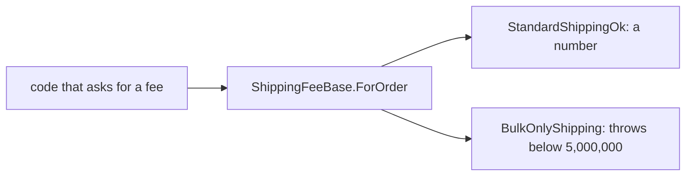

## Bạn cần biết trước

- [[design.l1.solid-ocp]] — bạn biết một kiểu giao hàng mới có thể đi vào dưới dạng một class mới kế thừa một class cha về giao hàng, để nguyên các class đã có và những chỗ gọi chúng.

## Tình huống

Một đồng nghiệp thêm kiểu giao hàng số lượng lớn, `BulkOnlyShipping`: 45.000 VND cho order từ 5.000.000 VND, còn với mọi order nhỏ hơn thì `ForOrder` của nó throw exception. `ShippingFeeBase` là một class cha thứ hai trong samples, cùng dạng với `ShippingFee`: một method, `ForOrder`; kiểu con còn lại của nó, `StandardShippingOk`, hành xử giống `StandardShipping`. `BulkOnlyShipping` kế thừa `ShippingFeeBase`, override `ForOrder`, và compile được. Theo đúng OCP, không có gì khác bị sửa. Rồi một đoạn code duyệt qua các order trong ngày, gọi `ForOrder(order.TotalVnd)` trên kiểu giao hàng mà mỗi order đã chọn — đoạn code đã nhiều tháng không đổi — và nó crash ngay ở order 500.000 VND đầu tiên chọn giao số lượng lớn. Không thứ gì nó dựa vào bị sửa, vậy cái gì đã làm nó hỏng?

## Khái niệm cốt lõi

- **Liskov Substitution Principle (LSP)** — code viết cho một kiểu cha phải tiếp tục chạy đúng, không cần sửa, khi được đưa bất kỳ kiểu con nào của nó.
- kiểu con — một class kế thừa một kiểu cha, như `StandardShipping` đối với `ShippingFee`.
- thay thế — đưa cho code một kiểu con ở chỗ nó cần kiểu cha; LSP nói kiểu con nào cũng phải chạy đúng ở đó.

## Cơ chế hoạt động



Trong sơ đồ, mỗi mũi tên đi ra từ `ForOrder` cho thấy lời gọi tới kiểu con đó trả lại gì. Code viết cho một kiểu cha về giao hàng chỉ biết đúng một điều về nó: bạn đưa `ForOrder` một tổng tiền, và nó trả lại cho bạn một mức phí. Code không biết mình đang có kiểu con nào, và với OCP thì nó cũng không cần biết. Vì vậy nó dựa vào việc mọi kiểu con giữ lời hứa đó với bất kỳ tổng tiền nào nó có thể truyền vào.

Các kiểu `ShippingFee` giữ được lời hứa. `StandardShipping`, `ExpressShipping` và `PickUpInStore` đều trả về một con số với mọi tổng tiền, nên kiểu nào cũng thay được cho kiểu khác và chỗ gọi vẫn chạy đúng. Đó là LSP được giữ. `StandardShippingOk`, dưới `ShippingFeeBase`, cũng giữ được.

`BulkOnlyShipping` phá lời hứa. Với tổng tiền dưới 5.000.000, nó hoàn toàn không trả về phí; nó throw. Chỗ gọi không làm gì sai: nó hỏi `ShippingFeeBase` đúng câu hỏi mà `ShippingFeeBase` nói mình trả lời được. Kiểu con đã từ chối một số tổng tiền mà kiểu cha chấp nhận, nên code vốn đúng với kiểu cha không còn đúng với kiểu con này nữa. Đó là điều LSP cấm.

Compiler không bắt được lỗi này. Nó kiểm tra `ForOrder` có tồn tại với đúng tham số và kiểu trả về; nó không kiểm tra method làm gì với tổng tiền 500.000. Vì vậy LSP là thứ bạn tự kiểm tra khi viết một kiểu con, bằng cách hỏi: kiểu con này có giữ lời hứa của kiểu cha với mọi đầu vào mà chỗ gọi có thể truyền, chứ không chỉ những đầu vào mình đang nghĩ tới?

## Trong hệ thống Đơn Hàng

Kiểu cha và hai kiểu con của nó:

```csharp file=samples/DonHang.Samples/Samples/Design/ShippingFeeLspViolation.cs tag=stage-1 lines=7-24
public abstract class ShippingFeeBase
{
    public abstract int ForOrder(int totalVnd);
}

public sealed class StandardShippingOk : ShippingFeeBase
{
    public override int ForOrder(int totalVnd) => totalVnd >= 2_000_000 ? 0 : 30_000;
}

public sealed class BulkOnlyShipping : ShippingFeeBase
{
    // Every other ShippingFeeBase answers any totalVnd. This one throws below
    // a threshold instead — a caller looping over orders and calling
    // ForOrder(order.TotalVnd) works for every subtype except this one.
    public override int ForOrder(int totalVnd) =>
        totalVnd >= 5_000_000 ? 45_000 : throw new InvalidOperationException("order too small for bulk shipping");
}
```

`ForOrder` nhận bất kỳ tổng tiền `int` nào và trả về một mức phí `int`; không có gì trong kiểu cha nói rằng một số tổng tiền không được phép. `StandardShippingOk` trả lời mọi tổng tiền. `BulkOnlyShipping` chỉ trả lời từ 5.000.000 và throw `InvalidOperationException` khi dưới mức đó — comment phía trên nó nói rõ chỗ gọi nào sẽ hỏng.

Để so sánh, đây là một chỗ thay thế trơn tru. Nó gọi `ForOrder` trên ba kiểu `ShippingFee` mà không cần biết kiểu nào là kiểu nào:

```csharp file=samples/DonHang.Samples.Tests/SamplesTests.cs tag=stage-1 lines=18-24
    [Fact]
    public void EveryKindAnswersTheSameCall()
    {
        var kinds = new ShippingFee[] { new StandardShipping(), new ExpressShipping(), new PickUpInStore() };

        Assert.Equal(new[] { 0, 60_000, 0 }, kinds.Select(kind => kind.ForOrder(2_000_000)));
    }
```

Mảng có kiểu `ShippingFee[]`, và `kinds.Select(kind => kind.ForOrder(2_000_000))` gọi cùng một method trên từng phần tử mà không hỏi nó là gì. Mỗi kiểu đều thay thế trơn tru. Nhưng để ý là test chỉ hỏi về một tổng tiền. Một test tương tự cho `BulkOnlyShipping` mà chỉ hỏi về 5.000.000 sẽ nhận 45.000 và pass. Một test pass ở một giá trị không chứng minh được kiểu con giữ lời hứa ở mọi giá trị.

## Người mới hay nghĩ rằng…

- **"LSP chỉ có nghĩa là class con phải cài đặt mọi method mà kiểu cha khai báo."** → Thực ra compiler đã bắt buộc điều đó với abstract method ở mọi class con không phải abstract; LSP là chuyện giữ lời hứa — với mọi đầu vào chỗ gọi có thể truyền, chỗ gọi nhận lại đúng thứ kiểu cha đã nói. `BulkOnlyShipping` cài đặt `ForOrder` mà vẫn làm hỏng code viết cho `ShippingFeeBase`. Bạn sẽ nhận ra khi một kiểu con đã cài đặt đủ mọi method mà vẫn làm chỗ gọi hỏng với vài đầu vào.
- **"Miễn là class con compile được với kiểu cha, nó tự động thỏa LSP."** → Thực ra compile được chỉ chứng minh override có đúng tham số, kiểu trả về và thân method là C# hợp lệ, chứ không nói nó làm gì với từng đầu vào. `ForOrder` trả về phí hay throw với tổng tiền 500.000 là hành vi mà compiler không bao giờ kiểm tra. Bạn sẽ nhận ra khi lỗi chỉ xuất hiện với vài đầu vào nhất định, ở xa chỗ kiểu con được viết.

## Thử ngay (3 phút)

Dùng khối code đầu tiên, tính xem `ForOrder` làm gì với từng kiểu con và tổng tiền.

1. `StandardShippingOk`, tổng tiền 500.000
2. `StandardShippingOk`, tổng tiền 6.000.000
3. `BulkOnlyShipping`, tổng tiền 6.000.000
4. `BulkOnlyShipping`, tổng tiền 500.000

Kết quả mong đợi: 1 trả về `30000`, vì 500.000 dưới 2.000.000. 2 trả về `0`. 3 trả về `45000`. 4 throw `InvalidOperationException` với thông báo `order too small for bulk shipping`.

Kiểu con nào không thể đưa cho code tính phí cho mọi order, và code đó sẽ thấy gì?

<details><summary>Gợi ý đáp án</summary>

`BulkOnlyShipping`. Code tính phí cho mọi order truyền vào bất kỳ tổng tiền nào nó có; với order 500.000, nó nhận về một exception thay vì một con số, dù nó gọi `ForOrder` đúng như `ShippingFeeBase` cho phép. `StandardShippingOk` trả về một con số với mọi tổng tiền, nên thay thế được ở bất kỳ đâu.

</details>

## Liên hệ

- [[design.l1.solid-ocp]] — OCP cho phép kiểu mới đi vào dưới dạng class mới; LSP là thứ khiến việc đó an toàn, vì chỗ gọi tin rằng mọi kiểu con đều giữ lời hứa của kiểu cha.
- [[foundation.l1.oop-polymorphism]] — nơi lần đầu thấy việc gọi `ForOrder` qua `ShippingFee` mà không hỏi là kiểu nào.
- [[design.l1.solid-isp]] — nguyên tắc SOLID tiếp theo, về việc một chỗ gọi bị buộc phải phụ thuộc vào những gì.

## Tóm tắt 5 dòng

1. Liskov Substitution Principle nói code viết cho một kiểu cha phải tiếp tục chạy đúng với bất kỳ kiểu con nào của nó.
2. `ForOrder` hứa trả một mức phí cho mọi tổng tiền; `StandardShippingOk` và ba kiểu `ShippingFee` đều trả về một con số với mọi tổng tiền.
3. `BulkOnlyShipping` throw khi dưới 5.000.000, phá lời hứa đó, nên những chỗ gọi không hề đổi bắt đầu hỏng.
4. Compiler kiểm tra method tồn tại với đúng tham số và kiểu trả về, không kiểm tra nó làm gì với từng đầu vào.
5. Một test ở một giá trị, như 5.000.000, vẫn có thể pass dù kiểu con phá lời hứa ở chỗ khác.
