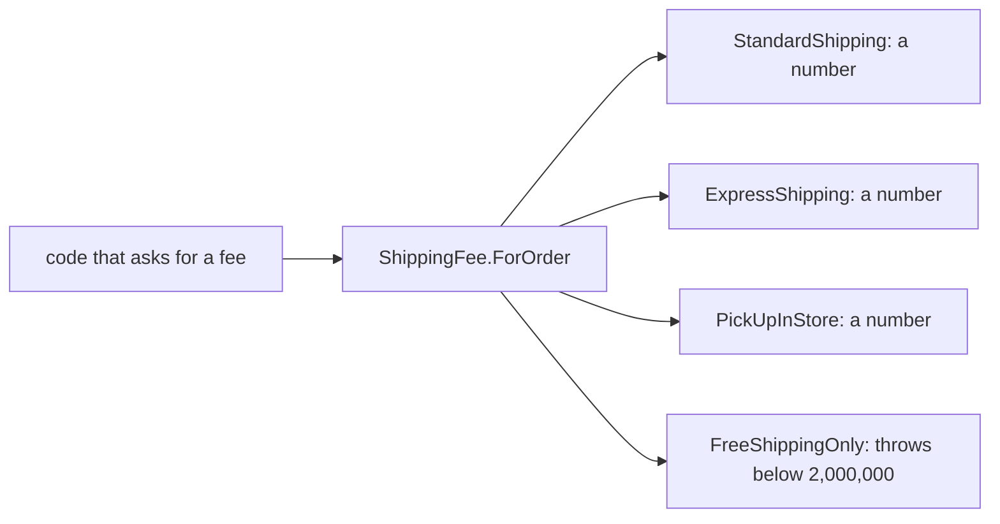

## Bạn cần biết trước

- [[design.l1.solid-ocp]] — bạn biết một kiểu giao hàng mới có thể đi vào dưới dạng một class mới kế thừa `ShippingFee`, để nguyên các class đã có và những chỗ gọi chúng.

## Tình huống

Để chạy khuyến mãi, một đồng nghiệp thêm kiểu giao hàng thứ tư, `FreeShippingOnly`: miễn phí cho order từ 2.000.000 VND, còn với mọi order nhỏ hơn thì `ForOrder` của nó throw exception, vì "kiểu này không bao giờ được dùng cho order nhỏ." Nó kế thừa `ShippingFee`, override `ForOrder`, và compile được. Theo đúng OCP, không có gì khác bị sửa. Trong đợt khuyến mãi, trang thanh toán cho chọn mọi kiểu, nên một khách có order 500.000 VND chọn nó, và đoạn code tính phí — đoạn code đã nhiều tháng không đổi — bị crash. Không thứ gì nó dựa vào bị sửa, vậy cái gì đã làm nó hỏng?

## Khái niệm cốt lõi

- **Liskov Substitution Principle (LSP)** — code viết cho một kiểu cha phải tiếp tục chạy đúng, không cần sửa, khi được đưa bất kỳ kiểu con nào của nó.
- kiểu con — một class kế thừa một kiểu cha, như `StandardShipping` đối với `ShippingFee`.
- thay thế — đưa cho code một kiểu con ở chỗ nó cần kiểu cha; LSP nói kiểu con nào cũng phải chạy đúng ở đó.

## Cơ chế hoạt động



Code viết cho `ShippingFee` chỉ biết đúng một điều về nó: bạn đưa `ForOrder` một tổng tiền, và nó trả lại cho bạn một mức phí. Code không biết mình đang có kiểu con nào, và với OCP thì nó cũng không cần biết. Vì vậy nó dựa vào việc mọi kiểu con giữ lời hứa đó với bất kỳ tổng tiền nào nó có thể truyền vào.

Ba kiểu đã có giữ được lời hứa. `StandardShipping`, `ExpressShipping` và `PickUpInStore` đều trả về một con số với mọi tổng tiền, nên kiểu nào cũng thay được cho kiểu khác và chỗ gọi vẫn chạy đúng. Đó là LSP được giữ.

`FreeShippingOnly` phá lời hứa. Với tổng tiền dưới 2.000.000, nó hoàn toàn không trả về phí; nó throw. Chỗ gọi không làm gì sai: nó hỏi `ShippingFee` đúng câu hỏi mà `ShippingFee` nói mình trả lời được. Kiểu con đã đổi ý nghĩa của câu hỏi, nên code vốn đúng với kiểu cha không còn đúng với kiểu con này nữa. Đó là điều LSP cấm.

Compiler không bắt được lỗi này. Nó kiểm tra `ForOrder` có tồn tại với đúng tham số và kiểu trả về; nó không kiểm tra method làm gì với tổng tiền 500.000. Vì vậy LSP là thứ bạn tự kiểm tra khi viết một kiểu con, bằng cách hỏi: kiểu con này có giữ lời hứa của kiểu cha với mọi đầu vào mà chỗ gọi có thể truyền, chứ không chỉ những đầu vào mình đang nghĩ tới?

## Trong hệ thống Đơn Hàng

Kiểu cha đưa ra đúng một lời hứa:

```csharp file=samples/DonHang.Samples/Samples/Oop/ShippingFee.cs tag=stage-0 lines=5-8
public abstract class ShippingFee
{
    public abstract int ForOrder(int totalVnd);
}
```

`ForOrder` nhận bất kỳ tổng tiền `int` nào và trả về một mức phí `int`. Không có gì trong khai báo nói rằng một số tổng tiền không được phép.

Chỗ trong samples gọi `ForOrder` trên nhiều kiểu mà không cần biết kiểu nào là kiểu nào là một test:

```csharp file=samples/DonHang.Samples.Tests/SamplesTests.cs tag=stage-0 lines=18-24
    [Fact]
    public void EveryKindAnswersTheSameCall()
    {
        var kinds = new ShippingFee[] { new StandardShipping(), new ExpressShipping(), new PickUpInStore() };

        Assert.Equal(new[] { 0, 60_000, 0 }, kinds.Select(kind => kind.ForOrder(2_000_000)));
    }
```

Mảng có kiểu `ShippingFee[]`, và `kinds.Select(kind => kind.ForOrder(2_000_000))` gọi cùng một method trên từng phần tử mà không hỏi nó là gì. Mỗi kiểu đã có đều thay thế trơn tru. Nhưng để ý là test chỉ hỏi về một tổng tiền, 2.000.000. Nếu thêm `FreeShippingOnly` vào mảng với mức phí mong đợi là `0`, nó cũng sẽ pass test này — nó chỉ throw khi dưới 2.000.000. Một test pass ở một giá trị không chứng minh được kiểu con giữ lời hứa ở mọi giá trị.

## Người mới hay nghĩ rằng…

- **"LSP chỉ có nghĩa là class con phải cài đặt mọi method mà kiểu cha khai báo."** → Thực ra compiler đã bắt buộc điều đó với abstract method; LSP là chuyện giữ lời hứa — với mọi đầu vào chỗ gọi có thể truyền, chỗ gọi nhận lại đúng thứ kiểu cha đã nói. `FreeShippingOnly` cài đặt `ForOrder` mà vẫn làm hỏng code viết cho `ShippingFee`. Bạn sẽ nhận ra khi một kiểu con đã cài đặt đủ mọi method mà vẫn làm chỗ gọi hỏng với vài đầu vào.
- **"Miễn là class con compile được với kiểu cha, nó tự động thỏa LSP."** → Thực ra compile được chỉ chứng minh override có đúng tham số, kiểu trả về và thân method là C# hợp lệ, chứ không nói nó làm gì với từng đầu vào. `ForOrder` trả về phí hay throw với tổng tiền 500.000 là hành vi mà compiler không bao giờ kiểm tra. Bạn sẽ nhận ra khi lỗi chỉ xuất hiện với vài đầu vào nhất định, ở xa chỗ kiểu con được viết.

## Thử ngay (3 phút)

Với mỗi kiểu, tính xem `ForOrder(500_000)` làm gì. Với ba kiểu thật, dùng `samples/DonHang.Samples/Samples/Oop/ShippingFee.cs`, dòng 10-23, mà bạn đã đọc ở bài OCP; với `FreeShippingOnly`, dùng mô tả trong phần tình huống.

1. `StandardShipping`
2. `ExpressShipping`
3. `PickUpInStore`
4. `FreeShippingOnly`

Kết quả mong đợi: 1 trả về `30000`, vì 500.000 dưới 2.000.000. 2 trả về `60000`. 3 trả về `0`. 4 throw exception thay vì trả về phí.

Trong bốn kiểu, kiểu nào không thể đưa cho code tính phí cho mọi order, và code đó sẽ thấy gì?

<details><summary>Gợi ý đáp án</summary>

`FreeShippingOnly`. Code tính phí cho mọi order truyền vào bất kỳ tổng tiền nào nó có; với order 500.000, nó nhận về một exception thay vì một con số, dù nó gọi `ForOrder` đúng như `ShippingFee` cho phép. Ba kiểu kia trả về một con số với mọi tổng tiền, nên kiểu nào cũng thay thế được.

</details>

## Liên hệ

- [[design.l1.solid-ocp]] — OCP cho phép kiểu mới đi vào dưới dạng class mới; LSP là thứ khiến việc đó an toàn, vì chỗ gọi tin rằng mọi kiểu con đều giữ lời hứa của kiểu cha.
- [[foundation.l1.oop-polymorphism]] — nơi lần đầu thấy việc gọi `ForOrder` qua `ShippingFee` mà không hỏi là kiểu nào.
- [[design.l1.solid-isp]] — nguyên tắc SOLID tiếp theo, về việc một chỗ gọi bị buộc phải phụ thuộc vào những gì.

## Tóm tắt 5 dòng

1. Liskov Substitution Principle nói code viết cho một kiểu cha phải tiếp tục chạy đúng với bất kỳ kiểu con nào của nó.
2. `ShippingFee.ForOrder` hứa trả một mức phí cho một tổng tiền; ba kiểu đã có đều trả về một con số với mọi tổng tiền.
3. Một `FreeShippingOnly` throw khi dưới 2.000.000 là phá lời hứa đó, nên những chỗ gọi không hề đổi bắt đầu hỏng.
4. Compiler kiểm tra method tồn tại với đúng tham số và kiểu trả về, không kiểm tra nó làm gì với từng đầu vào.
5. Một test ở một giá trị, như 2.000.000, vẫn có thể pass dù kiểu con phá lời hứa ở chỗ khác.
