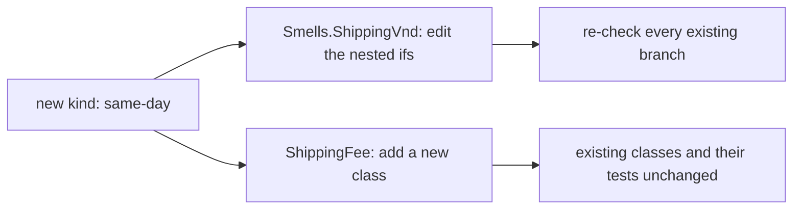

## Before you start

- [[design.l1.solid-srp]] — you know SOLID is five principles, and that the first, SRP, asks each class to have only one reason to change.

## The situation

The shop wants a fourth way to ship: same-day delivery. The samples project already works out a shipping fee in two places: one is `Smells.ShippingVnd`, a single method that takes `express` and `pickUp` flags and decides the fee through nested `if`s. The other is `ShippingFee`, with one class per kind of shipping and tests that already check them. In the first, same-day means opening a method that works today and editing branches that were never meant to change. In the second, it means writing a new class and leaving the old ones alone. Why is the second one so much safer?

## Core concepts

- **Open/Closed Principle (OCP)** — code should be open for extension but closed for modification: adding a new case should not require editing code that already works and is already tested.
- extension — adding new code, such as a new class, next to what exists.
- modification — editing code that already exists, such as a working method body.

## How it works



OCP is about where a new case goes. In `Smells.ShippingVnd`, the kind of shipping is not a thing of its own; it is a pair of flags that every branch reads. A new kind has nowhere to go except inside the same method, so adding it is a modification. Every existing branch sits next to the edit, so every existing branch has to be checked again.

In `ShippingFee`, each kind is a class that derives from the same abstract class and overrides one method, `ForOrder`. A new kind is a new class beside the others, so adding it is an extension. `StandardShipping`, `ExpressShipping` and `PickUpInStore` are not opened, and the tests that check them do not change.

Code that only calls `ForOrder` through a `ShippingFee` variable does not change either: it never asks which kind it has. Some code still has to create the new kind, and that may mean a small edit where the kind is chosen; but it sits outside the fee rules, and the rules that already work are not edited. That is the goal of OCP: the change you are asked for arrives as new code, and the code you trusted yesterday stays as it was.

## In the Đơn Hàng system

The flag version, from the code smells lesson:

```csharp file=samples/DonHang.Samples/Samples/Clean/Smells.cs tag=stage-0 lines=8-30
    public static int ShippingVnd(
        int totalVnd, bool express, bool loyal, bool pickUp, string city, int weightGram)
    {
        if (!pickUp)
        {
            if (city == "Hà Nội" || city == "Hồ Chí Minh")
            {
                if (weightGram < 5000)
                {
                    // charge 30000 unless the total reaches 2000000
                    if (totalVnd < 2000000) return express ? 60000 : 30000;
                    return express ? 60000 : 0;
                }

                if (totalVnd < 2000000) return express ? 60000 : 30000;
                return express ? 60000 : 0;
            }

            return express ? 90000 : 45000;
        }

        return 0;
    }
```

The kind of shipping is spread across the method: `pickUp` is checked at the top, and `express` is checked again in five separate `return` lines. Same-day would need another flag, and it has to go somewhere inside this method, among or ahead of branches that work today. Either way you edit the method, and every `return` next to the edit must be checked again.

The class version — it ignores city and weight, so compare the two only on where a new kind goes:

```csharp file=samples/DonHang.Samples/Samples/Oop/ShippingFee.cs tag=stage-0 lines=5-23
public abstract class ShippingFee
{
    public abstract int ForOrder(int totalVnd);
}

public sealed class StandardShipping : ShippingFee
{
    public override int ForOrder(int totalVnd) => totalVnd >= 2_000_000 ? 0 : 30_000;
}

public sealed class ExpressShipping : ShippingFee
{
    public override int ForOrder(int totalVnd) => 60_000;
}

public sealed class PickUpInStore : ShippingFee
{
    public override int ForOrder(int totalVnd) => 0;
}
```

Each kind owns its answer in one line. Same-day would be a fourth class deriving from `ShippingFee` with its own `ForOrder`; none of the three above changes. The compiler also helps: a new class like this that forgets to override `ForOrder` does not compile. The tests in `SamplesTests.cs` that check the three existing kinds keep passing without an edit.

## Beginners often think…

- **"OCP means you should never change a class once it's written."** → Actually OCP is about adding new cases, not about freezing code. If the shop moves the free-shipping threshold for standard shipping, you edit `StandardShipping`, because the rule itself changed. You notice this when the change is to how an existing kind behaves, rather than a new kind arriving.
- **"Using an abstract class or interface automatically makes code follow OCP, no matter how it's used."** → Actually what matters is whether callers need to know which kind they have. If callers checked which class they had before deciding what to do, every new kind would mean editing those checks, even with `ShippingFee` in place. You notice this when adding a class still sends you hunting for places that list the kinds by name.

## Try it (3 minutes)

Use the two code blocks above.

1. In `Smells.ShippingVnd`, count the `return` lines that read `express`.
2. In `ShippingFee.cs`, list the existing classes you would have to edit to add same-day delivery at 80,000 VND.

Expected result: step 1 gives five — every `return` except the last one, `return 0;`. Step 2 gives none: you add one new class that derives from `ShippingFee` and returns `80_000` from `ForOrder`.

In which version does adding same-day put working code at risk, and why?

<details><summary>Suggested answer</summary>

In `Smells.ShippingVnd`: same-day has to be added inside the method, next to the five `express` lines, so you edit working code and must check those branches again. In `ShippingFee`, the new kind is a new class; the three old classes and their tests are not touched, so nothing that worked yesterday is opened.

</details>

## Connections

- [[design.l1.solid-srp]] — SRP gives each class one reason to change; OCP asks that a new case arrive as new code instead of another edit to that class.
- [[foundation.l1.oop-polymorphism]] — where `ShippingFee` and its three classes were first introduced; polymorphism is what lets callers stay unchanged.
- [[foundation.l1.code-smells-basic]] — where `Smells.ShippingVnd` was read for its smells; here it is read for what a new kind costs.

## Five-line summary

1. The Open/Closed Principle says code should be open for extension but closed for modification.
2. Adding a new case should mean adding new code, not editing code that already works and is tested.
3. `Smells.ShippingVnd` spreads the kind of shipping across a `pickUp` check and five `express` returns, so a new kind means editing that method and re-checking them.
4. `ShippingFee` gives each kind its own class, so same-day is a new class and the old ones stay untouched.
5. OCP does not freeze code: changing how an existing kind behaves still edits that kind's class.
