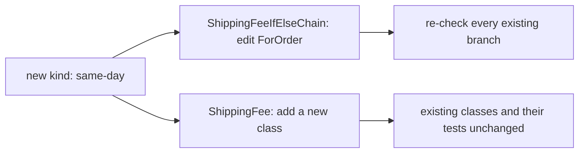

## Before you start

- [[design.l1.solid-srp]] — you know SOLID is five principles, and that the first, SRP, asks each class to have only one reason to change.

## The situation

The shop wants a fourth way to ship: same-day delivery. Two files in the samples project work out the same shipping fees in different ways: one is `ShippingFeeIfElseChain.ForOrder`, a single method that takes the kind of shipping as a string and walks an `if`/`else if` chain. The other is `ShippingFee`, with one class per kind of shipping and tests that already check them. In the first, same-day means opening a method that works today and adding a branch next to the ones that answer standard, express and pick-up orders. In the second, it means writing a new class and leaving the old ones alone. Why is the second one so much safer?

## Core concepts

- **Open/Closed Principle (OCP)** — code should be open for extension but closed for modification: adding a new case should not require editing code that already works and is already tested.
- extension — adding new code, such as a new class, next to what exists.
- modification — editing code that already exists, such as a working method body.

## How it works



OCP is about where a new case goes. In `ShippingFeeIfElseChain`, a kind of shipping is not a thing of its own; it is a string that one method compares against a list of names. A new kind has nowhere to go except another branch inside that method, so adding it is a modification. The edit sits among branches that standard, express and pick-up orders rely on today, so those branches have to be checked again.

In `ShippingFee`, each kind is a class that derives from the same abstract class and overrides one method, `ForOrder`. A new kind is a new class beside the others, so adding it is an extension. `StandardShipping`, `ExpressShipping` and `PickUpInStore` are not opened, and the tests that check them do not change.

Code that only calls `ForOrder` through a `ShippingFee` variable does not change either: it never asks which kind it has. Some code still has to create the new kind, and that may mean a small edit where the kind is chosen; but it sits outside the fee rules, and the rules that already work are not edited. That is the goal of OCP: the change you are asked for arrives as new code, and the code you trusted yesterday stays as it was.

## In the Đơn Hàng system

The chain version:

```csharp file=samples/DonHang.Samples/Samples/Design/ShippingFeeIfElseChain.cs tag=stage-1 lines=9-29
    public static int ForOrder(string kind, int totalVnd)
    {
        if (kind == "standard")
        {
            return totalVnd >= 2_000_000 ? 0 : 30_000;
        }
        else if (kind == "express")
        {
            return 60_000;
        }
        else if (kind == "pickup")
        {
            return 0;
        }
        // A fourth kind ("same_day", say) needs a fourth branch right here —
        // in a method that other kinds already depend on working correctly.
        else
        {
            throw new ArgumentException($"unknown shipping kind: {kind}");
        }
    }
```

Every kind lives in this one method. Today a string like `"same_day"` falls through to the final `else` and throws `ArgumentException`. To support it, you add a fourth `else if` inside `ForOrder` — exactly where the file's own comment points — and then check that standard, express and pick-up still give the same answers, because you edited the method they all go through.

The class version:

```csharp file=samples/DonHang.Samples/Samples/Oop/ShippingFee.cs tag=stage-1 lines=5-23
public abstract class ShippingFee
{
    public abstract int ForOrder(int totalVnd);
}

public sealed class StandardShipping : ShippingFee
{
    public override int ForOrder(int totalVnd) => totalVnd >= 2_000_000 ? 0 : 30_000;
}

public sealed class ExpressShipping : ShippingFee
{
    public override int ForOrder(int totalVnd) => 60_000;
}

public sealed class PickUpInStore : ShippingFee
{
    public override int ForOrder(int totalVnd) => 0;
}
```

The fees are the same as in the chain, but each kind owns its answer in its own class. Same-day would be a fourth class deriving from `ShippingFee` with its own `ForOrder`; none of the three above changes. The compiler also helps: a new class like this that forgets to override `ForOrder` does not compile. The tests in `SamplesTests.cs` that check the three existing kinds keep passing without an edit.

## Beginners often think…

- **"OCP means you should never change a class once it's written."** → Actually OCP is about adding new cases, not about freezing code. If the shop moves the free-shipping threshold for standard shipping, you edit `StandardShipping`, because the rule itself changed. You notice this when the change is to how an existing kind behaves, rather than a new kind arriving.
- **"Using an abstract class or interface automatically makes code follow OCP, no matter how it's used."** → Actually what matters is whether callers need to know which kind they have. If callers checked which class they had before deciding what to do, every new kind would mean editing those checks, even with `ShippingFee` in place — the same chain, moved somewhere else. You notice this when adding a class still sends you hunting for places that list the kinds by name.

## Try it (3 minutes)

Use the two code blocks above.

1. What does `ShippingFeeIfElseChain.ForOrder("same_day", 500_000)` do today?
2. In `ShippingFee.cs`, list the existing classes you would have to edit to add same-day delivery at 80,000 VND.

Expected result: step 1 throws `ArgumentException` with the message `unknown shipping kind: same_day`, because no branch matches. Step 2 gives none: you add one new class that derives from `ShippingFee` and returns `80_000` from `ForOrder`.

In which version does adding same-day put working code at risk, and why?

<details><summary>Suggested answer</summary>

In `ShippingFeeIfElseChain`: same-day needs a new branch inside `ForOrder`, the method standard, express and pick-up already go through, so you edit working code and must check those branches again. In `ShippingFee`, the new kind is a new class; the three old classes and their tests are not touched, so nothing that worked yesterday is opened.

</details>

## Connections

- [[design.l1.solid-srp]] — SRP gives each class one reason to change; OCP asks that a new case arrive as new code instead of another edit to that class.
- [[foundation.l1.oop-polymorphism]] — where `ShippingFee` and its three classes were first introduced; polymorphism is what lets callers stay unchanged.
- [[design.l1.solid-lsp]] — the next SOLID principle: every new subtype must keep the promise its base type makes.

## Five-line summary

1. The Open/Closed Principle says code should be open for extension but closed for modification.
2. Adding a new case should mean adding new code, not editing code that already works and is tested.
3. `ShippingFeeIfElseChain` keeps every kind in one method, so same-day means another branch among ones that already work.
4. `ShippingFee` gives each kind its own class, so same-day is a new class and the old ones stay untouched.
5. OCP does not freeze code: changing how an existing kind behaves still edits that kind's class.
