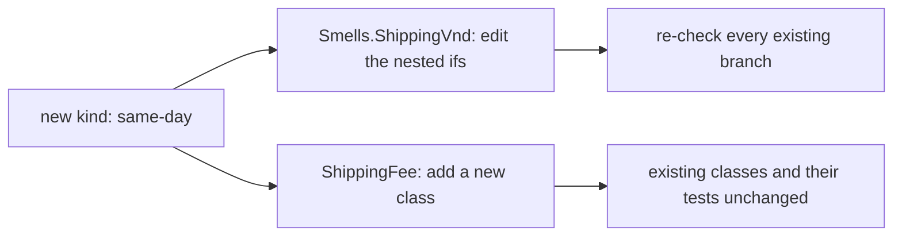

## Bạn cần biết trước

- [[design.l1.solid-srp]] — bạn biết SOLID là năm nguyên tắc, và nguyên tắc đầu tiên, SRP, yêu cầu mỗi class chỉ có một lý do để thay đổi.

## Tình huống

Cửa hàng muốn có kiểu giao hàng thứ tư: giao trong ngày. Project samples đã tính phí giao hàng ở hai chỗ: một là `Smells.ShippingVnd`, một method duy nhất nhận cờ `express` và `pickUp` rồi quyết định phí qua các `if` lồng nhau. Chỗ kia là `ShippingFee`, mỗi kiểu giao hàng một class, và đã có test kiểm tra chúng. Ở chỗ thứ nhất, giao trong ngày nghĩa là mở một method đang chạy tốt và sửa những nhánh vốn không định bị đổi. Ở chỗ thứ hai, nó nghĩa là viết một class mới và để yên các class cũ. Vì sao chỗ thứ hai an toàn hơn hẳn?

## Khái niệm cốt lõi

- **Open/Closed Principle (OCP)** — code nên mở để mở rộng nhưng đóng để sửa đổi: thêm một trường hợp mới không nên đòi hỏi sửa code đang chạy tốt và đã được test.
- mở rộng — thêm code mới, như một class mới, đặt cạnh những gì đã có.
- sửa đổi — sửa code đã có, như thân của một method đang chạy tốt.

## Cơ chế hoạt động



OCP nói về chỗ đặt một trường hợp mới. Trong `Smells.ShippingVnd`, kiểu giao hàng không phải là một thứ riêng; nó là một cặp cờ mà nhánh nào cũng đọc. Một kiểu mới chẳng có chỗ nào để đặt ngoài chính method đó, nên thêm nó là sửa đổi. Nhánh cũ nào cũng nằm sát chỗ sửa, nên nhánh cũ nào cũng phải kiểm tra lại.

Trong `ShippingFee`, mỗi kiểu là một class kế thừa cùng một abstract class và override một method, `ForOrder`. Một kiểu mới là một class mới đặt cạnh các class khác, nên thêm nó là mở rộng. `StandardShipping`, `ExpressShipping` và `PickUpInStore` không bị mở ra, và các test kiểm tra chúng không đổi.

Code chỉ gọi `ForOrder` qua một biến `ShippingFee` cũng không đổi: nó không bao giờ hỏi mình đang có kiểu nào. Vẫn phải có code tạo ra kiểu mới, và điều đó có thể nghĩa là một chỗ sửa nhỏ ở nơi chọn kiểu; nhưng chỗ đó nằm ngoài các quy tắc tính phí, và các quy tắc đang chạy tốt không bị sửa. Đó là mục tiêu của OCP: thay đổi được yêu cầu đi vào dưới dạng code mới, còn code bạn tin tưởng hôm qua vẫn giữ nguyên.

## Trong hệ thống Đơn Hàng

Phiên bản dùng cờ, từ bài về code smell:

```csharp file=samples/DonHang.Samples/Samples/Clean/Smells.cs tag=stage-0 lines=8-30
    public static int ShippingVnd(
        int totalVnd, bool express, bool loyal, bool pickUp, string city, int weightGram)
    {
        if (!pickUp)
        {
            if (city == "Hà Nội" || city == "Hồ Chí Minh")
            {
                if (weightGram < 5000)
                {
                    // charge 30000 unless the total reaches 2000000
                    if (totalVnd < 2000000) return express ? 60000 : 30000;
                    return express ? 60000 : 0;
                }

                if (totalVnd < 2000000) return express ? 60000 : 30000;
                return express ? 60000 : 0;
            }

            return express ? 90000 : 45000;
        }

        return 0;
    }
```

Kiểu giao hàng bị rải khắp method: `pickUp` được kiểm tra ở đầu, còn `express` lại được kiểm tra ở năm dòng `return` riêng rẽ. Giao trong ngày sẽ cần thêm một cờ, và cờ đó phải nằm đâu đó trong method này, xen giữa hoặc đứng trước các nhánh đang chạy tốt. Cách nào thì bạn cũng sửa method, và mọi `return` nằm sát chỗ sửa đều phải kiểm tra lại.

Phiên bản dùng class — nó không xét thành phố và cân nặng, nên chỉ so hai phiên bản ở chỗ một kiểu mới được đặt vào đâu:

```csharp file=samples/DonHang.Samples/Samples/Oop/ShippingFee.cs tag=stage-0 lines=5-23
public abstract class ShippingFee
{
    public abstract int ForOrder(int totalVnd);
}

public sealed class StandardShipping : ShippingFee
{
    public override int ForOrder(int totalVnd) => totalVnd >= 2_000_000 ? 0 : 30_000;
}

public sealed class ExpressShipping : ShippingFee
{
    public override int ForOrder(int totalVnd) => 60_000;
}

public sealed class PickUpInStore : ShippingFee
{
    public override int ForOrder(int totalVnd) => 0;
}
```

Mỗi kiểu tự giữ câu trả lời của mình trong một dòng. Giao trong ngày sẽ là class thứ tư kế thừa `ShippingFee` với `ForOrder` riêng; không class nào trong ba class trên phải đổi. Compiler cũng giúp một tay: một class mới như vậy mà quên override `ForOrder` thì không compile được. Các test trong `SamplesTests.cs` kiểm tra ba kiểu đã có vẫn pass mà không cần sửa.

## Người mới hay nghĩ rằng…

- **"OCP nghĩa là không bao giờ được sửa một class sau khi đã viết xong."** → Thực ra OCP nói về việc thêm trường hợp mới, không phải đóng băng code. Nếu cửa hàng dời ngưỡng miễn phí giao hàng của kiểu tiêu chuẩn, bạn sửa `StandardShipping`, vì chính quy tắc đã đổi. Bạn sẽ nhận ra khi thay đổi là về cách một kiểu đã có hoạt động, chứ không phải có một kiểu mới đến.
- **"Dùng abstract class hay interface là code tự động theo OCP, bất kể dùng thế nào."** → Thực ra điều quan trọng là chỗ gọi có cần biết mình đang có kiểu nào hay không. Nếu chỗ gọi kiểm tra mình có class nào trước khi quyết định làm gì, thì mỗi kiểu mới lại phải sửa những phép kiểm tra đó, dù đã có `ShippingFee`. Bạn sẽ nhận ra khi thêm một class mà vẫn phải đi lùng những chỗ liệt kê các kiểu theo tên.

## Thử ngay (3 phút)

Dùng hai khối code ở trên.

1. Trong `Smells.ShippingVnd`, đếm số dòng `return` có đọc `express`.
2. Trong `ShippingFee.cs`, liệt kê những class đã có mà bạn sẽ phải sửa để thêm giao trong ngày giá 80.000 VND.

Kết quả mong đợi: bước 1 ra năm — mọi `return` trừ dòng cuối, `return 0;`. Bước 2 ra không class nào: bạn thêm một class mới kế thừa `ShippingFee` và trả về `80_000` từ `ForOrder`.

Ở phiên bản nào việc thêm giao trong ngày đặt code đang chạy tốt vào rủi ro, và vì sao?

<details><summary>Gợi ý đáp án</summary>

Ở `Smells.ShippingVnd`: giao trong ngày phải được thêm vào bên trong method, sát năm dòng `express`, nên bạn sửa code đang chạy tốt và phải kiểm tra lại các nhánh đó. Ở `ShippingFee`, kiểu mới là một class mới; ba class cũ và test của chúng không bị đụng tới, nên không có gì chạy tốt hôm qua bị mở ra.

</details>

## Liên hệ

- [[design.l1.solid-srp]] — SRP cho mỗi class một lý do để thay đổi; OCP yêu cầu trường hợp mới đi vào dưới dạng code mới thay vì thêm một chỗ sửa vào class đó.
- [[foundation.l1.oop-polymorphism]] — nơi `ShippingFee` và ba class của nó được giới thiệu lần đầu; polymorphism là thứ giúp chỗ gọi giữ nguyên.
- [[foundation.l1.code-smells-basic]] — nơi `Smells.ShippingVnd` được đọc để tìm smell; ở đây nó được đọc để xem một kiểu mới tốn bao nhiêu.

## Tóm tắt 5 dòng

1. Open/Closed Principle nói code nên mở để mở rộng nhưng đóng để sửa đổi.
2. Thêm một trường hợp mới nên là thêm code mới, không phải sửa code đang chạy tốt và đã được test.
3. `Smells.ShippingVnd` rải kiểu giao hàng qua một phép kiểm tra `pickUp` và năm `return` đọc `express`, nên kiểu mới nghĩa là sửa method đó và kiểm tra lại chúng.
4. `ShippingFee` cho mỗi kiểu một class riêng, nên giao trong ngày là một class mới và các class cũ giữ nguyên.
5. OCP không đóng băng code: đổi cách một kiểu đã có hoạt động thì vẫn sửa class của kiểu đó.
