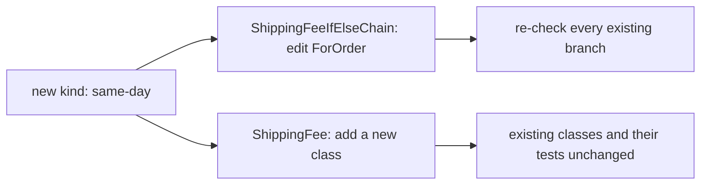

## Bạn cần biết trước

- [[design.l1.solid-srp]] — bạn biết SOLID là năm nguyên tắc, và nguyên tắc đầu tiên, SRP, yêu cầu mỗi class chỉ có một lý do để thay đổi.

## Tình huống

Cửa hàng muốn có kiểu giao hàng thứ tư: giao trong ngày. Hai file trong project samples tính cùng những mức phí giao hàng theo hai cách khác nhau: một là `ShippingFeeIfElseChain.ForOrder`, một method duy nhất nhận kiểu giao hàng dưới dạng string rồi đi qua một chuỗi `if`/`else if`. Cái kia là `ShippingFee`, mỗi kiểu giao hàng một class, và đã có test kiểm tra chúng. Ở cái thứ nhất, giao trong ngày nghĩa là mở một method đang chạy tốt và thêm một nhánh cạnh những nhánh đang trả lời order giao tiêu chuẩn, giao nhanh và nhận tại cửa hàng. Ở cái thứ hai, nó nghĩa là viết một class mới và để yên các class cũ. Vì sao cái thứ hai an toàn hơn hẳn?

## Khái niệm cốt lõi

- **Open/Closed Principle (OCP)** — code nên mở để mở rộng nhưng đóng để sửa đổi: thêm một trường hợp mới không nên đòi hỏi sửa code đang chạy tốt và đã được test.
- mở rộng — thêm code mới, như một class mới, đặt cạnh những gì đã có.
- sửa đổi — sửa code đã có, như thân của một method đang chạy tốt.

## Cơ chế hoạt động



OCP nói về chỗ đặt một trường hợp mới. Trong `ShippingFeeIfElseChain`, một kiểu giao hàng không phải là một thứ riêng; nó là một string mà một method đem so với một danh sách tên. Một kiểu mới chẳng có chỗ nào để đặt ngoài một nhánh nữa bên trong method đó, nên thêm nó là sửa đổi. Chỗ sửa nằm giữa những nhánh mà order tiêu chuẩn, giao nhanh và nhận tại cửa hàng đang dựa vào, nên các nhánh đó phải kiểm tra lại.

Trong `ShippingFee`, mỗi kiểu là một class kế thừa cùng một abstract class và override một method, `ForOrder`. Một kiểu mới là một class mới đặt cạnh các class khác, nên thêm nó là mở rộng. `StandardShipping`, `ExpressShipping` và `PickUpInStore` không bị mở ra, và các test kiểm tra chúng không đổi.

Code chỉ gọi `ForOrder` qua một biến `ShippingFee` cũng không đổi: nó không bao giờ hỏi mình đang có kiểu nào. Vẫn phải có code tạo ra kiểu mới. Trong samples, code duy nhất tạo các kiểu là hai test trong `SamplesTests.cs`, viết `new StandardShipping()` và các kiểu kia; code nào cho chọn giao trong ngày sẽ thêm một `new` như vậy. Đó là một chỗ sửa nhỏ ở nơi chọn kiểu, không nằm trong quy tắc tính phí nào — OCP bảo vệ những quy tắc đang chạy tốt và các test kiểm tra chúng. Vậy mục tiêu của OCP là: thay đổi được yêu cầu đi vào dưới dạng code mới, còn code bạn tin tưởng hôm qua vẫn giữ nguyên.

## Trong hệ thống Đơn Hàng

Phiên bản dùng chuỗi if:

```csharp file=samples/DonHang.Samples/Samples/Design/ShippingFeeIfElseChain.cs tag=stage-1 lines=9-29
    public static int ForOrder(string kind, int totalVnd)
    {
        if (kind == "standard")
        {
            return totalVnd >= 2_000_000 ? 0 : 30_000;
        }
        else if (kind == "express")
        {
            return 60_000;
        }
        else if (kind == "pickup")
        {
            return 0;
        }
        // A fourth kind ("same_day", say) needs a fourth branch right here —
        // in a method that other kinds already depend on working correctly.
        else
        {
            throw new ArgumentException($"unknown shipping kind: {kind}");
        }
    }
```

Mọi kiểu đều nằm trong đúng method này. Hiện giờ một string như `"same_day"` rơi xuống `else` cuối và throw `ArgumentException`. Muốn hỗ trợ nó, bạn thêm một `else if` thứ tư bên trong `ForOrder` — đúng chỗ mà chính comment trong file chỉ tới — rồi kiểm tra lại rằng tiêu chuẩn, giao nhanh và nhận tại cửa hàng vẫn cho đúng kết quả, vì bạn đã sửa method mà cả ba đều đi qua.

Phiên bản dùng class:

```csharp file=samples/DonHang.Samples/Samples/Oop/ShippingFee.cs tag=stage-1 lines=5-23
public abstract class ShippingFee
{
    public abstract int ForOrder(int totalVnd);
}

public sealed class StandardShipping : ShippingFee
{
    public override int ForOrder(int totalVnd) => totalVnd >= 2_000_000 ? 0 : 30_000;
}

public sealed class ExpressShipping : ShippingFee
{
    public override int ForOrder(int totalVnd) => 60_000;
}

public sealed class PickUpInStore : ShippingFee
{
    public override int ForOrder(int totalVnd) => 0;
}
```

Các mức phí giống hệt bên chuỗi if, nhưng mỗi kiểu tự giữ câu trả lời trong class riêng. Giao trong ngày sẽ là class thứ tư kế thừa `ShippingFee` với `ForOrder` riêng; không class nào trong ba class trên phải đổi. Compiler cũng giúp một tay: một class mới như vậy mà quên override `ForOrder` thì không compile được. Các test trong `SamplesTests.cs` kiểm tra ba kiểu đã có vẫn pass mà không cần sửa.

## Người mới hay nghĩ rằng…

- **"OCP nghĩa là không bao giờ được sửa một class sau khi đã viết xong."** → Thực ra OCP nói về việc thêm trường hợp mới, không phải đóng băng code. Nếu cửa hàng dời ngưỡng miễn phí giao hàng của kiểu tiêu chuẩn, bạn sửa `StandardShipping`, vì chính quy tắc đã đổi. Bạn sẽ nhận ra khi thay đổi là về cách một kiểu đã có hoạt động, chứ không phải có một kiểu mới đến.
- **"Dùng abstract class hay interface là code tự động theo OCP, bất kể dùng thế nào."** → Thực ra điều quan trọng là chỗ gọi có cần biết mình đang có kiểu nào hay không. Nếu chỗ gọi kiểm tra mình có class nào trước khi quyết định làm gì, thì mỗi kiểu mới lại phải sửa những phép kiểm tra đó, dù đã có `ShippingFee` — vẫn là chuỗi if ấy, chỉ dời sang chỗ khác. Bạn sẽ nhận ra khi thêm một class mà vẫn phải đi lùng những chỗ liệt kê các kiểu theo tên.

## Thử ngay (3 phút)

Dùng hai khối code ở trên.

1. Hiện giờ `ShippingFeeIfElseChain.ForOrder("same_day", 500_000)` làm gì?
2. Trong `ShippingFee.cs`, liệt kê những class đã có mà bạn sẽ phải sửa để thêm giao trong ngày giá 80.000 VND.

Kết quả mong đợi: bước 1 throw `ArgumentException` với thông báo `unknown shipping kind: same_day`, vì không nhánh nào khớp. Bước 2 ra không class nào: bạn thêm một class mới kế thừa `ShippingFee` và trả về `80_000` từ `ForOrder`.

Ở phiên bản nào việc thêm giao trong ngày đặt code đang chạy tốt vào rủi ro, và vì sao?

<details><summary>Gợi ý đáp án</summary>

Ở `ShippingFeeIfElseChain`: giao trong ngày cần một nhánh mới bên trong `ForOrder`, method mà tiêu chuẩn, giao nhanh và nhận tại cửa hàng đều đi qua, nên bạn sửa code đang chạy tốt và phải kiểm tra lại các nhánh đó. Ở `ShippingFee`, kiểu mới là một class mới; ba class cũ và test của chúng không bị đụng tới, nên không có gì chạy tốt hôm qua bị mở ra.

</details>

## Liên hệ

- [[design.l1.solid-srp]] — SRP cho mỗi class một lý do để thay đổi; OCP yêu cầu trường hợp mới đi vào dưới dạng code mới thay vì thêm một chỗ sửa vào class đó.
- [[foundation.l1.oop-polymorphism]] — nơi `ShippingFee` và ba class của nó được giới thiệu lần đầu; polymorphism là thứ giúp chỗ gọi giữ nguyên.
- [[design.l1.solid-lsp]] — nguyên tắc SOLID tiếp theo: mọi class mới kế thừa một kiểu cha đều phải giữ lời hứa của kiểu cha đó.

## Tóm tắt 5 dòng

1. Open/Closed Principle nói code nên mở để mở rộng nhưng đóng để sửa đổi.
2. Thêm một trường hợp mới nên là thêm code mới, không phải sửa code đang chạy tốt và đã được test.
3. `ShippingFeeIfElseChain` giữ mọi kiểu trong một method, nên giao trong ngày là thêm một nhánh giữa những nhánh đang chạy tốt.
4. `ShippingFee` cho mỗi kiểu một class riêng, nên giao trong ngày là một class mới và các class cũ giữ nguyên.
5. OCP không đóng băng code: đổi cách một kiểu đã có hoạt động thì vẫn sửa class của kiểu đó.
