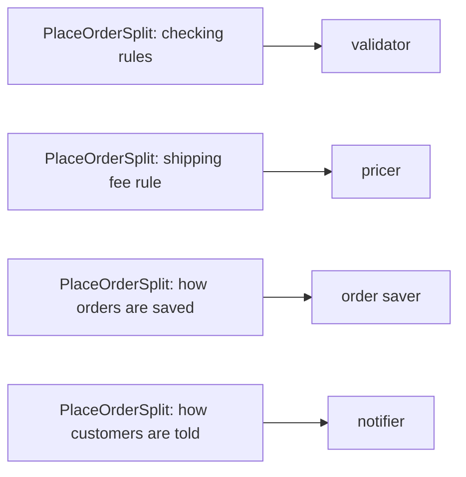

## Before you start

- [[design.l1.coupling-and-cohesion]] — you know each method in `PlaceOrderSplit` has high cohesion, while the class as a whole still holds four jobs and `Place` depends on all of them.

## The situation

`PlaceOrderSplit` is short, every method does one job, and the code review called it much better. In one sprint, four requests arrive from four different people: product wants orders capped at 20 order lines, finance wants free shipping to start at 1,500,000 VND, operations wants orders saved somewhere real instead of printed, and marketing wants an SMS as well as the email. Each request touches a different method — and all four land in `PlaceOrderSplit.cs`. If every method already does one job, why does one class keep collecting everyone's changes?

## Core concepts

- **SOLID** — a set of five design principles, one per letter. The S is the Single Responsibility Principle, covered here; the next lessons cover the other four.
- **Single Responsibility Principle (SRP)** — a class should have only one reason to change.
- reason to change — first named in [[design.l1.why-design-matters]]: a rule the business might ask you to change on its own. Here, you can often spot one by asking who would request the change.

## How it works



Each arrow in the diagram moves one reason to change out of `PlaceOrderSplit` into a class of its own. The test SRP gives you is not about size or tidiness. It asks one question about a class: how many different reasons could make it change? For `PlaceOrderSplit` the answer is four — a new checking rule, a new shipping fee rule, a new way of saving, a new way of telling the customer. Each of those could be requested by a different person, at a different time.

Cohesion inside each method was already high; SRP looks one level up, at the class. A class with four reasons to change can end up edited, re-read and re-tested by up to four different people, even when each of them cares about only one part of it.

What SRP asks for is one class per reason: a validator, a pricer, an order saver and a notifier. None of the four needs to know how the others work. The notifier, for example, does not need to know how the total was worked out; today it only needs the customer id. Something still has to run them in order — check, price, save, notify. That can stay in `Place`, which would then be all that is left of `PlaceOrderSplit`; its reason to change is the sequence of steps — for example, if the customer had to be told before the order is saved.

## In the Đơn Hàng system

These are the four private methods of `PlaceOrderSplit`:

```csharp file=samples/DonHang.Samples/Samples/Clean/PlaceOrderSplit.cs tag=stage-0 lines=18-37
    private static string? FirstProblemWith(int customerId, List<OrderLine> lines)
    {
        if (customerId <= 0) return "the customer id is not valid";
        if (lines.Count == 0) return "an order needs at least one line";
        if (lines.Any(line => line.Quantity <= 0)) return "a line needs a quantity";
        if (lines.Any(line => line.UnitPriceVnd <= 0)) return "a line needs a price";
        return null;
    }

    private static int TotalWithShippingVnd(List<OrderLine> lines, bool customerIsLoyal)
    {
        var totalVnd = NamingAfter.TotalVnd(lines, customerIsLoyal);
        return totalVnd + (totalVnd >= 2_000_000 ? 0 : 30_000);
    }

    private static void Save(int customerId, int totalVnd) =>
        Console.WriteLine($"saving order for customer {customerId}, total {totalVnd}");

    private static void Notify(int customerId) =>
        Console.WriteLine($"sending an email to customer {customerId}");
```

Read them as four answers to "who would ask for this to change?". `FirstProblemWith` holds the checking rules: a cap of 20 order lines would be one more `if` here. `TotalWithShippingVnd` holds the shipping fee rule: free shipping from 1,500,000 VND means changing `2_000_000`. `Save` is how an order is saved — for now, a printed line. `Notify` is how the customer is told — for now, a printed line about an email.

Each method is focused, and the whole file is under 40 lines. By size, this class looks fine. By SRP's question, it has four reasons to change, so all four requests in the situation edit this one file.

## Beginners often think…

- **"Single Responsibility means a class should have only one method."** → Actually SRP counts reasons to change, not methods. A pricer could hold one method for adding up the lines, one for the discount and one for the shipping fee: three methods, but one reason to change — the pricing rules. You notice this when every change to a class comes from the same kind of request, even though the class has several methods.
- **"A class that already looks small and tidy, like `PlaceOrderSplit`, must already satisfy SRP."** → Actually size and tidiness are not the test. `PlaceOrderSplit` is short and well named, yet a checking rule, a fee rule, a way of saving and a way of notifying all live in it. You notice this when requests from different people keep landing in the same small file.

## Try it (3 minutes)

Using the code block above, take each of these new requests and write down which method of `PlaceOrderSplit` it changes, and which of the four classes SRP asks for — validator, pricer, order saver, notifier — would own it after a split.

1. A customer id above 1,000,000 is not valid.
2. Loyal customers never pay shipping.
3. The saving line must also print the date.
4. The email text must thank the customer.

Expected result: 1 → `FirstProblemWith`, validator. 2 → `TotalWithShippingVnd`, pricer. 3 → `Save`, order saver. 4 → `Notify`, notifier. Four different methods — all in the one file `PlaceOrderSplit.cs`.

How many classes do these four requests edit today, and how many would they edit after the split?

<details><summary>Suggested answer</summary>

Today all four edit one class, `PlaceOrderSplit`, so up to four people change, review and re-test the same file. After the split, each request edits a different class: the shipping change touches only the pricer, and the email text change touches only the notifier. That is what "one reason to change" buys you.

</details>

## Connections

- [[design.l1.coupling-and-cohesion]] — cohesion measured each method; SRP measures the class around them.
- [[design.l1.why-design-matters]] — where "reason to change" was first named, in `PlaceOrderLong`.
- [[design.l1.solid-ocp]] — the next SOLID principle: adding a new case without editing code that already works.

## Five-line summary

1. SOLID names five design principles; the Single Responsibility Principle, SRP, is the first.
2. SRP says a class should have only one reason to change.
3. `PlaceOrderSplit` is short and focused per method, yet it has four reasons to change: checking, the shipping fee, saving, notifying.
4. SRP asks for one class per reason — validator, pricer, order saver, notifier — each unaware of how the others work.
5. SRP's test is how many reasons to change a class has, not how many lines or methods it has.
