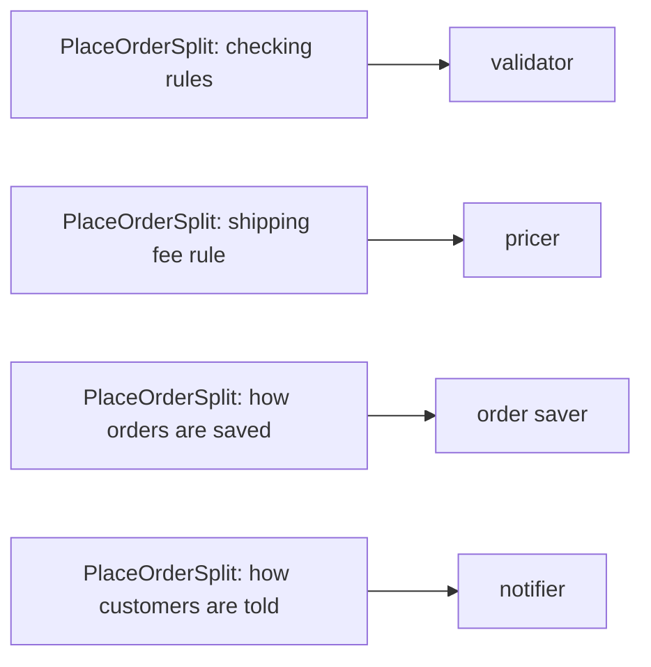

## Bạn cần biết trước

- [[design.l1.coupling-and-cohesion]] — bạn biết mỗi method trong `PlaceOrderSplit` có cohesion cao, trong khi class nhìn tổng thể vẫn giữ bốn việc và `Place` phụ thuộc vào cả bốn.

## Tình huống

`PlaceOrderSplit` ngắn, method nào cũng làm một việc, và code review đã khen là tốt hơn nhiều. Trong một sprint, bốn yêu cầu đến từ bốn người khác nhau: bên sản phẩm muốn giới hạn mỗi order tối đa 20 dòng đơn hàng, bên tài chính muốn miễn phí giao hàng từ 1.500.000 VND, bên vận hành muốn order được lưu vào chỗ thật thay vì chỉ in ra, còn bên marketing muốn gửi thêm SMS bên cạnh email. Mỗi yêu cầu đụng tới một method khác nhau — và cả bốn đều rơi vào `PlaceOrderSplit.cs`. Nếu method nào cũng đã làm một việc, sao một class lại cứ gom hết thay đổi của mọi người?

## Khái niệm cốt lõi

- **SOLID** — một bộ năm nguyên tắc thiết kế, mỗi chữ cái một nguyên tắc. Chữ S là Single Responsibility Principle, học ở bài này; các bài tiếp theo học bốn chữ còn lại.
- **Single Responsibility Principle (SRP)** — một class chỉ nên có một lý do để thay đổi.
- lý do để thay đổi — được gọi tên lần đầu ở [[design.l1.why-design-matters]]: một quy tắc mà phía kinh doanh có thể yêu cầu bạn đổi riêng lẻ. Ở đây, bạn thường nhận ra nó bằng cách hỏi ai sẽ là người yêu cầu thay đổi.

## Cơ chế hoạt động



Mỗi mũi tên trong sơ đồ chuyển một lý do để thay đổi ra khỏi `PlaceOrderSplit`, sang một class riêng. Phép thử mà SRP đưa ra không liên quan tới độ dài hay độ gọn gàng. Nó hỏi đúng một câu về một class: có bao nhiêu lý do khác nhau có thể khiến class này phải đổi? Với `PlaceOrderSplit`, câu trả lời là bốn — một quy tắc kiểm tra mới, một quy tắc phí giao hàng mới, một kiểu lưu mới, một kiểu báo khách mới. Mỗi thứ có thể do một người khác nhau yêu cầu, vào một lúc khác nhau.

Cohesion bên trong từng method vốn đã cao; SRP nhìn lên một mức, vào class. Một class có bốn lý do để thay đổi có thể bị tới bốn người khác nhau sửa, đọc lại và kiểm tra lại, dù mỗi người chỉ quan tâm tới một phần của nó.

Điều SRP yêu cầu là mỗi lý do một class: một validator, một pricer, một order saver và một notifier. Không class nào trong bốn class cần biết các class kia làm việc ra sao. Ví dụ, notifier không cần biết tổng tiền được tính thế nào; hiện giờ nó chỉ cần id của customer. Vẫn phải có thứ chạy chúng theo thứ tự — kiểm tra, tính giá, lưu, báo khách. Việc đó có thể ở lại trong `Place`, và khi ấy `Place` là tất cả những gì còn lại của `PlaceOrderSplit`; lý do để nó thay đổi là trình tự các bước — ví dụ, nếu khách phải được báo trước khi order được lưu.

## Trong hệ thống Đơn Hàng

Đây là bốn method private của `PlaceOrderSplit`:

```csharp file=samples/DonHang.Samples/Samples/Clean/PlaceOrderSplit.cs tag=stage-0 lines=18-37
    private static string? FirstProblemWith(int customerId, List<OrderLine> lines)
    {
        if (customerId <= 0) return "the customer id is not valid";
        if (lines.Count == 0) return "an order needs at least one line";
        if (lines.Any(line => line.Quantity <= 0)) return "a line needs a quantity";
        if (lines.Any(line => line.UnitPriceVnd <= 0)) return "a line needs a price";
        return null;
    }

    private static int TotalWithShippingVnd(List<OrderLine> lines, bool customerIsLoyal)
    {
        var totalVnd = NamingAfter.TotalVnd(lines, customerIsLoyal);
        return totalVnd + (totalVnd >= 2_000_000 ? 0 : 30_000);
    }

    private static void Save(int customerId, int totalVnd) =>
        Console.WriteLine($"saving order for customer {customerId}, total {totalVnd}");

    private static void Notify(int customerId) =>
        Console.WriteLine($"sending an email to customer {customerId}");
```

Hãy đọc chúng như bốn câu trả lời cho câu hỏi "ai sẽ yêu cầu cái này thay đổi?". `FirstProblemWith` giữ các quy tắc kiểm tra: giới hạn 20 dòng đơn hàng sẽ là thêm một `if` ở đây. `TotalWithShippingVnd` giữ quy tắc phí giao hàng: miễn phí từ 1.500.000 VND nghĩa là đổi `2_000_000`. `Save` là cách một order được lưu — hiện giờ là in ra một dòng. `Notify` là cách báo cho khách — hiện giờ là in ra một dòng về email.

Method nào cũng tập trung, và cả file chưa tới 40 dòng. Xét độ dài, class này trông ổn. Xét theo câu hỏi của SRP, nó có bốn lý do để thay đổi, nên cả bốn yêu cầu trong tình huống đều sửa vào đúng file này.

## Người mới hay nghĩ rằng…

- **"Single Responsibility nghĩa là một class chỉ nên có một method."** → Thực ra SRP đếm lý do để thay đổi, không đếm method. Một pricer có thể có một method cộng các dòng, một method trừ giảm giá và một method tính phí giao hàng: ba method, nhưng chỉ một lý do để thay đổi — các quy tắc tính giá. Bạn sẽ nhận ra khi mọi thay đổi ở một class đều đến từ cùng một loại yêu cầu, dù class đó có nhiều method.
- **"Một class trông đã nhỏ gọn, như `PlaceOrderSplit`, hẳn là đã thỏa SRP."** → Thực ra độ dài và độ gọn không phải phép thử. `PlaceOrderSplit` ngắn và đặt tên tốt, vậy mà một quy tắc kiểm tra, một quy tắc phí, một kiểu lưu và một kiểu báo khách đều nằm trong nó. Bạn sẽ nhận ra khi yêu cầu từ nhiều người khác nhau cứ rơi vào cùng một file nhỏ.

## Thử ngay (3 phút)

Dựa vào khối code ở trên, với mỗi yêu cầu mới dưới đây, ghi ra nó sửa method nào của `PlaceOrderSplit`, và class nào trong bốn class mà SRP yêu cầu — validator, pricer, order saver, notifier — sẽ giữ nó sau khi tách.

1. Id customer lớn hơn 1.000.000 là không hợp lệ.
2. Khách thân thiết không bao giờ phải trả phí giao hàng.
3. Dòng lưu phải in thêm ngày.
4. Nội dung email phải cảm ơn khách.

Kết quả mong đợi: 1 → `FirstProblemWith`, validator. 2 → `TotalWithShippingVnd`, pricer. 3 → `Save`, order saver. 4 → `Notify`, notifier. Bốn method khác nhau — tất thảy đều nằm trong một file `PlaceOrderSplit.cs`.

Hôm nay bốn yêu cầu này sửa bao nhiêu class, và sau khi tách thì sửa bao nhiêu class?

<details><summary>Gợi ý đáp án</summary>

Hôm nay cả bốn đều sửa một class, `PlaceOrderSplit`, nên có thể tới bốn người cùng sửa, review và kiểm tra lại một file. Sau khi tách, mỗi yêu cầu sửa một class khác nhau: thay đổi về phí giao hàng chỉ đụng tới pricer, còn thay đổi nội dung email chỉ đụng tới notifier. Đó là thứ mà "một lý do để thay đổi" mang lại cho bạn.

</details>

## Liên hệ

- [[design.l1.coupling-and-cohesion]] — cohesion đo từng method; SRP đo class bao quanh chúng.
- [[design.l1.why-design-matters]] — nơi "lý do để thay đổi" được gọi tên lần đầu, trong `PlaceOrderLong`.
- [[design.l1.solid-ocp]] — nguyên tắc SOLID tiếp theo: thêm một trường hợp mới mà không phải sửa code đang chạy tốt.

## Tóm tắt 5 dòng

1. SOLID gọi tên năm nguyên tắc thiết kế; Single Responsibility Principle, SRP, là nguyên tắc đầu tiên.
2. SRP nói một class chỉ nên có một lý do để thay đổi.
3. `PlaceOrderSplit` ngắn và mỗi method đều tập trung, vậy mà có bốn lý do để thay đổi: kiểm tra, phí giao hàng, lưu, báo khách.
4. SRP yêu cầu mỗi lý do một class — validator, pricer, order saver, notifier — không class nào cần biết class kia làm thế nào.
5. Phép thử của SRP là class có bao nhiêu lý do để thay đổi, không phải nó có bao nhiêu dòng hay bao nhiêu method.
