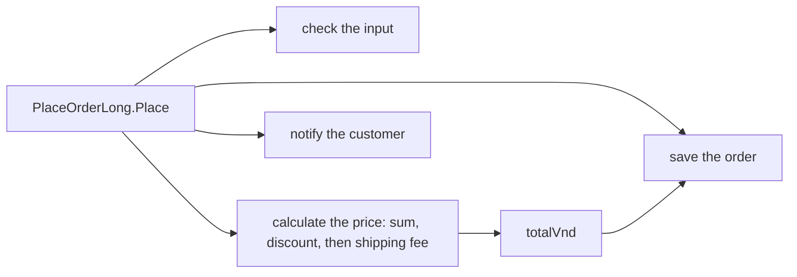

## Before you start

- [[foundation.l1.small-functions]] — you know a function that does one thing can be named honestly, and that `PlaceOrderLong.Place` does several.
- [[foundation.l1.code-smells-basic]] — you know a code smell points at a design problem without naming it, and that refactoring changes structure without changing behaviour.

## The situation

The shop wants loyal customers to get 5% off instead of 10%. You open `PlaceOrderLong.Place`, find the line that takes 10% off, and change `10` to `5`. It is a tiny edit to the discount, and nothing else looks touched. A week later, a loyal customer who ordered two items at 1,100,000 VND each asks why their shipping fee disappeared. Nobody changed the shipping fee, and nobody decided it should change. How did a change to the discount end up changing it?

## Core concepts

- reason to change — a rule the business might ask you to change on its own, such as how orders are checked, how prices are calculated, how an order is saved, or how the customer is told.
- change cost — how much you have to read, change and re-check to make one such change safely; the more unrelated work shares a place with it, the higher it is.
- design — the choices about where each piece of work lives and what it can reach, which together shape how expensive later changes are.

## How it works



`PlaceOrderLong.Place` does four jobs in one method body: it checks the input, calculates the price, saves the order and notifies the customer. Each of those is a separate reason to change — the checking rules, the pricing rules, how saving works and how notifications go out can each change on their own. None of the four has a name: they are just stretches of lines inside `Place`.

Because they share one body, they also share its variables. The pricing job is itself three rules — sum the lines, take the discount, add the shipping fee — and all three build up the one variable `totalVnd`. The fee rule reads whatever the discount rule left there: it adds 30,000 VND only when the total is below 2,000,000 VND. In the situation, the order came to 2,200,000 VND. With 10% off, it dropped to 1,980,000, below the threshold, so the fee was added; with 5% off, it dropped only to 2,090,000, so the fee vanished. And the saving job reads `totalVnd` too, so every pricing change reaches what gets saved.

Should the fee follow the discounted total or the original one? That is a business decision, and the code never states it. The edit changed the answer without anyone deciding — not because the code is wrong, but because nothing separates the rules that read `totalVnd`.

That is what design is about. The code ran exactly as written before the edit and after it; the problem is how much you had to know to edit it safely. If each rule took the value it needs as a named input, a discount edit could not reach the fee by accident — the next lessons show ways to get there.

## In the Đơn Hàng system

The first half of `Place` checks the input and adds up the lines:

```csharp file=samples/DonHang.Samples/Samples/Clean/PlaceOrderLong.cs tag=stage-0 lines=8-22
    public static string Place(int customerId, List<OrderLine> lines, bool customerIsLoyal)
    {
        if (customerId <= 0) return "the customer id is not valid";
        if (lines.Count == 0) return "an order needs at least one line";
        foreach (var line in lines)
        {
            if (line.Quantity <= 0) return "a line needs a quantity";
            if (line.UnitPriceVnd <= 0) return "a line needs a price";
        }

        var totalVnd = 0;
        foreach (var line in lines)
        {
            totalVnd += line.Quantity * line.UnitPriceVnd;
        }
```

The second half applies the discount, adds the shipping fee, then "saves" and "notifies" — here by printing a line for each:

```csharp file=samples/DonHang.Samples/Samples/Clean/PlaceOrderLong.cs tag=stage-0 lines=24-34
        if (customerIsLoyal)
        {
            totalVnd -= totalVnd * 10 / 100;
        }

        totalVnd += totalVnd >= 2_000_000 ? 0 : 30_000;

        Console.WriteLine($"saving order for customer {customerId}, total {totalVnd}");
        Console.WriteLine($"sending an email to customer {customerId}");

        return $"order placed, total {totalVnd}";
```

The discount line changes `totalVnd` in place, and the very next statement decides the shipping fee from that same `totalVnd`. Nothing in the code says the fee is meant to depend on the discounted total rather than the original one — it just does, because of where the lines sit. The saving line prints `totalVnd` too, so a pricing change reaches it as well; the email line uses only `customerId`, yet it still sits in the same body you have to read. The file's own comment, just above the class, names the problem: "Four reasons to change one place, and no name for any of the four."

## Beginners often think…

- **"Code that works and passes its tests doesn't need any more design thought."** → Actually working code can still be expensive to change: `Place` ran exactly as written both before and after the discount edit, and the fee change it caused was still a surprise. Tests check what the code does today; design decides how much you must understand to change it tomorrow. You notice this when a small, correct-looking edit changes a result nobody asked you to touch.
- **"Design is about making code look elegant, not about how easy it is to change later."** → Actually the point of design is the cost of the next change, not the look of the current code. `Place` is readable, yet a one-number pricing edit reached the shipping fee. You notice this when you have to trace a whole method to be sure a one-line change is safe.

## Try it (3 minutes)

Trace `Place` by hand for a loyal customer with one line: quantity `2`, unit price `1_100_000`.

1. Work out the returned total as the code is written, with `10` on the discount line.
2. Work it out again with `10` changed to `5`.

Expected result: step 1 gives `order placed, total 2010000` — 2,200,000, minus 220,000, plus the 30,000 fee. Step 2 gives `order placed, total 2090000` — 2,200,000, minus 110,000, and no fee.

Which line decided the fee in each case, and what would you have to read before changing the discount again?

<details><summary>Suggested answer</summary>

The fee line, `totalVnd += totalVnd >= 2_000_000 ? 0 : 30_000;`, decided it both times, by reading the already-discounted `totalVnd`. Before changing the discount again you would have to read everything after it in `Place` that uses `totalVnd` — the fee, the saving line and the return — because they all read that one variable. That reading is the change cost this lesson is about.

</details>

## Connections

- [[foundation.l1.small-functions]] — the same `PlaceOrderLong`, first read for its length, now read for what one change to it can reach.
- [[foundation.l1.code-smells-basic]] — a smell points at a design problem; this lesson names the problem: several reasons to change in one place.
- [[design.l1.coupling-and-cohesion]] — the next lesson, which gives names to how pieces of code depend on each other.

## Five-line summary

1. `PlaceOrderLong.Place` checks, prices, saves and notifies in one method: four reasons to change, none of them named.
2. Sharing one body means sharing variables, so a change to one rule can reach others that read the same variable.
3. Changing the discount changed the shipping fee, because the fee is decided from the already-discounted total.
4. Working code can still be expensive to change; tests describe today's behaviour, design decides tomorrow's change cost.
5. Design is the set of choices about where each piece of work lives, and it is a large part of what later changes cost.
